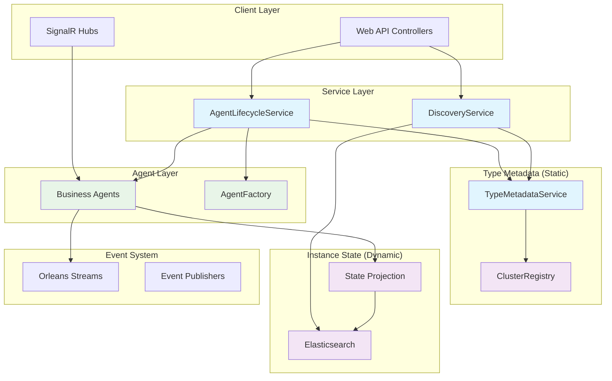
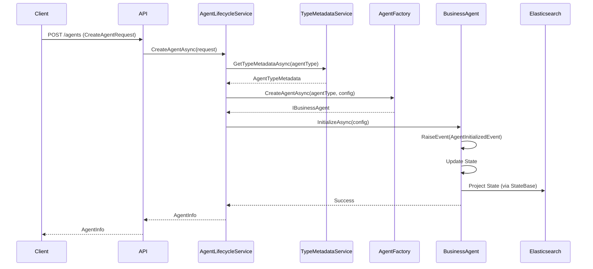
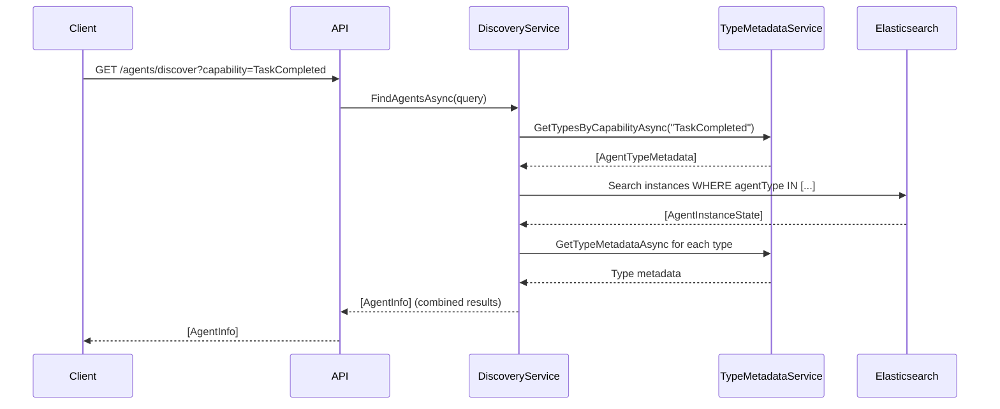
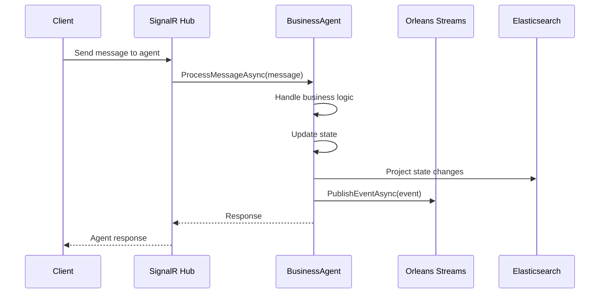

# Agent Management Architecture Proposal

## Executive Summary

This proposal outlines an improved architecture for agent management in the Aevatar Station platform that **eliminates CreatorGAgent** while retaining all its essential features. The new architecture provides direct business agent access, improved performance, and better separation of concerns by building upon the AgentRegistry-ElasticSearch-Lite design.

## Problem Statement

The current `CreatorGAgent` implementation creates an unnecessary proxy layer that:
- Adds indirection between clients and business agents
- Duplicates metadata across multiple storage systems
- Complicates the agent interaction model
- Creates potential performance bottlenecks
- Mixes agent lifecycle management with business logic concerns

## Proposed Architecture

### Architecture Overview



### Key Components

#### 1. AgentLifecycleService
**Purpose**: Centralized service for agent CRUD operations, replacing CreatorGAgent's factory responsibilities.

```csharp
public interface IAgentLifecycleService
{
    Task<AgentInfo> CreateAgentAsync(CreateAgentRequest request);
    Task<AgentInfo> UpdateAgentAsync(Guid agentId, UpdateAgentRequest request);
    Task DeleteAgentAsync(Guid agentId);
    Task<AgentInfo> GetAgentAsync(Guid agentId);
    Task<List<AgentInfo>> GetUserAgentsAsync(Guid userId);
}

public class CreateAgentRequest
{
    public Guid UserId { get; set; }
    public string AgentType { get; set; }
    public string Name { get; set; }
    public Dictionary<string, object> Properties { get; set; }
}

public class AgentInfo
{
    public Guid Id { get; set; }
    public Guid UserId { get; set; }
    public string AgentType { get; set; }
    public string Name { get; set; }
    public Dictionary<string, object> Properties { get; set; }
    public List<string> Capabilities { get; set; }
    public AgentStatus Status { get; set; }
    public DateTime CreatedAt { get; set; }
    public DateTime LastActivity { get; set; }
}
```

#### 2. Enhanced Business Agent Interface
**Purpose**: Business agents become the primary interface with standardized lifecycle management.

```csharp
public interface IBusinessAgent : IGrain
{
    Task InitializeAsync(AgentConfiguration config);
    Task<AgentInstanceState> GetStateAsync();
    Task UpdateConfigurationAsync(AgentConfiguration config);
    Task PublishEventAsync<T>(T @event) where T : EventBase;
    Task<string> GetDescriptionAsync();
}

public abstract class BusinessAgentBase<TState, TEvent> : GAgentBase<TState, TEvent>, IBusinessAgent
    where TState : AgentInstanceState, new()
    where TEvent : EventBase
{
    public async Task InitializeAsync(AgentConfiguration config)
    {
        RaiseEvent(new AgentInitializedEvent
        {
            Id = config.Id,
            UserId = config.UserId,
            AgentType = config.AgentType,
            Name = config.Name,
            Properties = config.Properties
        });
        await ConfirmEvents();
    }
    
    public async Task PublishEventAsync<T>(T @event) where T : EventBase
    {
        if (@event == null) throw new ArgumentNullException(nameof(@event));
        Logger.LogInformation("Publishing event: {Event}", @event);
        await PublishAsync(@event);
    }
    
    public virtual Task<string> GetDescriptionAsync()
    {
        return Task.FromResult($"{GetType().Name} - {State.Name}");
    }
}
```

#### 3. Agent Factory Service
**Purpose**: Standardized agent creation and configuration.

```csharp
public interface IAgentFactory
{
    Task<IBusinessAgent> CreateAgentAsync(string agentType, AgentConfiguration config);
    Task<bool> SupportsAgentTypeAsync(string agentType);
}

public class AgentFactory : IAgentFactory
{
    private readonly IGrainFactory _grainFactory;
    private readonly ITypeMetadataService _typeMetadataService;
    
    public async Task<IBusinessAgent> CreateAgentAsync(string agentType, AgentConfiguration config)
    {
        var typeMetadata = await _typeMetadataService.GetTypeMetadataAsync(agentType);
        if (typeMetadata == null)
            throw new InvalidOperationException($"Unknown agent type: {agentType}");
            
        var grainId = GrainId.Create(agentType, config.Id.ToString());
        var agent = _grainFactory.GetGrain<IBusinessAgent>(grainId);
        
        return agent;
    }
}
```

#### 4. Agent Instance State
**Purpose**: Replaces CreatorGAgentState with automatic Elasticsearch projection.

```csharp
public class AgentInstanceState : StateBase
{
    public Guid Id { get; set; }
    public Guid UserId { get; set; }
    public string AgentType { get; set; }
    public string Name { get; set; }
    public Dictionary<string, object> Properties { get; set; }
    public AgentStatus Status { get; set; }
    public DateTime CreatedAt { get; set; }
    public DateTime LastActivity { get; set; }
    public AgentMetrics Metrics { get; set; }
    
    // Inherited from StateBase for automatic projection
    public override string GetIndexName() => "agent-instances";
    public override string GetDocumentId() => Id.ToString();
}

public enum AgentStatus
{
    Initializing,
    Active,
    Inactive,
    Error,
    Deleted
}

public class AgentMetrics
{
    public int EventsProcessed { get; set; }
    public int EventsPublished { get; set; }
    public DateTime LastEventTime { get; set; }
    public TimeSpan TotalProcessingTime { get; set; }
}
```

#### 5. Discovery Service Enhancement
**Purpose**: Builds on AgentRegistry-ElasticSearch-Lite design for efficient agent discovery.

```csharp
public class AgentDiscoveryService : IAgentDiscoveryService
{
    private readonly ITypeMetadataService _typeMetadataService;
    private readonly IElasticsearchClient _elasticsearchClient;
    
    public async Task<List<AgentInfo>> FindAgentsAsync(AgentDiscoveryQuery query)
    {
        // Step 1: Filter agent types by capabilities (fast, in-memory)
        var eligibleTypes = await _typeMetadataService.GetTypesByCapabilityAsync(query.RequiredCapabilities);
        
        // Step 2: Build Elasticsearch query
        var searchRequest = new SearchRequest<AgentInstanceState>
        {
            Query = Query.Bool(b => b
                .Must(
                    Query.Terms(t => t.Field(f => f.AgentType).Terms(eligibleTypes.Select(t => t.AgentType))),
                    Query.Term(t => t.Field(f => f.UserId).Value(query.UserId))
                )
                .Filter(Query.Term(t => t.Field(f => f.Status).Value(AgentStatus.Active)))
            )
        };
        
        // Step 3: Execute search
        var response = await _elasticsearchClient.SearchAsync<AgentInstanceState>(searchRequest);
        
        // Step 4: Combine with type metadata
        var results = new List<AgentInfo>();
        foreach (var doc in response.Documents)
        {
            var typeMetadata = await _typeMetadataService.GetTypeMetadataAsync(doc.AgentType);
            results.Add(new AgentInfo
            {
                Id = doc.Id,
                UserId = doc.UserId,
                AgentType = doc.AgentType,
                Name = doc.Name,
                Properties = doc.Properties,
                Capabilities = typeMetadata.Capabilities,
                Status = doc.Status,
                CreatedAt = doc.CreatedAt,
                LastActivity = doc.LastActivity
            });
        }
        
        return results;
    }
}
```


## Data Flow Diagrams

### Agent Creation Flow


### Agent Discovery Flow


### Direct Agent Interaction Flow


## Feature Preservation

### Features Retained from CreatorGAgent

#### ✅ Agent Factory and Management
- **Creation**: `AgentLifecycleService.CreateAgentAsync()` replaces `CreatorGAgent.CreateAgentAsync()`
- **Updates**: `AgentLifecycleService.UpdateAgentAsync()` replaces `CreatorGAgent.UpdateAgentAsync()`
- **Deletion**: `AgentLifecycleService.DeleteAgentAsync()` replaces `CreatorGAgent.DeleteAgentAsync()`
- **Metadata**: Stored in `AgentInstanceState` and projected to Elasticsearch

#### ✅ Event Management System
- **Event Publishing**: `BusinessAgent.PublishEventAsync()` replaces `CreatorGAgent.PublishEventAsync()`
- **Event Registry**: `TypeMetadataService.GetTypeMetadataAsync()` provides capabilities
- **Event Discovery**: Automatic discovery through reflection at startup

#### ✅ State Management
- **State Persistence**: `AgentInstanceState` replaces `CreatorGAgentState`
- **Event Sourcing**: Maintained through `BusinessAgentBase<TState, TEvent>`
- **State Transitions**: Handled directly in business agents

#### ✅ Multi-Tenancy Support
- **User Isolation**: Maintained through `UserId` in all operations
- **Tenant Boundaries**: Enforced at service layer and Elasticsearch queries
- **Access Control**: Maintained through user-scoped operations

#### ✅ Audit Trail
- **Event History**: Complete audit trail through GAgentBase event sourcing
- **State Changes**: All state transitions recorded as events in Orleans
- **User Activity**: Tracked through built-in event sourcing mechanisms

#### ✅ Orleans Integration
- **Grain Management**: Business agents are Orleans grains
- **Clustering**: Automatic distribution across cluster nodes
- **Persistence**: State persistence through Orleans providers
- **Streaming**: Event publishing through Orleans streams

#### ✅ Performance & Scalability
- **Horizontal Scaling**: Orleans cluster scaling
- **Load Balancing**: Automatic grain distribution
- **Caching**: In-memory state in grains
- **Async Operations**: Maintained throughout

### New Features Added

#### 🆕 Direct Business Agent Access
- Eliminate proxy layer for better performance
- Direct grain references for client interactions
- Simplified debugging and monitoring

#### 🆕 Enhanced Discovery
- Type-based capability filtering
- Efficient Elasticsearch queries
- Combined type and instance metadata

#### 🆕 Improved Separation of Concerns
- Static type metadata separate from instance state
- Dedicated services for specific responsibilities
- Clear interface boundaries

## Implementation Strategy

### Phase 1: Foundation (Weeks 1-2)
1. **Implement Core Services**
   - `AgentLifecycleService`
   - `TypeMetadataService` enhancements
   - `AgentFactory`

2. **Create Base Classes**
   - `BusinessAgentBase<TState, TEvent>`
   - `AgentInstanceState`
   - Standard interfaces

3. **Set up Infrastructure**
   - Elasticsearch mappings for new indices
   - Orleans grain registration
   - Dependency injection configuration

### Phase 2: Parallel Implementation (Weeks 3-4)
1. **Implement New Architecture**
   - Create new agent types using `BusinessAgentBase`
   - Implement `AgentLifecycleService` operations
   - Set up state projection pipeline

2. **Maintain Compatibility**
   - Keep existing `CreatorGAgent` operational
   - Add feature flags for new vs old architecture
   - Implement bridge patterns for migration

### Phase 3: Migration (Weeks 5-6)
1. **Data Migration**
   - Migrate existing `CreatorGAgentState` to `AgentInstanceState`
   - Update Elasticsearch indices
   - Migrate event history

2. **API Updates**
   - Update web API controllers to use new services
   - Update SignalR hubs for direct agent access
   - Maintain backward compatibility

### Phase 4: Cleanup (Weeks 7-8)
1. **Remove CreatorGAgent**
   - Delete `CreatorGAgent` class and related files
   - Remove unused interfaces and models
   - Clean up configuration

2. **Optimization**
   - Performance testing and optimization
   - Monitoring and alerting setup
   - Documentation updates

## Benefits

### Performance Improvements
- **Reduced Latency**: Direct agent access eliminates proxy layer
- **Lower Memory Usage**: No CreatorGAgent grains for each business agent
- **Better Throughput**: Parallel processing without bottlenecks

### Architectural Benefits
- **Cleaner Separation**: Type metadata separate from instance state
- **Better Scalability**: Elasticsearch handles large-scale queries efficiently
- **Simplified Development**: Direct business agent interfaces
- **Reduced Complexity**: Eliminate unnecessary abstraction layers

### Operational Benefits
- **Easier Debugging**: Direct access to business logic
- **Better Monitoring**: Clear separation of concerns
- **Improved Testability**: Mock individual services independently
- **Faster Development**: Simpler mental model

## Risks and Mitigations

### Risk: Data Migration Complexity
**Mitigation**: Implement gradual migration with rollback capabilities

### Risk: Performance Regressions
**Mitigation**: Comprehensive performance testing during Phase 2

### Risk: Feature Gaps
**Mitigation**: Detailed feature mapping and testing against existing functionality

### Risk: User Disruption
**Mitigation**: Feature flags and backward compatibility during migration

## Testing Strategy

### Unit Tests
- Test each service in isolation
- Mock dependencies for focused testing
- Test error handling and edge cases

### Integration Tests
- Test service interactions
- Test Elasticsearch integration
- Test Orleans grain interactions

### End-to-End Tests
- Test complete agent lifecycle
- Test discovery and interaction flows
- Test multi-tenancy and security

### Performance Tests
- Compare performance with existing architecture
- Test scalability under load
- Validate Elasticsearch query performance

## Monitoring and Observability

### Metrics to Track
- Agent creation/deletion rates
- Discovery query performance
- Direct agent interaction latency
- Elasticsearch query performance
- Orleans grain activation patterns

### Logging Strategy
- Structured logging for all operations
- Correlation IDs for request tracing
- Performance metrics logging
- Error tracking and alerting

### Health Checks
- Service health endpoints
- Elasticsearch cluster health
- Orleans cluster health
- Agent responsiveness checks

## Conclusion

This architecture proposal successfully eliminates the CreatorGAgent proxy layer while preserving all essential functionality. The new design provides:

- **Direct business agent access** for improved performance
- **Enhanced discovery capabilities** through the AgentRegistry-ElasticSearch-Lite design
- **Better separation of concerns** with dedicated services
- **Maintained audit trail** through GAgentBase built-in event sourcing
- **Preserved multi-tenancy** and security features
- **Simplified development model** for agent interactions

The phased implementation approach ensures minimal disruption while providing clear benefits in terms of performance, maintainability, and scalability. The architecture supports the long-term goals of the Aevatar Station platform while eliminating unnecessary complexity.