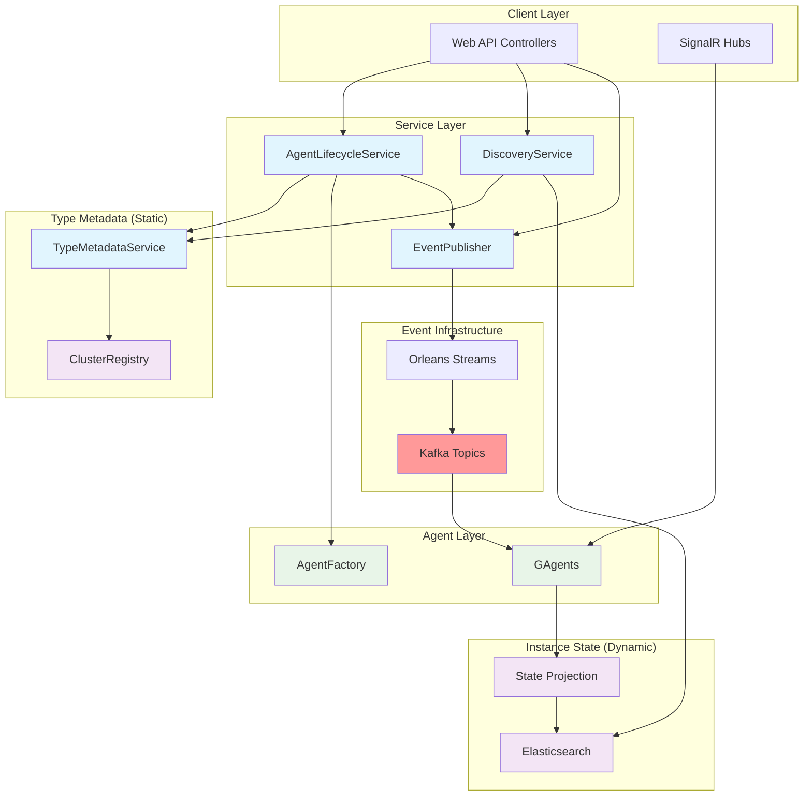
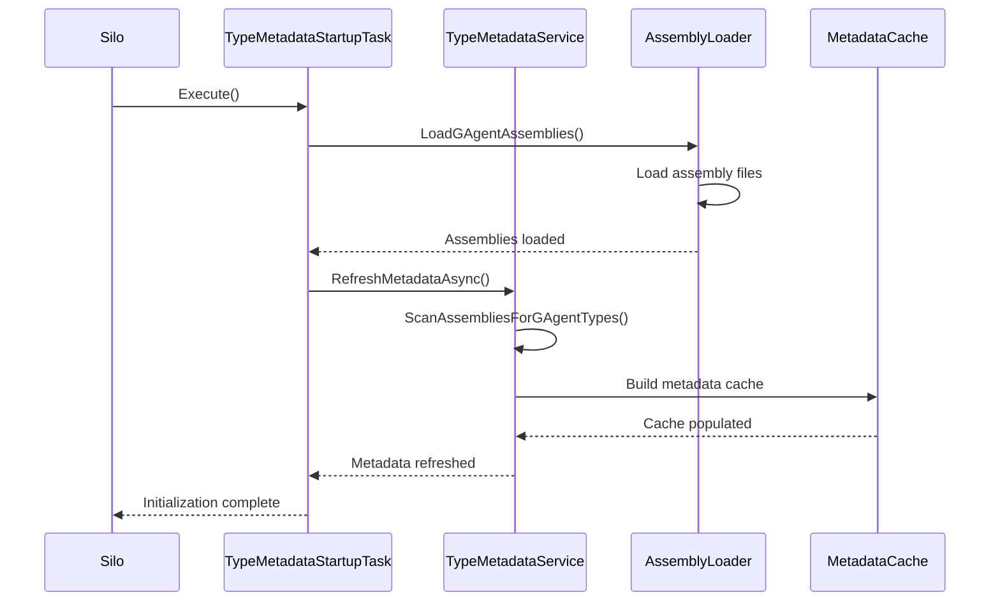
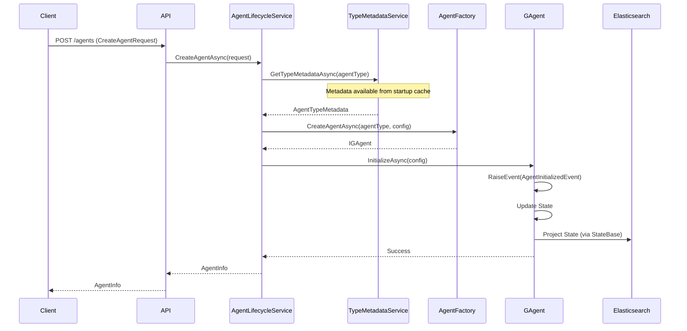
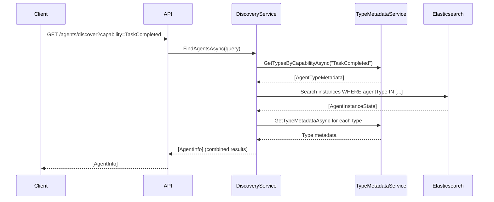
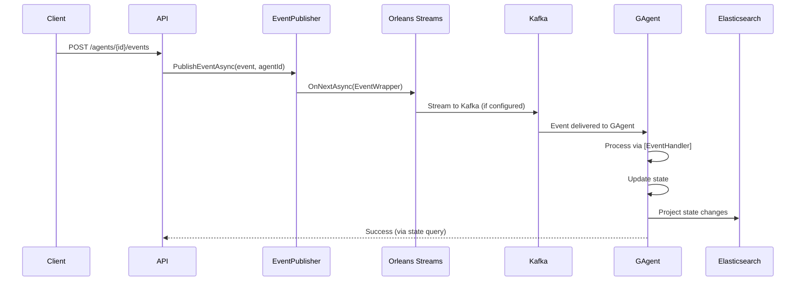
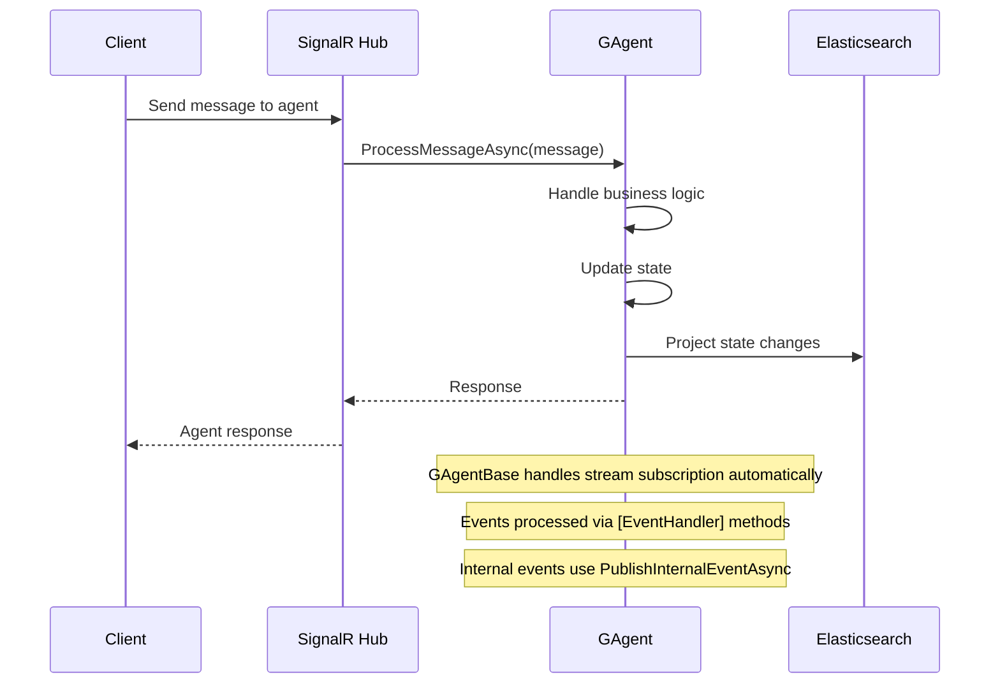

# Agent Management Architecture Proposal

## Executive Summary

This proposal outlines an improved architecture for agent management in the Aevatar Station platform that **eliminates CreatorGAgent** while retaining all its essential features. The new architecture provides direct GAgent access, improved performance, better separation of concerns, and **Kafka-based event delivery** that eliminates the need for GAgents to implement outbound event publishing.

## Problem Statement

The current `CreatorGAgent` implementation creates an unnecessary proxy layer that:
- Adds indirection between clients and business agents
- Duplicates metadata across multiple storage systems
- Complicates the agent interaction model
- Creates potential performance bottlenecks
- Mixes agent lifecycle management with business logic concerns

## Proposed Architecture

### Architecture Overview



### Key Components

#### 1. AgentLifecycleService
**Purpose**: Centralized service for agent CRUD operations, replacing CreatorGAgent's factory responsibilities.

```csharp
public interface IAgentLifecycleService
{
    Task<AgentInfo> CreateAgentAsync(CreateAgentRequest request);
    Task<AgentInfo> UpdateAgentAsync(Guid agentId, UpdateAgentRequest request);
    Task DeleteAgentAsync(Guid agentId);
    Task<AgentInfo> GetAgentAsync(Guid agentId);
    Task<List<AgentInfo>> GetUserAgentsAsync(Guid userId);
    Task SendEventToAgentAsync(Guid agentId, EventBase @event);
}

public class AgentLifecycleService : IAgentLifecycleService
{
    private readonly IEventPublisher _eventPublisher;
    
    public async Task SendEventToAgentAsync(Guid agentId, EventBase @event)
    {
        // Publish event to Orleans stream for agent consumption
        await _eventPublisher.PublishEventAsync(@event, agentId.ToString());
    }
}

public class CreateAgentRequest
{
    public Guid UserId { get; set; }
    public string AgentType { get; set; }
    public string Name { get; set; }
    public Dictionary<string, object> Properties { get; set; }
}

public class AgentInfo
{
    public Guid Id { get; set; }
    public Guid UserId { get; set; }
    public string AgentType { get; set; }
    public string Name { get; set; }
    public Dictionary<string, object> Properties { get; set; }
    public List<string> Capabilities { get; set; }
    public AgentStatus Status { get; set; }
    public DateTime CreatedAt { get; set; }
    public DateTime LastActivity { get; set; }
}
```

#### 2. Standard GAgent Interface
**Purpose**: All agents inherit directly from GAgentBase which automatically handles stream subscription and event processing.

```csharp
// All agents inherit directly from GAgentBase
// GAgentBase already handles stream initialization and subscription
[GAgent]
[StorageProvider(ProviderName = "PubSubStore")]
[LogConsistencyProvider(ProviderName = "LogStorage")]
public class MyAgent : GAgentBase<MyAgentState, MyAgentEvent>, IMyAgent
    where MyAgentState : AgentInstanceState, new()
    where MyAgentEvent : EventBase
{
    public async Task InitializeAsync(AgentConfiguration config)
    {
        RaiseEvent(new AgentInitializedEvent
        {
            Id = config.Id,
            UserId = config.UserId,
            AgentType = config.AgentType,
            Name = config.Name,
            Properties = config.Properties
        });
        await ConfirmEvents();
    }
    
    // Handle events from external sources (Kafka) via event handlers
    [EventHandler]
    public async Task HandleAgentCommandAsync(AgentCommandEvent command)
    {
        Logger.LogInformation("Processing command: {CommandType}", command.CommandType);
        // Process command and update state
        RaiseEvent(new CommandProcessedEvent 
        { 
            CommandId = command.Id,
            ProcessedAt = DateTime.UtcNow 
        });
        await ConfirmEvents();
    }
    
    [EventHandler]
    public async Task HandleAgentQueryAsync(AgentQueryEvent query)
    {
        Logger.LogInformation("Processing query: {QueryType}", query.QueryType);
        // Process query - no state changes for queries typically
        // Response would be sent back via state projection or direct query
    }
    
    // Note: PublishEventAsync removed - external events come through Kafka
    // For internal agent-to-agent communication, use Orleans streams directly
    protected async Task PublishInternalEventAsync<T>(T @event) where T : EventBase
    {
        await PublishAsync(@event); // Orleans stream publish for internal events
    }
    
    public virtual Task<string> GetDescriptionAsync()
    {
        return Task.FromResult($"{GetType().Name} - {State.Name}");
    }
}
```

#### 3. Agent Factory Service
**Purpose**: Standardized agent creation and configuration.

```csharp
public interface IAgentFactory
{
    Task<IGAgent> CreateAgentAsync(string agentType, AgentConfiguration config);
    Task<bool> SupportsAgentTypeAsync(string agentType);
}

public class AgentFactory : IAgentFactory
{
    private readonly IGrainFactory _grainFactory;
    private readonly ITypeMetadataService _typeMetadataService;
    
    public async Task<IGAgent> CreateAgentAsync(string agentType, AgentConfiguration config)
    {
        var typeMetadata = await _typeMetadataService.GetTypeMetadataAsync(agentType);
        if (typeMetadata == null)
            throw new InvalidOperationException($"Unknown agent type: {agentType}");
            
        var grainId = GrainId.Create(agentType, config.Id.ToString());
        var agent = _grainFactory.GetGrain<IGAgent>(grainId);
        
        return agent;
    }
}
```

#### 4. TypeMetadataService Architecture
**Purpose**: Cluster-wide agent type metadata storage and retrieval using Orleans grain.

**Key Design Decisions**:
- **Orleans Grain Storage**: Use single TypeMetadataGrain with persistent state
- **Strong Consistency**: Single grain activation ensures atomic updates
- **Performance**: In-memory grain state provides ~1ms access latency
- **Capacity**: Supports ~10,000 agent types within 16MB MongoDB document limit
- **Monitoring**: Built-in size monitoring with alerts at 50% capacity

```csharp
// TypeMetadataGrain with size monitoring
[StatelessWorker] // Single activation per cluster
public class TypeMetadataGrain : Grain, ITypeMetadataGrain
{
    private readonly IPersistentState<TypeMetadataState> _state;
    
    public TypeMetadataGrain(
        [PersistentState("typeMetadata", "PubSubStore")] 
        IPersistentState<TypeMetadataState> state)
    {
        _state = state;
    }
    
    public async Task<MetadataStats> GetStatsAsync()
    {
        var sizeInBytes = CalculateStateSize();
        var stats = new MetadataStats
        {
            TotalTypes = _state.State.Metadata.Count,
            SizeInBytes = sizeInBytes,
            PercentageOf16MB = (sizeInBytes / (16.0 * 1024 * 1024)) * 100
        };
        
        if (stats.PercentageOf16MB > 50)
        {
            _logger.LogWarning(
                "TypeMetadata approaching capacity: {Percentage}% of 16MB limit", 
                stats.PercentageOf16MB);
        }
        
        return stats;
    }
    
    // Metadata management methods
    public async Task SetMetadataAsync(List<AgentTypeMetadata> metadata)
    {
        _state.State.Metadata = metadata ?? new List<AgentTypeMetadata>();
        await _state.WriteStateAsync();
    }
    
    public async Task<List<AgentTypeMetadata>> GetByCapabilityAsync(string capability)
    {
        return _state.State.Metadata
            .Where(m => m.Capabilities?.Contains(capability) == true)
            .ToList();
    }
}

// TypeMetadataService with grain integration
public class TypeMetadataService : ITypeMetadataService
{
    private readonly IGrainFactory _grainFactory;
    private readonly ConcurrentDictionary<string, AgentTypeMetadata> _localCache;
    
    public async Task<AgentTypeMetadata> GetTypeMetadataAsync(string agentType)
    {
        // Check local cache first (fastest)
        if (_localCache.TryGetValue(agentType, out var cached))
            return cached;
            
        // Fallback to grain (still fast, ~1ms)
        var grain = _grainFactory.GetGrain<ITypeMetadataGrain>(0);
        var metadata = await grain.GetByTypeAsync(agentType);
        
        if (metadata != null)
            _localCache.TryAdd(agentType, metadata);
            
        return metadata;
    }
}
```

#### 5. TypeMetadataService Initialization
**Purpose**: Automatic loading of agent type metadata during silo startup.

```csharp
// Startup task for TypeMetadataService initialization
public class TypeMetadataStartupTask : IStartupTask
{
    private readonly ITypeMetadataService _typeMetadataService;
    private readonly ILogger<TypeMetadataStartupTask> _logger;
    
    public TypeMetadataStartupTask(
        ITypeMetadataService typeMetadataService,
        ILogger<TypeMetadataStartupTask> logger)
    {
        _typeMetadataService = typeMetadataService;
        _logger = logger;
    }
    
    public async Task Execute(CancellationToken cancellationToken)
    {
        _logger.LogInformation("Starting TypeMetadataService initialization");
        
        // Force load all assemblies that might contain GAgents
        await LoadGAgentAssemblies();
        
        // Scan assemblies and build metadata cache
        await _typeMetadataService.RefreshMetadataAsync();
        
        _logger.LogInformation("TypeMetadataService initialization completed");
    }
    
    private async Task LoadGAgentAssemblies()
    {
        // Load assemblies that contain GAgent implementations
        // This ensures assemblies are loaded before scanning
        var assemblyPaths = new[]
        {
            "Aevatar.Application.Grains.dll",
            "Aevatar.Domain.dll",
            // Add other assemblies that contain GAgent implementations
        };
        
        foreach (var assemblyPath in assemblyPaths)
        {
            try
            {
                if (File.Exists(assemblyPath))
                {
                    Assembly.LoadFrom(assemblyPath);
                    _logger.LogInformation("Loaded assembly: {AssemblyPath}", assemblyPath);
                }
            }
            catch (Exception ex)
            {
                _logger.LogWarning(ex, "Failed to load assembly: {AssemblyPath}", assemblyPath);
            }
        }
        
        await Task.CompletedTask;
    }
}

// Silo configuration for startup task registration
public static class SiloHostBuilderExtensions
{
    public static ISiloHostBuilder AddTypeMetadataService(this ISiloHostBuilder builder)
    {
        return builder
            .ConfigureServices(services =>
            {
                services.AddSingleton<ITypeMetadataService, TypeMetadataService>();
                services.AddSingleton<IStartupTask, TypeMetadataStartupTask>();
            });
    }
}
```

#### 6. Agent Instance State
**Purpose**: Replaces CreatorGAgentState with automatic Elasticsearch projection using IMetaDataState interface.

```csharp
// IMetaDataState interface with Orleans serialization support and default Apply implementation
public interface IMetaDataState
{
    Guid Id { get; set; }
    Guid UserId { get; set; }
    string AgentType { get; set; }
    string Name { get; set; }
    Dictionary<string, string> Properties { get; set; }
    GrainId AgentGrainId { get; set; }
    DateTime CreateTime { get; set; }
    AgentStatus Status { get; set; }
    DateTime LastActivity { get; set; }
    
    // Default Apply method implementation for event sourcing (.NET 8+ feature)
    void Apply(MetaDataStateLogEvent @event)
    {
        // Apply state changes based on event type
        switch (@event)
        {
            case AgentCreatedEvent created:
                Id = created.AgentId;
                UserId = created.UserId;
                AgentType = created.AgentType;
                Name = created.Name;
                AgentGrainId = created.AgentGrainId;
                CreateTime = created.Ctime;
                Status = AgentStatus.Initializing;
                LastActivity = created.Ctime;
                break;
                
            case AgentStatusChangedEvent statusChanged:
                Status = statusChanged.NewStatus;
                LastActivity = statusChanged.Ctime;
                break;
                
            case AgentPropertiesUpdatedEvent propertiesUpdated:
                Properties = propertiesUpdated.NewProperties;
                LastActivity = propertiesUpdated.Ctime;
                break;
                
            case AgentActivityUpdatedEvent activityUpdated:
                LastActivity = activityUpdated.CurrentActivity;
                break;
        }
    }
}

// Base event for metadata state changes
[GenerateSerializer]
public abstract class MetaDataStateLogEvent : StateLogEventBase<MetaDataStateLogEvent>
{
    [Id(0)] public string EventType { get; set; }
    [Id(1)] public string Description { get; set; }
    [Id(2)] public Dictionary<string, string> EventData { get; set; } = new();
}

// Specific event types for metadata changes
[GenerateSerializer]
public class AgentCreatedEvent : MetaDataStateLogEvent
{
    [Id(0)] public Guid AgentId { get; set; }
    [Id(1)] public Guid UserId { get; set; }
    [Id(2)] public string AgentType { get; set; }
    [Id(3)] public string Name { get; set; }
    [Id(4)] public GrainId AgentGrainId { get; set; }
}

[GenerateSerializer]
public class AgentStatusChangedEvent : MetaDataStateLogEvent
{
    [Id(0)] public AgentStatus OldStatus { get; set; }
    [Id(1)] public AgentStatus NewStatus { get; set; }
    [Id(2)] public string Reason { get; set; }
}

[GenerateSerializer]
public class AgentPropertiesUpdatedEvent : MetaDataStateLogEvent
{
    [Id(0)] public Dictionary<string, string> OldProperties { get; set; }
    [Id(1)] public Dictionary<string, string> NewProperties { get; set; }
    [Id(2)] public List<string> ChangedKeys { get; set; }
}

[GenerateSerializer]
public class AgentActivityUpdatedEvent : MetaDataStateLogEvent
{
    [Id(0)] public DateTime PreviousActivity { get; set; }
    [Id(1)] public DateTime CurrentActivity { get; set; }
    [Id(2)] public string ActivityType { get; set; }
}

// Refactored AgentInstanceState using IMetaDataState with default Apply implementation
[GenerateSerializer]
public class AgentInstanceState : StateBase, IMetaDataState
{
    [Id(0)] public Guid Id { get; set; }
    [Id(1)] public Guid UserId { get; set; }
    [Id(2)] public string AgentType { get; set; }
    [Id(3)] public string Name { get; set; }
    [Id(4)] public Dictionary<string, string> Properties { get; set; } = new();
    [Id(5)] public GrainId AgentGrainId { get; set; }
    [Id(6)] public DateTime CreateTime { get; set; }
    [Id(7)] public AgentStatus Status { get; set; }
    [Id(8)] public DateTime LastActivity { get; set; }
    
}

[GenerateSerializer]
public enum AgentStatus
{
    [Id(0)] Initializing,
    [Id(1)] Active,
    [Id(2)] Inactive,
    [Id(3)] Error,
    [Id(4)] Deleted
}
```

#### 6. Discovery Service Enhancement
**Purpose**: Builds on AgentRegistry-ElasticSearch-Lite design for efficient agent discovery.

```csharp
public class AgentDiscoveryService : IAgentDiscoveryService
{
    private readonly ITypeMetadataService _typeMetadataService;
    private readonly IElasticsearchClient _elasticsearchClient;
    
    public async Task<List<AgentInfo>> FindAgentsAsync(AgentDiscoveryQuery query)
    {
        // Step 1: Filter agent types by capabilities (fast, in-memory)
        var eligibleTypes = await _typeMetadataService.GetTypesByCapabilityAsync(query.RequiredCapabilities);
        
        // Step 2: Build Elasticsearch query
        var searchRequest = new SearchRequest<AgentInstanceState>
        {
            Query = Query.Bool(b => b
                .Must(
                    Query.Terms(t => t.Field(f => f.AgentType).Terms(eligibleTypes.Select(t => t.AgentType))),
                    Query.Term(t => t.Field(f => f.UserId).Value(query.UserId))
                )
                .Filter(Query.Term(t => t.Field(f => f.Status).Value(AgentStatus.Active)))
            )
        };
        
        // Step 3: Execute search
        var response = await _elasticsearchClient.SearchAsync<AgentInstanceState>(searchRequest);
        
        // Step 4: Combine with type metadata
        var results = new List<AgentInfo>();
        foreach (var doc in response.Documents)
        {
            var typeMetadata = await _typeMetadataService.GetTypeMetadataAsync(doc.AgentType);
            results.Add(new AgentInfo
            {
                Id = doc.Id,
                UserId = doc.UserId,
                AgentType = doc.AgentType,
                Name = doc.Name,
                Properties = doc.Properties,
                Capabilities = typeMetadata.Capabilities,
                Status = doc.Status,
                CreatedAt = doc.CreatedAt,
                LastActivity = doc.LastActivity
            });
        }
        
        return results;
    }
}
```

#### 7. Orleans Event Publisher
**Purpose**: Publishes events from API layer to Orleans streams (which can be backed by Kafka) for agent consumption.

```csharp
public interface IEventPublisher
{
    Task PublishEventAsync<T>(T @event, string agentId) where T : EventBase;
    Task PublishBroadcastEventAsync<T>(T @event, string streamNamespace) where T : EventBase;
}

public class EventPublisher : IEventPublisher
{
    private readonly IClusterClient _clusterClient;
    private readonly ILogger<EventPublisher> _logger;
    
    public EventPublisher(IClusterClient clusterClient, ILogger<EventPublisher> logger)
    {
        _clusterClient = clusterClient;
        _logger = logger;
    }
    
    public async Task PublishEventAsync<T>(T @event, string agentId) where T : EventBase
    {
        var wrapper = new EventWrapper
        {
            Event = @event,
            Timestamp = DateTime.UtcNow,
            SourceId = "API",
            TargetAgentId = agentId
        };
        
        try
        {
            // Get the stream provider (can be Kafka-backed or memory)
            var streamProvider = _clusterClient.GetStreamProvider("Aevatar");
            
            // Create stream ID for the specific agent
            var streamId = StreamId.Create("agent-events", agentId);
            var stream = streamProvider.GetStream<EventWrapper>(streamId);
            
            // Publish to Orleans stream (Orleans handles Kafka integration)
            await stream.OnNextAsync(wrapper);
            
            _logger.LogInformation("Published event to Orleans stream: agent-events/{AgentId}", agentId);
        }
        catch (Exception ex)
        {
            _logger.LogError(ex, "Failed to publish event to Orleans stream for agent {AgentId}", agentId);
            throw;
        }
    }
    
    public async Task PublishBroadcastEventAsync<T>(T @event, string streamNamespace) where T : EventBase
    {
        var wrapper = new EventWrapper
        {
            Event = @event,
            Timestamp = DateTime.UtcNow,
            SourceId = "API",
            TargetAgentId = "*" // Broadcast indicator
        };
        
        try
        {
            var streamProvider = _clusterClient.GetStreamProvider("Aevatar");
            var streamId = StreamId.Create(streamNamespace, "broadcast");
            var stream = streamProvider.GetStream<EventWrapper>(streamId);
            
            await stream.OnNextAsync(wrapper);
            
            _logger.LogInformation("Published broadcast event to Orleans stream: {StreamNamespace}", streamNamespace);
        }
        catch (Exception ex)
        {
            _logger.LogError(ex, "Failed to publish broadcast event to Orleans stream {StreamNamespace}", streamNamespace);
            throw;
        }
    }
}

public class EventWrapper
{
    public EventBase Event { get; set; }
    public DateTime Timestamp { get; set; }
    public string SourceId { get; set; }
    public string TargetAgentId { get; set; }
}
```

## Data Flow Diagrams

### Silo Startup Flow


### Agent Creation Flow


### Agent Discovery Flow


### External Event Flow (API to Agent via Orleans Streams)


### Direct Agent Interaction Flow (SignalR)


## Feature Preservation

### Features Retained from CreatorGAgent

#### ✅ Agent Factory and Management
- **Creation**: `AgentLifecycleService.CreateAgentAsync()` replaces `CreatorGAgent.CreateAgentAsync()`
- **Updates**: `AgentLifecycleService.UpdateAgentAsync()` replaces `CreatorGAgent.UpdateAgentAsync()`
- **Deletion**: `AgentLifecycleService.DeleteAgentAsync()` replaces `CreatorGAgent.DeleteAgentAsync()`
- **Metadata**: Stored in `AgentInstanceState` and projected to Elasticsearch

#### ✅ Event Management System
- **External Event Delivery**: API → Orleans Streams → GAgents (streams can be Kafka-backed)
- **Internal Event Publishing**: `GAgent.PublishInternalEventAsync()` for agent-to-agent communication
- **Event Registry**: `TypeMetadataService.GetTypeMetadataAsync()` provides capabilities
- **Event Discovery**: Automatic discovery through reflection at startup
- **Stream Subscription**: GAgentBase automatically subscribes to Orleans streams (Kafka-backed)
- **Event Processing**: External events handled via `[EventHandler]` attributed methods

#### ✅ State Management
- **State Persistence**: `AgentInstanceState` replaces `CreatorGAgentState`
- **Event Sourcing**: Maintained through `GAgentBase<TState, TEvent>`
- **State Transitions**: Handled directly in GAgents

#### ✅ Multi-Tenancy Support
- **User Isolation**: Maintained through `UserId` in all operations
- **Tenant Boundaries**: Enforced at service layer and Elasticsearch queries
- **Access Control**: Maintained through user-scoped operations

#### ✅ Audit Trail
- **Event History**: Complete audit trail through GAgentBase event sourcing
- **State Changes**: All state transitions recorded as events in Orleans
- **User Activity**: Tracked through built-in event sourcing mechanisms

#### ✅ Orleans Integration
- **Grain Management**: GAgents are Orleans grains
- **Clustering**: Automatic distribution across cluster nodes
- **Persistence**: State persistence through Orleans providers
- **Streaming**: Event publishing through Orleans streams

#### ✅ Performance & Scalability
- **Horizontal Scaling**: Orleans cluster scaling
- **Load Balancing**: Automatic grain distribution
- **Caching**: In-memory state in grains
- **Async Operations**: Maintained throughout

### New Features Added

#### 🆕 Direct GAgent Access
- Eliminate proxy layer for better performance
- Direct grain references for client interactions
- Simplified debugging and monitoring

#### 🆕 Orleans Stream-Based Event Delivery
- API publishes events to Orleans streams using IClusterClient
- Orleans streams can be backed by Kafka for scalability
- GAgents consume events via existing stream infrastructure
- Eliminates need for outbound PublishEventAsync in GAgents
- Better integration with Orleans ecosystem

#### 🆕 Enhanced Discovery
- Type-based capability filtering
- Efficient Elasticsearch queries
- Combined type and instance metadata

#### 🆕 Improved Separation of Concerns
- Static type metadata separate from instance state
- Dedicated services for specific responsibilities
- Clear interface boundaries


## TypeMetadata Storage Architecture

### Orleans Grain Approach Benefits
1. **Strong Consistency**: Single grain activation prevents race conditions
2. **Simple Implementation**: No complex cache invalidation logic
3. **Excellent Performance**: In-memory access with ~1ms latency
4. **Orleans Native**: Seamless integration with existing infrastructure
5. **Sufficient Capacity**: Supports ~10,000+ agent types (10MB+ capacity)

### Capacity Management
- **Monitoring**: Continuous size tracking with GetStatsAsync()
- **Alerts**: Automatic warnings at 50% capacity (8MB)
- **Growth Path**: Clear migration strategy if limits approached
- **Current Usage**: Estimated <1MB for hundreds of agent types

### Future Migration Strategy (If Needed)
If approaching capacity limits:
1. **Monitor**: Alerts trigger at 50% capacity
2. **Plan**: Design MongoDB-based implementation
3. **Parallel Run**: Run both implementations temporarily
4. **Migrate**: Switch to MongoDB while keeping same interfaces
5. **Verify**: Ensure data consistency before decommissioning grain

## Benefits

### Performance Improvements
- **Reduced Latency**: Direct agent access eliminates proxy layer
- **Lower Memory Usage**: No CreatorGAgent grains for each business agent
- **Better Throughput**: Parallel processing without bottlenecks
- **Fast Metadata Access**: ~1ms for type metadata queries

### Architectural Benefits
- **Cleaner Separation**: Type metadata separate from instance state
- **Better Scalability**: Elasticsearch handles large-scale queries efficiently
- **Simplified Development**: Direct GAgent interfaces
- **Reduced Complexity**: Eliminate unnecessary abstraction layers
- **Stream-Based Integration**: Orleans streams provide consistent event delivery
- **Configurable Backend**: Streams can use Kafka or other providers as needed
- **Strong Consistency**: Orleans grain ensures metadata consistency

### Operational Benefits
- **Easier Debugging**: Direct access to agent logic
- **Better Monitoring**: Clear separation of concerns
- **Improved Testability**: Mock individual services independently
- **Faster Development**: Simpler mental model
- **Capacity Visibility**: Real-time monitoring of metadata storage usage


## Conclusion

This architecture proposal successfully eliminates the CreatorGAgent proxy layer while preserving all essential functionality. The new design provides:

- **Direct GAgent access** for improved performance
- **Enhanced discovery capabilities** through the AgentRegistry-ElasticSearch-Lite design
- **Better separation of concerns** with dedicated services
- **Maintained audit trail** through GAgentBase built-in event sourcing
- **Preserved multi-tenancy** and security features
- **Simplified development model** for GAgent interactions
- **Orleans stream-based event delivery** eliminating outbound PublishEventAsync needs
- **External system integration** through configurable stream providers (Kafka, etc.)

The phased implementation approach ensures minimal disruption while providing clear benefits in terms of performance, maintainability, and scalability. The architecture supports the long-term goals of the Aevatar Station platform while eliminating unnecessary complexity.