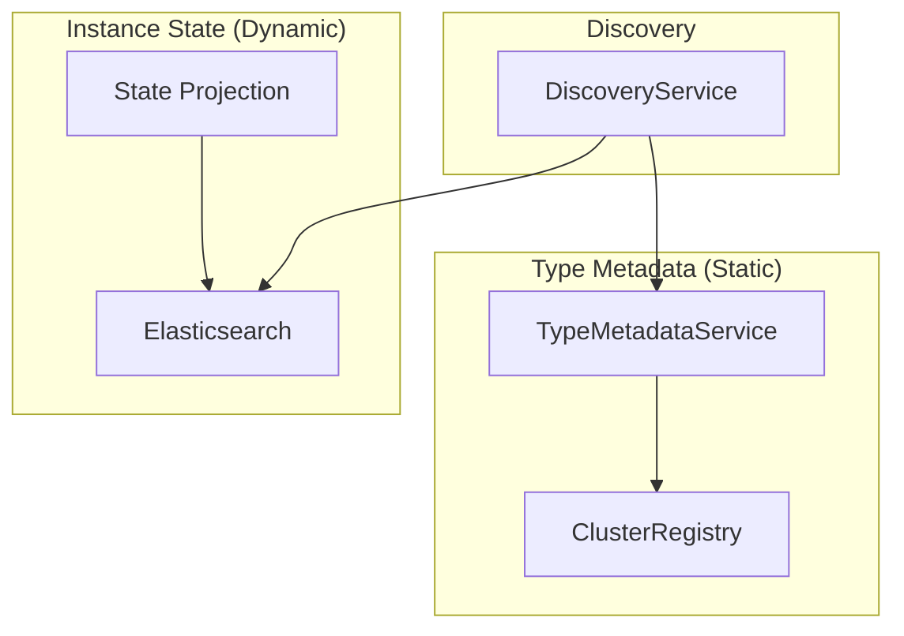
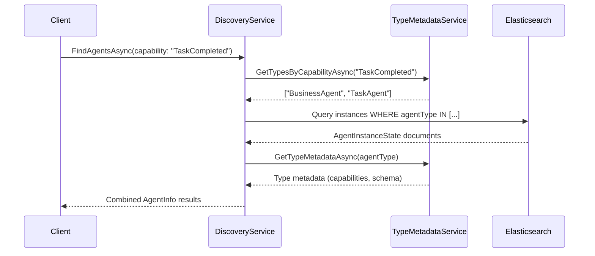

# Agent Discovery Architecture - Concise Reference

## Core Problem
Mixing **type-level metadata** (capabilities, versions) with **instance-level state** (configuration, metrics) creates data duplication and inconsistency during rolling updates.

## Solution
Separate static type information from dynamic instance data using a two-tier architecture.

## Architecture Overview



## Key Components

### 1. Type Metadata Service
**Purpose**: Introspect assemblies for agent capabilities at startup
**Storage**: In-memory cache + Orleans grain registry

```csharp
public interface IAgentTypeMetadataService
{
    Task<List<AgentTypeMetadata>> GetTypesByCapabilityAsync(string capability);
    Task<AgentTypeMetadata> GetTypeMetadataAsync(string agentType);
}

public class AgentTypeMetadata
{
    public string AgentType { get; set; }
    public List<string> Capabilities { get; set; }      // From [EventHandler] methods
    public List<string> InterfaceVersions { get; set; } // From [Version] attributes  
    public string AssemblyVersion { get; set; }        // For rolling updates
    public string DeploymentId { get; set; }           // Version tracking
}
```

### 2. Instance State
**Purpose**: Runtime agent data projected to Elasticsearch
**Pattern**: Inherits from `StateBase` for automatic projection

```csharp
public class AgentInstanceState : StateBase
{
    public Guid Id { get; set; }
    public Guid UserId { get; set; }
    public string AgentType { get; set; }        // Links to type metadata
    public AgentStatus Status { get; set; }
    public Dictionary<string, object> Configuration { get; set; }
    public AgentMetrics Metrics { get; set; }
    
    // NO capabilities here - these are type-level
}
```

### 3. Discovery Service
**Purpose**: Combine type filtering with instance queries

```csharp
public class AgentDiscoveryService : IAgentDiscoveryService
{
    public async Task<List<AgentInfo>> FindAgentsAsync(AgentDiscoveryQuery query)
    {
        // Step 1: Filter agent types by capabilities (fast, in-memory)
        var eligibleTypes = await _typeMetadataService.GetTypesByCapabilityAsync(query.Capability);
        
        // Step 2: Query Elasticsearch for instances of eligible types (scalable)
        var instances = await _elasticsearchClient.SearchAsync<AgentInstanceState>(
            Query.Terms(field: "agenttype", terms: eligibleTypes.Select(t => t.AgentType))
        );
        
        // Step 3: Combine type metadata with instance data
        return await CombineResults(instances.Documents);
    }
}
```

## Data Flow



## Rolling Update Support

### Problem
During rolling updates, different silos have different agent versions with different capabilities.

### Solution
**Cluster-wide metadata registry** tracks all versions; discovery service uses **latest version** for capability filtering.

```csharp
// Registry stores multiple versions:
// BusinessAgent v1.0 -> Capabilities: [TaskAdded, TaskCompleted]  
// BusinessAgent v1.1 -> Capabilities: [TaskAdded, TaskCompleted, TaskPrioritized]

// Discovery always uses latest (v1.1) for filtering
// Orleans routes to correct silo version automatically
```

## Key Benefits

1. **Separation of Concerns**: Type metadata (static) vs instance state (dynamic)
2. **No Data Duplication**: Capabilities stored once per type, not per instance
3. **Efficient Discovery**: Type filtering (memory) → Instance filtering (Elasticsearch)
4. **Rolling Update Safe**: Version-aware metadata management
5. **Automatic Projection**: Uses existing StateBase projection pipeline

## Integration Points

### With Existing State Projection
`AgentInstanceState : StateBase` automatically flows through:
StateDispatcher → Orleans Streams → StateProjectionGrain → Elasticsearch

### With GAgent Framework
- Scans assemblies for `[GAgent]` types at startup
- Extracts capabilities from `[EventHandler]` methods
- Uses `IGAgentFactory` for agent creation
- Follows `GAgentBase<TState, TEvent>` patterns

## Usage Example

```csharp
// Find all agents that can handle "TaskCompleted" events for user
var agents = await discoveryService.FindAgentsAsync(new AgentDiscoveryQuery 
{
    UserId = userId,
    RequiredCapabilities = ["TaskCompleted"],
    Status = AgentStatus.Active
});

// Result combines type metadata + instance data
foreach (var agent in agents)
{
    Console.WriteLine($"{agent.AgentType}: {string.Join(", ", agent.Capabilities)}");
    Console.WriteLine($"Status: {agent.Status}, Last Activity: {agent.LastActivity}");
}
```

## Implementation Notes

- **Type Metadata**: Extracted at silo startup, cached in memory, shared via Orleans grain
- **Instance Queries**: Use modern `ElasticsearchClient` with proper field mapping
- **Version Tracking**: `AssemblyVersion_DeploymentId_SiloIdentity` for uniqueness
- **Cleanup**: Old metadata versions auto-expire after configurable time

This architecture provides efficient, consistent agent discovery while handling the complexity of distributed deployments and rolling updates.