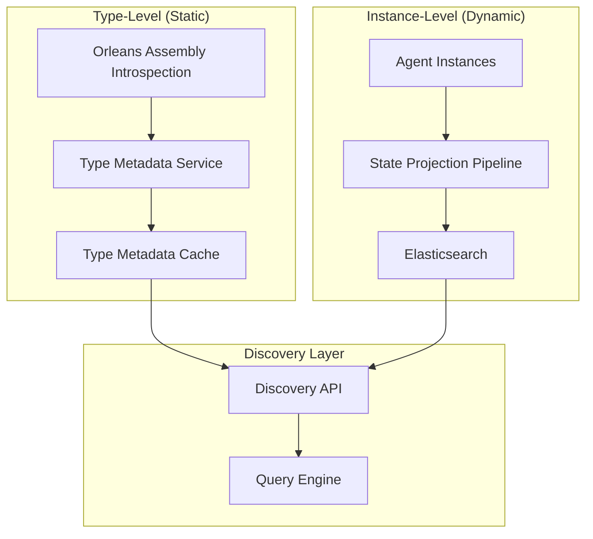
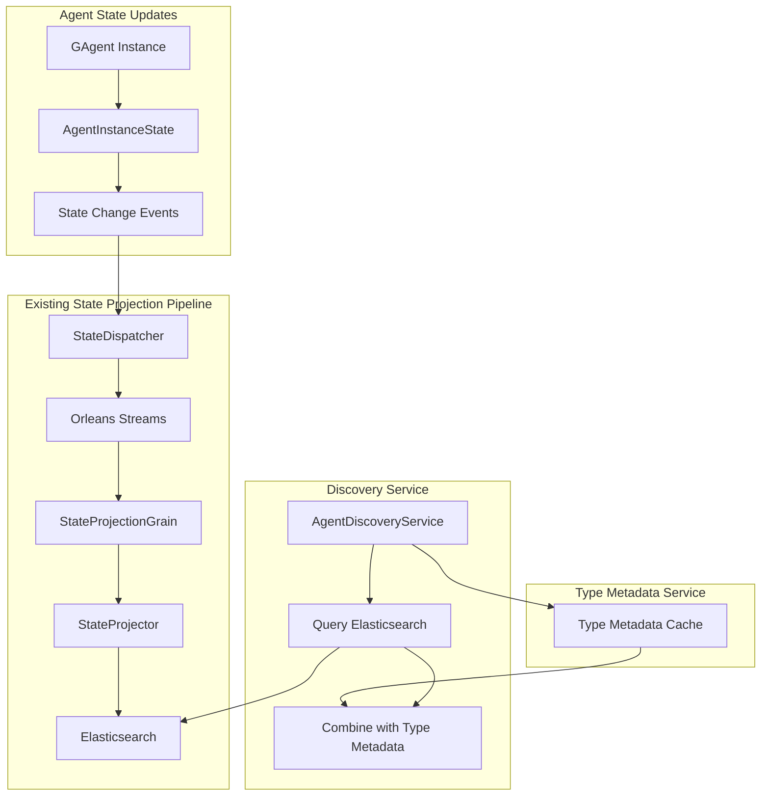

# Agent Discovery with Elasticsearch and Type Metadata Service

## Overview

This design addresses the architectural problem of mixing type-level metadata (capabilities, versioning) with instance-level state by separating static type information from dynamic instance data. The solution uses a lightweight Type Metadata Service for static agent type information and Elasticsearch for dynamic instance state.

## Architecture Problem

Using Elasticsearch directly for service discovery creates a fundamental issue:
- **Type-level information**: Agent capabilities, interface versions, supported event types (determined by code/deployment)
- **Instance-level information**: Agent state, configuration, metrics, status (specific to each agent instance)

Storing capabilities in each agent's state leads to:
- Data duplication (same capabilities stored for every instance of the same agent type)
- Inconsistency risks (different instances might report different capabilities due to deployment issues)
- Mixing concerns (type metadata with instance data)

## Solution Architecture



## Component Design

### 1. Type Metadata Service with Rolling Update Support

```csharp
// ABOUTME: Lightweight service for agent type introspection with rolling update support
// ABOUTME: Extracts static metadata from Orleans grain definitions and shares across cluster

public interface IAgentTypeMetadataService
{
    Task<AgentTypeMetadata> GetTypeMetadataAsync(string agentType);
    Task<List<AgentTypeMetadata>> GetAllTypesAsync();
    Task<List<AgentTypeMetadata>> GetTypesByCapabilityAsync(string capability);
    Task InitializeAsync();
}

// Cluster-wide metadata registry grain
public interface IAgentTypeMetadataRegistry : IGrainWithIntegerKey
{
    Task RegisterTypeMetadataAsync(AgentTypeMetadata metadata);
    Task<AgentTypeMetadata> GetLatestTypeMetadataAsync(string agentType);
    Task<List<AgentTypeMetadata>> GetAllTypeMetadataAsync();
    Task<List<AgentTypeMetadata>> GetTypeMetadataVersionsAsync(string agentType);
    Task CleanupOldVersionsAsync(TimeSpan maxAge);
}

[GAgent]
[StorageProvider(ProviderName = "PubSubStore")]
public class AgentTypeMetadataRegistry : Grain, IAgentTypeMetadataRegistry
{
    private readonly ConcurrentDictionary<string, ConcurrentDictionary<string, AgentTypeMetadata>> _typeVersions = new();
    
    public Task RegisterTypeMetadataAsync(AgentTypeMetadata metadata)
    {
        var versionKey = $"{metadata.AssemblyVersion}_{metadata.DeploymentId}_{metadata.SiloIdentity}";
        
        _typeVersions.AddOrUpdate(metadata.AgentType,
            new ConcurrentDictionary<string, AgentTypeMetadata> { [versionKey] = metadata },
            (key, existing) =>
            {
                existing[versionKey] = metadata;
                return existing;
            });
            
        return Task.CompletedTask;
    }
    
    public Task<AgentTypeMetadata> GetLatestTypeMetadataAsync(string agentType)
    {
        if (_typeVersions.TryGetValue(agentType, out var versions))
        {
            var latest = versions.Values
                .OrderByDescending(v => v.LastUpdated)
                .FirstOrDefault();
            return Task.FromResult(latest);
        }
        
        return Task.FromResult<AgentTypeMetadata>(null);
    }
    
    public Task<List<AgentTypeMetadata>> GetAllTypeMetadataAsync()
    {
        var latestVersions = _typeVersions.Values
            .Select(versions => versions.Values
                .OrderByDescending(v => v.LastUpdated)
                .FirstOrDefault())
            .Where(v => v != null)
            .ToList();
            
        return Task.FromResult(latestVersions);
    }
    
    public Task<List<AgentTypeMetadata>> GetTypeMetadataVersionsAsync(string agentType)
    {
        if (_typeVersions.TryGetValue(agentType, out var versions))
        {
            return Task.FromResult(versions.Values.ToList());
        }
        
        return Task.FromResult(new List<AgentTypeMetadata>());
    }
    
    public Task CleanupOldVersionsAsync(TimeSpan maxAge)
    {
        var cutoffTime = DateTime.UtcNow - maxAge;
        
        foreach (var typeVersions in _typeVersions.Values)
        {
            var keysToRemove = typeVersions
                .Where(kv => kv.Value.LastUpdated < cutoffTime)
                .Select(kv => kv.Key)
                .ToList();
                
            foreach (var key in keysToRemove)
            {
                typeVersions.TryRemove(key, out _);
            }
        }
        
        return Task.CompletedTask;
    }
}

public class AgentTypeMetadata
{
    public string AgentType { get; set; }
    public string AssemblyName { get; set; }
    public string AssemblyVersion { get; set; } // Assembly version for rolling update detection
    public string DeploymentId { get; set; } // Unique deployment identifier
    public List<string> Capabilities { get; set; }
    public List<string> InterfaceVersions { get; set; }
    public List<string> SupportedEvents { get; set; }
    public AgentTypeSchema Schema { get; set; }
    public DateTime LastUpdated { get; set; } // Deployment timestamp
    public string SiloIdentity { get; set; } // Which silo reported this metadata
}

public class AgentTypeMetadataService : IAgentTypeMetadataService
{
    private readonly ConcurrentDictionary<string, ConcurrentDictionary<string, AgentTypeMetadata>> _typeVersionCache = new();
    private readonly ILogger<AgentTypeMetadataService> _logger;
    private readonly IClusterClient _clusterClient;
    private readonly string _siloIdentity;
    private readonly string _deploymentId;
    
    public AgentTypeMetadataService(ILogger<AgentTypeMetadataService> logger, IClusterClient clusterClient)
    {
        _logger = logger;
        _clusterClient = clusterClient;
        _siloIdentity = Environment.MachineName + "_" + Environment.ProcessId;
        _deploymentId = Environment.GetEnvironmentVariable("DEPLOYMENT_ID") ?? Guid.NewGuid().ToString("N")[..8];
    }
    
    public async Task InitializeAsync()
    {
        // Introspect Orleans assemblies at startup
        var grainTypes = AppDomain.CurrentDomain.GetAssemblies()
            .SelectMany(assembly => assembly.GetTypes())
            .Where(t => t.GetCustomAttribute<GAgentAttribute>() != null)
            .ToList();
            
        foreach (var grainType in grainTypes)
        {
            var metadata = ExtractTypeMetadata(grainType);
            
            // Store by agent type and version key
            var versionKey = $"{metadata.AssemblyVersion}_{metadata.DeploymentId}";
            _typeVersionCache.AddOrUpdate(grainType.Name, 
                new ConcurrentDictionary<string, AgentTypeMetadata> { [versionKey] = metadata },
                (key, existing) => 
                {
                    existing[versionKey] = metadata;
                    return existing;
                });
        }
        
        // TODO: Implement distributed metadata sharing across silos
        await ShareMetadataWithCluster();
    }
    
    private AgentTypeMetadata ExtractTypeMetadata(Type grainType)
    {
        var assembly = grainType.Assembly;
        var assemblyName = assembly.GetName();
        
        return new AgentTypeMetadata
        {
            AgentType = grainType.Name,
            AssemblyName = assemblyName.Name,
            AssemblyVersion = assemblyName.Version?.ToString() ?? "1.0.0.0",
            DeploymentId = _deploymentId,
            SiloIdentity = _siloIdentity,
            Capabilities = ExtractCapabilities(grainType),
            InterfaceVersions = ExtractInterfaceVersions(grainType),
            SupportedEvents = ExtractSupportedEvents(grainType),
            Schema = ExtractSchema(grainType),
            LastUpdated = DateTime.UtcNow
        };
    }
    
    private async Task ShareMetadataWithCluster()
    {
        // Share metadata with other silos through Orleans grain
        var metadataRegistry = _clusterClient.GetGrain<IAgentTypeMetadataRegistry>(0);
        
        foreach (var typeVersions in _typeVersionCache)
        {
            foreach (var versionMetadata in typeVersions.Value)
            {
                await metadataRegistry.RegisterTypeMetadataAsync(versionMetadata.Value);
            }
        }
    }
    
    public async Task<AgentTypeMetadata> GetTypeMetadataAsync(string agentType)
    {
        if (_typeVersionCache.TryGetValue(agentType, out var versions))
        {
            // Return the latest version metadata
            var latestVersion = versions.Values
                .OrderByDescending(v => v.LastUpdated)
                .FirstOrDefault();
                
            if (latestVersion != null)
                return latestVersion;
        }
        
        // Fallback: query cluster-wide metadata
        var metadataRegistry = _clusterClient.GetGrain<IAgentTypeMetadataRegistry>(0);
        return await metadataRegistry.GetLatestTypeMetadataAsync(agentType);
    }
    
    public async Task<List<AgentTypeMetadata>> GetAllTypesAsync()
    {
        // Get local metadata and merge with cluster-wide metadata
        var localTypes = _typeVersionCache.Values
            .SelectMany(versions => versions.Values)
            .ToList();
            
        var metadataRegistry = _clusterClient.GetGrain<IAgentTypeMetadataRegistry>(0);
        var clusterTypes = await metadataRegistry.GetAllTypeMetadataAsync();
        
        // Merge and deduplicate, preferring latest versions
        return MergeTypeMetadata(localTypes, clusterTypes);
    }
    
    public async Task<List<AgentTypeMetadata>> GetTypesByCapabilityAsync(string capability)
    {
        var allTypes = await GetAllTypesAsync();
        return allTypes
            .Where(t => t.Capabilities?.Contains(capability) == true)
            .ToList();
    }
    
    private List<AgentTypeMetadata> MergeTypeMetadata(List<AgentTypeMetadata> local, List<AgentTypeMetadata> cluster)
    {
        var merged = new Dictionary<string, AgentTypeMetadata>();
        
        // Process all metadata, keeping the latest version for each agent type
        foreach (var metadata in local.Concat(cluster))
        {
            var key = metadata.AgentType;
            if (!merged.TryGetValue(key, out var existing) || 
                metadata.LastUpdated > existing.LastUpdated)
            {
                merged[key] = metadata;
            }
        }
        
        return merged.Values.ToList();
    }
    
    private List<string> ExtractCapabilities(Type grainType)
    {
        return grainType.GetMethods()
            .Where(m => m.GetCustomAttribute<EventHandlerAttribute>() != null)
            .SelectMany(m => m.GetParameters().Select(p => p.ParameterType.Name))
            .Where(t => t != null)
            .Distinct()
            .ToList();
    }
    
    private List<string> ExtractInterfaceVersions(Type grainType)
    {
        return grainType.GetInterfaces()
            .Where(i => i.GetCustomAttribute<VersionAttribute>() != null)
            .Select(i => $"{i.Name}:v{i.GetCustomAttribute<VersionAttribute>().Version}")
            .ToList();
    }
    
    private List<string> ExtractSupportedEvents(Type grainType)
    {
        return grainType.GetMethods()
            .Where(m => m.GetCustomAttribute<EventHandlerAttribute>() != null)
            .SelectMany(m => m.GetParameters().Select(p => p.ParameterType.Name))
            .Distinct()
            .ToList();
    }
    
    private AgentTypeSchema ExtractSchema(Type grainType)
    {
        // Extract schema information from the grain's state type
        // Look for GAgentBase<TState, TEvent> pattern
        var baseType = grainType.BaseType;
        while (baseType != null && !baseType.IsGenericType)
            baseType = baseType.BaseType;
            
        if (baseType?.IsGenericType == true && baseType.GetGenericTypeDefinition().Name.Contains("GAgentBase"))
        {
            var stateType = baseType.GetGenericArguments().FirstOrDefault();
            if (stateType != null)
            {
                return new AgentTypeSchema
                {
                    StateType = stateType.Name,
                    Properties = stateType.GetProperties()
                        .Select(p => new SchemaProperty
                        {
                            Name = p.Name,
                            Type = p.PropertyType.Name,
                            IsRequired = p.GetCustomAttribute<RequiredAttribute>() != null
                        })
                        .ToList()
                };
            }
        }
        
        return null;
    }
}

public class AgentTypeSchema
{
    public string StateType { get; set; }
    public List<SchemaProperty> Properties { get; set; }
}

public class SchemaProperty
{
    public string Name { get; set; }
    public string Type { get; set; }
    public bool IsRequired { get; set; }
}
```

### 2. Agent Instance State (Following GAgent State Projection Pattern)

```csharp
// ABOUTME: Agent instance state inheriting from StateBase for automatic projection
// ABOUTME: Will be automatically projected to Elasticsearch via state projection pipeline

public class AgentInstanceState : StateBase
{
    public Guid Id { get; set; }
    public Guid UserId { get; set; }
    public string AgentType { get; set; } // Reference to type metadata
    public string Name { get; set; }
    public Dictionary<string, object> Configuration { get; set; } = new();
    public AgentStatus Status { get; set; } = AgentStatus.Active;
    public DateTime CreatedAt { get; set; } = DateTime.UtcNow;
    public DateTime UpdatedAt { get; set; } = DateTime.UtcNow;
    public DateTime LastActivity { get; set; } = DateTime.UtcNow;
    public AgentMetrics Metrics { get; set; } = new();
    
    // NO capabilities or versioning here - these are type-level
}

public class AgentMetrics
{
    public int EventsProcessed { get; set; }
    public TimeSpan TotalProcessingTime { get; set; }
    public DateTime LastEventTime { get; set; }
    public double AverageProcessingTime { get; set; }
}

public enum AgentStatus
{
    Pending = 0,
    Active = 1,
    Inactive = 2,
    Error = 3,
    Decommissioned = 4
}
```

### 3. Discovery API

```csharp
// ABOUTME: Discovery service combining type metadata with instance filtering
// ABOUTME: Efficient queries without data duplication

public interface IAgentDiscoveryService
{
    Task<List<AgentInfo>> FindAgentsAsync(AgentDiscoveryQuery query);
    Task<List<AgentTypeInfo>> GetAvailableTypesAsync();
    Task<List<AgentInfo>> GetAgentsWithCapabilityAsync(string capability, Guid userId);
    Task<AgentTypeMetadata> GetTypeMetadataAsync(string agentType);
}

public class AgentDiscoveryQuery
{
    public Guid UserId { get; set; }
    public List<string> RequiredCapabilities { get; set; } = new();
    public List<string> AgentTypes { get; set; } = new();
    public AgentStatus? Status { get; set; }
    public int PageIndex { get; set; } = 0;
    public int PageSize { get; set; } = 100;
    public DateTime? CreatedAfter { get; set; }
    public DateTime? LastActivityAfter { get; set; }
    public Dictionary<string, object> ConfigurationFilters { get; set; } = new();
}

public class AgentInfo
{
    public Guid Id { get; set; }
    public Guid UserId { get; set; }
    public string AgentType { get; set; }
    public string Name { get; set; }
    public AgentStatus Status { get; set; }
    public DateTime CreatedAt { get; set; }
    public DateTime UpdatedAt { get; set; }
    public DateTime LastActivity { get; set; }
    
    // Type metadata (combined from type service)
    public List<string> Capabilities { get; set; }
    public List<string> InterfaceVersions { get; set; }
    public List<string> SupportedEvents { get; set; }
    public AgentTypeSchema Schema { get; set; }
    
    // Instance data
    public Dictionary<string, object> Configuration { get; set; }
    public AgentMetrics Metrics { get; set; }
}

public class AgentTypeInfo
{
    public string AgentType { get; set; }
    public string AssemblyName { get; set; }
    public List<string> Capabilities { get; set; }
    public List<string> InterfaceVersions { get; set; }
    public List<string> SupportedEvents { get; set; }
    public AgentTypeSchema Schema { get; set; }
    public int ActiveInstanceCount { get; set; }
    public DateTime LastDeployment { get; set; }
}

public class AgentDiscoveryService : IAgentDiscoveryService
{
    private readonly IAgentTypeMetadataService _typeMetadataService;
    private readonly ElasticsearchClient _elasticsearchClient;
    private readonly ILogger<AgentDiscoveryService> _logger;
    
    public async Task<List<AgentInfo>> FindAgentsAsync(AgentDiscoveryQuery query)
    {
        // Step 1: Filter agent types by capabilities (in-memory, fast)
        var eligibleTypes = await FilterTypesByCapabilities(query.RequiredCapabilities);
        
        if (query.AgentTypes.Any())
        {
            eligibleTypes = eligibleTypes.Intersect(query.AgentTypes).ToList();
        }
        
        if (!eligibleTypes.Any())
        {
            return new List<AgentInfo>();
        }
        
        // Step 2: Query Elasticsearch for instances (scalable)
        var mustClauses = new List<Query>
        {
            Query.Term(new Field(nameof(AgentInstanceState.UserId).ToLower()), query.UserId),
            Query.Terms(new TermsQuery
            {
                Field = new Field(nameof(AgentInstanceState.AgentType).ToLower()),
                Terms = new TermsQueryField(eligibleTypes.Cast<FieldValue>())
            })
        };
        
        if (query.Status.HasValue)
        {
            mustClauses.Add(Query.Term(new Field(nameof(AgentInstanceState.Status).ToLower()), query.Status.ToString()));
        }
        
        if (query.CreatedAfter.HasValue)
        {
            mustClauses.Add(Query.DateRange(new DateRangeQuery
            {
                Field = new Field(nameof(AgentInstanceState.CreatedAt).ToLower()),
                Gte = DateMath.FromDateTime(query.CreatedAfter.Value)
            }));
        }
        
        if (query.LastActivityAfter.HasValue)
        {
            mustClauses.Add(Query.DateRange(new DateRangeQuery
            {
                Field = new Field(nameof(AgentInstanceState.LastActivity).ToLower()),
                Gte = DateMath.FromDateTime(query.LastActivityAfter.Value)
            }));
        }
        
        var searchRequest = new SearchRequest
        {
            Query = Query.Bool(new BoolQuery { Must = mustClauses }),
            From = query.PageIndex * query.PageSize,
            Size = query.PageSize,
            Sort = new List<SortOptions>
            {
                SortOptions.Field(new Field(nameof(AgentInstanceState.UpdatedAt).ToLower()), new FieldSort { Order = SortOrder.Desc })
            }
        };
        
        var instanceResults = await _elasticsearchClient.SearchAsync<AgentInstanceState>(searchRequest);
        
        // Step 3: Combine type metadata with instance data
        return await CombineResults(instanceResults.Documents);
    }
    
    public async Task<List<AgentTypeInfo>> GetAvailableTypesAsync()
    {
        var allTypes = await _typeMetadataService.GetAllTypesAsync();
        var typeInfos = new List<AgentTypeInfo>();
        
        foreach (var type in allTypes)
        {
            // Get instance count for this type
            var countRequest = new CountRequest
            {
                Query = Query.Term(new Field(nameof(AgentInstanceState.AgentType).ToLower()), type.AgentType)
            };
            
            var countResult = await _elasticsearchClient.CountAsync(countRequest);
            
            typeInfos.Add(new AgentTypeInfo
            {
                AgentType = type.AgentType,
                AssemblyName = type.AssemblyName,
                Capabilities = type.Capabilities,
                InterfaceVersions = type.InterfaceVersions,
                SupportedEvents = type.SupportedEvents,
                Schema = type.Schema,
                ActiveInstanceCount = (int)countResult.Count,
                LastDeployment = type.LastUpdated
            });
        }
        
        return typeInfos;
    }
    
    public async Task<List<AgentInfo>> GetAgentsWithCapabilityAsync(string capability, Guid userId)
    {
        var query = new AgentDiscoveryQuery
        {
            UserId = userId,
            RequiredCapabilities = new List<string> { capability },
            Status = AgentStatus.Active
        };
        
        return await FindAgentsAsync(query);
    }
    
    public async Task<AgentTypeMetadata> GetTypeMetadataAsync(string agentType)
    {
        return await _typeMetadataService.GetTypeMetadataAsync(agentType);
    }
    
    private async Task<List<string>> FilterTypesByCapabilities(List<string> requiredCapabilities)
    {
        if (!requiredCapabilities.Any())
        {
            var allTypes = await _typeMetadataService.GetAllTypesAsync();
            return allTypes.Select(t => t.AgentType).ToList();
        }
        
        var eligibleTypes = new List<string>();
        
        foreach (var capability in requiredCapabilities)
        {
            var typesWithCapability = await _typeMetadataService.GetTypesByCapabilityAsync(capability);
            var typeNames = typesWithCapability.Select(t => t.AgentType).ToList();
            
            if (eligibleTypes.Count == 0)
            {
                eligibleTypes.AddRange(typeNames);
            }
            else
            {
                eligibleTypes = eligibleTypes.Intersect(typeNames).ToList();
            }
        }
        
        return eligibleTypes;
    }
    
    private async Task<List<AgentInfo>> CombineResults(IEnumerable<AgentInstanceState> instanceStates)
    {
        var result = new List<AgentInfo>();
        
        foreach (var instance in instanceStates)
        {
            var typeMetadata = await _typeMetadataService.GetTypeMetadataAsync(instance.AgentType);
            
            result.Add(new AgentInfo
            {
                Id = instance.Id,
                UserId = instance.UserId,
                AgentType = instance.AgentType,
                Name = instance.Name,
                Status = instance.Status,
                CreatedAt = instance.CreatedAt,
                UpdatedAt = instance.UpdatedAt,
                LastActivity = instance.LastActivity,
                Configuration = instance.Configuration,
                Metrics = instance.Metrics,
                
                // Type metadata
                Capabilities = typeMetadata?.Capabilities ?? new List<string>(),
                InterfaceVersions = typeMetadata?.InterfaceVersions ?? new List<string>(),
                SupportedEvents = typeMetadata?.SupportedEvents ?? new List<string>(),
                Schema = typeMetadata?.Schema
            });
        }
        
        return result;
    }
}
```

### 4. Service Registration

```csharp
// ABOUTME: Service registration for the discovery architecture
// ABOUTME: Registers type metadata service and discovery service

public static class ServiceCollectionExtensions
{
    public static IServiceCollection AddAgentDiscovery(this IServiceCollection services, IConfiguration configuration)
    {
        // Register Elasticsearch client
        services.AddSingleton<ElasticsearchClient>(serviceProvider =>
        {
            var connectionString = configuration.GetConnectionString("Elasticsearch") ?? "http://localhost:9200";
            var settings = new ElasticsearchClientSettings(new Uri(connectionString))
                .DefaultIndex("aevatar-agents")
                .DisableDirectStreaming(); // For debugging purposes
                
            return new ElasticsearchClient(settings);
        });
        
        services.AddSingleton<IAgentTypeMetadataService, AgentTypeMetadataService>();
        services.AddScoped<IAgentDiscoveryService, AgentDiscoveryService>();
        
        return services;
    }
}

// Startup configuration
public void ConfigureServices(IServiceCollection services, IConfiguration configuration)
{
    services.AddAgentDiscovery(configuration);
    
    // Initialize type metadata service
    services.AddHostedService<TypeMetadataInitializationService>();
    
    // Register GAgent factory from Aevatar framework
    services.AddAevatar();
}

public class TypeMetadataInitializationService : IHostedService
{
    private readonly IAgentTypeMetadataService _typeMetadataService;
    
    public TypeMetadataInitializationService(IAgentTypeMetadataService typeMetadataService)
    {
        _typeMetadataService = typeMetadataService;
    }
    
    public async Task StartAsync(CancellationToken cancellationToken)
    {
        await _typeMetadataService.InitializeAsync();
    }
    
    public Task StopAsync(CancellationToken cancellationToken)
    {
        return Task.CompletedTask;
    }
}
```

### 5. Usage Examples

```csharp
// ABOUTME: Example usage of the agent discovery service
// ABOUTME: Demonstrates various discovery scenarios with proper GAgent factory usage

public class AgentController : ControllerBase
{
    private readonly IAgentDiscoveryService _discoveryService;
    private readonly IGAgentFactory _gAgentFactory;
    
    public AgentController(IAgentDiscoveryService discoveryService, IGAgentFactory gAgentFactory)
    {
        _discoveryService = discoveryService;
        _gAgentFactory = gAgentFactory;
    }
    
    [HttpGet("types")]
    public async Task<ActionResult<List<AgentTypeInfo>>> GetAvailableTypes()
    {
        var types = await _discoveryService.GetAvailableTypesAsync();
        return Ok(types);
    }
    
    [HttpGet("search")]
    public async Task<ActionResult<List<AgentInfo>>> SearchAgents(
        [FromQuery] List<string> capabilities,
        [FromQuery] string agentType,
        [FromQuery] AgentStatus? status)
    {
        var query = new AgentDiscoveryQuery
        {
            UserId = GetCurrentUserId(),
            RequiredCapabilities = capabilities ?? new List<string>(),
            AgentTypes = string.IsNullOrEmpty(agentType) ? new List<string>() : new List<string> { agentType },
            Status = status
        };
        
        var agents = await _discoveryService.FindAgentsAsync(query);
        return Ok(agents);
    }
    
    [HttpGet("capability/{capability}")]
    public async Task<ActionResult<List<AgentInfo>>> GetAgentsWithCapability(string capability)
    {
        var agents = await _discoveryService.GetAgentsWithCapabilityAsync(capability, GetCurrentUserId());
        return Ok(agents);
    }
    
    [HttpGet("types/{agentType}/metadata")]
    public async Task<ActionResult<AgentTypeMetadata>> GetTypeMetadata(string agentType)
    {
        var metadata = await _discoveryService.GetTypeMetadataAsync(agentType);
        return Ok(metadata);
    }
    
    [HttpPost("agents")]
    public async Task<ActionResult<AgentInfo>> CreateAgent(
        [FromBody] CreateAgentRequest request)
    {
        // Use GAgent factory to create agent instance
        var agentId = Guid.NewGuid();
        var agent = await _gAgentFactory.GetGAgentAsync(agentId, request.AgentType);
        
        // Configure the agent if configuration provided
        if (request.Configuration != null)
        {
            await agent.ConfigAsync(request.Configuration);
        }
        
        // Activate the agent
        await agent.ActivateAsync();
        
        // Get agent info for response
        var agentInfo = await _discoveryService.FindAgentsAsync(new AgentDiscoveryQuery
        {
            UserId = GetCurrentUserId(),
            AgentTypes = new List<string> { request.AgentType }
        });
        
        return Ok(agentInfo.FirstOrDefault(a => a.Id == agentId));
    }
    
    [HttpGet("agents/{agentId}")]
    public async Task<ActionResult<IGAgent>> GetAgent(Guid agentId)
    {
        // Use GAgent factory to get existing agent
        var agent = await _gAgentFactory.GetGAgentAsync(agentId);
        return Ok(agent);
    }
    
    private Guid GetCurrentUserId()
    {
        // Implementation to get current user ID from claims/context
        return Guid.Empty; // Placeholder
    }
}

public class CreateAgentRequest
{
    public string AgentType { get; set; }
    public string Name { get; set; }
    public ConfigurationBase Configuration { get; set; }
}
```

## Benefits of This Architecture

### 1. **Separation of Concerns**
- **Type metadata**: Static, deployment-time information cached in memory
- **Instance state**: Dynamic, runtime information in Elasticsearch
- Clear boundaries between static and dynamic data

### 2. **No Data Duplication**
- Capabilities stored once per type, not per instance
- Consistent across all instances of the same type
- Reduced storage overhead

### 3. **Efficient Discovery**
- Type filtering happens in memory (fast)
- Instance filtering leverages Elasticsearch (scalable)
- Optimal query performance for both dimensions

### 4. **Deployment Consistency**
- Type metadata updates automatically with code deployments
- Eliminates capability inconsistencies between instances
- Single source of truth for type information

### 5. **Simplified Elasticsearch Schema**
- Elasticsearch focuses on what it does best: runtime state queries
- No complex versioning or capability management
- Cleaner index structure and better performance

### 6. **Orleans Integration**
- Leverages Orleans' type system and assembly introspection
- Consistent with Orleans patterns and practices
- Minimal additional infrastructure required

### 7. **Scalability**
- Type metadata scales with number of agent types (typically small)
- Instance data scales with number of agent instances (can be large)
- Appropriate storage for each type of data

## Implementation Considerations

### 1. **Type Metadata Refresh**
- Automatically refresh on deployment
- Can be triggered manually for development scenarios
- Consider versioning type metadata for rollback scenarios

### 2. **Caching Strategy**
- Type metadata cached in memory (static data)
- Consider distributed caching for multi-instance scenarios
- Instance data queried from Elasticsearch (dynamic data)

### 3. **Error Handling**
- Graceful degradation if type metadata service is unavailable
- Fallback to basic discovery without capability filtering
- Proper logging and monitoring for troubleshooting

### 4. **Performance Optimization**
- Pre-compile type metadata at build time for faster startup
- Use background tasks for type metadata refresh
- Implement result caching for frequently accessed discovery queries

### Integration with Existing State Projection Pipeline

Since `AgentInstanceState` inherits from `StateBase`, it will automatically be projected to Elasticsearch through the existing state projection pipeline:



**Key Benefits:**
- **No Additional Infrastructure**: Leverages existing state projection pipeline
- **Automatic Synchronization**: Agent state changes automatically projected to Elasticsearch
- **Consistent Data Model**: Uses the same `StateBase` pattern as other GAgent states
- **Event Sourcing Compatibility**: Full audit trail of agent state changes
- **Real-time Updates**: State changes reflected in Elasticsearch through the pipeline

**Configuration Example:**
```csharp
// AgentInstanceState will be automatically discovered and projected
// No additional configuration needed - follows existing StateBase projection pattern

public class SampleGAgent : GAgentBase<AgentInstanceState, AgentInstanceStateLogEvent>
{
    // Agent implementation with automatic state projection
}
```

## Rolling Update Support

### Problem: Version Conflicts During Rolling Updates

During rolling updates, different Orleans silos may have different versions of the same agent type:

```mermaid
graph TB
    subgraph "Rolling Update Scenario"
        subgraph "Old Silos (v1.0)"
            S1[Silo 1<br/>Assembly v1.0<br/>Capabilities: A, B]
            S2[Silo 2<br/>Assembly v1.0<br/>Capabilities: A, B]
        end
        
        subgraph "New Silos (v1.1)"
            S3[Silo 3<br/>Assembly v1.1<br/>Capabilities: A, B, C]
            S4[Silo 4<br/>Assembly v1.1<br/>Capabilities: A, B, C]
        end
        
        subgraph "Client Discovery"
            Client[Client Request<br/>\"Find agents with capability C\"]
        end
        
        subgraph "Type Metadata Registry"
            Registry[Cluster-wide Registry<br/>Knows about all versions]
        end
    end
    
    Client --> Registry
    S1 --> Registry
    S2 --> Registry
    S3 --> Registry
    S4 --> Registry
```

### Solution: Version-Aware Metadata Management

1. **Multi-Version Storage**: Each silo registers its metadata with version information
2. **Cluster-wide Registry**: Central Orleans grain maintains all versions
3. **Latest Version Selection**: Discovery service uses the most recent version for capabilities
4. **Gradual Migration**: Old versions gradually disappear as silos update

### Implementation Benefits

```csharp
// During rolling update, registry contains multiple versions:
// AgentTypeMetadata for "BusinessAgent":
// - Version "1.0.0_deploy123_silo1" -> Capabilities: [TaskAdded, TaskCompleted]
// - Version "1.1.0_deploy124_silo3" -> Capabilities: [TaskAdded, TaskCompleted, TaskPrioritized]

// Discovery service always uses latest version for capability filtering:
public async Task<List<AgentInfo>> FindAgentsWithCapability(string capability)
{
    // Gets latest metadata (v1.1.0) which includes "TaskPrioritized"
    var eligibleTypes = await FilterTypesByCapabilities([capability]);
    
    // Queries Elasticsearch for ANY instances (regardless of which silo created them)
    // Orleans handles routing to appropriate silo version
    return await QueryElasticsearchInstances(eligibleTypes);
}
```

### Rolling Update Workflow

1. **Pre-Update**: All silos report v1.0 metadata
2. **During Update**: Mixed versions in cluster registry
3. **Discovery Logic**: Uses latest version (v1.1) capabilities for filtering
4. **Instance Routing**: Orleans automatically routes to correct silo version
5. **Post-Update**: Old metadata automatically cleaned up

### Key Advantages

- **Consistent Discovery**: Always uses latest capabilities for filtering
- **Zero Downtime**: Orleans handles version routing automatically  
- **Backward Compatibility**: Existing instances continue working on old silos
- **Automatic Cleanup**: Old metadata expires after configurable time
- **Version Transparency**: Clients don't need to worry about rolling updates

This architecture provides a clean, scalable, and efficient solution for agent discovery while maintaining clear separation between static type metadata and dynamic instance state, fully integrated with the existing Aevatar framework patterns and robust handling of rolling update scenarios.