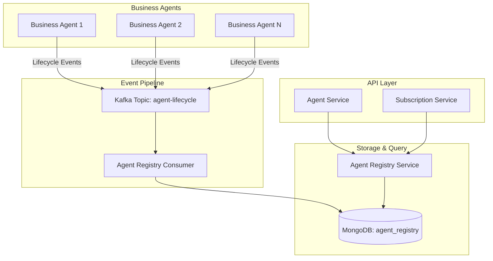

# Event-Driven Agent Registry Design with Kafka

## Overview

This design leverages Kafka for agent service discovery by having agents publish lifecycle events that are consumed and stored in MongoDB for efficient querying.



## Detailed Design

### 1. Agent Lifecycle Events

**Define events for agent lifecycle:**

```csharp
// ABOUTME: Events published to Kafka for agent service discovery
// ABOUTME: Enables decoupled, scalable agent registry management

namespace Aevatar.Events.AgentLifecycle
{
    public abstract class AgentLifecycleEvent : EventBase
    {
        public Guid AgentId { get; set; }
        public Guid UserId { get; set; }
        public string AgentType { get; set; }
        public DateTime OccurredAt { get; set; }
    }

    public class AgentCreatedEvent : AgentLifecycleEvent
    {
        public string Name { get; set; }
        public Dictionary<string, object> Properties { get; set; }
        public List<string> Capabilities { get; set; }
        public string GrainId { get; set; }
    }

    public class AgentUpdatedEvent : AgentLifecycleEvent
    {
        public string Name { get; set; }
        public Dictionary<string, object> Properties { get; set; }
        public List<string> ChangedFields { get; set; }
    }

    public class AgentDeletedEvent : AgentLifecycleEvent
    {
        public string Reason { get; set; }
    }

    public class AgentStatusChangedEvent : AgentLifecycleEvent
    {
        public AgentStatus OldStatus { get; set; }
        public AgentStatus NewStatus { get; set; }
    }
}
```

### 2. Enhanced GAgentBase with Kafka Publishing

**Integrate Kafka event publishing into GAgentBase:**

```csharp
// ABOUTME: Enhanced base class with Kafka event publishing for service discovery
// ABOUTME: Publishes lifecycle events for consumption by registry services

public abstract class GAgentBase<TState, TEvent> : 
    IGAgentMetadata, 
    IGAgentEventPublisher, 
    IGAgentLifecycle
    where TState : BusinessAgentState, new()
    where TEvent : class
{
    private readonly IKafkaProducer _kafkaProducer;
    private readonly ILogger _logger;
    private const string AGENT_LIFECYCLE_TOPIC = "agent-lifecycle";

    protected GAgentBase(IKafkaProducer kafkaProducer, ILogger logger)
    {
        _kafkaProducer = kafkaProducer;
        _logger = logger;
    }

    public virtual async Task InitializeAsync(AgentInitializationData data)
    {
        // Update state
        State.Id = this.GetPrimaryKey();
        State.UserId = data.UserId;
        State.AgentType = this.GetType().Name;
        State.Name = data.Name;
        State.Properties = data.Properties;
        State.CreatedAt = DateTime.UtcNow;
        State.UpdatedAt = DateTime.UtcNow;
        State.Status = AgentStatus.Active;

        // Raise internal event for event sourcing
        RaiseEvent(new InternalAgentCreatedEvent
        {
            AgentId = this.GetPrimaryKey(),
            UserId = data.UserId,
            AgentType = this.GetType().Name,
            Name = data.Name,
            Properties = data.Properties,
            CreatedAt = DateTime.UtcNow
        });
        
        await ConfirmEvents();

        // Publish to Kafka for service discovery
        await PublishLifecycleEventAsync(new AgentCreatedEvent
        {
            AgentId = this.GetPrimaryKey(),
            UserId = data.UserId,
            AgentType = this.GetType().Name,
            Name = data.Name,
            Properties = string.IsNullOrEmpty(data.Properties) ? 
                null : 
                JsonConvert.DeserializeObject<Dictionary<string, object>>(data.Properties),
            Capabilities = GetCapabilities().Select(t => t.FullName).ToList(),
            GrainId = this.GetGrainId().ToString(),
            OccurredAt = DateTime.UtcNow
        });
    }

    public virtual async Task UpdateAsync(AgentUpdateData data)
    {
        var changedFields = new List<string>();
        
        if (State.Name != data.Name)
        {
            State.Name = data.Name;
            changedFields.Add(nameof(State.Name));
        }
        
        if (State.Properties != data.Properties)
        {
            State.Properties = data.Properties;
            changedFields.Add(nameof(State.Properties));
        }
        
        State.UpdatedAt = DateTime.UtcNow;

        // Internal event sourcing
        RaiseEvent(new InternalAgentUpdatedEvent
        {
            AgentId = this.GetPrimaryKey(),
            Name = data.Name,
            Properties = data.Properties,
            UpdatedAt = DateTime.UtcNow
        });
        
        await ConfirmEvents();

        // Publish to Kafka
        if (changedFields.Any())
        {
            await PublishLifecycleEventAsync(new AgentUpdatedEvent
            {
                AgentId = this.GetPrimaryKey(),
                UserId = State.UserId,
                AgentType = State.AgentType,
                Name = data.Name,
                Properties = string.IsNullOrEmpty(data.Properties) ? 
                    null : 
                    JsonConvert.DeserializeObject<Dictionary<string, object>>(data.Properties),
                ChangedFields = changedFields,
                OccurredAt = DateTime.UtcNow
            });
        }
    }

    public virtual async Task DeleteAsync()
    {
        var oldStatus = State.Status;
        State.Status = AgentStatus.Deleted;
        State.UpdatedAt = DateTime.UtcNow;

        // Internal event sourcing
        RaiseEvent(new InternalAgentDeletedEvent
        {
            AgentId = this.GetPrimaryKey(),
            DeletedAt = DateTime.UtcNow
        });
        
        await ConfirmEvents();

        // Publish deletion event to Kafka
        await PublishLifecycleEventAsync(new AgentDeletedEvent
        {
            AgentId = this.GetPrimaryKey(),
            UserId = State.UserId,
            AgentType = State.AgentType,
            Reason = "User requested deletion",
            OccurredAt = DateTime.UtcNow
        });
    }

    private async Task PublishLifecycleEventAsync(AgentLifecycleEvent lifecycleEvent)
    {
        try
        {
            var message = new KafkaMessage
            {
                Key = lifecycleEvent.AgentId.ToString(),
                Value = JsonConvert.SerializeObject(lifecycleEvent),
                Headers = new Dictionary<string, string>
                {
                    ["event-type"] = lifecycleEvent.GetType().Name,
                    ["agent-type"] = lifecycleEvent.AgentType,
                    ["user-id"] = lifecycleEvent.UserId.ToString()
                }
            };

            await _kafkaProducer.ProduceAsync(AGENT_LIFECYCLE_TOPIC, message);
            
            _logger.LogInformation(
                "Published {EventType} for agent {AgentId} to Kafka", 
                lifecycleEvent.GetType().Name, 
                lifecycleEvent.AgentId);
        }
        catch (Exception ex)
        {
            // Log error but don't fail the operation
            _logger.LogError(ex, 
                "Failed to publish lifecycle event for agent {AgentId}", 
                lifecycleEvent.AgentId);
        }
    }
}
```

### 3. Kafka Consumer for Agent Registry

**Background service that consumes events and updates MongoDB:**

```csharp
// ABOUTME: Kafka consumer that maintains agent registry in MongoDB
// ABOUTME: Provides eventual consistency for agent discovery

public class AgentRegistryConsumer : BackgroundService
{
    private readonly IKafkaConsumer _kafkaConsumer;
    private readonly IMongoDatabase _mongoDatabase;
    private readonly ILogger<AgentRegistryConsumer> _logger;
    private const string AGENT_LIFECYCLE_TOPIC = "agent-lifecycle";
    private const string AGENT_REGISTRY_COLLECTION = "agent_registry";

    public AgentRegistryConsumer(
        IKafkaConsumer kafkaConsumer,
        IMongoDatabase mongoDatabase,
        ILogger<AgentRegistryConsumer> logger)
    {
        _kafkaConsumer = kafkaConsumer;
        _mongoDatabase = mongoDatabase;
        _logger = logger;
    }

    protected override async Task ExecuteAsync(CancellationToken stoppingToken)
    {
        await _kafkaConsumer.SubscribeAsync(AGENT_LIFECYCLE_TOPIC);

        while (!stoppingToken.IsCancellationRequested)
        {
            try
            {
                var messages = await _kafkaConsumer.ConsumeAsync(stoppingToken);
                
                foreach (var message in messages)
                {
                    await ProcessLifecycleEvent(message);
                }

                await _kafkaConsumer.CommitAsync();
            }
            catch (Exception ex)
            {
                _logger.LogError(ex, "Error processing agent lifecycle events");
                await Task.Delay(5000, stoppingToken); // Backoff on error
            }
        }
    }

    private async Task ProcessLifecycleEvent(KafkaMessage message)
    {
        var eventType = message.Headers["event-type"];
        var collection = _mongoDatabase.GetCollection<AgentRegistryDocument>(AGENT_REGISTRY_COLLECTION);

        switch (eventType)
        {
            case nameof(AgentCreatedEvent):
                var createdEvent = JsonConvert.DeserializeObject<AgentCreatedEvent>(message.Value);
                await HandleAgentCreated(collection, createdEvent);
                break;

            case nameof(AgentUpdatedEvent):
                var updatedEvent = JsonConvert.DeserializeObject<AgentUpdatedEvent>(message.Value);
                await HandleAgentUpdated(collection, updatedEvent);
                break;

            case nameof(AgentDeletedEvent):
                var deletedEvent = JsonConvert.DeserializeObject<AgentDeletedEvent>(message.Value);
                await HandleAgentDeleted(collection, deletedEvent);
                break;

            case nameof(AgentStatusChangedEvent):
                var statusEvent = JsonConvert.DeserializeObject<AgentStatusChangedEvent>(message.Value);
                await HandleAgentStatusChanged(collection, statusEvent);
                break;
        }
    }

    private async Task HandleAgentCreated(
        IMongoCollection<AgentRegistryDocument> collection, 
        AgentCreatedEvent evt)
    {
        var document = new AgentRegistryDocument
        {
            Id = evt.AgentId,
            UserId = evt.UserId,
            AgentType = evt.AgentType,
            Name = evt.Name,
            Properties = evt.Properties,
            Capabilities = evt.Capabilities,
            GrainId = evt.GrainId,
            Status = AgentStatus.Active,
            CreatedAt = evt.OccurredAt,
            UpdatedAt = evt.OccurredAt,
            Version = 1
        };

        await collection.ReplaceOneAsync(
            x => x.Id == evt.AgentId,
            document,
            new ReplaceOptions { IsUpsert = true });

        _logger.LogInformation("Created registry entry for agent {AgentId}", evt.AgentId);
    }

    private async Task HandleAgentUpdated(
        IMongoCollection<AgentRegistryDocument> collection, 
        AgentUpdatedEvent evt)
    {
        var update = Builders<AgentRegistryDocument>.Update
            .Set(x => x.UpdatedAt, evt.OccurredAt)
            .Inc(x => x.Version, 1);

        if (evt.ChangedFields.Contains("Name"))
            update = update.Set(x => x.Name, evt.Name);

        if (evt.ChangedFields.Contains("Properties"))
            update = update.Set(x => x.Properties, evt.Properties);

        await collection.UpdateOneAsync(
            x => x.Id == evt.AgentId,
            update);

        _logger.LogInformation("Updated registry entry for agent {AgentId}", evt.AgentId);
    }

    private async Task HandleAgentDeleted(
        IMongoCollection<AgentRegistryDocument> collection, 
        AgentDeletedEvent evt)
    {
        var update = Builders<AgentRegistryDocument>.Update
            .Set(x => x.Status, AgentStatus.Deleted)
            .Set(x => x.UpdatedAt, evt.OccurredAt)
            .Set(x => x.DeletedAt, evt.OccurredAt);

        await collection.UpdateOneAsync(
            x => x.Id == evt.AgentId,
            update);

        _logger.LogInformation("Marked agent {AgentId} as deleted", evt.AgentId);
    }
}
```

### 4. MongoDB Document Model

**Agent registry document structure:**

```csharp
// ABOUTME: MongoDB document model for agent registry
// ABOUTME: Optimized for efficient queries with proper indexes

[BsonIgnoreExtraElements]
public class AgentRegistryDocument
{
    [BsonId]
    public Guid Id { get; set; } // AgentId
    
    [BsonElement("userId")]
    public Guid UserId { get; set; }
    
    [BsonElement("agentType")]
    public string AgentType { get; set; }
    
    [BsonElement("name")]
    public string Name { get; set; }
    
    [BsonElement("properties")]
    public Dictionary<string, object> Properties { get; set; }
    
    [BsonElement("capabilities")]
    public List<string> Capabilities { get; set; }
    
    [BsonElement("grainId")]
    public string GrainId { get; set; }
    
    [BsonElement("status")]
    public AgentStatus Status { get; set; }
    
    [BsonElement("createdAt")]
    public DateTime CreatedAt { get; set; }
    
    [BsonElement("updatedAt")]
    public DateTime UpdatedAt { get; set; }
    
    [BsonElement("deletedAt")]
    public DateTime? DeletedAt { get; set; }
    
    [BsonElement("version")]
    public int Version { get; set; }
}

// Index configuration
public static class AgentRegistryIndexes
{
    public static void CreateIndexes(IMongoCollection<AgentRegistryDocument> collection)
    {
        // Compound index for user queries
        collection.Indexes.CreateOne(new CreateIndexModel<AgentRegistryDocument>(
            Builders<AgentRegistryDocument>.IndexKeys
                .Ascending(x => x.UserId)
                .Ascending(x => x.Status)
                .Descending(x => x.CreatedAt)));

        // Index for type queries
        collection.Indexes.CreateOne(new CreateIndexModel<AgentRegistryDocument>(
            Builders<AgentRegistryDocument>.IndexKeys
                .Ascending(x => x.AgentType)
                .Ascending(x => x.Status)));

        // Text index for name search
        collection.Indexes.CreateOne(new CreateIndexModel<AgentRegistryDocument>(
            Builders<AgentRegistryDocument>.IndexKeys.Text(x => x.Name)));
    }
}
```

### 5. Agent Registry Query Service

**Service that queries MongoDB for agent discovery:**

```csharp
// ABOUTME: Query service for agent discovery using MongoDB
// ABOUTME: Provides fast lookups with eventual consistency

public interface IAgentRegistryService
{
    Task<AgentInfo> FindAgentAsync(Guid agentId);
    Task<List<AgentInfo>> GetUserAgentsAsync(Guid userId, int pageIndex = 0, int pageSize = 100);
    Task<List<AgentInfo>> GetAgentsByTypeAsync(string agentType, Guid userId, int pageIndex = 0, int pageSize = 100);
    Task<List<AgentInfo>> SearchAgentsByNameAsync(string searchTerm, Guid userId, int pageIndex = 0, int pageSize = 100);
}

public class AgentRegistryService : IAgentRegistryService
{
    private readonly IMongoDatabase _mongoDatabase;
    private readonly ILogger<AgentRegistryService> _logger;
    private const string AGENT_REGISTRY_COLLECTION = "agent_registry";

    public AgentRegistryService(IMongoDatabase mongoDatabase, ILogger<AgentRegistryService> logger)
    {
        _mongoDatabase = mongoDatabase;
        _logger = logger;
    }

    public async Task<AgentInfo> FindAgentAsync(Guid agentId)
    {
        var collection = _mongoDatabase.GetCollection<AgentRegistryDocument>(AGENT_REGISTRY_COLLECTION);
        
        var document = await collection.Find(x => x.Id == agentId).FirstOrDefaultAsync();
        
        return document == null ? null : MapToAgentInfo(document);
    }

    public async Task<List<AgentInfo>> GetUserAgentsAsync(Guid userId, int pageIndex = 0, int pageSize = 100)
    {
        var collection = _mongoDatabase.GetCollection<AgentRegistryDocument>(AGENT_REGISTRY_COLLECTION);
        
        var filter = Builders<AgentRegistryDocument>.Filter.And(
            Builders<AgentRegistryDocument>.Filter.Eq(x => x.UserId, userId),
            Builders<AgentRegistryDocument>.Filter.Eq(x => x.Status, AgentStatus.Active)
        );

        var documents = await collection
            .Find(filter)
            .SortByDescending(x => x.CreatedAt)
            .Skip(pageIndex * pageSize)
            .Limit(pageSize)
            .ToListAsync();

        return documents.Select(MapToAgentInfo).ToList();
    }

    public async Task<List<AgentInfo>> GetAgentsByTypeAsync(string agentType, Guid userId, int pageIndex = 0, int pageSize = 100)
    {
        var collection = _mongoDatabase.GetCollection<AgentRegistryDocument>(AGENT_REGISTRY_COLLECTION);
        
        var filter = Builders<AgentRegistryDocument>.Filter.And(
            Builders<AgentRegistryDocument>.Filter.Eq(x => x.UserId, userId),
            Builders<AgentRegistryDocument>.Filter.Eq(x => x.AgentType, agentType),
            Builders<AgentRegistryDocument>.Filter.Eq(x => x.Status, AgentStatus.Active)
        );

        var documents = await collection
            .Find(filter)
            .SortByDescending(x => x.CreatedAt)
            .Skip(pageIndex * pageSize)
            .Limit(pageSize)
            .ToListAsync();

        return documents.Select(MapToAgentInfo).ToList();
    }

    public async Task<List<AgentInfo>> SearchAgentsByNameAsync(string searchTerm, Guid userId, int pageIndex = 0, int pageSize = 100)
    {
        var collection = _mongoDatabase.GetCollection<AgentRegistryDocument>(AGENT_REGISTRY_COLLECTION);
        
        var filter = Builders<AgentRegistryDocument>.Filter.And(
            Builders<AgentRegistryDocument>.Filter.Eq(x => x.UserId, userId),
            Builders<AgentRegistryDocument>.Filter.Text(searchTerm),
            Builders<AgentRegistryDocument>.Filter.Eq(x => x.Status, AgentStatus.Active)
        );

        var documents = await collection
            .Find(filter)
            .Skip(pageIndex * pageSize)
            .Limit(pageSize)
            .ToListAsync();

        return documents.Select(MapToAgentInfo).ToList();
    }

    private AgentInfo MapToAgentInfo(AgentRegistryDocument doc)
    {
        return new AgentInfo
        {
            AgentId = doc.Id,
            UserId = doc.UserId,
            AgentType = doc.AgentType,
            Name = doc.Name,
            Properties = doc.Properties,
            Capabilities = doc.Capabilities,
            GrainId = doc.GrainId,
            Status = doc.Status,
            CreatedAt = doc.CreatedAt,
            UpdatedAt = doc.UpdatedAt
        };
    }
}
```

### 6. Updated API Services

**Minimal changes to use the registry service:**

```csharp
public class AgentService : ApplicationService, IAgentService
{
    private readonly IAgentRegistryService _registryService; // Replaces IAgentRegistry
    private readonly IGAgentFactory _gAgentFactory;
    // ... other dependencies

    public async Task<AgentDto> GetAgentAsync(Guid guid)
    {
        // Query registry for agent info
        var agentInfo = await _registryService.FindAgentAsync(guid);
        if (agentInfo == null)
        {
            throw new UserFriendlyException("Agent not found");
        }

        EnsureUserAuthorized(agentInfo.UserId);

        // Get business agent using grain ID from registry
        var grainId = GrainId.Parse(agentInfo.GrainId);
        var businessAgent = await _gAgentFactory.GetGAgentAsync(grainId);
        
        // Get current state from agent
        var metadata = await businessAgent.GetMetadataAsync();

        var resp = new AgentDto
        {
            Id = guid,
            AgentType = agentInfo.AgentType,
            Name = metadata.Name, // Use current data from agent
            GrainId = grainId,
            Properties = metadata.Properties.IsNullOrWhiteSpace()
                ? null
                : JsonConvert.DeserializeObject<Dictionary<string, object>>(metadata.Properties),
            AgentGuid = businessAgent.GetPrimaryKey(),
            BusinessAgentGrainId = grainId.ToString()
        };

        // Continue as before...
        return resp;
    }

    public async Task<List<AgentInstanceDto>> GetAllAgentInstances(int pageIndex, int pageSize)
    {
        var currentUserId = _userAppService.GetCurrentUserId();
        
        // Use registry service for queries
        var userAgents = await _registryService.GetUserAgentsAsync(currentUserId, pageIndex, pageSize);
        
        // Map to DTOs
        var result = userAgents.Select(agentInfo => new AgentInstanceDto
        {
            Id = agentInfo.AgentId.ToString(),
            Name = agentInfo.Name,
            Properties = agentInfo.Properties,
            AgentType = agentInfo.AgentType,
            BusinessAgentGrainId = agentInfo.GrainId
        }).ToList();

        return result;
    }
}
```

## Benefits of Event-Driven Approach

### 1. Scalability
- **Decoupled Architecture**: Registry updates don't block agent operations
- **Horizontal Scaling**: Add more consumers as needed
- **Event Buffering**: Kafka handles load spikes
- **Distributed Processing**: Multiple consumers can process events

### 2. Resilience
- **Eventual Consistency**: System remains operational even if registry is behind
- **Fault Tolerance**: Kafka ensures events aren't lost
- **Retry Capability**: Failed updates can be retried
- **Audit Trail**: Complete event history in Kafka

### 3. Flexibility
- **Multiple Consumers**: Other services can consume agent events
- **Event Replay**: Rebuild registry from events if needed
- **Schema Evolution**: Events can evolve independently
- **Analytics**: Stream processing on agent events

### 4. Performance
- **Async Updates**: Agent operations aren't slowed by registry
- **Optimized Queries**: MongoDB indexes for fast lookups
- **Batch Processing**: Consumer can batch updates
- **Caching Opportunities**: Registry data can be cached

## Configuration Examples

### Kafka Topic Configuration
```yaml
agent-lifecycle:
  partitions: 10
  replication-factor: 3
  retention-ms: 604800000  # 7 days
  compression-type: snappy
  min-insync-replicas: 2
```

### MongoDB Collection Configuration
```javascript
db.createCollection("agent_registry");
db.agent_registry.createIndex({ "userId": 1, "status": 1, "createdAt": -1 });
db.agent_registry.createIndex({ "agentType": 1, "status": 1 });
db.agent_registry.createIndex({ "name": "text" });
```

### Consumer Configuration
```csharp
services.Configure<KafkaConsumerOptions>(options =>
{
    options.GroupId = "agent-registry-consumer";
    options.EnableAutoCommit = false;
    options.MaxPollRecords = 100;
    options.SessionTimeoutMs = 30000;
});
```

## Monitoring and Operations

### Key Metrics
- **Event Lag**: Monitor consumer lag in Kafka
- **Processing Time**: Track time to update MongoDB
- **Error Rate**: Failed event processing
- **Registry Freshness**: Time since last update

### Health Checks
```csharp
public class AgentRegistryHealthCheck : IHealthCheck
{
    public async Task<HealthCheckResult> CheckHealthAsync(HealthCheckContext context)
    {
        // Check Kafka consumer lag
        // Check MongoDB connectivity
        // Check registry data freshness
        // Return appropriate health status
    }
}
```

## Conclusion

This event-driven approach using Kafka provides a highly scalable, resilient solution for agent service discovery that:
- Eliminates MongoDB size limitations
- Provides eventual consistency
- Enables horizontal scaling
- Maintains loose coupling
- Supports future extensibility

The architecture aligns perfectly with the event sourcing patterns already in use and provides a robust foundation for agent discovery at scale.