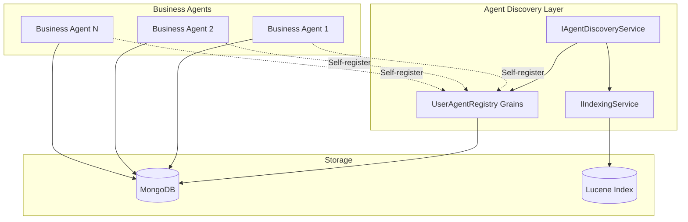

# Scalable Agent Registry Design

## Problem Statement

The initial AgentRegistry proposal in `CreatorGAgent-Improved-Architecture-Proposal.md` has a critical scalability issue:

- **MongoDB Document Limit**: Single grain storing all agents would exceed MongoDB's 16MB document size limit
- **Performance Bottleneck**: All agent discovery queries go through a single grain
- **Memory Inefficiency**: Loading all agents into memory is not scalable

## Proposed Solution: Distributed Registry Architecture

### Overview

Replace the single AgentRegistry grain with a distributed approach that leverages existing infrastructure and scales horizontally.



## Detailed Design

### 1. Agent Discovery Service

**Replace single AgentRegistry grain with a service that coordinates discovery:**

```csharp
// ABOUTME: Scalable agent discovery service using existing indexing infrastructure
// ABOUTME: Avoids MongoDB 16MB limit by distributing registry across multiple grains

public interface IAgentDiscoveryService
{
    // Direct agent lookup - no registry needed
    Task<AgentInfo> FindAgentAsync(Guid agentId, string agentType);
    
    // Uses IIndexingService for queries
    Task<List<AgentInfo>> GetUserAgentsAsync(Guid userId, int pageIndex = 0, int pageSize = 100);
    Task<List<AgentInfo>> GetAgentsByTypeAsync(string agentType, Guid userId, int pageIndex = 0, int pageSize = 100);
    
    // Registration handled by per-user registry grains
    Task RegisterAgentAsync(Guid agentId, AgentRegistrationData data);
    Task UnregisterAgentAsync(Guid agentId, Guid userId);
}

public class AgentDiscoveryService : IAgentDiscoveryService
{
    private readonly IClusterClient _clusterClient;
    private readonly IIndexingService _indexingService;
    private readonly IGAgentFactory _gAgentFactory;
    private readonly GrainTypeResolver _grainTypeResolver;

    public async Task<AgentInfo> FindAgentAsync(Guid agentId, string agentType)
    {
        // Direct agent lookup - no central registry needed
        if (string.IsNullOrEmpty(agentType))
        {
            // Query indexing service if type unknown
            var response = await _indexingService.QueryWithLuceneAsync(new LuceneQueryDto
            {
                QueryString = $"id.keyword:{agentId}",
                StateName = "BusinessAgentState", // Base state name for all business agents
                PageSize = 1
            });

            if (response.TotalCount == 0) return null;

            var item = response.Items.First();
            agentType = (string)item["agentType"];
        }

        // Get agent directly
        var grainId = GrainId.Create(agentType, GuidUtil.GuidToGrainKey(agentId));
        var businessAgent = await _gAgentFactory.GetGAgentAsync(grainId);
        
        // Get metadata from agent
        var metadata = await businessAgent.GetMetadataAsync();
        
        return new AgentInfo
        {
            AgentId = agentId,
            UserId = metadata.UserId,
            AgentType = agentType,
            Name = metadata.Name,
            Properties = string.IsNullOrEmpty(metadata.Properties) ? 
                null : 
                JsonConvert.DeserializeObject<Dictionary<string, object>>(metadata.Properties),
            Status = metadata.Status,
            CreatedAt = metadata.CreatedAt,
            UpdatedAt = metadata.UpdatedAt
        };
    }

    public async Task<List<AgentInfo>> GetUserAgentsAsync(Guid userId, int pageIndex = 0, int pageSize = 100)
    {
        // Use existing indexing service - same as current CreatorGAgentState queries
        var response = await _indexingService.QueryWithLuceneAsync(new LuceneQueryDto
        {
            QueryString = $"userId.keyword:{userId} AND status.keyword:Active",
            StateName = "BusinessAgentState",
            PageSize = pageSize,
            PageIndex = pageIndex
        });

        return MapIndexResponseToAgentInfo(response);
    }

    public async Task<List<AgentInfo>> GetAgentsByTypeAsync(string agentType, Guid userId, int pageIndex = 0, int pageSize = 100)
    {
        var response = await _indexingService.QueryWithLuceneAsync(new LuceneQueryDto
        {
            QueryString = $"userId.keyword:{userId} AND agentType.keyword:{agentType} AND status.keyword:Active",
            StateName = "BusinessAgentState",
            PageSize = pageSize,
            PageIndex = pageIndex
        });

        return MapIndexResponseToAgentInfo(response);
    }

    public async Task RegisterAgentAsync(Guid agentId, AgentRegistrationData data)
    {
        // Use per-user registry grain for user-specific tracking
        var userRegistry = _clusterClient.GetGrain<IUserAgentRegistry>(data.UserId);
        await userRegistry.RegisterAgentAsync(agentId, data);
    }

    public async Task UnregisterAgentAsync(Guid agentId, Guid userId)
    {
        var userRegistry = _clusterClient.GetGrain<IUserAgentRegistry>(userId);
        await userRegistry.UnregisterAgentAsync(agentId);
    }

    private List<AgentInfo> MapIndexResponseToAgentInfo(IndexQueryResponse response)
    {
        return response.Items.Select(item => new AgentInfo
        {
            AgentId = Guid.Parse((string)item["id"]),
            UserId = Guid.Parse((string)item["userId"]),
            AgentType = (string)item["agentType"],
            Name = (string)item["name"],
            Properties = item.ContainsKey("properties") && item["properties"] != null ? 
                JsonConvert.DeserializeObject<Dictionary<string, object>>((string)item["properties"]) : 
                null,
            Status = Enum.Parse<AgentStatus>((string)item["status"]),
            CreatedAt = DateTime.Parse((string)item["createdAt"]),
            UpdatedAt = DateTime.Parse((string)item["updatedAt"])
        }).ToList();
    }
}
```

### 2. Per-User Agent Registry

**Distributed registry grains by user to avoid size limits:**

```csharp
// ABOUTME: Per-user registry grain for lightweight agent tracking
// ABOUTME: Avoids MongoDB document size limits by sharding by user

[GAgent]
[StorageProvider(ProviderName = "PubSubStore")]
public interface IUserAgentRegistry : IGrainWithGuidKey
{
    Task RegisterAgentAsync(Guid agentId, AgentRegistrationData data);
    Task UnregisterAgentAsync(Guid agentId);
    Task<List<AgentSummary>> GetUserAgentSummariesAsync();
    Task<int> GetAgentCountAsync();
}

public class UserAgentRegistry : Grain<UserAgentRegistryState>, IUserAgentRegistry
{
    public async Task RegisterAgentAsync(Guid agentId, AgentRegistrationData data)
    {
        State.AgentSummaries[agentId] = new AgentSummary
        {
            AgentId = agentId,
            AgentType = data.AgentType,
            Name = data.Name,
            RegisteredAt = DateTime.UtcNow
        };
        
        await WriteStateAsync();
    }

    public async Task UnregisterAgentAsync(Guid agentId)
    {
        State.AgentSummaries.Remove(agentId);
        await WriteStateAsync();
    }

    public Task<List<AgentSummary>> GetUserAgentSummariesAsync()
    {
        return Task.FromResult(State.AgentSummaries.Values.ToList());
    }

    public Task<int> GetAgentCountAsync()
    {
        return Task.FromResult(State.AgentSummaries.Count);
    }
}

public class UserAgentRegistryState
{
    public Dictionary<Guid, AgentSummary> AgentSummaries { get; set; } = new();
}

public class AgentSummary
{
    public Guid AgentId { get; set; }
    public string AgentType { get; set; }
    public string Name { get; set; }
    public DateTime RegisteredAt { get; set; }
}
```

### 3. Enhanced Business Agent State

**Business agents store indexable metadata:**

```csharp
// ABOUTME: Enhanced base state for business agents with indexable metadata
// ABOUTME: Enables direct queries through IIndexingService

public abstract class BusinessAgentState
{
    // Core fields indexed for queries
    [Index]
    public Guid Id { get; set; }
    
    [Index]
    public Guid UserId { get; set; }
    
    [Index]
    public string AgentType { get; set; }
    
    [Index]
    public string Name { get; set; }
    
    public string Properties { get; set; }
    
    [Index]
    public DateTime CreatedAt { get; set; }
    
    [Index]
    public DateTime UpdatedAt { get; set; }
    
    [Index]
    public AgentStatus Status { get; set; }
    
    // Business-specific state continues here...
}
```

### 4. Updated Enhanced GAgentBase

**Modified to work with distributed registry:**

```csharp
public abstract class GAgentBase<TState, TEvent> : 
    IGAgentMetadata, 
    IGAgentEventPublisher, 
    IGAgentLifecycle
    where TState : BusinessAgentState, new()
    where TEvent : class
{
    private readonly IAgentDiscoveryService _discoveryService;

    // Built-in lifecycle management
    public virtual async Task InitializeAsync(AgentInitializationData data)
    {
        // Store metadata in agent state for indexing
        State.Id = this.GetPrimaryKey();
        State.UserId = data.UserId;
        State.AgentType = this.GetType().Name;
        State.Name = data.Name;
        State.Properties = data.Properties;
        State.CreatedAt = DateTime.UtcNow;
        State.UpdatedAt = DateTime.UtcNow;
        State.Status = AgentStatus.Active;

        RaiseEvent(new AgentCreatedEvent
        {
            AgentId = this.GetPrimaryKey(),
            UserId = data.UserId,
            AgentType = this.GetType().Name,
            Name = data.Name,
            Properties = data.Properties,
            CreatedAt = DateTime.UtcNow
        });
        
        await ConfirmEvents();
        
        // Register with discovery service
        await _discoveryService.RegisterAgentAsync(this.GetPrimaryKey(), new AgentRegistrationData
        {
            AgentId = this.GetPrimaryKey(),
            UserId = data.UserId,
            AgentType = this.GetType().Name,
            Name = data.Name,
            Capabilities = GetCapabilities()
        });
    }

    public virtual async Task DeleteAsync()
    {
        State.Status = AgentStatus.Deleted;
        State.UpdatedAt = DateTime.UtcNow;

        RaiseEvent(new AgentDeletedEvent
        {
            AgentId = this.GetPrimaryKey(),
            DeletedAt = DateTime.UtcNow
        });
        
        await ConfirmEvents();
        
        // Unregister from discovery service
        await _discoveryService.UnregisterAgentAsync(this.GetPrimaryKey(), State.UserId);
    }

    // GetMetadataAsync returns data from local state
    public virtual async Task<AgentMetadata> GetMetadataAsync()
    {
        return new AgentMetadata
        {
            Id = State.Id,
            AgentType = State.AgentType,
            UserId = State.UserId,
            Name = State.Name,
            Properties = State.Properties,
            CreatedAt = State.CreatedAt,
            UpdatedAt = State.UpdatedAt,
            Status = State.Status,
            Capabilities = GetCapabilities().Select(t => t.Name).ToList()
        };
    }
}
```

### 5. Updated API Services

**Minimal changes to use IAgentDiscoveryService:**

```csharp
public class AgentService : ApplicationService, IAgentService
{
    private readonly IAgentDiscoveryService _discoveryService; // Replaces IAgentRegistry
    // ... other dependencies

    public async Task<AgentDto> GetAgentAsync(Guid guid)
    {
        // Use discovery service instead of registry
        var agentInfo = await _discoveryService.FindAgentAsync(guid, null);
        if (agentInfo == null)
        {
            throw new UserFriendlyException("Agent not found");
        }

        EnsureUserAuthorized(agentInfo.UserId);

        // Get business agent directly
        var grainId = GrainId.Create(agentInfo.AgentType, GuidUtil.GuidToGrainKey(guid));
        var businessAgent = await _gAgentFactory.GetGAgentAsync(grainId);
        
        // Continue as before...
    }

    public async Task<List<AgentInstanceDto>> GetAllAgentInstances(int pageIndex, int pageSize)
    {
        var currentUserId = _userAppService.GetCurrentUserId();
        
        // Use discovery service for paginated queries
        var userAgents = await _discoveryService.GetUserAgentsAsync(currentUserId, pageIndex, pageSize);
        
        // Map to DTOs
        var result = userAgents.Select(agentInfo => new AgentInstanceDto
        {
            Id = agentInfo.AgentId.ToString(),
            Name = agentInfo.Name,
            Properties = agentInfo.Properties,
            AgentType = agentInfo.AgentType,
            BusinessAgentGrainId = GrainId.Create(agentInfo.AgentType, 
                GuidUtil.GuidToGrainKey(agentInfo.AgentId)).ToString()
        }).ToList();

        return result;
    }
}
```

## Benefits of This Approach

### 1. Scalability
- **No Single Point of Failure**: Distributed across multiple grains
- **No Size Limits**: Each user's registry is independent
- **Horizontal Scaling**: Add more nodes as needed
- **Efficient Queries**: Leverage existing Lucene indexing

### 2. Performance
- **Direct Agent Access**: No registry lookup for known agents
- **Indexed Queries**: Fast searches using Lucene
- **Minimal Overhead**: Lightweight per-user registries
- **Parallel Operations**: Multiple registries can operate concurrently

### 3. Compatibility
- **Uses Existing Infrastructure**: IIndexingService already in place
- **Minimal API Changes**: Services work with minor updates
- **Same Query Patterns**: Supports all required lookups
- **Backward Compatible**: Can coexist during migration

### 4. Storage Efficiency
- **Distributed Storage**: No single large document
- **Indexed Fields Only**: Store minimal data for queries
- **Business Logic Separate**: Agent state remains with agents
- **Automatic Cleanup**: Deleted agents removed from index

## Query Performance Comparison

### Current Architecture (CreatorGAgent)
```
GetAllAgentInstances → IIndexingService → Lucene Query on CreatorGAgentState
Time: O(log n) for indexed queries
Storage: One document per CreatorGAgent (can hit 16MB limit)
```

### Single Registry Grain (Original Proposal)
```
GetAllAgentInstances → AgentRegistry Grain → In-memory list scan
Time: O(n) for full scan
Storage: Single document with ALL agents (will hit 16MB limit)
```

### Distributed Registry (This Proposal)
```
GetAllAgentInstances → IIndexingService → Lucene Query on BusinessAgentState
Time: O(log n) for indexed queries
Storage: One document per business agent (scales infinitely)
```

## Implementation Notes

### 1. Index Configuration
Ensure BusinessAgentState fields are properly indexed:
```csharp
[Index(IndexType = IndexType.Searchable)]
public class BusinessAgentStateIndex : IIndexableGrain
{
    [Index] public string Id { get; set; }
    [Index] public string UserId { get; set; }
    [Index] public string AgentType { get; set; }
    [Index] public string Name { get; set; }
    [Index] public string Status { get; set; }
    [Index] public DateTime CreatedAt { get; set; }
    [Index] public DateTime UpdatedAt { get; set; }
}
```

### 2. Migration Path
1. Implement IAgentDiscoveryService
2. Update GAgentBase to store indexed metadata
3. Modify API services to use discovery service
4. Migrate existing agents to populate indexed fields
5. Remove CreatorGAgent dependencies

### 3. Monitoring
- Track per-user registry sizes
- Monitor index query performance
- Alert on registry growth patterns
- Implement cleanup for deleted agents

## Conclusion

This distributed registry design solves the MongoDB 16MB limit issue while maintaining all the benefits of the direct business agent architecture. By leveraging existing infrastructure (IIndexingService) and distributing the registry by user, we achieve better scalability, performance, and maintainability than either the current CreatorGAgent pattern or a single registry grain approach.