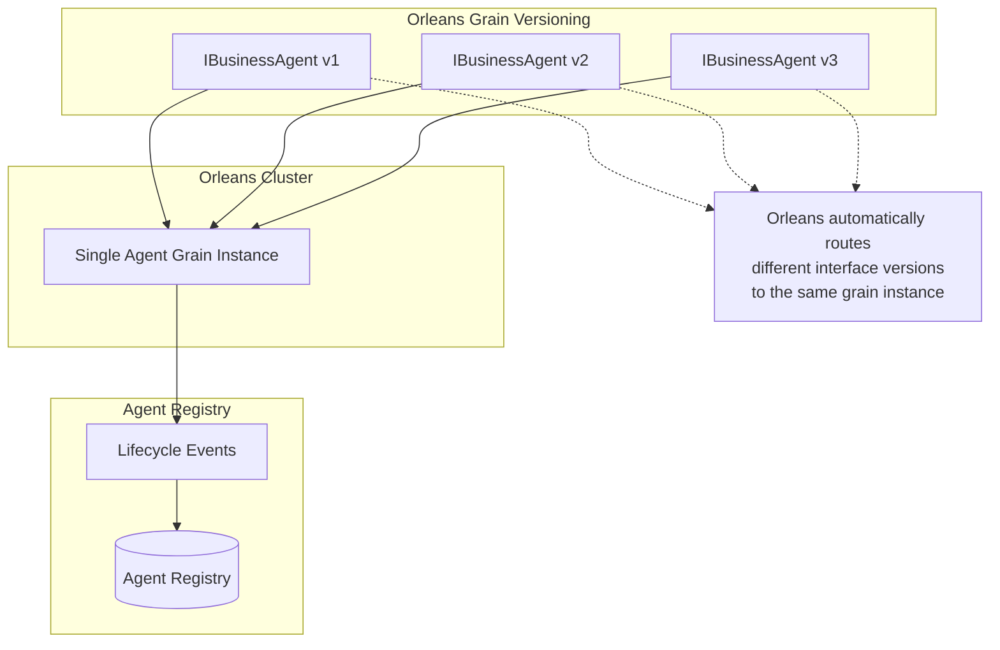
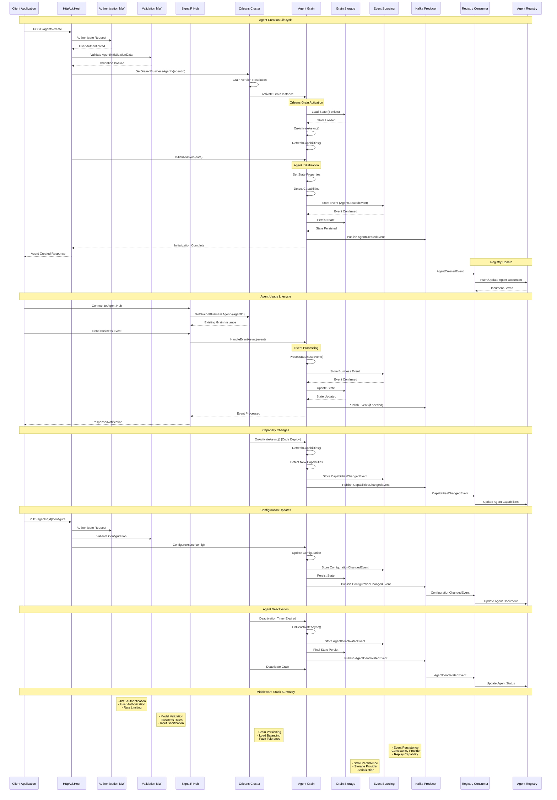
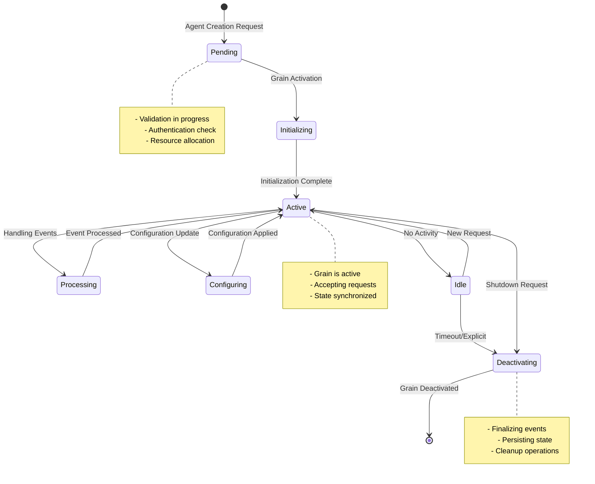

# Agent Versioning with Orleans Grain Versioning

## Overview

This design leverages Orleans built-in grain versioning for all agent versioning needs, eliminating custom versioning logic and relying on Orleans' proven versioning capabilities. Orleans automatically maintains the same grain instance across interface versions.



## Orleans Grain Versioning Strategy

### 1. Interface Versioning

Use Orleans `[Version(X)]` attribute with the same interface name for evolution:

```csharp
// ABOUTME: Version 1 of business agent interface
// ABOUTME: Basic agent operations

[Version(1)]
public interface IBusinessAgent : IGrainWithGuidKey
{
    Task InitializeAsync(AgentInitializationData data);
    Task<AgentStatus> GetStatusAsync();
    Task HandleEventAsync(BusinessEvent @event);
}

// ABOUTME: Version 2 adds capability discovery
// ABOUTME: Same interface name with higher version number

[Version(2)]
public interface IBusinessAgent : IGrainWithGuidKey
{
    Task InitializeAsync(AgentInitializationData data);
    Task<AgentStatus> GetStatusAsync();
    Task HandleEventAsync(BusinessEvent @event);
    Task<List<string>> GetCapabilitiesAsync(); // New in V2
}

// ABOUTME: Version 3 adds advanced agent management
// ABOUTME: Same interface name with monotonically increasing version

[Version(3)]
public interface IBusinessAgent : IGrainWithGuidKey
{
    Task InitializeAsync(AgentInitializationData data);
    Task<AgentStatus> GetStatusAsync();
    Task HandleEventAsync(BusinessEvent @event);
    Task<List<string>> GetCapabilitiesAsync();
    Task ConfigureAsync(AgentConfiguration config); // New in V3
    Task<AgentMetrics> GetMetricsAsync(); // New in V3
}
```

### 2. Simplified Agent State

Remove custom versioning fields from agent state:

```csharp
// ABOUTME: Simplified agent state without custom versioning
// ABOUTME: Orleans handles interface versioning automatically

public abstract class BusinessAgentState
{
    // Core agent data
    public Guid Id { get; set; }
    public Guid UserId { get; set; }
    public string AgentType { get; set; }
    public string Name { get; set; }
    public string Properties { get; set; }
    public DateTime CreatedAt { get; set; }
    public DateTime UpdatedAt { get; set; }
    public AgentStatus Status { get; set; }
    
    // Business capabilities (no version tracking needed)
    public List<string> Capabilities { get; set; } = new();
    public AgentConfiguration Configuration { get; set; }
}
```

### 3. Simplified GAgent Base Class

```csharp
// ABOUTME: Simplified base class relying on Orleans versioning
// ABOUTME: No custom version tracking or migration logic needed

public abstract class GAgentBase<TState, TEvent> : 
    IGAgentMetadata, 
    IGAgentEventPublisher, 
    IGAgentLifecycle
    where TState : BusinessAgentState, new()
    where TEvent : class
{
    private readonly IKafkaProducer _kafkaProducer;
    private readonly ILogger _logger;

    public override async Task OnActivateAsync()
    {
        await base.OnActivateAsync();
        
        // Simple capability detection without version tracking
        await RefreshCapabilities();
    }

    private async Task RefreshCapabilities()
    {
        var currentCapabilities = GetCapabilities().Select(t => t.FullName).ToList();
        var storedCapabilities = State.Capabilities ?? new List<string>();

        if (!currentCapabilities.SequenceEqual(storedCapabilities))
        {
            _logger.LogInformation(
                "Agent {AgentId} capabilities changed",
                this.GetPrimaryKey());

            State.Capabilities = currentCapabilities;
            State.UpdatedAt = DateTime.UtcNow;

            await PublishLifecycleEventAsync(new AgentCapabilitiesChangedEvent
            {
                AgentId = this.GetPrimaryKey(),
                UserId = State.UserId,
                AgentType = this.GetType().Name,
                PreviousCapabilities = storedCapabilities,
                CurrentCapabilities = currentCapabilities,
                OccurredAt = DateTime.UtcNow
            });

            await ConfirmEvents();
        }
    }

    public override async Task InitializeAsync(AgentInitializationData data)
    {
        State.Id = this.GetPrimaryKey();
        State.UserId = data.UserId;
        State.AgentType = this.GetType().Name;
        State.Name = data.Name;
        State.Properties = data.Properties;
        State.CreatedAt = DateTime.UtcNow;
        State.UpdatedAt = DateTime.UtcNow;
        State.Status = AgentStatus.Active;
        State.Capabilities = GetCapabilities().Select(t => t.FullName).ToList();

        await base.InitializeAsync(data);

        await PublishLifecycleEventAsync(new AgentCreatedEvent
        {
            AgentId = this.GetPrimaryKey(),
            UserId = data.UserId,
            AgentType = this.GetType().Name,
            Name = data.Name,
            Properties = string.IsNullOrEmpty(data.Properties) ? 
                null : 
                JsonConvert.DeserializeObject<Dictionary<string, object>>(data.Properties),
            Capabilities = State.Capabilities,
            GrainId = this.GetGrainId().ToString(),
            OccurredAt = DateTime.UtcNow
        });
    }

    protected virtual Type[] GetCapabilities()
    {
        return this.GetType()
            .GetMethods()
            .Where(m => m.GetCustomAttribute<EventHandlerAttribute>() != null)
            .Select(m => m.GetParameters().FirstOrDefault()?.ParameterType)
            .Where(t => t != null)
            .Distinct()
            .ToArray();
    }
}
```

### 4. Simplified Lifecycle Events

Remove version-specific events and keep only essential lifecycle events:

```csharp
// ABOUTME: Simplified lifecycle events without custom versioning
// ABOUTME: Orleans handles interface versioning automatically

namespace Aevatar.Events.AgentLifecycle
{
    public abstract class AgentLifecycleEvent : EventBase
    {
        public Guid AgentId { get; set; }
        public Guid UserId { get; set; }
        public string AgentType { get; set; }
        public DateTime OccurredAt { get; set; }
    }

    public class AgentCreatedEvent : AgentLifecycleEvent
    {
        public string Name { get; set; }
        public Dictionary<string, object> Properties { get; set; }
        public List<string> Capabilities { get; set; }
        public string GrainId { get; set; }
    }

    public class AgentCapabilitiesChangedEvent : AgentLifecycleEvent
    {
        public List<string> PreviousCapabilities { get; set; }
        public List<string> CurrentCapabilities { get; set; }
        public string ChangeReason { get; set; }
    }

    public class AgentDeactivatedEvent : AgentLifecycleEvent
    {
        public string Reason { get; set; }
    }

    public class AgentConfigurationChangedEvent : AgentLifecycleEvent
    {
        public AgentConfiguration PreviousConfiguration { get; set; }
        public AgentConfiguration NewConfiguration { get; set; }
    }
}
```

### 5. Simplified MongoDB Schema

Remove version tracking fields from the registry document:

```csharp
// ABOUTME: Simplified MongoDB document without custom version tracking
// ABOUTME: Orleans handles versioning, registry handles discovery

[BsonIgnoreExtraElements]
public class AgentRegistryDocument
{
    [BsonId]
    public Guid Id { get; set; }
    
    [BsonElement("userId")]
    public Guid UserId { get; set; }
    
    [BsonElement("agentType")]
    public string AgentType { get; set; }
    
    [BsonElement("name")]
    public string Name { get; set; }
    
    [BsonElement("properties")]
    public Dictionary<string, object> Properties { get; set; }
    
    [BsonElement("grainId")]
    public string GrainId { get; set; }
    
    [BsonElement("status")]
    public AgentStatus Status { get; set; }
    
    [BsonElement("capabilities")]
    public List<string> Capabilities { get; set; }
    
    [BsonElement("createdAt")]
    public DateTime CreatedAt { get; set; }
    
    [BsonElement("updatedAt")]
    public DateTime UpdatedAt { get; set; }
    
    [BsonElement("version")]
    public int DocumentVersion { get; set; }
}
```

### 6. Simplified Registry Service

Keep the registry service completely version-agnostic:

```csharp
// ABOUTME: Version-agnostic registry service
// ABOUTME: Focuses on agent discovery without version concerns

public interface IAgentRegistryService
{
    Task<AgentInfo> FindAgentAsync(Guid agentId);
    Task<List<AgentInfo>> GetUserAgentsAsync(Guid userId, int pageIndex = 0, int pageSize = 100);
    Task<List<AgentInfo>> GetAgentsByTypeAsync(string agentType, Guid userId, int pageIndex = 0, int pageSize = 100);
    Task<List<AgentInfo>> FindAgentsAsync(AgentSearchCriteria criteria);
    Task<bool> IsAgentRegisteredAsync(Guid agentId);
    Task<int> GetAgentCountAsync(Guid userId, string agentType = null);
}

public class AgentSearchCriteria
{
    public Guid UserId { get; set; }
    public string AgentType { get; set; }
    public List<string> RequiredCapabilities { get; set; } = new();
    public AgentStatus? Status { get; set; } = AgentStatus.Active;
    public int PageIndex { get; set; } = 0;
    public int PageSize { get; set; } = 100;
    public DateTime? CreatedAfter { get; set; }
    public DateTime? UpdatedAfter { get; set; }
    public Dictionary<string, object> Properties { get; set; } = new();
}
```

### 7. Orleans Versioning Configuration

Configure Orleans to handle all versioning:

```csharp
// ABOUTME: Orleans configuration for grain versioning
// ABOUTME: Handles all agent interface evolution automatically

public void ConfigureServices(IServiceCollection services)
{
    services.AddOrleans(builder =>
    {
        builder.Configure<GrainVersioningOptions>(options =>
        {
            // Backward compatibility by default
            options.DefaultCompatibilityStrategy = nameof(BackwardCompatible);
            options.DefaultVersionSelectorStrategy = nameof(MinimumVersion);
        });
        
        // Register all interface versions
        builder.ConfigureApplicationParts(parts =>
        {
            parts.AddApplicationPart(typeof(IBusinessAgent).Assembly);
        });
    });
}
```

## Agent Implementation Examples

### 1. Single Agent Implementation Supporting All Versions

```csharp
// ABOUTME: Single agent implementing all interface versions automatically
// ABOUTME: Orleans routes version requests to the same grain instance

[GAgent]
[StorageProvider(ProviderName = "PubSubStore")]
[LogConsistencyProvider(ProviderName = "LogStorage")]
public class BusinessAgent : GAgentBase<BusinessAgentState, BusinessAgentEvent>, 
    IBusinessAgent // Implements all versions of IBusinessAgent
{
    // All interface methods are available - Orleans handles version routing
    
    public async Task InitializeAsync(AgentInitializationData data)
    {
        await base.InitializeAsync(data);
    }

    public async Task<AgentStatus> GetStatusAsync()
    {
        return State.Status;
    }

    public async Task HandleEventAsync(BusinessEvent @event)
    {
        // Handle business event
        await ProcessBusinessEvent(@event);
        await ConfirmEvents();
    }

    // Available in V2+
    public async Task<List<string>> GetCapabilitiesAsync()
    {
        return State.Capabilities ?? new List<string>();
    }

    // Available in V3+
    public async Task ConfigureAsync(AgentConfiguration config)
    {
        State.Configuration = config;
        State.UpdatedAt = DateTime.UtcNow;
        
        await PublishLifecycleEventAsync(new AgentConfigurationChangedEvent
        {
            AgentId = this.GetPrimaryKey(),
            UserId = State.UserId,
            AgentType = State.AgentType,
            PreviousConfiguration = State.Configuration,
            NewConfiguration = config,
            OccurredAt = DateTime.UtcNow
        });
        
        await ConfirmEvents();
    }

    // Available in V3+
    public async Task<AgentMetrics> GetMetricsAsync()
    {
        return new AgentMetrics
        {
            AgentId = this.GetPrimaryKey(),
            CapabilityCount = State.Capabilities?.Count ?? 0,
            LastActivity = State.UpdatedAt,
            Status = State.Status
        };
    }

    private async Task ProcessBusinessEvent(BusinessEvent @event)
    {
        // Business logic implementation
        State.UpdatedAt = DateTime.UtcNow;
    }
}
```

### 2. Client Usage with Automatic Version Selection

```csharp
// ABOUTME: Client code accessing the same grain instance
// ABOUTME: Orleans automatically handles version compatibility

public class AgentService : ApplicationService, IAgentService
{
    private readonly IClusterClient _clusterClient;

    public async Task<List<string>> GetAgentCapabilitiesAsync(Guid agentId)
    {
        // Same interface name - Orleans determines available methods based on versions
        var agent = _clusterClient.GetGrain<IBusinessAgent>(agentId);
        return await agent.GetCapabilitiesAsync(); // Available if grain supports V2+
    }

    public async Task<AgentMetrics> GetAgentMetricsAsync(Guid agentId)
    {
        // Same interface name - Orleans routes to same grain instance
        var agent = _clusterClient.GetGrain<IBusinessAgent>(agentId);
        return await agent.GetMetricsAsync(); // Available if grain supports V3+
    }

    public async Task<AgentStatus> GetBasicStatusAsync(Guid agentId)
    {
        // Same interface name - basic methods available in all versions
        var agent = _clusterClient.GetGrain<IBusinessAgent>(agentId);
        return await agent.GetStatusAsync(); // Available in V1+
    }

    public async Task InitializeAgentAsync(Guid agentId, AgentInitializationData data)
    {
        // All requests go to the same grain instance
        var agent = _clusterClient.GetGrain<IBusinessAgent>(agentId);
        await agent.InitializeAsync(data); // Available in V1+
    }
}
```

## Benefits of Orleans-Only Versioning

### 1. **Simplified Architecture**
- Single versioning system (Orleans)
- No custom version tracking
- Reduced complexity

### 2. **Automatic Compatibility**
- Orleans handles version selection
- Backward compatibility by default
- No manual migration logic

### 3. **Proven Reliability**
- Battle-tested Orleans versioning
- Consistent with Orleans patterns
- Well-documented and supported

### 4. **Reduced Maintenance**
- No custom versioning code to maintain
- Fewer potential bugs
- Simpler debugging

### 5. **Standard Orleans Patterns**
- Follows Orleans best practices
- Familiar to Orleans developers
- Easier onboarding

## Migration Strategy

### From Custom Versioning to Orleans Versioning

1. **Phase 1**: Remove custom version fields from state and events
2. **Phase 2**: Add Orleans `[Version]` attributes to interfaces
3. **Phase 3**: Configure Orleans versioning options
4. **Phase 4**: Remove custom migration logic
5. **Phase 5**: Clean up version-specific code

This approach provides all necessary versioning capabilities through Orleans' robust and proven grain versioning system, eliminating the need for custom versioning infrastructure.

## Agent Lifecycle Diagram

The following diagram shows the complete lifecycle of an agent from creation to deactivation, including all middlewares and components involved:



### Middleware Components Breakdown

#### 1. **HTTP API Middlewares**
```csharp
// ABOUTME: HTTP request pipeline middlewares
// ABOUTME: Handles authentication, validation, and routing

app.UseAuthentication();           // JWT token validation
app.UseAuthorization();            // Role-based access control
app.UseRateLimiting();            // Request throttling
app.UseRequestValidation();        // Input validation
app.UseExceptionHandling();        // Error handling
app.UseCorrelationId();           // Request tracing
```

#### 2. **Orleans Middlewares**
```csharp
// ABOUTME: Orleans grain call interceptors and middleware
// ABOUTME: Provides cross-cutting concerns for grain operations

services.Configure<GrainCallFilterOptions>(options =>
{
    options.Filters.Add<LoggingGrainCallFilter>();      // Method call logging
    options.Filters.Add<MetricsGrainCallFilter>();      // Performance metrics
    options.Filters.Add<ExceptionHandlingFilter>();     // Error handling
    options.Filters.Add<AuthorizationFilter>();         // Grain-level security
    options.Filters.Add<ValidationFilter>();            // Parameter validation
});
```

#### 3. **Event Sourcing Middleware**
```csharp
// ABOUTME: Event sourcing pipeline components
// ABOUTME: Handles event persistence and consistency

public class EventSourcingMiddleware
{
    // Event validation before persistence
    private readonly IEventValidator _validator;
    
    // Event serialization/deserialization
    private readonly IEventSerializer _serializer;
    
    // Consistency provider for transaction handling
    private readonly ILogConsistencyProvider _consistencyProvider;
    
    // Event store for persistence
    private readonly IEventStore _eventStore;
}
```

#### 4. **Kafka Integration Middleware**
```csharp
// ABOUTME: Kafka producer and consumer middleware
// ABOUTME: Handles event publishing and consumption

public class KafkaMiddleware
{
    // Message serialization
    private readonly IMessageSerializer _serializer;
    
    // Retry policy for failed messages
    private readonly IRetryPolicy _retryPolicy;
    
    // Dead letter queue handling
    private readonly IDeadLetterQueue _deadLetterQueue;
    
    // Message deduplication
    private readonly IMessageDeduplicator _deduplicator;
}
```

#### 5. **SignalR Middleware**
```csharp
// ABOUTME: Real-time communication middleware
// ABOUTME: Handles WebSocket connections and message routing

public class SignalRMiddleware
{
    // Connection management
    private readonly IConnectionManager _connectionManager;
    
    // User group management
    private readonly IGroupManager _groupManager;
    
    // Message broadcasting
    private readonly IHubContext<AgentHub> _hubContext;
    
    // Authentication for WebSocket connections
    private readonly ISignalRAuthenticationHandler _authHandler;
}
```

### Lifecycle States and Transitions

