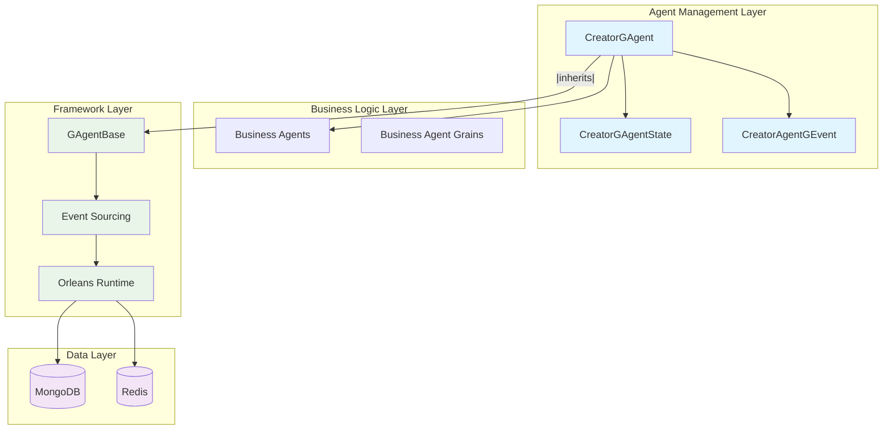
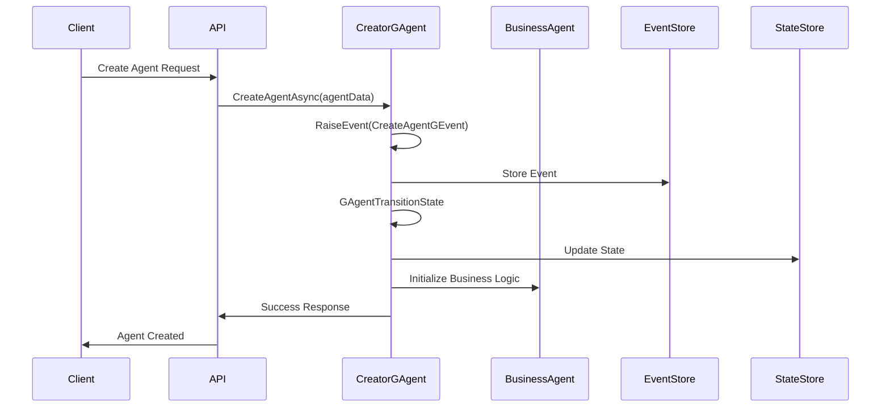
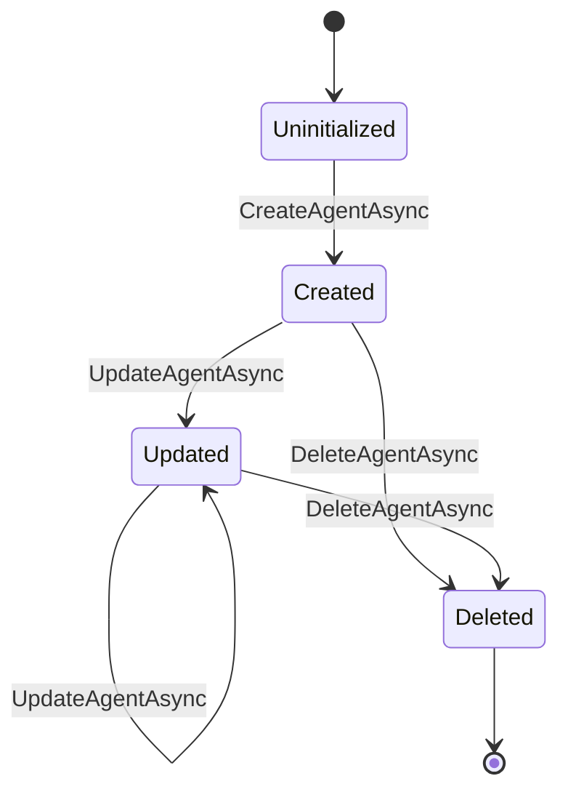

# CreatorGAgent Analysis Report

## Overview

The `CreatorGAgent` is a sophisticated distributed agent implementation within the Aevatar Station platform that serves as a factory and management layer for creating, organizing, and orchestrating other business agents. Built on Microsoft Orleans framework, it implements event sourcing patterns and provides a consistent interface for agent lifecycle management in a multi-tenant environment.

**Location**: `station/src/Aevatar.Application.Grains/Agents/Creator/CreatorGAgent.cs`

## Architecture Overview



## Core Functionality

### 1. Agent Factory and Management

The CreatorGAgent acts as a sophisticated factory pattern implementation for business agents:

#### **Agent Creation (`CreateAgentAsync`)**
```csharp
public async Task CreateAgentAsync(AgentData agentData)
{
    _logger.LogInformation("CreateAgentAsync");
    RaiseEvent(new CreateAgentGEvent()
    {
        UserId = agentData.UserId,
        Id = Guid.NewGuid(),
        AgentId = this.GetPrimaryKey(),
        AgentType = agentData.AgentType,
        Properties = agentData.Properties,
        Name = agentData.Name,
        BusinessAgentGrainId = agentData.BusinessAgentGrainId,
        FormattedBusinessAgentGrainId = agentData.BusinessAgentGrainId.ToString()
    });
    await ConfirmEvents();
}
```

**Purpose**: Creates new business agents and establishes their metadata within the system.

**Key Features**:
- Generates unique identifiers for tracking
- Links to underlying business agent grains
- Maintains user ownership through `UserId`
- Stores agent configuration in `Properties`
- Implements event sourcing for auditability

#### **Agent Updates (`UpdateAgentAsync`)**
```csharp
public async Task UpdateAgentAsync(UpdateAgentInput dto)
{
    _logger.LogInformation("UpdateAgentAsync");
    RaiseEvent(new UpdateAgentGEvent()
    {
        Id = Guid.NewGuid(),
        Properties = dto.Properties,
        Name = dto.Name
    });
    await ConfirmEvents();
}
```

**Purpose**: Modifies existing agent configurations while maintaining state consistency.

#### **Agent Deletion (`DeleteAgentAsync`)**
```csharp
public async Task DeleteAgentAsync()
{
    _logger.LogInformation("DeleteAgentAsync");
    RaiseEvent(new DeleteAgentGEvent());
    await ConfirmEvents();
}
```

**Purpose**: Safely removes agents and cleans up associated state.

### 2. Event Management System

#### **Available Events Tracking (`UpdateAvailableEventsAsync`)**
```csharp
public async Task UpdateAvailableEventsAsync(List<Type>? eventTypeList)
{   
    _logger.LogInformation("UpdateAvailableEventsAsync {list}", JsonConvert.SerializeObject(eventTypeList));
    if (eventTypeList == null)
    {
        _logger.LogInformation("UpdateAvailableEventsAsync No eventTypeList");
        return;
    }

    var eventDescriptionList = new List<EventDescription>();
    foreach (var t in eventTypeList)
    {
        eventDescriptionList.Add(new EventDescription()
        {
            EventType = t,
            Description = t.GetCustomAttribute<DescriptionAttribute>()?.Description ?? "No description",
        });
    }
    
    RaiseEvent(new UpdateAvailableEventsGEvent()
    {
        EventInfoList = eventDescriptionList
    });
    await ConfirmEvents();
}
```

**Purpose**: Maintains a registry of events that the agent can process, using reflection to extract metadata.

**Key Features**:
- Uses reflection to extract event descriptions from attributes
- Maintains event registry for dynamic event handling
- Provides event discovery capabilities for the system

#### **Event Publishing (`PublishEventAsync`)**
```csharp
public async Task PublishEventAsync<T>(T @event) where T : EventBase
{
    if (@event == null)
    {
        throw new ArgumentNullException(nameof(@event));
    }

    Logger.LogInformation( "publish event: {event}", @event);
    await PublishAsync(@event);
}
```

**Purpose**: Publishes events to the Orleans event streaming system with type safety.

### 3. State Management

#### **State Structure (`CreatorGAgentState`)**
```csharp
public class CreatorGAgentState : GroupAgentState
{
    public Guid Id { get; set; }
    public Guid UserId { get; set; }
    public string AgentType { get; set; }
    public string Name { get; set; }
    public string Properties { get; set; }
    public GrainId BusinessAgentGrainId { get; set; }
    public List<EventDescription> EventInfoList { get; set; }
    public DateTime CreateTime { get; set; }
    public string FormattedBusinessAgentGrainId { get; set; }
}
```

**Purpose**: Maintains agent metadata and configuration in a structured format.

#### **State Transitions (`GAgentTransitionState`)**
```csharp
protected override void GAgentTransitionState(CreatorGAgentState state, StateLogEventBase<CreatorAgentGEvent> @event)
{
    switch (@event)
    {
        case CreateAgentGEvent createAgentGEvent:
            State.Id = createAgentGEvent.AgentId;
            State.Properties = createAgentGEvent.Properties;
            State.UserId = createAgentGEvent.UserId;
            State.AgentType = createAgentGEvent.AgentType;
            State.Name = createAgentGEvent.Name;
            State.BusinessAgentGrainId = createAgentGEvent.BusinessAgentGrainId;
            State.CreateTime = DateTime.Now;
            State.FormattedBusinessAgentGrainId = createAgentGEvent.FormattedBusinessAgentGrainId;
            break;
        case UpdateAgentGEvent updateAgentGEvent:
            State.Properties = updateAgentGEvent.Properties;
            State.Name = updateAgentGEvent.Name;
            break;
        case DeleteAgentGEvent deleteAgentGEvent:
            State.UserId = Guid.Empty;
            State.AgentType = "";
            State.Name = "";
            State.Properties = null;
            State.BusinessAgentGrainId = default;
            break;
        case UpdateAvailableEventsGEvent updateSubscribedEventInfoGEvent:
            State.EventInfoList = updateSubscribedEventInfoGEvent.EventInfoList;
            break;
    }
}
```

**Purpose**: Implements event sourcing pattern by applying events to update agent state immutably.

## Technical Architecture

### 1. Design Patterns

#### **Actor Model Implementation**
- **Orleans Grain**: Distributed actor with persistent state
- **Location Transparency**: Agents can be accessed from anywhere in the cluster
- **Automatic Activation**: Orleans handles grain lifecycle management

#### **Event Sourcing Pattern**
- **Event Store**: All state changes recorded as events
- **State Reconstruction**: Current state built by replaying events
- **Audit Trail**: Complete history of agent modifications

#### **CQRS (Command Query Responsibility Segregation)**
- **Commands**: `CreateAgentAsync`, `UpdateAgentAsync`, `DeleteAgentAsync`
- **Queries**: `GetAgentAsync`, `GetDescriptionAsync`
- **Separation**: Clear distinction between read and write operations

#### **Factory Pattern**
- **Agent Creation**: Centralized creation logic for business agents
- **Configuration Management**: Handles agent setup and initialization
- **Type Safety**: Strongly typed creation process

### 2. Multi-Tenancy Support

#### **User Isolation**
```csharp
State.UserId = createAgentGEvent.UserId;
```
- Each agent is associated with a specific user
- Provides data isolation between tenants
- Enables user-specific agent management

#### **Business Agent Linking**
```csharp
State.BusinessAgentGrainId = createAgentGEvent.BusinessAgentGrainId;
```
- Links to actual business logic implementations
- Maintains separation between management and business layers
- Enables distributed agent orchestration

### 3. Event System Integration

#### **Event Types Handled**
1. **CreateAgentGEvent**: Agent creation with full metadata
2. **UpdateAgentGEvent**: Agent property and name updates
3. **DeleteAgentGEvent**: Agent removal and cleanup
4. **UpdateAvailableEventsGEvent**: Event registry updates

#### **Event Flow Architecture**


## Interface Definition

```csharp
public interface ICreatorGAgent : IStateGAgent<CreatorGAgentState>
{
    Task<CreatorGAgentState> GetAgentAsync();
    Task CreateAgentAsync(AgentData agentData);
    Task UpdateAgentAsync(UpdateAgentInput dto);
    Task DeleteAgentAsync();
    Task PublishEventAsync<T>(T @event) where T : EventBase;
    Task UpdateAvailableEventsAsync(List<Type>? eventTypeList);
}
```

**Purpose**: Defines the contract for agent management operations with Orleans grain characteristics.

## Data Models

### 1. Input Models

#### **AgentData**
```csharp
public class AgentData
{
    public Guid UserId { get; set; }
    public string AgentType { get; set; }
    public string Name { get; set; }
    public string Properties { get; set; }
    public GrainId BusinessAgentGrainId { get; set; }
}
```

#### **UpdateAgentInput**
```csharp
public class UpdateAgentInput
{
    public string Name { get; set; }
    public string Properties { get; set; }
}
```

### 2. Event Models

#### **EventDescription**
```csharp
public class EventDescription
{
    public Type EventType { get; set; }
    public string Description { get; set; }
}
```

## Integration Points

### 1. Orleans Framework Integration
- **Grain Registration**: `[GAgent]` attribute enables automatic discovery
- **Persistence**: Automatic state persistence through Orleans providers
- **Clustering**: Distributed across Orleans cluster nodes
- **Streaming**: Integration with Orleans streaming for event publishing

### 2. ABP Framework Integration
- **Dependency Injection**: Constructor injection for logging services
- **Multi-tenancy**: Built-in support for tenant isolation
- **Event Bus**: Integration with ABP event system

### 3. Logging and Monitoring
```csharp
private readonly ILogger<CreatorGAgent> _logger;

_logger.LogInformation("CreateAgentAsync");
_logger.LogInformation("GetAgentAsync {state}", JsonConvert.SerializeObject(State));
```

- Comprehensive logging for all operations
- JSON serialization for complex object logging
- Integration with .NET logging infrastructure

## Usage Scenarios

### 1. Agent Creation Workflow
1. **User Request**: API receives agent creation request
2. **Validation**: Input validation and authorization checks
3. **Business Agent**: Create underlying business logic agent
4. **Creator Agent**: Initialize CreatorGAgent with metadata
5. **State Persistence**: Store agent state and configuration
6. **Event Publishing**: Notify system of new agent creation

### 2. Agent Management Lifecycle


### 3. Event Handling Workflow
1. **Event Registration**: `UpdateAvailableEventsAsync` registers event types
2. **Event Reception**: Events received through Orleans streaming
3. **Event Processing**: Business logic execution in business agents
4. **State Updates**: Metadata updates in CreatorGAgent
5. **Event Publishing**: Downstream event propagation

## Security Considerations

### 1. User Authorization
- **UserId Tracking**: All agents linked to specific users
- **Tenant Isolation**: Multi-tenant architecture prevents cross-user access
- **Audit Trail**: Complete event history for security auditing

### 2. Input Validation
```csharp
if (@event == null)
{
    throw new ArgumentNullException(nameof(@event));
}
```
- Null validation for all public methods
- Type safety through generic constraints
- Parameter validation at entry points

## Performance Characteristics

### 1. Scalability Features
- **Distributed Architecture**: Orleans provides horizontal scaling
- **Stateful Actors**: In-memory state with persistent backing
- **Load Balancing**: Automatic distribution across cluster nodes
- **Event Streaming**: Asynchronous event processing

### 2. Optimization Strategies
- **Lazy Loading**: State loaded on first access
- **Event Batching**: Multiple events confirmed together
- **Caching**: In-memory state reduces database access
- **Async Operations**: Non-blocking I/O throughout

## Features Enabled by CreatorGAgent

Based on the analysis of `station/src/Aevatar.Application.Grains/Agents/Creator/CreatorGAgent.cs`, the following features are enabled:

### **Core Agent Management Features**

#### 1. **Dynamic Agent Factory**
- **Agent Instantiation**: Create new business agents on-demand with custom configurations
- **Type-Safe Creation**: Strongly typed agent creation with validation
- **Unique Identification**: Automatic generation of unique identifiers for agent tracking
- **Metadata Association**: Link agents with business logic grains and user context

#### 2. **Agent Lifecycle Management**
- **Creation Operations**: Initialize agents with full metadata and configuration
- **Update Operations**: Modify agent names and properties while preserving history
- **Deletion Operations**: Safe agent removal with complete state cleanup
- **State Retrieval**: Query current agent state and metadata

#### 3. **Multi-Tenant Agent Orchestration**
- **User Isolation**: Per-user agent management with strict tenant boundaries
- **Cross-User Security**: Prevent unauthorized access to other users' agents
- **Tenant-Aware Operations**: All operations scoped to specific user contexts
- **User-Specific Agent Catalogs**: Maintain separate agent inventories per user

### **Event System Features**

#### 4. **Dynamic Event Discovery**
- **Runtime Event Registration**: Dynamically register available event types using reflection
- **Event Metadata Extraction**: Automatically extract event descriptions from attributes
- **Event Registry Management**: Maintain current list of supported events
- **Event Documentation**: Provide descriptions for event types

#### 5. **Event Publishing & Streaming**
- **Type-Safe Event Publishing**: Generic event publishing with compile-time type safety
- **Orleans Streaming Integration**: Seamless integration with Orleans event streams
- **Event Validation**: Null-checking and parameter validation for events
- **Event Logging**: Comprehensive logging of all published events

#### 6. **Event Sourcing Implementation**
- **Immutable State Updates**: All state changes through events only
- **Event History**: Complete audit trail of all agent modifications
- **State Reconstruction**: Ability to rebuild state from event history
- **Event Confirmation**: Transactional event processing with confirmation

### **Distributed System Features**

#### 7. **Orleans Grain Integration**
- **Actor Model Implementation**: Distributed actors with location transparency
- **Automatic Activation**: Orleans-managed grain lifecycle and activation
- **Cluster Distribution**: Automatic distribution across Orleans cluster nodes
- **Persistent State**: Durable state persistence through Orleans providers

#### 8. **Scalability & Performance**
- **Horizontal Scaling**: Scale across multiple nodes in Orleans cluster
- **Load Balancing**: Automatic load distribution across cluster
- **In-Memory State**: Fast state access with persistent backing
- **Asynchronous Operations**: Non-blocking I/O throughout the system

#### 9. **High Availability**
- **Fault Tolerance**: Orleans provides built-in fault tolerance
- **State Persistence**: Durable state storage across restarts
- **Cluster Resilience**: Continue operations even with node failures
- **Automatic Recovery**: Orleans handles grain reactivation after failures

### **Configuration & Management Features**

#### 10. **Flexible Agent Configuration**
- **Property-Based Configuration**: JSON-based agent properties for flexibility
- **Runtime Configuration Changes**: Update agent configurations without restart
- **Configuration Validation**: Validate configurations during updates
- **Configuration History**: Track configuration changes through events

#### 11. **Business Logic Integration**
- **Business Agent Linking**: Connect to actual business logic implementations
- **Grain Reference Management**: Maintain references to business agent grains
- **Separation of Concerns**: Clear separation between management and business logic
- **Coordinated Operations**: Coordinate between management and business layers

### **Observability & Monitoring Features**

#### 12. **Comprehensive Logging**
- **Operation Logging**: Log all major operations with context
- **State Serialization**: JSON serialization of complex state for debugging
- **Event Tracking**: Detailed logging of event processing
- **Error Logging**: Comprehensive error logging and tracking

#### 13. **Audit & Compliance**
- **Complete Audit Trail**: Every state change recorded as events
- **User Action Tracking**: Track all user-initiated operations
- **Timestamp Management**: Automatic timestamping of operations
- **Immutable History**: Event history cannot be modified after creation

### **Integration Features**

#### 14. **Framework Integration**
- **ABP Framework Integration**: Seamless integration with ABP's multi-tenancy
- **Dependency Injection**: Constructor injection for all dependencies
- **Logging Integration**: Integration with .NET logging infrastructure
- **Orleans Integration**: Full Orleans framework feature utilization

#### 15. **API Integration**
- **RESTful API Support**: Designed to work with web API controllers
- **DTO Support**: Proper data transfer object handling
- **Async API Patterns**: Fully asynchronous API operations
- **Error Handling**: Proper exception handling and error responses

### **Security Features**

#### 16. **Input Validation**
- **Null Parameter Checking**: Validation of all input parameters
- **Type Safety**: Generic type constraints for type safety
- **Parameter Validation**: Validation at all public method entry points
- **Error Throwing**: Appropriate exceptions for invalid inputs

#### 17. **Access Control**
- **User-Based Authorization**: All operations tied to specific users
- **Tenant Isolation**: Complete isolation between different tenants
- **Business Agent Security**: Secure linking to business logic grains
- **Event Security**: Secure event publishing and handling

### **Development & Maintenance Features**

#### 18. **Developer Experience**
- **Clear Interface Contracts**: Well-defined interfaces for all operations
- **Comprehensive Documentation**: Built-in description methods
- **Error Messages**: Clear error messages for debugging
- **Code Organization**: Clean separation of concerns and responsibilities

#### 19. **Extensibility**
- **Generic Event Support**: Support for any event type extending EventBase
- **Pluggable Configuration**: Flexible property-based configuration system
- **Interface-Based Design**: Easy to mock and test
- **Extension Points**: Clear extension points for customization

## Conclusion

The `CreatorGAgent` represents a sophisticated implementation of the actor model for distributed agent management. It successfully combines event sourcing, CQRS patterns, and Orleans framework capabilities to provide a robust, scalable solution for agent lifecycle management in the Aevatar platform.

**Key Strengths**:
- **Maintainability**: Clear separation of concerns and event-driven architecture
- **Scalability**: Built on proven Orleans distributed computing platform
- **Auditability**: Complete event history through event sourcing
- **Flexibility**: Generic event publishing and dynamic event discovery
- **Multi-tenancy**: Built-in support for user isolation and tenant management

**Use Cases**:
- AI agent factory and orchestration
- Distributed system coordination
- Multi-tenant agent management
- Event-driven workflow coordination
- Metadata management for business agents

The implementation demonstrates enterprise-grade software engineering practices with proper separation of concerns, comprehensive logging, and robust error handling, making it well-suited for production distributed systems.