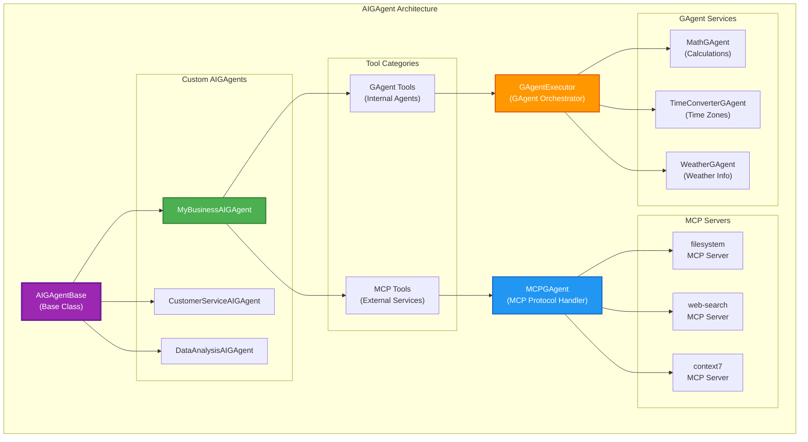

# AIGAgentBase: 统一的智能工具调用架构

## 系统架构图



## 概述

AIGAgentBase 是 Aevatar GAgent 框架的核心基类，为构建具有 AI 能力的智能体（AIGAgent）提供了基础架构。它创新性地将 MCP（Model Context Protocol）服务和内部 GAgent 服务统一在一个智能工具调用架构下。

**什么是 AIGAgent？**
- AIGAgent 是指继承自 AIGAgentBase 的一类 GAgent
- 它们具备与大语言模型（LLM）交互的能力
- 可以智能地调用工具来完成复杂任务
- 是构建 AI 应用的核心组件

通过这种设计，任何业务 GAgent 都可以轻松获得 AI 能力，无缝地调用外部服务和内部智能体，大大扩展了系统的能力边界。

## 架构亮点

### 1. 统一的工具调用接口

AIGAgentBase 为所有继承它的 GAgent 提供了统一的工具调用机制，使得任何业务 GAgent 都能够：
- **调用外部 MCP 服务**：如文件系统操作、网络搜索、数据库访问等
- **调用内部 GAgent 服务**：如数学计算、时间转换、业务逻辑处理等
- **智能路由**：AI 自动识别何时需要调用工具，并路由到相应的处理器
- **无缝集成**：开发者只需继承 AIGAgentBase，即可获得完整的 AI 工具调用能力

### 2. 如何启用 AIGAgent 工具调用

任何继承自 AIGAgentBase 的 GAgent 都可以启用工具调用功能。以下是具体步骤：

#### 创建自定义 AIGAgent

```csharp
// 定义你的 AIGAgent 类
public interface IMyBusinessAIGAgent : IAIGAgent
{
    // 定义业务接口
}

[GAgent]
public class MyBusinessAIGAgent : AIGAgentBase<MyAIGAgentState, ...>, IMyBusinessAIGAgent
{
    // 实现你的业务逻辑
}
```

#### 启用工具调用

```csharp
// 第1步：创建你的 AIGAgent 实例
var agent = await gAgentFactory.GetGAgentAsync<IMyBusinessAIGAgent>();

// 第2步：配置 AI 模型（必须）
await agent.ConfigureBrainAsync("OpenAI"); // 或其他支持的 LLM

// 第3步：启用并配置 MCP 工具（外部服务）
var mcpServers = new List<MCPServerConfig>
{
    new() { ServerName = "filesystem", Command = "npx", Args = ["-y", "@modelcontextprotocol/server-filesystem"] },
    new() { ServerName = "web-search", Url = "https://your-search-api.com/sse" }
};
await agent.ConfigureMCPServersAsync(mcpServers);

// 第4步：启用并配置 GAgent 工具（内部智能体）
var gAgentTypes = new List<GrainType>
{
    GrainType.Create("MathGAgent"),
    GrainType.Create("TimeConverterGAgent"),
    GrainType.Create("YourCustomGAgent")
};
await agent.ConfigureGAgentToolsAsync(gAgentTypes);
```

配置完成后，你的 AIGAgent 就可以在对话中智能地识别何时需要调用工具，并自动执行相应的操作。

### 3. MCPGAgent 的生命周期管理

MCPGAgent 是处理 MCP 协议的专门智能体，其生命周期管理体现了系统的高效性：

#### 创建阶段
- **按需创建**：只有当 AIGAgent 需要调用特定 MCP 服务器时，才会创建对应的 MCPGAgent
- **单例模式**：每个 MCP 服务器对应一个 MCPGAgent 实例，避免重复创建

#### 运行阶段
- **连接管理**：MCPGAgent 维护与 MCP 服务器的长连接，提高调用效率
- **状态跟踪**：实时监控连接状态，自动重连和错误恢复
- **工具发现**：动态发现 MCP 服务器提供的工具，无需手动配置

#### 生命周期示例
```
AIGAgent 创建
    ↓
配置 MCP 服务器 (filesystem, web-search)
    ↓
首次调用 filesystem 工具
    ↓
创建 filesystem MCPGAgent → 建立连接 → 发现工具
    ↓
后续调用直接使用已创建的 MCPGAgent
    ↓
AIGAgent 销毁时，所有 MCPGAgent 自动清理
```

### 4. GAgent 作为工具的创新设计

将任意 GAgent 转换为可调用工具是系统的一大创新，其核心原理包括：

#### ResultGAgent 模式
- **统一返回格式**：所有作为工具的 GAgent 都实现 `IResultGAgent` 接口
- **结构化输出**：确保返回结果可以被 AI 理解和处理
- **错误处理**：统一的错误返回机制，便于 AI 进行错误恢复

#### GAgentService 服务层
- **服务发现**：自动扫描系统中可用的 GAgent 类型
- **元数据管理**：维护每个 GAgent 的描述、参数、返回值等信息
- **权限控制**：可以控制哪些 GAgent 可以被作为工具使用

#### GAgentExecutor 执行器
- **动态调用**：根据工具名称动态创建和调用对应的 GAgent
- **参数映射**：自动将 AI 的自然语言参数转换为 GAgent 需要的强类型参数
- **结果转换**：将 GAgent 的执行结果转换为 AI 可理解的格式

### 5. 实际应用场景

通过这种架构，我们可以轻松实现复杂的 AI 应用场景：

**场景1：智能文件助手**
```
用户："帮我找出项目中所有的配置文件，并分析其中的数据库连接信息"
AI → 调用 filesystem MCP 工具搜索文件
   → 调用 ConfigAnalyzerGAgent 分析配置
   → 综合结果给出报告
```

**场景2：多源数据聚合**
```
用户："查询北京和纽约的当前时间和天气"
AI → 调用 TimeConverterGAgent 获取时间
   → 调用 web-search MCP 工具查询天气
   → 格式化输出结果
```

### 6. 核心优势

1. **扩展性强**
   - 新增 MCP 服务器无需修改代码
   - 任何 GAgent 都可以快速转换为工具
   - 支持动态加载和配置

2. **性能优化**
   - 连接池管理，减少连接开销
   - 并行工具调用，提高响应速度
   - 智能缓存，避免重复调用

3. **可靠性高**
   - 完善的错误处理和恢复机制
   - 工具调用超时控制
   - 详细的调用日志和监控

4. **开发友好**
   - 统一的工具定义和调用接口
   - 丰富的调试信息
   - 完整的类型安全保证

## 总结

AIGAgentBase 作为构建 AI 智能体的基础框架，通过统一的工具调用架构，成功地将外部 MCP 服务和内部 GAgent 服务整合在一起。任何继承自 AIGAgentBase 的业务 GAgent 都能立即获得：

- **AI 对话能力**：与大语言模型的无缝集成
- **工具调用能力**：智能识别何时需要调用工具
- **扩展能力**：轻松接入新的 MCP 服务和 GAgent 工具

这种设计让开发者能够快速构建具有 AI 能力的业务智能体，专注于业务逻辑的实现，而不必关心底层的 AI 集成和工具调用细节。

未来，我们将继续优化这个架构，支持更多类型的工具服务，让创建 AI 应用变得更加简单和强大。
