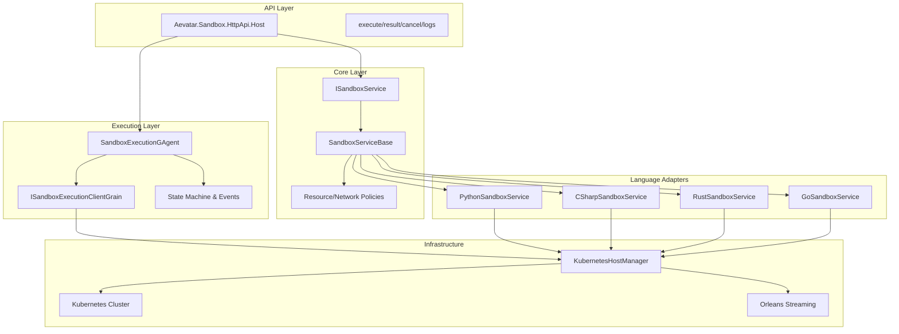
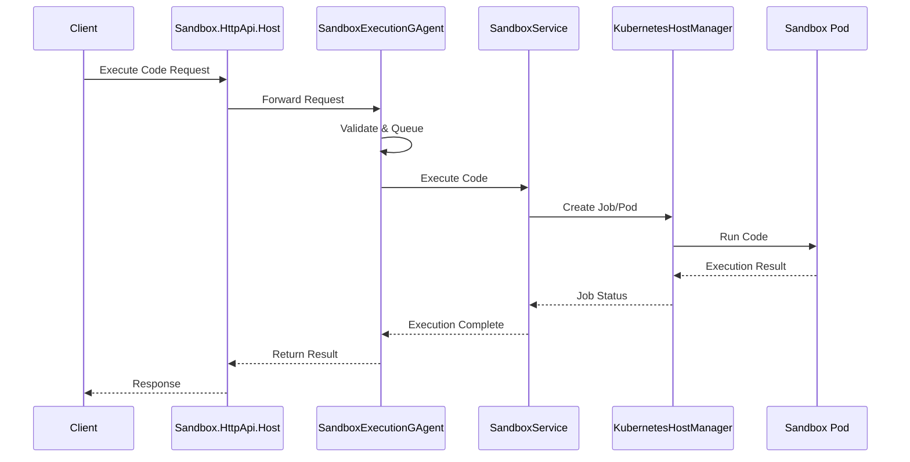

# Aevatar Sandbox Architecture

## Overview

The Aevatar Sandbox Platform is a secure, scalable, and extensible system for executing untrusted code in isolated environments. It supports multiple programming languages through a unified abstraction layer and provides comprehensive monitoring, resource management, and security controls.

## Architecture Diagrams

### Component Architecture



### Execution Flow



## Core Components

### 1. API Layer (Aevatar.Sandbox.HttpApi.Host)

The API layer provides a unified HTTP interface for all sandbox operations:

- Code execution
- Status monitoring
- Log retrieval
- Execution cancellation

### 2. Core Layer (Aevatar.Sandbox.Core)

The core layer defines the fundamental abstractions and implementations:

- ISandboxService interface
- SandboxServiceBase abstract class
- Resource management policies
- Security boundaries

### 3. Language Adapters

Language-specific implementations extending SandboxServiceBase:

- PythonSandboxService
- CSharpSandboxService (planned)
- RustSandboxService (planned)
- GoSandboxService (planned)

### 4. Execution Layer

Orleans-based execution coordination:

- SandboxExecutionGAgent
- State machine management
- Event sourcing
- Concurrency control

### 5. Infrastructure Layer

Kubernetes-based container orchestration:

- KubernetesHostManager
- Resource quotas
- Network policies
- Container lifecycle

## Security Architecture

### 1. Container Isolation

- Dedicated namespace per execution
- Resource limits and quotas
- Network policy enforcement
- Read-only root filesystem

### 2. Code Validation

- Static analysis
- Banned import detection
- Resource usage estimation
- Security policy validation

### 3. Runtime Controls

- CPU limits
- Memory constraints
- Disk quotas
- Network restrictions
- Execution timeouts

### 4. Access Control

- API authentication
- Rate limiting
- Audit logging
- Resource authorization

## Resource Management

### 1. Compute Resources

```yaml
resources:
  limits:
    cpu: "100m"
    memory: "256Mi"
  requests:
    cpu: "50m"
    memory: "128Mi"
```

### 2. Network Policies

```yaml
apiVersion: networking.k8s.io/v1
kind: NetworkPolicy
metadata:
  name: sandbox-isolation
spec:
  podSelector:
    matchLabels:
      role: sandbox
  policyTypes:
  - Ingress
  - Egress
  ingress: []
  egress: []
```

### 3. Storage

```yaml
spec:
  volumes:
  - name: tmp
    emptyDir:
      medium: Memory
      sizeLimit: "64Mi"
```

## Monitoring and Observability

### 1. Metrics

- Execution duration
- Resource utilization
- Error rates
- Queue length
- Latency distribution

### 2. Logging

- Execution logs
- System events
- Security alerts
- Audit trail

### 3. Tracing

- Request flow
- Component interactions
- Performance bottlenecks
- Error propagation

## Local Development Setup

### Prerequisites

1. Install required tools:
   - Docker
   - Kubernetes (or K3d/Kind)
   - .NET 8.0+
   - Orleans tools

2. Clone repositories:
   ```bash
   git clone https://github.com/aevatar/sandbox.git
   ```

3. Build projects:
   ```bash
   dotnet restore
   dotnet build
   ```

### Local Testing

1. Start local Kubernetes cluster:
   ```bash
   k3d cluster create sandbox-dev
   ```

2. Deploy sandbox components:
   ```bash
   kubectl apply -f k8s/
   ```

3. Run integration tests:
   ```bash
   dotnet test
   ```

## Deployment Architecture

### 1. Production Environment

- Multiple Kubernetes clusters
- Load balancing
- Auto-scaling
- High availability

### 2. Scaling Strategy

- Horizontal pod autoscaling
- Cluster autoscaling
- Queue-based load management
- Resource optimization

### 3. Disaster Recovery

- Multi-region deployment
- Backup and restore
- Failover procedures
- Data retention

## Future Enhancements

1. **Language Support**
   - Add support for more languages
   - Improve language-specific optimizations
   - Enhanced runtime controls

2. **Security**
   - Advanced code analysis
   - Enhanced isolation
   - Vulnerability scanning
   - Runtime protection

3. **Performance**
   - Warm pool management
   - Resource prediction
   - Cache optimization
   - Request batching

4. **Monitoring**
   - Advanced analytics
   - Predictive alerts
   - Cost optimization
   - Performance insights

## License

Copyright (c) Aevatar. All rights reserved.