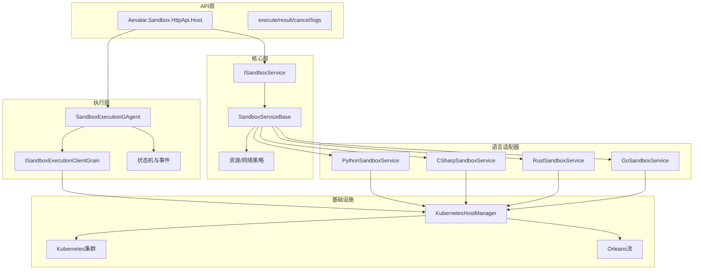
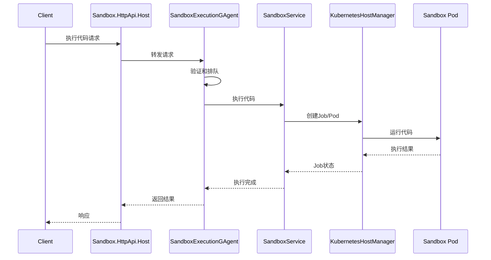

# Aevatar沙箱架构

## 概述

Aevatar沙箱平台是一个安全、可扩展且可扩展的系统，用于在隔离环境中执行不受信任的代码。它通过统一的抽象层支持多种编程语言，并提供全面的监控、资源管理和安全控制。

## 架构图

### 组件架构



### 执行流程



## 核心组件

### 1. API层 (Aevatar.Sandbox.HttpApi.Host)

API层为所有沙箱操作提供统一的HTTP接口：

- 代码执行
- 状态监控
- 日志检索
- 执行取消

### 2. 核心层 (Aevatar.Sandbox.Core)

核心层定义基本抽象和实现：

- ISandboxService接口
- SandboxServiceBase抽象类
- 资源管理策略
- 安全边界

### 3. 语言适配器

扩展SandboxServiceBase的特定语言实现：

- PythonSandboxService
- CSharpSandboxService（计划中）
- RustSandboxService（计划中）
- GoSandboxService（计划中）

### 4. 执行层

基于Orleans的执行协调：

- SandboxExecutionGAgent
- 状态机管理
- 事件溯源
- 并发控制

### 5. 基础设施层

基于Kubernetes的容器编排：

- KubernetesHostManager
- 资源配额
- 网络策略
- 容器生命周期

## 安全架构

### 1. 容器隔离

- 每次执行专用命名空间
- 资源限制和配额
- 网络策略执行
- 只读根文件系统

### 2. 代码验证

- 静态分析
- 禁用导入检测
- 资源使用估算
- 安全策略验证

### 3. 运行时控制

- CPU限制
- 内存约束
- 磁盘配额
- 网络限制
- 执行超时

### 4. 访问控制

- API认证
- 速率限制
- 审计日志
- 资源授权

## 资源管理

### 1. 计算资源

```yaml
resources:
  limits:
    cpu: "100m"
    memory: "256Mi"
  requests:
    cpu: "50m"
    memory: "128Mi"
```

### 2. 网络策略

```yaml
apiVersion: networking.k8s.io/v1
kind: NetworkPolicy
metadata:
  name: sandbox-isolation
spec:
  podSelector:
    matchLabels:
      role: sandbox
  policyTypes:
  - Ingress
  - Egress
  ingress: []
  egress: []
```

### 3. 存储

```yaml
spec:
  volumes:
  - name: tmp
    emptyDir:
      medium: Memory
      sizeLimit: "64Mi"
```

## 监控和可观测性

### 1. 指标

- 执行时长
- 资源利用率
- 错误率
- 队列长度
- 延迟分布

### 2. 日志

- 执行日志
- 系统事件
- 安全警报
- 审计跟踪

### 3. 追踪

- 请求流程
- 组件交互
- 性能瓶颈
- 错误传播

## 本地开发设置

### 前置要求

1. 安装所需工具：
   - Docker
   - Kubernetes（或K3d/Kind）
   - .NET 8.0+
   - Orleans工具

2. 克隆代码库：
   ```bash
   git clone https://github.com/aevatar/sandbox.git
   ```

3. 构建项目：
   ```bash
   dotnet restore
   dotnet build
   ```

### 本地测试

1. 启动本地Kubernetes集群：
   ```bash
   k3d cluster create sandbox-dev
   ```

2. 部署沙箱组件：
   ```bash
   kubectl apply -f k8s/
   ```

3. 运行集成测试：
   ```bash
   dotnet test
   ```

## 部署架构

### 1. 生产环境

- 多Kubernetes集群
- 负载均衡
- 自动扩缩容
- 高可用性

### 2. 扩展策略

- 水平Pod自动扩缩容
- 集群自动扩缩容
- 基于队列的负载管理
- 资源优化

### 3. 灾难恢复

- 多区域部署
- 备份和恢复
- 故障转移程序
- 数据保留

## 未来增强

1. **语言支持**
   - 添加更多语言支持
   - 改进特定语言优化
   - 增强运行时控制

2. **安全性**
   - 高级代码分析
   - 增强隔离
   - 漏洞扫描
   - 运行时保护

3. **性能**
   - 热池管理
   - 资源预测
   - 缓存优化
   - 请求批处理

4. **监控**
   - 高级分析
   - 预测性警报
   - 成本优化
   - 性能洞察

## 许可证

版权所有 (c) Aevatar。保留所有权利。