# AI配置系统增强设计

## 🎯 核心需求

1. **LLM配置分离**: `LLM` → `Provider + Model` 分离架构
2. **动态配置接口**: 通过接口获取配置，支持内存/其他存储方式
3. **Scope逻辑**: 保留分层配置管理 (System/Project/Workflow/User)

## 🚨 设计过程中的关键问题与解决方案

### 问题1: 跨容器配置共享
**问题描述**: 
- Controller 运行在 Client/Web 容器中，设置的是客户端内存配置
- AIGAgentBase 运行在 Orleans Silo 容器中，需要访问这些配置
- 两个容器进程隔离，内存不共享

**解决方案**: Orleans Grain 配置架构
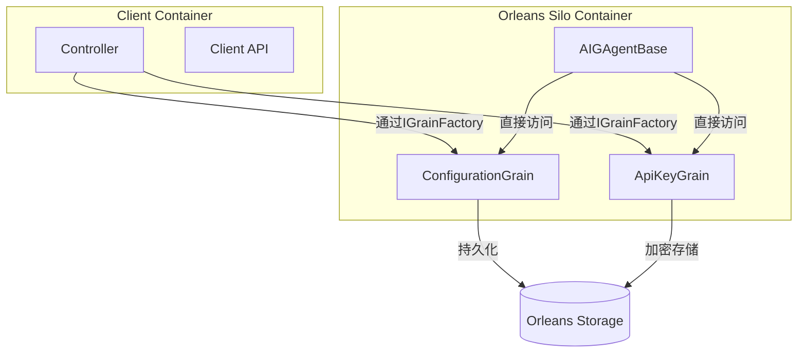

**优势**:
- ✅ 配置存储在 Silo 中，天然支持分布式
- ✅ Client 和 Silo 通过相同接口访问
- ✅ 利用 Orleans 状态管理和持久化
- ✅ 无需外部依赖 (Redis/数据库)

### 问题2: 框架层业务耦合
**问题描述**: 
- AIGAgentBase 直接了解 workflowId, projectId, userId 等业务概念
- 框架层不应依赖具体业务逻辑

**解决方案**: ConfigurationContext 抽象层
```csharp
// ❌ 业务耦合的旧方式
var llmService = await configService.ResolveLLMServiceAsync(
    provider, model, workflowId, projectId, userId);

// ✅ 抽象解耦的新方式  
var context = ConfigurationContext.FromGrainContext(grainId);
var llmService = await configService.ResolveLLMServiceAsync(
    provider, model, context);
```

**优势**:
- ✅ 框架层与业务层解耦
- ✅ 业务层灵活映射作用域
- ✅ 提高可测试性和可扩展性

### 问题3: LLM 配置灵活性不足
**问题描述**: 
- 原有 SystemLLM 字符串配置过于简单
- 无法灵活组合不同 Provider 和 Model
- 配置变更需要重启应用

**解决方案**: Provider + Model 分离架构
```csharp
// ❌ 旧的单一配置
SystemLLM = "openai"

// ✅ 新的分离配置
ProviderType = LLMProviderEnum.Azure    // 可以是 Azure
ModelType = ModelIdEnum.OpenAI          // 但模型是 OpenAI GPT-4
```

**优势**:
- ✅ 支持 Azure OpenAI, OpenAI Native 等多种组合
- ✅ 运行时动态更新配置
- ✅ 更精细的参数控制

### 问题4: 配置级联复杂性
**问题描述**: 
- 需要支持多层级配置 (System → Project → User → Workflow)
- 不同场景需要不同的配置优先级
- 配置查找逻辑复杂

**解决方案**: 统一级联查找机制
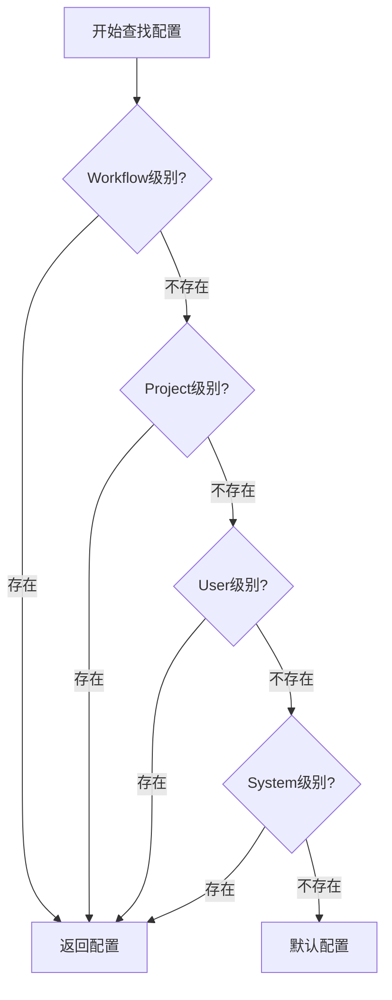

**优势**:
- ✅ 统一的查找逻辑
- ✅ 支持配置继承和覆盖
- ✅ 灵活的优先级控制

## 🏗️ 最终架构图

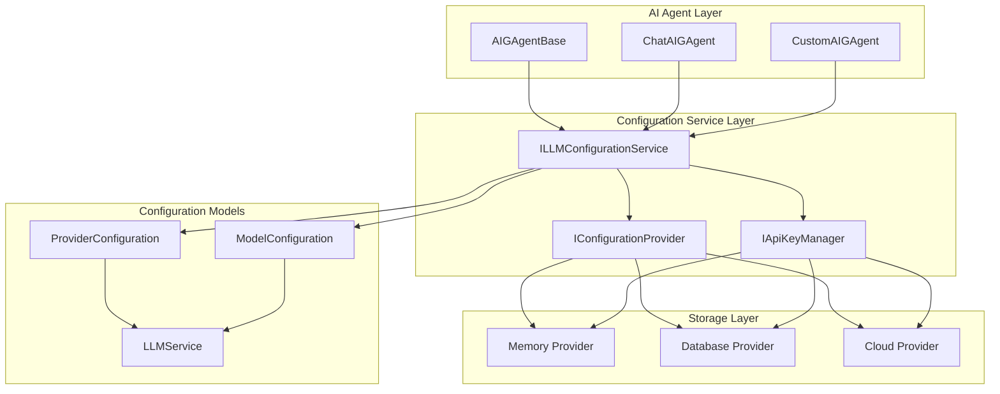

## 📊 Provider + Model 分离架构

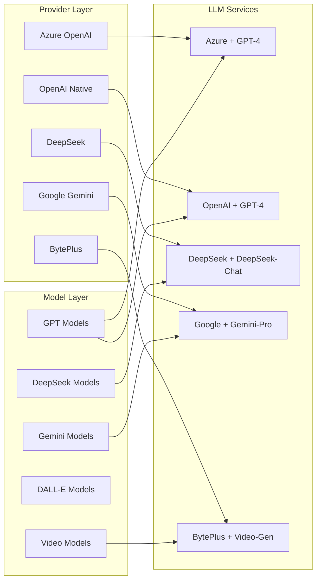

## 🔄 配置级联机制

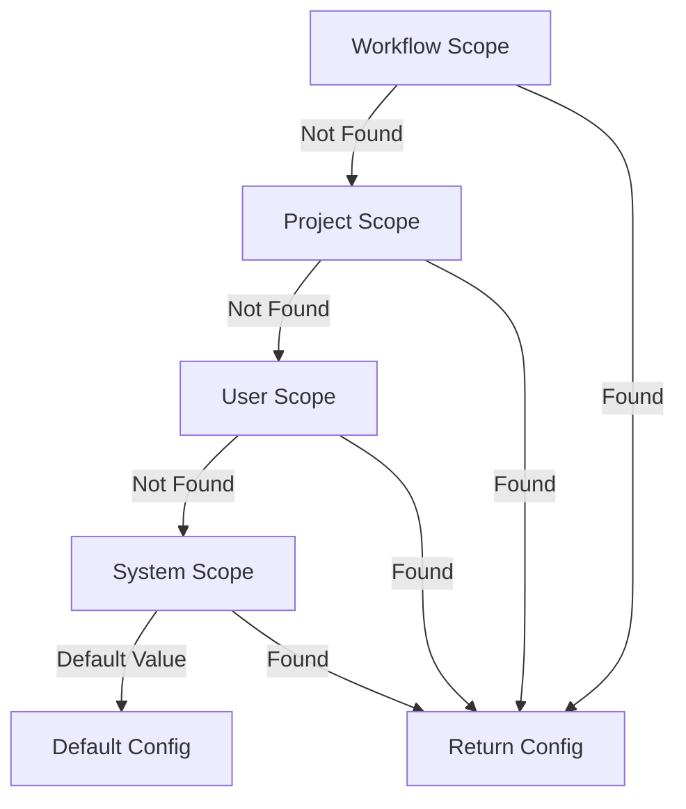

## 🔧 核心接口设计

```csharp
// 简化的配置DTO
public class LLMConfigDto
{
    public LLMProviderEnum? ProviderType { get; set; }
    public ModelIdEnum? ModelType { get; set; }
    public string? SystemLLM { get; set; }  // 向后兼容
}

// 动态配置服务
public interface ILLMConfigurationService
{
    Task<LLMService> ResolveLLMServiceAsync(
        LLMProviderEnum provider, ModelIdEnum model,
        ConfigurationContext? context = null);
        
    Task<LLMService> ResolveLLMServiceFromSystemLLMAsync(
        string systemLLM, ConfigurationContext? context = null);
}
```

## 💡 使用流程图

### 1. AI Agent 初始化流程

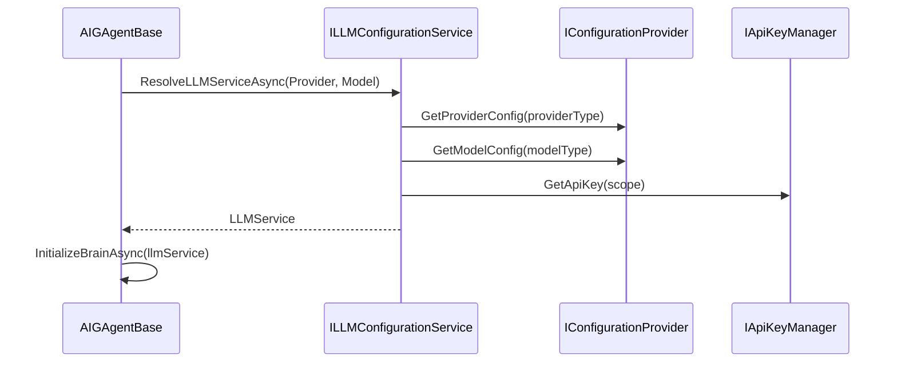

### 2. 配置查找优先级

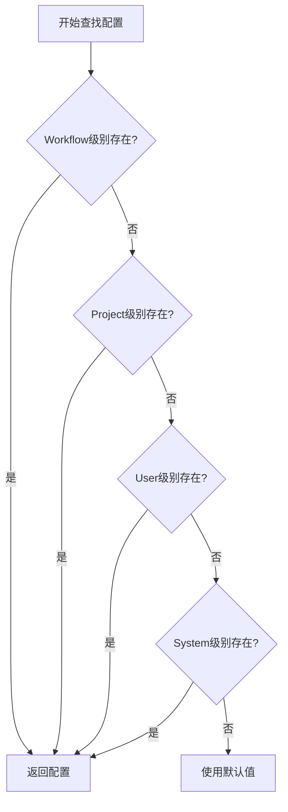

### 3. ChatAIGAgent 使用示例

```csharp
// ChatAIGAgent 中的配置
protected override async Task PerformConfigAsync(ChatAIGAgentConfigDto configuration)
{
    await base.PerformConfigAsync(configuration);

    // 使用 Provider + Model 分离配置
    var llmConfig = new LLMConfigDto
    {
        ProviderType = LLMProviderEnum.Azure,
        ModelType = ModelIdEnum.OpenAI,
        SystemLLM = configuration.SystemLLM?.ToString() // 向后兼容
    };

    // 构建业务上下文
    var businessContext = ConfigurationContext.ForProject(configuration.ProjectId ?? "default")
        .WithUser(configuration.UserId ?? "system");

    // 自动解析和应用动态配置
    await InitializeAsync(new InitializeDto
    {
        Instructions = configuration.Instructions,
        LLMConfig = llmConfig,
        MCPServers = configuration.MCPServers,
        ToolGAgentTypes = configuration.ToolGAgentTypes,
        ToolGAgents = configuration.ToolGAgents,
    }, businessContext);
}
```

## 🔄 迁移策略图

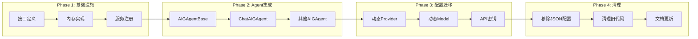

## 🔧 配置兼容性矩阵

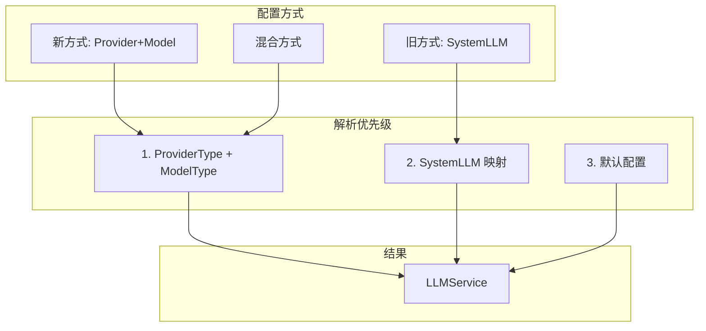

## ✅ 核心优势

| 特性 | 旧架构 | 新架构 | 改进 |
|------|--------|--------|------|
| 配置灵活性 | 固定JSON | Provider+Model分离 | ⭐⭐⭐⭐⭐ |
| 动态更新 | 需重启 | 运行时更新 | ⭐⭐⭐⭐⭐ |
| 存储方式 | 仅JSON文件 | 多种后端支持 | ⭐⭐⭐⭐ |
| 配置管理 | 单一层级 | 四级级联 | ⭐⭐⭐⭐⭐ |
| 代码复用 | 重复配置 | 接口抽象 | ⭐⭐⭐⭐ |
| 向后兼容 | - | 完全兼容 | ⭐⭐⭐⭐⭐ |

## 📊 性能对比

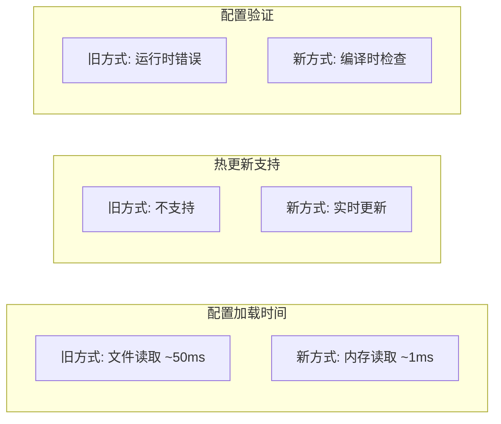

## 📁 简化的文件结构

```
gagents/
├── AI.Abstractions/Configuration/     # 🔧 核心接口 (4个文件)
├── AIGAgent/Dtos/LLMConfigDto.cs      # 📝 配置DTO (1个文件)
└── AIGAgent/Agent/AIGAgentBase.cs     # 🤖 基础Agent (已更新)

station/
└── Application/Configuration/          # 💾 内存实现 (2个文件)
```

**总计**: 仅7个核心文件，实现完整的动态配置系统！🎯

## 📋 设计决策总结

### 🎯 核心设计原则

1. **Orleans First**: 充分利用 Orleans 框架优势，避免外部依赖
2. **分层解耦**: 框架层与业务层清晰分离
3. **向后兼容**: 保持现有代码的可用性
4. **运行时配置**: 支持热更新，无需重启

### 🔄 架构演进路径

| 阶段 | 问题 | 解决方案 | 收益 |
|------|------|----------|------|
| **Phase 1** | 配置不灵活 | Provider+Model分离 | 🔧 灵活组合 |
| **Phase 2** | 跨容器共享 | Orleans Grain架构 | 🌐 分布式配置 |
| **Phase 3** | 业务耦合 | ConfigurationContext抽象 | 🏗️ 分层解耦 |
| **Phase 4** | 级联复杂 | 统一查找机制 | ⚡ 简化逻辑 |

### 🚀 关键创新点

- **Grain-Based Configuration**: 首次将配置管理完全集成到 Orleans 架构中
- **Context Abstraction**: 创新的业务抽象层，实现框架与业务解耦
- **Dynamic Provider-Model**: 运行时可配置的 AI 服务组合
- **Cascade Resolution**: 智能的多层级配置查找机制

### 📊 性能与可扩展性

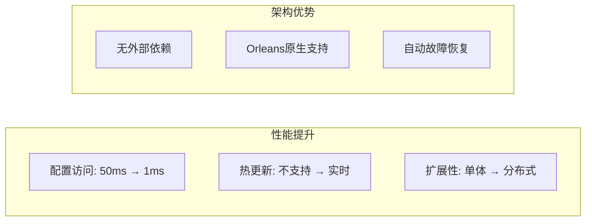

## 🔧 架构改进：分层解耦

### 问题
原始设计中 `AIGAgentBase` 直接了解业务级别概念：
```csharp
// ❌ 框架层不应了解业务概念
var workflowId = this.GetPrimaryKeyString();
var projectId = "default-project";
var userId = "system-user";
```

### 解决方案：ConfigurationContext 抽象
```csharp
// ✅ 通过抽象上下文解耦
public class ConfigurationContext
{
    public string? PrimaryScope { get; set; }    // 主要作用域 (如 grain ID)
    public string? SecondaryScope { get; set; }  // 次要作用域 (如 租户/项目)
    public string? TertiaryScope { get; set; }   // 第三作用域 (如 用户/工作流)
    public string SystemScope { get; set; } = "system";
}

// 框架层只需要知道 grain 级别信息
var context = ConfigurationContext.FromGrainContext(this.GetPrimaryKeyString());
var llmService = await configurationService.ResolveLLMServiceAsync(provider, model, context);
```

### 架构优势
- **分层清晰**: 框架层不依赖业务概念
- **可扩展性**: 业务层可灵活映射作用域
- **可测试性**: 上下文可独立模拟和测试
- **向后兼容**: 现有代码无需大幅修改

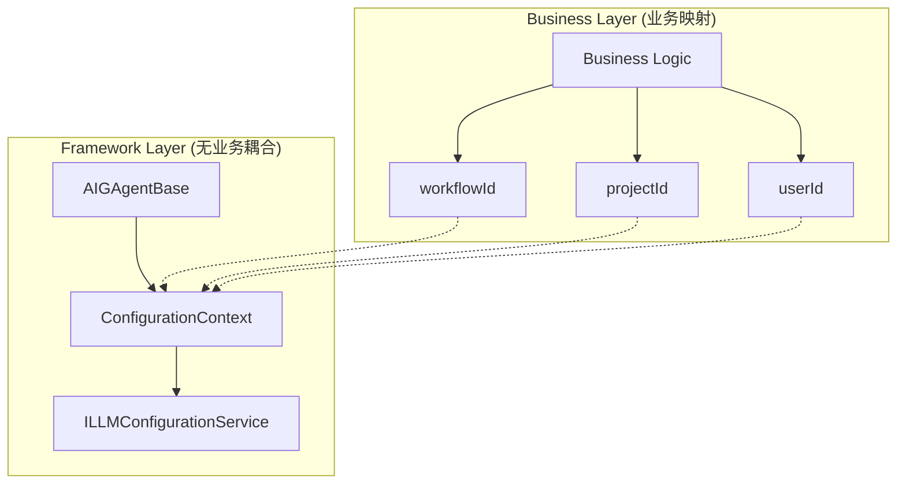
