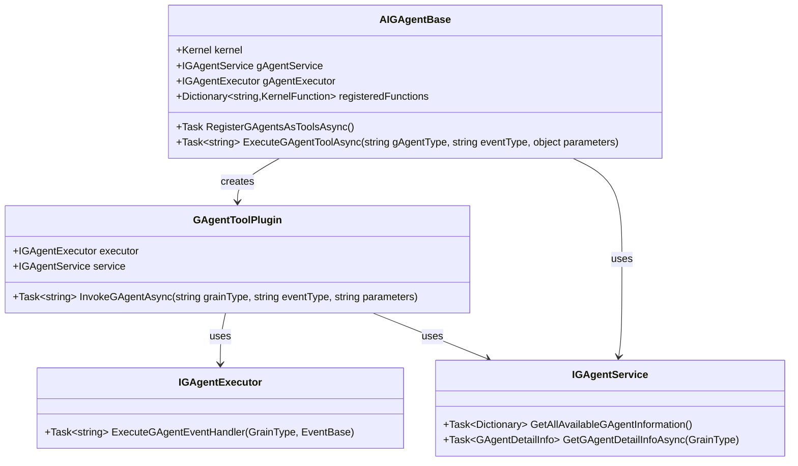
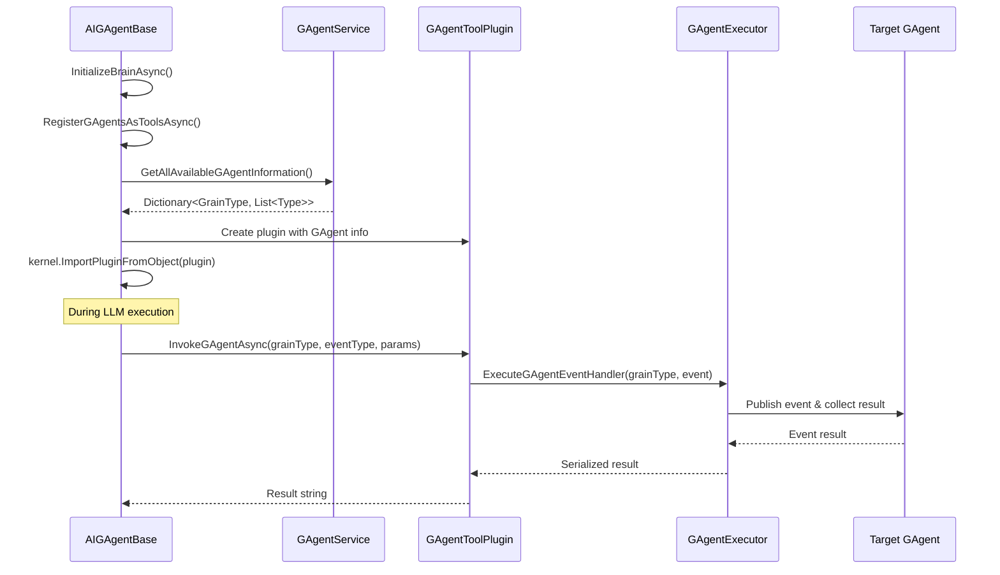

# AIGAgentBase GAgent自动发现与执行功能设计

## 📐 设计概述

### 业务目标
在AIGAgentBase中加入新的功能，使其能够：
1. 自动识别系统中的所有GAgent
2. 通过GAgentExecutor将这些GAgent作为工具（tool）调用
3. 自动注册成为Semantic Kernel Function

### 技术背景
- **Aevatar Multi-Agent系统**：每个Agent称为GAgent
- **通信机制**：GAgent之间通过Orleans streaming进行交互
- **事件处理**：GAgent通过event handler处理继承自EventBase的event
- **AI能力**：AIGAgentBase封装了Semantic Kernel，可调用LLM
- **执行器**：GAgentExecutor可执行GAgent type的event handler
- **服务发现**：GAgentService可缓存系统中所有GAgent类型及其事件

## 🏗️ 架构设计

### 核心组件关系


### 数据流


## 💻 实现细节

### 1. AIGAgentBase扩展

```csharp
public abstract partial class AIGAgentBase<TState, TStateLogEvent, TEvent, TConfiguration>
{
    private IGAgentService? _gAgentService;
    private IGAgentExecutor? _gAgentExecutor;
    private Dictionary<string, KernelFunction> _registeredGAgentFunctions = new();
    
    protected virtual async Task RegisterGAgentsAsToolsAsync()
    {
        if (_brain == null || Kernel == null)
        {
            Logger.LogWarning("Cannot register GAgent tools: Brain not initialized");
            return;
        }
        
        _gAgentService ??= ServiceProvider.GetRequiredService<IGAgentService>();
        _gAgentExecutor ??= ServiceProvider.GetRequiredService<IGAgentExecutor>();
        
        // 获取所有可用的GAgent信息
        var allGAgents = await _gAgentService.GetAllAvailableGAgentInformation();
        
        // 创建GAgent工具插件
        var gAgentPlugin = new GAgentToolPlugin(_gAgentExecutor, _gAgentService, Logger);
        
        // 动态注册每个GAgent的每个事件处理器作为函数
        foreach (var (grainType, eventTypes) in allGAgents)
        {
            var detailInfo = await _gAgentService.GetGAgentDetailInfoAsync(grainType);
            
            foreach (var eventType in eventTypes)
            {
                var functionName = $"{grainType.ToString().Replace("/", "_")}_{eventType.Name}";
                
                // 创建函数描述
                var description = $"Execute {eventType.Name} on {grainType} GAgent. {detailInfo.Description}";
                
                // 注册为Kernel函数
                var function = KernelFunctionFactory.CreateFromMethod(
                    method: (string parameters) => gAgentPlugin.InvokeGAgentAsync(grainType.ToString(), eventType.Name, parameters),
                    functionName: functionName,
                    description: description,
                    parameters: new[]
                    {
                        new KernelParameterMetadata("parameters") 
                        { 
                            Description = $"JSON serialized parameters for {eventType.Name}",
                            IsRequired = true
                        }
                    }
                );
                
                _registeredGAgentFunctions[functionName] = function;
            }
        }
        
        // 将所有函数作为插件导入Kernel
        Kernel.ImportPluginFromFunctions("GAgentTools", _registeredGAgentFunctions.Values);
        
        Logger.LogInformation($"Registered {_registeredGAgentFunctions.Count} GAgent functions as tools");
    }
    
    // 在InitializeBrainAsync中调用
    protected override async Task<bool> InitializeBrainAsync(LLMConfig llmConfig, string instructions)
    {
        var result = await base.InitializeBrainAsync(llmConfig, instructions);
        
        if (result && State.EnableGAgentTools)
        {
            await RegisterGAgentsAsToolsAsync();
        }
        
        return result;
    }
}
```

### 2. GAgentToolPlugin实现

```csharp
public class GAgentToolPlugin
{
    private readonly IGAgentExecutor _executor;
    private readonly IGAgentService _service;
    private readonly ILogger _logger;
    
    public GAgentToolPlugin(IGAgentExecutor executor, IGAgentService service, ILogger logger)
    {
        _executor = executor;
        _service = service;
        _logger = logger;
    }
    
    [KernelFunction("InvokeGAgent")]
    [Description("Invoke a GAgent with specified event")]
    public async Task<string> InvokeGAgentAsync(
        [Description("The GrainType of the target GAgent")] string grainType,
        [Description("The event type name to send")] string eventTypeName,
        [Description("JSON serialized event parameters")] string parameters)
    {
        try
        {
            _logger.LogInformation($"Invoking GAgent {grainType} with event {eventTypeName}");
            
            // 解析GrainType
            var targetGrainType = GrainType.Create(grainType);
            
            // 查找事件类型
            var allGAgents = await _service.GetAllAvailableGAgentInformation();
            var eventTypes = allGAgents.GetValueOrDefault(targetGrainType);
            
            if (eventTypes == null)
            {
                throw new InvalidOperationException($"GAgent {grainType} not found");
            }
            
            var eventType = eventTypes.FirstOrDefault(t => t.Name == eventTypeName);
            if (eventType == null)
            {
                throw new InvalidOperationException($"Event type {eventTypeName} not found for GAgent {grainType}");
            }
            
            // 反序列化事件参数
            var @event = JsonConvert.DeserializeObject(parameters, eventType) as EventBase;
            if (@event == null)
            {
                throw new InvalidOperationException($"Failed to deserialize event parameters");
            }
            
            // 执行GAgent事件处理器
            var result = await _executor.ExecuteGAgentEventHandler(targetGrainType, @event);
            
            _logger.LogInformation($"GAgent {grainType} execution completed");
            
            return result;
        }
        catch (Exception ex)
        {
            _logger.LogError(ex, $"Error invoking GAgent {grainType} with event {eventTypeName}");
            return JsonConvert.SerializeObject(new { error = ex.Message });
        }
    }
}
```

### 3. 状态扩展

```csharp
[GenerateSerializer]
public abstract class AIGAgentStateBase : StateBase
{
    // ... 现有属性 ...
    
    [Id(13)] public bool EnableGAgentTools { get; set; } = false;
    [Id(14)] public List<string> RegisteredGAgentFunctions { get; set; } = new();
}
```

### 4. 配置和初始化

```csharp
public class AIGAgentConfiguration : ConfigurationBase
{
    public bool EnableGAgentTools { get; set; } = false;
    public List<string>? AllowedGAgentTypes { get; set; } // 可选：限制可用的GAgent类型
}
```

## 🔧 使用示例

### 1. 启用GAgent工具功能

```csharp
public class SmartAIGAgent : AIGAgentBase<SmartAIGAgentState, SmartAIGAgentLogEvent>
{
    protected override async Task PerformConfigAsync(SmartAIGAgentConfig configuration)
    {
        await InitializeAsync(new InitializeDto
        {
            Instructions = configuration.Instructions,
            LLMConfig = configuration.LLMConfig,
            EnableGAgentTools = true // 启用GAgent工具
        });
    }
}
```

### 2. LLM提示模板示例

```
You are an intelligent assistant with access to various GAgent tools.

Available tools include:
- TwitterGAgent_SendTweetGEvent: Send a tweet through Twitter
- TelegramGAgent_SendMessageGEvent: Send a message through Telegram
- RouterGAgent_RouteNextGEvent: Route tasks to appropriate agents

Use these tools when needed to complete user requests.
```

### 3. 运行时调用流程

```csharp
// 用户请求
var userPrompt = "Please send a tweet saying 'Hello from AI Agent'";

// LLM会自动识别需要调用TwitterGAgent
// 生成函数调用：TwitterGAgent_SendTweetGEvent
// 参数：{"Content": "Hello from AI Agent"}

// 系统自动执行并返回结果
```

## 🧪 测试策略

### 单元测试

1. **GAgentToolPlugin测试**
   - 测试正确解析GrainType和EventType
   - 测试事件参数序列化/反序列化
   - 测试错误处理

2. **AIGAgentBase扩展测试**
   - 测试工具注册流程
   - 测试函数命名和描述生成
   - 测试Kernel集成

3. **集成测试**
   - 测试完整的工具调用流程
   - 测试多个GAgent工具的协同
   - 测试错误恢复机制

### 测试用例示例

```csharp
[Fact]
public async Task Should_Register_All_Available_GAgents_As_Tools()
{
    // Arrange
    var aiAgent = await CreateTestAIGAgentAsync();
    
    // Act
    await aiAgent.InitializeAsync(new InitializeDto
    {
        EnableGAgentTools = true,
        // ... 其他配置
    });
    
    // Assert
    var kernel = await aiAgent.GetKernelAsync();
    var plugin = kernel.Plugins.FirstOrDefault(p => p.Name == "GAgentTools");
    
    Assert.NotNull(plugin);
    Assert.True(plugin.FunctionCount > 0);
}
```

## 🚀 性能考虑

1. **缓存策略**
   - GAgentService已实现5分钟缓存
   - 考虑增加函数元数据缓存

2. **延迟加载**
   - 仅在需要时创建GAgent实例
   - 按需注册函数，避免启动时注册所有

3. **并发处理**
   - GAgentExecutor支持并发执行
   - 考虑添加速率限制

## 🔒 安全考虑

1. **权限控制**
   - 可配置允许的GAgent类型白名单
   - 验证事件参数的合法性

2. **隔离执行**
   - 每个工具调用在独立的执行上下文中
   - 超时控制（默认5分钟）

3. **审计日志**
   - 记录所有工具调用
   - 追踪调用链路

## 📋 实施计划

1. **Phase 1: 核心功能**
   - 实现GAgentToolPlugin
   - 扩展AIGAgentBase
   - 基本测试

2. **Phase 2: 优化和增强**
   - 添加缓存机制
   - 实现权限控制
   - 性能优化

3. **Phase 3: 高级功能**
   - 支持批量操作
   - 添加工具调用分析
   - 智能工具推荐

## 🎯 成功标准

1. AIGAgent能够自动发现并调用系统中的其他GAgent
2. LLM能够理解并正确使用GAgent工具
3. 性能影响在可接受范围内（<100ms额外延迟）
4. 所有单元测试和集成测试通过
5. 文档完整，易于其他开发者使用 