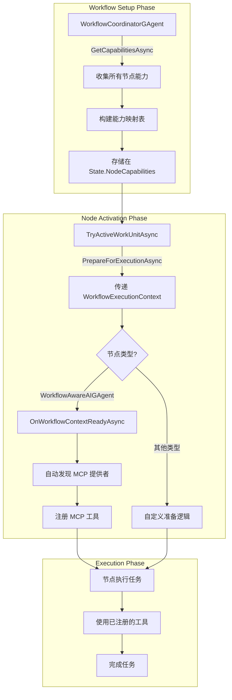

# 工作流工具注册最佳实践

## 概述

在 Aevatar 工作流系统中，工具注册通过抽象的能力声明机制实现。工作流节点不需要直接了解 MCP 工具等具体概念，而是通过能力（Capabilities）系统来发现和使用资源。

## 设计原则

### 1. **抽象分离** (Separation of Concerns)
- WorkflowUnit 只关注工作流抽象概念（关系、能力、执行上下文）
- 具体的工具注册逻辑由专门的 AIGAgent 层处理
- 工作流协调器不需要了解具体的资源类型

### 2. **能力声明** (Capability Declaration)
- 每个节点声明自己提供的能力（ProvidedCapabilities）
- 每个节点声明自己需要的能力（RequiredCapabilities）
- 通过能力匹配自动发现资源

### 3. **延迟绑定** (Late Binding)  
- 资源在节点准备执行时才绑定
- 避免过早的资源分配
- 支持动态的资源发现

### 4. **上下文传播** (Context Propagation)
- 通过 WorkflowExecutionContext 传递工作流信息
- 包含所有可用资源的引用
- 支持共享数据和元数据

## 架构设计

### 1. IWorkflowUnit 接口

```csharp
public interface IWorkflowUnit
{
    // 建立与其他工作流单元的关系
    Task EstablishRelationshipAsync(GrainId relatedUnit, string relationship);
    
    // 获取此单元的能力描述
    Task<WorkflowUnitCapabilities> GetCapabilitiesAsync();
    
    // 准备执行工作流任务
    Task PrepareForExecutionAsync(WorkflowExecutionContext context);
}
```

### 2. WorkflowAwareAIGAgentBase 基类

**注意：此基类位于 `Aevatar.GAgents.GroupChat` 命名空间中，避免循环依赖**

```csharp
namespace Aevatar.GAgents.GroupChat;

public abstract class WorkflowAwareAIGAgentBase<...> : AIGAgentBase<...>
{
    protected virtual async Task OnWorkflowContextReadyAsync(WorkflowExecutionContext context)
    {
        // 自动发现和注册 MCP 工具
        var mcpProviders = await DiscoverMCPProvidersAsync(context.AvailableResources);
        if (mcpProviders.Any())
        {
            await ConfigureMCPServersAsync(mcpProviders);
        }
    }
}
```

### 3. 工作流执行流程



## 改进的设计优势

### 1. 避免循环依赖
- AIGAgent 项目不依赖 GroupChat.Core
- WorkflowAwareAIGAgentBase 放在 GroupChat 项目中
- 清晰的依赖层次

### 2. 更好的抽象
- IWorkflowUnit 不包含任何工具相关的概念
- 使用通用的"能力"和"资源"概念
- 具体实现细节封装在基类中

### 3. 灵活的扩展性
- 可以轻松添加新的资源类型
- 不需要修改核心接口
- 子类可以自定义资源处理逻辑

## 使用指南

### 1. 创建工作流感知的 AI Agent

```csharp
using Aevatar.GAgents.GroupChat; // WorkflowAwareAIGAgentBase 在这里

public class MyWorkflowAIGAgent : WorkflowAwareAIGAgentBase<...>
{
    public override Task<WorkflowUnitCapabilities> GetCapabilitiesAsync()
    {
        return Task.FromResult(new WorkflowUnitCapabilities
        {
            UnitType = "CustomAI",
            RequiredCapabilities = new List<string> { "MCPTools" }
        });
    }
    
    public async Task PrepareForExecutionAsync(WorkflowExecutionContext context)
    {
        // 基类会自动处理 MCP 工具注册
        await OnWorkflowContextReadyAsync(context);
    }
}
```

### 2. 工作流中的工具自动发现

```csharp
// 工作流启动时
await coordinator.StartWorkflowAsync();

// 内部流程：
// 1. 协调器收集所有节点的能力
// 2. 构建执行上下文，包含所有资源引用
// 3. 激活节点时调用 PrepareForExecutionAsync
// 4. WorkflowAwareAIGAgentBase 自动发现和注册 MCP 工具
// 5. 节点可以使用注册的工具执行任务
```

## 最佳实践总结

1. **保持抽象** - 核心接口不应包含具体实现细节
2. **避免循环依赖** - 合理组织代码位置
3. **使用能力系统** - 通过声明式的能力匹配实现资源发现
4. **延迟加载** - 在需要时才进行资源绑定
5. **提供基类支持** - 通过基类简化常见场景的实现

## 故障排除

### 问题：编译错误 "未能找到类型或命名空间名"
**原因**：循环依赖导致的编译问题
**解决**：确保 WorkflowAwareAIGAgentBase 在 GroupChat 项目中

### 问题：工具未被自动注册
**检查点**：
1. MCP GAgent 是否正确声明了 "MCPTools" 能力
2. AI Agent 是否继承自 WorkflowAwareAIGAgentBase
3. PrepareForExecutionAsync 是否调用了 OnWorkflowContextReadyAsync

### 问题：资源发现失败
**调试步骤**：
1. 启用详细日志
2. 检查 WorkflowExecutionContext.AvailableResources
3. 验证 GAgentFactory 是否正确解析资源 