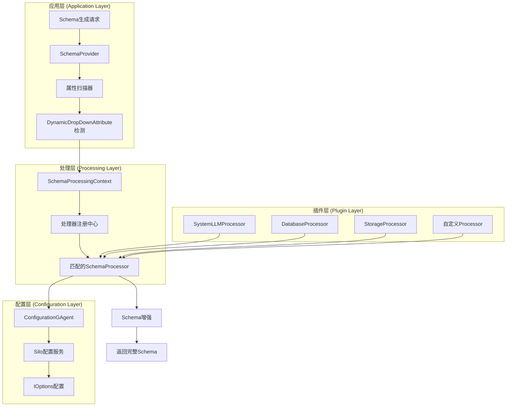

# 动态下拉菜单插件化架构设计方案

## 1. 方案概述

### 1.1 背景
当前系统的动态下拉菜单配置获取方式需要显式调用固定接口，缺乏灵活性和扩展性。开发者无法简单地添加新的配置源，必须修改核心代码才能支持新的配置类型。

### 1.2 目标
设计一个**插件化、类型安全、高性能**的动态配置架构，让开发者可以：
- 通过简单继承的方式添加新的配置处理器
- 使用泛型方式保证类型安全
- 通过上下文传递统一管理配置
- 零侵入地扩展系统功能

### 1.3 核心价值
- **开发效率提升**：新增配置源只需3步，无需修改核心代码
- **类型安全保障**：编译时泛型检查，避免运行时错误
- **高性能架构**：智能缓存和延迟加载机制
- **完全解耦**：插件化架构，各组件独立开发和测试

## 2. 技术架构

### 2.1 整体架构图



### 2.2 核心设计原则

1. **插件化优先**：所有配置处理逻辑通过插件实现
2. **约定优于配置**：最小化开发者配置工作
3. **类型安全**：泛型保证编译时类型检查
4. **性能导向**：缓存、延迟加载、批量处理
5. **向后兼容**：不破坏现有功能

## 3. 核心组件设计

### 3.1 基础接口层

#### ISchemaProcessor<TOption>
```csharp
/// <summary>
/// Schema处理器基接口 - 开发者继承实现
/// </summary>
public interface ISchemaProcessor<TOption> where TOption : class
{
    /// <summary>
    /// 配置名称，对应DynamicDropDownAttribute.OptionSource的值
    /// </summary>
    string OptionName { get; }
    
    /// <summary>
    /// 处理Schema的核心方法
    /// </summary>
    /// <param name="schema">目标JSON Schema</param>
    /// <param name="property">当前处理的属性</param>
    /// <param name="option">从silo获取的配置对象</param>
    /// <param name="context">处理上下文，可获取其他配置</param>
    Task ProcessSchemaAsync(JsonSchema schema, PropertyInfo property, TOption option, SchemaProcessingContext context);
}
```

#### IConfigurationGAgent
```csharp
/// <summary>
/// 通用配置获取GAgent - 支持任意类型的配置获取
/// </summary>
public interface IConfigurationGAgent : IGrainWithStringKey
{
    /// <summary>
    /// 获取指定类型的配置选项
    /// </summary>
    Task<T?> GetOptionAsync<T>(string optionName) where T : class;
    
    /// <summary>
    /// 获取指定类型的配置选项（非泛型版本）
    /// </summary>
    Task<object?> GetOptionAsync(Type optionType, string optionName);
}
```

### 3.2 简化基类层

#### SchemaProcessorBase<TOption>
```csharp
/// <summary>
/// 简化的基类 - 开发者只需实现核心逻辑
/// </summary>
public abstract class SchemaProcessorBase<TOption> : ISchemaProcessor<TOption> where TOption : class
{
    /// <summary>
    /// 配置名称 - 开发者必须实现
    /// </summary>
    public abstract string OptionName { get; }

    /// <summary>
    /// 主处理流程 - 可重写以实现自定义逻辑
    /// </summary>
    public virtual async Task ProcessSchemaAsync(JsonSchema schema, PropertyInfo property, TOption option, SchemaProcessingContext context)
    {
        // 检查是否为目标属性
        var dynamicAttr = property.GetCustomAttribute<DynamicDropDownAttribute>();
        if (dynamicAttr?.OptionSource == OptionName)
        {
            await ProcessDynamicDropDownAsync(schema, property, option, context);
        }
        
        // 支持开发者自定义其他处理逻辑
        await ProcessCustomLogicAsync(schema, property, option, context);
    }

    /// <summary>
    /// 处理动态下拉逻辑 - 开发者必须实现
    /// </summary>
    protected abstract Task ProcessDynamicDropDownAsync(JsonSchema schema, PropertyInfo property, TOption option, SchemaProcessingContext context);
    
    /// <summary>
    /// 自定义处理逻辑 - 开发者可选实现
    /// </summary>
    protected virtual Task ProcessCustomLogicAsync(JsonSchema schema, PropertyInfo property, TOption option, SchemaProcessingContext context)
    {
        return Task.CompletedTask;
    }
}
```

### 3.3 上下文管理层

#### SchemaProcessingContext
```csharp
/// <summary>
/// Schema处理上下文 - 承载所有配置和状态
/// </summary>
public class SchemaProcessingContext
{
    private readonly Dictionary<string, object> _options = new();
    private readonly Dictionary<string, Task<object?>> _loadingTasks = new();
    private readonly IConfigurationGAgent _configAgent;
    private readonly ILogger<SchemaProcessingContext> _logger;

    public SchemaProcessingContext(IConfigurationGAgent configAgent, ILogger<SchemaProcessingContext> logger)
    {
        _configAgent = configAgent;
        _logger = logger;
    }

    /// <summary>
    /// 获取配置 - 支持延迟加载和缓存
    /// </summary>
    public async Task<T?> GetOptionAsync<T>(string optionName) where T : class
    {
        // 缓存命中
        if (_options.TryGetValue(optionName, out var cached))
        {
            _logger.LogDebug("Cache hit for option: {OptionName}", optionName);
            return cached as T;
        }

        // 避免重复加载
        if (!_loadingTasks.TryGetValue(optionName, out var loadingTask))
        {
            _logger.LogDebug("Starting to load option: {OptionName}", optionName);
            loadingTask = LoadOptionAsync<T>(optionName);
            _loadingTasks[optionName] = loadingTask;
        }

        var result = await loadingTask;
        if (result != null)
        {
            _options[optionName] = result;
            _logger.LogInformation("Successfully loaded and cached option: {OptionName}", optionName);
        }
        
        return result as T;
    }

    /// <summary>
    /// 批量预加载配置 - 性能优化
    /// </summary>
    public async Task PreloadOptionsAsync(IEnumerable<(string optionName, Type optionType)> requiredOptions)
    {
        var loadingTasks = requiredOptions.Select(async option =>
        {
            try
            {
                var result = await _configAgent.GetOptionAsync(option.optionType, option.optionName);
                if (result != null)
                {
                    _options[option.optionName] = result;
                }
                return (option.optionName, success: result != null);
            }
            catch (Exception ex)
            {
                _logger.LogWarning(ex, "Failed to preload option: {OptionName}", option.optionName);
                return (option.optionName, success: false);
            }
        });

        var results = await Task.WhenAll(loadingTasks);
        var successCount = results.Count(r => r.success);
        _logger.LogInformation("Preloaded {SuccessCount}/{TotalCount} configuration options", successCount, results.Length);
    }

    private async Task<object?> LoadOptionAsync<T>(string optionName) where T : class
    {
        try
        {
            return await _configAgent.GetOptionAsync<T>(optionName);
        }
        catch (Exception ex)
        {
            _logger.LogWarning(ex, "Failed to load option: {OptionName} of type: {OptionType}", optionName, typeof(T).Name);
            return null;
        }
    }
}
```

### 3.4 自动发现注册层

#### SchemaProcessorRegistry
```csharp
/// <summary>
/// Schema处理器注册中心 - 自动发现和注册所有处理器
/// </summary>
public class SchemaProcessorRegistry
{
    private readonly Dictionary<string, Type> _processorTypes = new();
    private readonly ILogger<SchemaProcessorRegistry> _logger;

    public SchemaProcessorRegistry(ILogger<SchemaProcessorRegistry> logger)
    {
        _logger = logger;
    }
    
    /// <summary>
    /// 自动注册所有Schema处理器
    /// </summary>
    public void RegisterProcessors(IServiceCollection services)
    {
        var assemblies = AppDomain.CurrentDomain.GetAssemblies();
        var totalProcessors = 0;
        
        foreach (var assembly in assemblies)
        {
            try
            {
                var processorTypes = assembly.GetTypes()
                    .Where(t => !t.IsAbstract && !t.IsInterface)
                    .Where(t => t.GetInterfaces()
                        .Any(i => i.IsGenericType && i.GetGenericTypeDefinition() == typeof(ISchemaProcessor<>)))
                    .ToList();

                foreach (var type in processorTypes)
                {
                    RegisterProcessor(services, type);
                    totalProcessors++;
                }
            }
            catch (Exception ex)
            {
                _logger.LogWarning(ex, "Failed to scan assembly: {AssemblyName}", assembly.FullName);
            }
        }
        
        _logger.LogInformation("Registered {ProcessorCount} schema processors", totalProcessors);
    }
    
    private void RegisterProcessor(IServiceCollection services, Type processorType)
    {
        try
        {
            // 注册处理器到DI容器
            services.AddSingleton(processorType);
            
            // 获取泛型接口
            var interfaceType = processorType.GetInterfaces()
                .First(i => i.IsGenericType && i.GetGenericTypeDefinition() == typeof(ISchemaProcessor<>));
            services.AddSingleton(interfaceType, processorType);
            
            // 获取OptionName用于索引
            var instance = Activator.CreateInstance(processorType);
            if (instance != null)
            {
                var optionName = GetOptionName(instance);
                if (!string.IsNullOrEmpty(optionName))
                {
                    _processorTypes[optionName] = processorType;
                    _logger.LogDebug("Registered processor: {ProcessorType} for option: {OptionName}", 
                        processorType.Name, optionName);
                }
            }
        }
        catch (Exception ex)
        {
            _logger.LogError(ex, "Failed to register processor: {ProcessorType}", processorType.Name);
        }
    }
    
    private static string? GetOptionName(object processor)
    {
        try
        {
            var property = processor.GetType().GetProperty("OptionName");
            return property?.GetValue(processor) as string;
        }
        catch
        {
            return null;
        }
    }
    
    /// <summary>
    /// 获取指定配置源的处理器类型
    /// </summary>
    public Type? GetProcessorType(string optionSource)
    {
        return _processorTypes.TryGetValue(optionSource, out var type) ? type : null;
    }
    
    /// <summary>
    /// 获取所有已注册的处理器类型
    /// </summary>
    public IEnumerable<Type> GetAllProcessorTypes() => _processorTypes.Values;
}
```

## 4. 实现细节

### 4.1 通用配置GAgent

#### ConfigurationGAgent
```csharp
[GAgent("configuration")]
[Description("通用配置获取代理")]
[StorageProvider(ProviderName = "Default")]
[LogConsistencyProvider(ProviderName = "Default")]
public class ConfigurationGAgent : GAgentBase<ConfigurationGAgentState, ConfigurationGAgentEvent>, IConfigurationGAgent
{
    public override Task<string> GetDescriptionAsync()
    {
        return Task.FromResult("通用配置获取代理，支持从silo获取任意类型的配置选项");
    }

    public async Task<T?> GetOptionAsync<T>(string optionName) where T : class
    {
        try
        {
            // 优先通过IOptions<T>获取强类型配置
            var optionsAccessor = ServiceProvider.GetService<IOptions<T>>();
            if (optionsAccessor != null)
            {
                Logger.LogInformation("Retrieved {OptionType} configuration for {OptionName} via IOptions", 
                    typeof(T).Name, optionName);
                return optionsAccessor.Value;
            }

            // 回退到IConfiguration获取
            var configuration = ServiceProvider.GetRequiredService<IConfiguration>();
            var configSection = configuration.GetSection(optionName);
            if (configSection.Exists())
            {
                var result = configSection.Get<T>();
                Logger.LogInformation("Retrieved {OptionType} configuration for {OptionName} via IConfiguration", 
                    typeof(T).Name, optionName);
                return result;
            }

            Logger.LogWarning("Configuration not found: {OptionName} of type {OptionType}", optionName, typeof(T).Name);
            return null;
        }
        catch (Exception ex)
        {
            Logger.LogError(ex, "Failed to retrieve configuration {OptionName} of type {OptionType}", 
                optionName, typeof(T).Name);
            return null;
        }
    }

    public async Task<object?> GetOptionAsync(Type optionType, string optionName)
    {
        try
        {
            // 使用反射调用泛型方法
            var method = GetType().GetMethod(nameof(GetOptionAsync), new[] { typeof(string) });
            var genericMethod = method!.MakeGenericMethod(optionType);
            var task = (Task)genericMethod.Invoke(this, new object[] { optionName })!;
            await task;
            
            // 获取Task<T>的Result
            var resultProperty = task.GetType().GetProperty("Result");
            return resultProperty?.GetValue(task);
        }
        catch (Exception ex)
        {
            Logger.LogError(ex, "Failed to retrieve configuration {OptionName} of type {OptionType}", 
                optionName, optionType.Name);
            return null;
        }
    }
}

[GenerateSerializer]
public class ConfigurationGAgentState : StateBase
{
    // 配置获取代理无需复杂状态
}

[GenerateSerializer]
public abstract class ConfigurationGAgentEvent : StateLogEventBase<ConfigurationGAgentEvent>
{
    [Id(0)] public override Guid Id { get; set; } = Guid.NewGuid();
}
```

### 4.2 增强的Schema提供者

#### EnhancedSchemaProvider
```csharp
/// <summary>
/// 增强的Schema提供者 - 集成插件化处理器
/// </summary>
public class EnhancedSchemaProvider : ISchemaProvider
{
    private readonly IServiceProvider _serviceProvider;
    private readonly SchemaProcessorRegistry _processorRegistry;
    private readonly IGAgentFactory _gAgentFactory;
    private readonly ILogger<EnhancedSchemaProvider> _logger;

    public EnhancedSchemaProvider(
        IServiceProvider serviceProvider,
        SchemaProcessorRegistry processorRegistry,
        IGAgentFactory gAgentFactory,
        ILogger<EnhancedSchemaProvider> logger)
    {
        _serviceProvider = serviceProvider;
        _processorRegistry = processorRegistry;
        _gAgentFactory = gAgentFactory;
        _logger = logger;
    }

    public async Task<JsonSchema> GetTypeSchemaAsync(Type type, SchemaProcessingContext? context = null)
    {
        var stopwatch = Stopwatch.StartNew();
        
        try
        {
            // 生成基础Schema
            var schema = GenerateBaseSchema(type);
            
            // 构建或使用传入的上下文
            context ??= await BuildSchemaContextAsync(type);
            
            // 处理所有属性
            var properties = type.GetProperties(BindingFlags.Public | BindingFlags.Instance);
            var processingTasks = properties.Select(property => ProcessPropertyAsync(schema, property, context));
            await Task.WhenAll(processingTasks);
            
            stopwatch.Stop();
            _logger.LogInformation("Generated enhanced schema for {TypeName} in {ElapsedMs}ms", 
                type.Name, stopwatch.ElapsedMilliseconds);
            
            return schema;
        }
        catch (Exception ex)
        {
            _logger.LogError(ex, "Failed to generate schema for type: {TypeName}", type.Name);
            throw;
        }
    }

    private async Task<SchemaProcessingContext> BuildSchemaContextAsync(Type type)
    {
        var configAgent = await _gAgentFactory.GetGAgentAsync<IConfigurationGAgent>("configuration");
        var contextLogger = _serviceProvider.GetRequiredService<ILogger<SchemaProcessingContext>>();
        var context = new SchemaProcessingContext(configAgent, contextLogger);
        
        // 发现所需的配置选项
        var requiredOptions = DiscoverRequiredOptions(type);
        if (requiredOptions.Any())
        {
            // 批量预加载提升性能
            await context.PreloadOptionsAsync(requiredOptions);
        }
        
        return context;
    }

    private async Task ProcessPropertyAsync(JsonSchema schema, PropertyInfo property, SchemaProcessingContext context)
    {
        try
        {
            var dynamicAttr = property.GetCustomAttribute<DynamicDropDownAttribute>();
            if (dynamicAttr?.OptionSource == null) return;

            var processorType = _processorRegistry.GetProcessorType(dynamicAttr.OptionSource);
            if (processorType == null)
            {
                _logger.LogWarning("No processor found for option source: {OptionSource}", dynamicAttr.OptionSource);
                return;
            }

            var processor = _serviceProvider.GetService(processorType);
            if (processor == null)
            {
                _logger.LogWarning("Failed to resolve processor: {ProcessorType}", processorType.Name);
                return;
            }

            // 获取处理器的配置类型
            var optionType = GetProcessorOptionType(processorType);
            if (optionType == null) return;

            // 获取配置
            var option = await context.GetOptionAsync(optionType, dynamicAttr.OptionSource);
            if (option == null)
            {
                _logger.LogWarning("Failed to load option: {OptionSource} for property: {PropertyName}", 
                    dynamicAttr.OptionSource, property.Name);
                return;
            }

            // 调用处理器
            await InvokeProcessorAsync(processor, schema, property, option, context);
            
            _logger.LogDebug("Successfully processed property: {PropertyName} with option: {OptionSource}", 
                property.Name, dynamicAttr.OptionSource);
        }
        catch (Exception ex)
        {
            _logger.LogError(ex, "Failed to process property: {PropertyName}", property.Name);
        }
    }

    private static Type? GetProcessorOptionType(Type processorType)
    {
        var interfaceType = processorType.GetInterfaces()
            .FirstOrDefault(i => i.IsGenericType && i.GetGenericTypeDefinition() == typeof(ISchemaProcessor<>));
        return interfaceType?.GetGenericArguments().FirstOrDefault();
    }

    private static async Task InvokeProcessorAsync(object processor, JsonSchema schema, PropertyInfo property, object option, SchemaProcessingContext context)
    {
        var method = processor.GetType().GetMethod("ProcessSchemaAsync");
        if (method != null)
        {
            var task = (Task)method.Invoke(processor, new[] { schema, property, option, context })!;
            await task;
        }
    }

    private List<(string optionName, Type optionType)> DiscoverRequiredOptions(Type type)
    {
        var requiredOptions = new List<(string, Type)>();
        
        foreach (var property in type.GetProperties())
        {
            var dynamicAttr = property.GetCustomAttribute<DynamicDropDownAttribute>();
            if (dynamicAttr?.OptionSource == null) continue;

            var processorType = _processorRegistry.GetProcessorType(dynamicAttr.OptionSource);
            if (processorType == null) continue;

            var optionType = GetProcessorOptionType(processorType);
            if (optionType != null)
            {
                requiredOptions.Add((dynamicAttr.OptionSource, optionType));
            }
        }

        return requiredOptions.Distinct().ToList();
    }

    private JsonSchema GenerateBaseSchema(Type type)
    {
        // 使用现有的Schema生成逻辑
        // 这里可以集成NJsonSchema或其他Schema生成库
        return new JsonSchema { Type = JsonObjectType.Object };
    }
}
```

## 5. 开发者使用指南

### 5.1 实现新的配置处理器

#### 步骤1：定义配置选项类
```csharp
[GenerateSerializer]
public class DatabaseConfigOptions
{
    [Id(0)] public Dictionary<string, DatabaseConfig> DatabaseConfigs { get; set; } = new();
}

[GenerateSerializer]
public class DatabaseConfig
{
    [Id(0)] public string ConnectionString { get; set; } = string.Empty;
    [Id(1)] public string Provider { get; set; } = string.Empty;
    [Id(2)] public string DisplayName { get; set; } = string.Empty;
    [Id(3)] public bool IsDefault { get; set; }
    [Id(4)] public Dictionary<string, string> Metadata { get; set; } = new();
}
```

#### 步骤2：实现Schema处理器
```csharp
/// <summary>
/// 数据库配置Schema处理器
/// </summary>
public class DatabaseSchemaProcessor : SchemaProcessorBase<DatabaseConfigOptions>
{
    public override string OptionName => "DatabaseConfigs";

    protected override async Task ProcessDynamicDropDownAsync(
        JsonSchema schema, 
        PropertyInfo property, 
        DatabaseConfigOptions option, 
        SchemaProcessingContext context)
    {
        // 构建下拉选项
        var dropdownOptions = option.DatabaseConfigs.Select(db => new
        {
            value = db.Key,
            label = db.Value.DisplayName ?? db.Key,
            description = $"{db.Value.Provider} Database",
            isDefault = db.Value.IsDefault,
            metadata = db.Value.Metadata
        }).ToList();

        // 注入到Schema
        schema.ExtensionData["x-enumDatabases"] = dropdownOptions;
        schema.ExtensionData["x-defaultDatabase"] = dropdownOptions.FirstOrDefault(x => x.isDefault)?.value;
        
        // 可以添加验证规则
        if (property.GetCustomAttribute<RequiredAttribute>() != null)
        {
            schema.ExtensionData["x-required"] = true;
        }
    }

    protected override async Task ProcessCustomLogicAsync(
        JsonSchema schema, 
        PropertyInfo property, 
        DatabaseConfigOptions option, 
        SchemaProcessingContext context)
    {
        // 示例：添加数据库相关的额外验证
        if (property.Name.Contains("Database", StringComparison.OrdinalIgnoreCase))
        {
            // 获取其他相关配置进行组合处理
            var storageConfig = await context.GetOptionAsync<StorageConfigOptions>("StorageConfigs");
            
            if (storageConfig != null)
            {
                // 组合数据库和存储配置的处理逻辑
                var combinedInfo = new
                {
                    databases = option.DatabaseConfigs.Keys,
                    storages = storageConfig.StorageConfigs?.Keys ?? new List<string>(),
                    recommendations = GenerateRecommendations(option, storageConfig)
                };
                
                schema.ExtensionData["x-combinedStorageInfo"] = combinedInfo;
            }
        }
    }

    private List<string> GenerateRecommendations(DatabaseConfigOptions dbConfig, StorageConfigOptions storageConfig)
    {
        // 业务逻辑：根据数据库和存储配置生成推荐
        var recommendations = new List<string>();
        
        if (dbConfig.DatabaseConfigs.Any(db => db.Value.Provider == "MongoDB"))
        {
            recommendations.Add("Consider using GridFS for large file storage");
        }
        
        return recommendations;
    }
}
```

#### 步骤3：注册配置到Silo
```csharp
// 在Silo配置中
public void ConfigureServices(IServiceCollection services)
{
    // 注册数据库配置
    services.Configure<DatabaseConfigOptions>(options =>
    {
        options.DatabaseConfigs = new Dictionary<string, DatabaseConfig>
        {
            ["primary"] = new DatabaseConfig
            {
                ConnectionString = "mongodb://localhost:27017/primary",
                Provider = "MongoDB",
                DisplayName = "Primary Database",
                IsDefault = true,
                Metadata = new Dictionary<string, string> { ["region"] = "us-east-1" }
            },
            ["secondary"] = new DatabaseConfig
            {
                ConnectionString = "postgresql://localhost:5432/secondary",
                Provider = "PostgreSQL",
                DisplayName = "Secondary Database",
                IsDefault = false,
                Metadata = new Dictionary<string, string> { ["region"] = "us-west-2" }
            }
        };
    });
}
```

### 5.2 在DTO中使用

```csharp
public class MyGAgentConfiguration : ConfigurationBase
{
    [DynamicDropDown("SystemLLMConfigs")]
    [Required]
    [Description("选择AI模型")]
    public string SystemLLM { get; set; } = string.Empty;
    
    [DynamicDropDown("DatabaseConfigs")]
    [Required]
    [Description("选择数据库")]
    public string Database { get; set; } = string.Empty;
    
    [DynamicDropDown("StorageConfigs")]
    [Description("选择存储服务")]
    public string? Storage { get; set; }
}
```

### 5.3 高级使用场景

#### 条件处理器
```csharp
public class ConditionalProcessor : SchemaProcessorBase<MyConfigOptions>
{
    public override string OptionName => "MyConfigs";

    protected override async Task ProcessDynamicDropDownAsync(JsonSchema schema, PropertyInfo property, MyConfigOptions option, SchemaProcessingContext context)
    {
        // 根据属性名称进行不同处理
        switch (property.Name)
        {
            case "PrimaryConfig":
                ProcessPrimaryConfig(schema, option);
                break;
            case "SecondaryConfig":
                await ProcessSecondaryConfigAsync(schema, option, context);
                break;
        }
    }

    private void ProcessPrimaryConfig(JsonSchema schema, MyConfigOptions option)
    {
        // 主要配置的处理逻辑
        schema.ExtensionData["x-primaryOptions"] = option.PrimaryConfigs;
    }

    private async Task ProcessSecondaryConfigAsync(JsonSchema schema, MyConfigOptions option, SchemaProcessingContext context)
    {
        // 依赖其他配置的处理逻辑
        var dependentConfig = await context.GetOptionAsync<DependentConfigOptions>("DependentConfigs");
        
        var filteredOptions = option.SecondaryConfigs
            .Where(config => IsCompatible(config, dependentConfig))
            .ToList();
            
        schema.ExtensionData["x-secondaryOptions"] = filteredOptions;
    }
}
```

## 6. 系统集成

### 6.1 依赖注入配置

```csharp
public class ApplicationModule : AbpModule
{
    public override void ConfigureServices(ServiceConfigurationContext context)
    {
        var services = context.Services;
        
        // 注册处理器注册中心
        services.AddSingleton<SchemaProcessorRegistry>();
        
        // 注册增强的Schema提供者
        services.AddSingleton<ISchemaProvider, EnhancedSchemaProvider>();
        
        // 自动注册所有Schema处理器
        var processorRegistry = new SchemaProcessorRegistry(
            services.BuildServiceProvider().GetRequiredService<ILogger<SchemaProcessorRegistry>>()
        );
        processorRegistry.RegisterProcessors(services);
        
        // 注册其他必要的服务
        services.AddSingleton<IGAgentFactory, GAgentFactory>();
    }
}
```

### 6.2 Orleans配置

```csharp
public class SiloHostBuilder
{
    public void ConfigureServices(IServiceCollection services)
    {
        // 注册配置GAgent
        services.AddSingleton<IConfigurationGAgent, ConfigurationGAgent>();
        
        // 注册各种配置选项
        services.Configure<SystemLLMConfigOptions>(config => { /* 配置数据 */ });
        services.Configure<DatabaseConfigOptions>(config => { /* 配置数据 */ });
        services.Configure<StorageConfigOptions>(config => { /* 配置数据 */ });
    }
}
```

## 7. 性能优化

### 7.1 缓存策略

1. **上下文级缓存**：在单次Schema生成过程中缓存所有配置
2. **延迟加载**：只有在需要时才获取配置
3. **批量预加载**：一次性获取所有需要的配置
4. **失效策略**：配置更新时自动清理缓存

### 7.2 性能监控

```csharp
public class PerformanceMonitoringProcessor : SchemaProcessorBase<MyConfigOptions>
{
    private readonly IMetrics _metrics;
    
    protected override async Task ProcessDynamicDropDownAsync(JsonSchema schema, PropertyInfo property, MyConfigOptions option, SchemaProcessingContext context)
    {
        using var activity = _metrics.StartTimer("schema_processing", new[] { ("processor", OptionName) });
        
        try
        {
            // 实际处理逻辑
            await ProcessCoreLogicAsync(schema, property, option, context);
            
            _metrics.Counter("schema_processing_success").Increment(new[] { ("processor", OptionName) });
        }
        catch (Exception ex)
        {
            _metrics.Counter("schema_processing_error").Increment(new[] { ("processor", OptionName), ("error", ex.GetType().Name) });
            throw;
        }
    }
}
```

## 8. 扩展性考虑

### 8.1 版本兼容性

- **向前兼容**：新版本处理器支持旧版本配置格式
- **优雅降级**：处理器异常时提供默认Schema
- **配置迁移**：提供配置格式升级机制

### 8.2 多租户支持

```csharp
public interface ITenantAwareSchemaProcessor<TOption> : ISchemaProcessor<TOption> where TOption : class
{
    Task ProcessSchemaAsync(JsonSchema schema, PropertyInfo property, TOption option, SchemaProcessingContext context, string tenantId);
}
```

### 8.3 国际化支持

```csharp
public abstract class LocalizedSchemaProcessorBase<TOption> : SchemaProcessorBase<TOption> where TOption : class
{
    protected readonly IStringLocalizer _localizer;
    
    protected override async Task ProcessDynamicDropDownAsync(JsonSchema schema, PropertyInfo property, TOption option, SchemaProcessingContext context)
    {
        var localizedOptions = await LocalizeOptionsAsync(option, context.CurrentCulture);
        schema.ExtensionData["x-localizedOptions"] = localizedOptions;
    }
    
    protected abstract Task<object> LocalizeOptionsAsync(TOption option, CultureInfo culture);
}
```

## 9. 测试策略

### 9.1 单元测试

```csharp
[Fact]
public async Task DatabaseSchemaProcessor_ShouldGenerateCorrectSchema()
{
    // Arrange
    var processor = new DatabaseSchemaProcessor();
    var schema = new JsonSchema();
    var property = typeof(TestDto).GetProperty("Database")!;
    var options = new DatabaseConfigOptions
    {
        DatabaseConfigs = new Dictionary<string, DatabaseConfig>
        {
            ["test"] = new DatabaseConfig { DisplayName = "Test DB", IsDefault = true }
        }
    };
    var context = new Mock<SchemaProcessingContext>();
    
    // Act
    await processor.ProcessSchemaAsync(schema, property, options, context.Object);
    
    // Assert
    schema.ExtensionData.Should().ContainKey("x-enumDatabases");
    var databases = schema.ExtensionData["x-enumDatabases"] as IEnumerable<object>;
    databases.Should().HaveCount(1);
}
```

### 9.2 集成测试

```csharp
[Fact]
public async Task SchemaProvider_WithMultipleProcessors_ShouldGenerateCompleteSchema()
{
    // Arrange
    var schemaProvider = GetService<ISchemaProvider>();
    
    // Act
    var schema = await schemaProvider.GetTypeSchemaAsync(typeof(ComplexConfigDto));
    
    // Assert
    schema.ExtensionData.Should().ContainKey("x-enumSystemLLM");
    schema.ExtensionData.Should().ContainKey("x-enumDatabases");
    schema.ExtensionData.Should().ContainKey("x-enumStorages");
}
```

## 10. 实施计划

### 10.1 第一阶段：核心框架（1-2周）
- [ ] 实现基础接口和抽象类
- [ ] 实现SchemaProcessingContext
- [ ] 实现ConfigurationGAgent
- [ ] 实现SchemaProcessorRegistry
- [ ] 基础单元测试

### 10.2 第二阶段：系统集成（1周）
- [ ] 实现EnhancedSchemaProvider
- [ ] 集成到现有Schema生成流程
- [ ] 向后兼容性验证
- [ ] 集成测试

### 10.3 第三阶段：现有处理器迁移（1周）
- [ ] 迁移SystemLLMSchemaProcessor
- [ ] 实现DatabaseSchemaProcessor
- [ ] 实现StorageSchemaProcessor
- [ ] 性能测试和优化

### 10.4 第四阶段：文档和示例（1周）
- [ ] 完善开发者文档
- [ ] 创建示例项目
- [ ] 编写最佳实践指南
- [ ] 用户验收测试

## 11. 总结

这个插件化动态配置架构设计具有以下核心优势：

1. **完全插件化**：开发者通过简单继承即可扩展新功能
2. **类型安全保障**：泛型设计确保编译时类型检查
3. **高性能架构**：智能缓存、延迟加载、批量处理
4. **零侵入扩展**：无需修改核心代码
5. **完善的错误处理**：优雅降级和详细日志
6. **丰富的扩展性**：支持多租户、国际化、版本兼容

该方案将传统的硬编码配置处理方式转变为现代化的插件架构，大大提升了系统的可维护性和扩展性。
