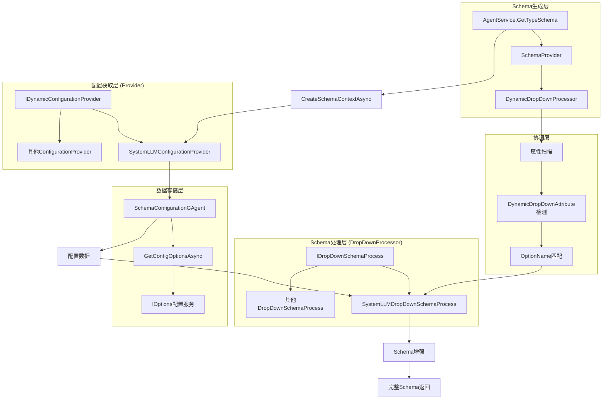

# 动态下拉菜单插件化架构实现方案

## 1. 方案概述

### 1.1 背景
当前系统实现了一个分离职责的插件化架构，将配置获取和Schema处理完全解耦，提供了灵活且可扩展的动态下拉菜单解决方案。

### 1.2 架构特点
- **职责分离**：配置获取与Schema处理完全分离
- **插件化设计**：通过接口实现，支持多种配置源和处理逻辑
- **类型安全**：使用泛型确保编译时类型检查
- **目录清晰**：按功能模块组织目录结构
- **字符串绑定**：通过OptionName实现松耦合关联

### 1.3 核心优势
- **开发效率高**：新增配置源只需实现接口并注册
- **扩展性强**：支持任意类型的配置源和处理逻辑
- **维护性好**：清晰的分层架构和目录结构
- **向后兼容**：不破坏现有功能

## 2. 技术架构

### 2.1 整体架构图



### 2.2 核心设计原则

1. **职责分离**：配置获取与Schema处理分离为独立层次
2. **字符串绑定**：通过OptionName实现组件间松耦合
3. **类型安全**：使用泛型确保编译时类型检查
4. **并发安全**：使用ConcurrentDictionary支持并发处理
5. **目录清晰**：按功能职责组织目录结构

## 3. 核心组件设计

### 3.1 基础接口层

#### IDynamicConfigurationProvider
```csharp
/// <summary>
/// 动态配置提供者接口 - 专门负责配置数据获取
/// </summary>
public interface IDynamicConfigurationProvider
{
    /// <summary>
    /// 处理配置获取并注入到并发字典中
    /// </summary>
    Task ProcessSchemaAsync(ConcurrentDictionary<string, object> concurrentData, IClusterClient clusterClient);
}
```

#### IDropDownSchemaProcess  
```csharp
/// <summary>
/// 下拉框Schema处理器接口 - 专门负责将配置数据注入到JSON Schema中
/// </summary>
public interface IDropDownSchemaProcess
{
    /// <summary>
    /// 配置名称，用于与DynamicDropDownAttribute的OptionName关联
    /// </summary>
    string OptionName { get; }
    
    /// <summary>
    /// 处理JSON Schema，将配置数据注入到属性schema中
    /// </summary>
    void ProcessSchema(JsonSchema propertySchema, PropertyInfo property, DynamicDropDownAttribute attribute, DynamicDropDownContext? context);
}
```

#### ISchemaConfigurationGAgent
```csharp
/// <summary>
/// Schema配置获取GAgent - 使用泛型支持任意类型配置获取
/// </summary>
public interface ISchemaConfigurationGAgent : IStateGAgent<SchemaConfigurationGAgentState>, IGrainWithStringKey
{
    /// <summary>
    /// 获取指定类型的配置选项
    /// </summary>
    Task<T> GetConfigOptionsAsync<T>() where T : class;
}
```

### 3.2 基类层

#### DynamicConfigurationProviderBase
```csharp
/// <summary>
/// 动态配置提供者抽象基类
/// </summary>
public abstract class DynamicConfigurationProviderBase : IDynamicConfigurationProvider
{
    public abstract Task ProcessSchemaAsync(ConcurrentDictionary<string, object> concurrentData, IClusterClient clusterClient);
}
```

#### DropDownSchemaProcessBase
```csharp
/// <summary>
/// 下拉框Schema处理器抽象基类
/// </summary>
public abstract class DropDownSchemaProcessBase : IDropDownSchemaProcess
{
    public abstract string OptionName { get; }
    public abstract void ProcessSchema(JsonSchema propertySchema, PropertyInfo property, DynamicDropDownAttribute attribute, DynamicDropDownContext? context);
}
```

### 3.3 数据传输层

#### DynamicDropDownContext
```csharp
/// <summary>
/// 动态下拉框上下文 - 承载配置数据
/// </summary>
[GenerateSerializer]
public class DynamicDropDownContext
{
    /// <summary>
    /// 附加数据字典，存储各种配置信息
    /// </summary>
    [Id(1)]
    public Dictionary<string, object> AdditionalData { get; set; } = new();
}
```

#### DynamicDropDownAttribute
```csharp
/// <summary>
/// 动态下拉框标记属性
/// </summary>
[AttributeUsage(AttributeTargets.Property, AllowMultiple = false)]
public class DynamicDropDownAttribute : Attribute
{
    public string OptionName { get; }
    
    public DynamicDropDownAttribute(string? optionName = "systemLLMConfig")
    {
        OptionName = optionName ?? "systemLLMConfig";
    }
}
```

### 3.4 协调器层

#### DynamicDropDownProcessor
```csharp
/// <summary>
/// DynamicDropDown处理器协调器 - 连接配置和Schema处理
/// </summary>
public class DynamicDropDownProcessor : NJsonSchema.Generation.ISchemaProcessor, ITransientDependency
{
    private readonly IEnumerable<IDropDownSchemaProcess> _schemaProcesses;
    private DynamicDropDownContext? _context;

    public DynamicDropDownProcessor(IEnumerable<IDropDownSchemaProcess> schemaProcesses)
    {
        _schemaProcesses = schemaProcesses;
    }

    /// <summary>
    /// 设置当前处理的上下文
    /// </summary>
    public void SetContext(DynamicDropDownContext? context)
    {
        _context = context;
    }

    public void Process(SchemaProcessorContext context)
    {
        // Skip null schemas or if no properties exist
        if (context.Schema?.Properties == null) return;

        // Check all properties for DynamicDropDown attribute
        if (context.ContextualType?.Type != null)
        {
            var type = context.ContextualType.Type;
            var properties = type.GetProperties(BindingFlags.Public | BindingFlags.Instance);
            
            foreach (var property in properties)
            {
                var dynamicDropDownAttribute = property.GetCustomAttribute<DynamicDropDownAttribute>();
                if (dynamicDropDownAttribute == null) continue;

                // 获取 OptionName
                var optionName = dynamicDropDownAttribute.OptionName;
                if (string.IsNullOrEmpty(optionName)) continue;

                // 根据 OptionName 找到对应的处理器
                var schemaProcess = _schemaProcesses.FirstOrDefault(p => p.OptionName == optionName);
                if (schemaProcess == null) continue;

                // 找到对应的属性Schema
                var propertySchema = FindPropertySchema(context.Schema, property);
                if (propertySchema == null) continue;

                // 调用对应的处理器进行Schema增强
                schemaProcess.ProcessSchema(propertySchema, property, dynamicDropDownAttribute, _context);
            }
        }
    }
}
```

## 4. 实现细节

### 4.1 目录结构

```
Aevatar.Application/
├── Provider/                           # 配置提供者层
│   ├── IDynamicConfigurationProvider.cs
│   ├── SystemLLMConfigurationProvider.cs
│   └── [其他ConfigurationProvider.cs]
├── Schema/
│   └── DropDownProcessor/             # Schema处理层
│       ├── IDropDownSchemaProcess.cs
│       ├── DynamicDropDownProcessor.cs
│       ├── SystemLLMDropDownSchemaProcess.cs
│       └── [其他DropDownSchemaProcess.cs]
└── Service/
    └── AgentService.cs                # 主要协调逻辑

Aevatar.Application.Grains/
└── Agents/Configuration/
    └── SchemaConfigurationGAgent.cs   # 配置获取GAgent

Aevatar.GAgents.Basic/Common/
└── DynamicDropDownAttribute.cs       # 标记属性
```

### 4.2 配置获取层实现

#### SystemLLMConfigurationProvider
```csharp
/// <summary>
/// SystemLLM配置提供者 - 从GAgent获取SystemLLM配置并提供给动态下拉框
/// </summary>
public class SystemLLMConfigurationProvider : DynamicConfigurationProviderBase, ITransientDependency
{
    private const string OPTION_NAME = "systemLLMConfig";

    public override async Task ProcessSchemaAsync(ConcurrentDictionary<string, object> concurrentData, IClusterClient clusterClient)
    {
        try
        {
            var grainId = Guid.NewGuid().ToString();
            var configurationGAgent = clusterClient.GetGrain<ISchemaConfigurationGAgent>(grainId);
            
            var systemLLMOptions = await configurationGAgent.GetConfigOptionsAsync<SystemLLMConfigOptions>();
            if (systemLLMOptions == null) return;

            var aiModelConfigs = ConvertToSystemLLMConfigDtos(systemLLMOptions);
            concurrentData[OPTION_NAME] = aiModelConfigs;
        }
        catch
        {
            return;
        }
    }
}
```

### 4.3 Schema处理层实现

#### SystemLLMDropDownSchemaProcess
```csharp
/// <summary>
/// SystemLLM下拉框Schema处理器 - 专门处理SystemLLM配置的Schema注入
/// </summary>
public class SystemLLMDropDownSchemaProcess : DropDownSchemaProcessBase, ITransientDependency
{
    private const string OPTION_NAME = "systemLLMConfig";

    public override string OptionName => OPTION_NAME;

    public override void ProcessSchema(JsonSchema propertySchema, PropertyInfo property, DynamicDropDownAttribute attribute, DynamicDropDownContext? context)
    {
        // 设置基本的Schema属性
        propertySchema.Type = NJsonSchema.JsonObjectType.String;
        propertySchema.Description = "The system LLM configuration to use for AI chat functionality";
        propertySchema.Default = "OpenAI";

        // 从context中获取SystemLLM配置并添加扩展数据
        if (context?.AdditionalData?.TryGetValue(OPTION_NAME, out var configsObj) == true &&
            configsObj is List<SystemLLMConfigDto> aiModelConfigs && 
            aiModelConfigs.Any())
        {
            // 确保Schema有ExtensionData
            if (propertySchema.ExtensionData == null)
                propertySchema.ExtensionData = new Dictionary<string, object>();

            // 注入配置到Schema扩展数据中
            var configObjectList = aiModelConfigs.Select(config => new
            {
                Name = config.Name,
                Provider = config.Provider,
                Type = config.Type,
                Strengths = config.Strengths ?? new List<string>(),
                BestFor = config.BestFor ?? new List<string>(),
                Speed = config.Speed ?? "Variable"
            }).ToList();

            propertySchema.ExtensionData["x-descriptions"] = configObjectList;
            propertySchema.ExtensionData["x-enumNames"] = aiModelConfigs.Select(c => c.Name).ToArray();
            propertySchema.ExtensionData["enum"] = aiModelConfigs.Select(c => c.Name).ToArray();
        }
    }
}
```

### 4.4 主要协调逻辑

#### AgentService.CreateSchemaContextAsync
```csharp
private async Task<DynamicDropDownContext> CreateSchemaContextAsync()
{
    try
    {
        var concurrentData = new ConcurrentDictionary<string, object>();
        var configurationProviders = _serviceProvider.GetServices<IDynamicConfigurationProvider>().ToList();
        
        if (!configurationProviders.Any())
        {
            throw new InvalidOperationException("Configuration provider plugin architecture not properly configured");
        }

        var processingTasks = configurationProviders.Select(async provider =>
        {
            try
            {
                await provider.ProcessSchemaAsync(concurrentData, _clusterClient);
            }
            catch (Exception ex)
            {
                _logger.LogError(ex, "Failed to process with provider: {ProviderType}", provider.GetType().Name);
            }
        });

        await Task.WhenAll(processingTasks);

        var context = new DynamicDropDownContext
        {
            AdditionalData = new Dictionary<string, object>(concurrentData)
        };

        return context;
    }
    catch (Exception ex)
    {
        _logger.LogError(ex, "Failed to create schema context using plugin architecture");
        throw;
    }
}
```

## 5. 开发者使用指南

### 5.1 实现新的配置处理器

#### 步骤1：定义配置选项类
```csharp
[GenerateSerializer]
public class DatabaseConfigOptions
{
    [Id(0)] public Dictionary<string, DatabaseConfig> DatabaseConfigs { get; set; } = new();
}

[GenerateSerializer]
public class DatabaseConfig
{
    [Id(0)] public string ConnectionString { get; set; } = string.Empty;
    [Id(1)] public string Provider { get; set; } = string.Empty;
    [Id(2)] public string DisplayName { get; set; } = string.Empty;
    [Id(3)] public bool IsDefault { get; set; }
    [Id(4)] public Dictionary<string, string> Metadata { get; set; } = new();
}
```

#### 步骤2：实现Schema处理器
```csharp
/// <summary>
/// 数据库配置Schema处理器
/// </summary>
public class DatabaseSchemaProcessor : SchemaProcessorBase<DatabaseConfigOptions>
{
    public override string OptionName => "DatabaseConfigs";

    protected override async Task ProcessDynamicDropDownAsync(
        JsonSchema schema, 
        PropertyInfo property, 
        DatabaseConfigOptions option, 
        SchemaProcessingContext context)
    {
        // 构建下拉选项
        var dropdownOptions = option.DatabaseConfigs.Select(db => new
        {
            value = db.Key,
            label = db.Value.DisplayName ?? db.Key,
            description = $"{db.Value.Provider} Database",
            isDefault = db.Value.IsDefault,
            metadata = db.Value.Metadata
        }).ToList();

        // 注入到Schema
        schema.ExtensionData["x-enumDatabases"] = dropdownOptions;
        schema.ExtensionData["x-defaultDatabase"] = dropdownOptions.FirstOrDefault(x => x.isDefault)?.value;
        
        // 可以添加验证规则
        if (property.GetCustomAttribute<RequiredAttribute>() != null)
        {
            schema.ExtensionData["x-required"] = true;
        }
    }

    protected override async Task ProcessCustomLogicAsync(
        JsonSchema schema, 
        PropertyInfo property, 
        DatabaseConfigOptions option, 
        SchemaProcessingContext context)
    {
        // 示例：添加数据库相关的额外验证
        if (property.Name.Contains("Database", StringComparison.OrdinalIgnoreCase))
        {
            // 获取其他相关配置进行组合处理
            var storageConfig = await context.GetOptionAsync<StorageConfigOptions>("StorageConfigs");
            
            if (storageConfig != null)
            {
                // 组合数据库和存储配置的处理逻辑
                var combinedInfo = new
                {
                    databases = option.DatabaseConfigs.Keys,
                    storages = storageConfig.StorageConfigs?.Keys ?? new List<string>(),
                    recommendations = GenerateRecommendations(option, storageConfig)
                };
                
                schema.ExtensionData["x-combinedStorageInfo"] = combinedInfo;
            }
        }
    }

    private List<string> GenerateRecommendations(DatabaseConfigOptions dbConfig, StorageConfigOptions storageConfig)
    {
        // 业务逻辑：根据数据库和存储配置生成推荐
        var recommendations = new List<string>();
        
        if (dbConfig.DatabaseConfigs.Any(db => db.Value.Provider == "MongoDB"))
        {
            recommendations.Add("Consider using GridFS for large file storage");
        }
        
        return recommendations;
    }
}
```

#### 步骤3：注册配置到Silo
```csharp
// 在Silo配置中
public void ConfigureServices(IServiceCollection services)
{
    // 注册数据库配置
    services.Configure<DatabaseConfigOptions>(options =>
    {
        options.DatabaseConfigs = new Dictionary<string, DatabaseConfig>
        {
            ["primary"] = new DatabaseConfig
            {
                ConnectionString = "mongodb://localhost:27017/primary",
                Provider = "MongoDB",
                DisplayName = "Primary Database",
                IsDefault = true,
                Metadata = new Dictionary<string, string> { ["region"] = "us-east-1" }
            },
            ["secondary"] = new DatabaseConfig
            {
                ConnectionString = "postgresql://localhost:5432/secondary",
                Provider = "PostgreSQL",
                DisplayName = "Secondary Database",
                IsDefault = false,
                Metadata = new Dictionary<string, string> { ["region"] = "us-west-2" }
            }
        };
    });
}
```

### 5.2 在DTO中使用

```csharp
public class MyGAgentConfiguration : ConfigurationBase
{
    [DynamicDropDown("SystemLLMConfigs")]
    [Required]
    [Description("选择AI模型")]
    public string SystemLLM { get; set; } = string.Empty;
    
    [DynamicDropDown("DatabaseConfigs")]
    [Required]
    [Description("选择数据库")]
    public string Database { get; set; } = string.Empty;
    
    [DynamicDropDown("StorageConfigs")]
    [Description("选择存储服务")]
    public string? Storage { get; set; }
}
```

### 5.3 高级使用场景

#### 条件处理器
```csharp
public class ConditionalProcessor : SchemaProcessorBase<MyConfigOptions>
{
    public override string OptionName => "MyConfigs";

    protected override async Task ProcessDynamicDropDownAsync(JsonSchema schema, PropertyInfo property, MyConfigOptions option, SchemaProcessingContext context)
    {
        // 根据属性名称进行不同处理
        switch (property.Name)
        {
            case "PrimaryConfig":
                ProcessPrimaryConfig(schema, option);
                break;
            case "SecondaryConfig":
                await ProcessSecondaryConfigAsync(schema, option, context);
                break;
        }
    }

    private void ProcessPrimaryConfig(JsonSchema schema, MyConfigOptions option)
    {
        // 主要配置的处理逻辑
        schema.ExtensionData["x-primaryOptions"] = option.PrimaryConfigs;
    }

    private async Task ProcessSecondaryConfigAsync(JsonSchema schema, MyConfigOptions option, SchemaProcessingContext context)
    {
        // 依赖其他配置的处理逻辑
        var dependentConfig = await context.GetOptionAsync<DependentConfigOptions>("DependentConfigs");
        
        var filteredOptions = option.SecondaryConfigs
            .Where(config => IsCompatible(config, dependentConfig))
            .ToList();
            
        schema.ExtensionData["x-secondaryOptions"] = filteredOptions;
    }
}
```

## 6. 系统集成

### 6.1 依赖注入配置

```csharp
public class ApplicationModule : AbpModule
{
    public override void ConfigureServices(ServiceConfigurationContext context)
    {
        var services = context.Services;
        
        // 注册处理器注册中心
        services.AddSingleton<SchemaProcessorRegistry>();
        
        // 注册增强的Schema提供者
        services.AddSingleton<ISchemaProvider, EnhancedSchemaProvider>();
        
        // 自动注册所有Schema处理器
        var processorRegistry = new SchemaProcessorRegistry(
            services.BuildServiceProvider().GetRequiredService<ILogger<SchemaProcessorRegistry>>()
        );
        processorRegistry.RegisterProcessors(services);
        
        // 注册其他必要的服务
        services.AddSingleton<IGAgentFactory, GAgentFactory>();
    }
}
```