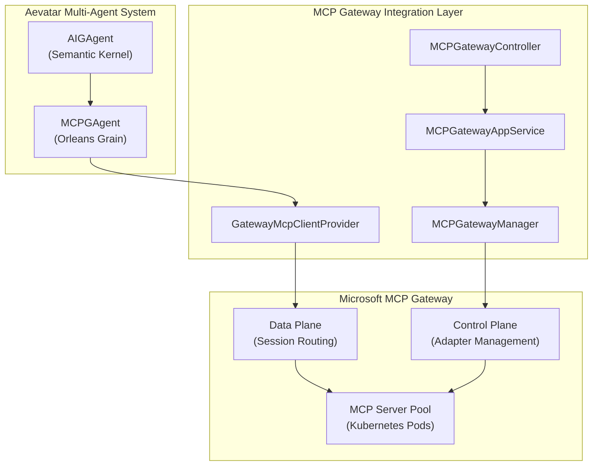
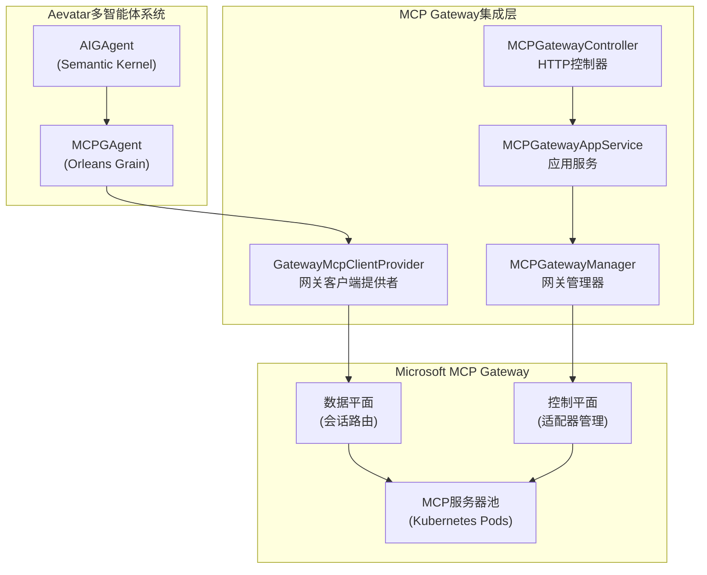

# MCP Gateway Integration Architecture Overview

## English Documentation

### Overview

The Aevatar MCP Gateway Integration provides a scalable, enterprise-ready solution for managing Model Context Protocol (MCP) servers through Microsoft's MCP Gateway. This integration transforms the traditional direct connection model into a centralized gateway architecture with session-aware routing and comprehensive management capabilities.

### Architecture Components

#### 1. **Core Components**



#### 2. **Connection Flow**

**Priority-based Connection Strategy:**
1. **Gateway Connection** (Primary) - If `UseGateway=true` and `GatewayAdapterName` is configured
2. **Direct SSE Connection** (Fallback) - If URL is provided
3. **Direct Stdio Connection** (Fallback) - For local development

#### 3. **State Management**

The system uses Orleans Event Sourcing to track connection states:

```csharp
public class MCPGAgentState : MemberState
{
    public MCPServerConfig MCPServerConfig { get; set; }
    public string? SessionId { get; set; }
    public string? GatewayAdapterName { get; set; }
    public string ConnectionType { get; set; } = "Direct";
    public DateTime? LastConnected { get; set; }
    public int RetryCount { get; set; } = 0;
    public string? LastConnectionError { get; set; }
}
```

#### 4. **Permission System**

Granular permission control for MCP Gateway operations:

- **Adapter Management**: Create, Read, Update, Delete
- **Monitoring**: View Metrics, View Logs, Test Connection
- **Gateway Management**: View Health, View Configuration
- **Session Management**: View Sessions, Terminate Sessions

### Key Features

#### **Session-Aware Routing**
- Automatic session ID generation and tracking
- Consistent routing to the same MCP server instance
- Session persistence across requests

#### **Intelligent Connection Management**
- Gateway-first connection strategy with graceful fallback
- Automatic retry mechanism with configurable parameters
- Connection health monitoring and error recovery

#### **Enterprise-Ready Management**
- RESTful API for adapter lifecycle management
- Comprehensive monitoring and logging
- Role-based access control with fine-grained permissions

#### **Backward Compatibility**
- Maintains support for direct connections
- Seamless migration from existing configurations
- Zero-downtime deployment capability

### Benefits

1. **Scalability**: Dynamic scaling of MCP servers in Kubernetes
2. **Reliability**: Session affinity and automatic failover
3. **Security**: Centralized authentication and authorization
4. **Observability**: Comprehensive monitoring and logging
5. **Management**: Unified control plane for all MCP resources

---

## 中文文档

### 概述

Aevatar MCP Gateway集成提供了一个可扩展的、企业级的解决方案，通过Microsoft的MCP Gateway来管理模型上下文协议(MCP)服务器。此集成将传统的直连模型转换为具有会话感知路由和全面管理功能的集中式网关架构。

### 架构组件

#### 1. **核心组件**



#### 2. **连接流程**

**基于优先级的连接策略：**
1. **网关连接**（主要）- 当`UseGateway=true`且配置了`GatewayAdapterName`时
2. **直连SSE连接**（备用）- 当提供URL时
3. **直连Stdio连接**（备用）- 用于本地开发

#### 3. **状态管理**

系统使用Orleans事件溯源来跟踪连接状态：

```csharp
public class MCPGAgentState : MemberState
{
    public MCPServerConfig MCPServerConfig { get; set; }    // MCP服务器配置
    public string? SessionId { get; set; }                 // 会话ID
    public string? GatewayAdapterName { get; set; }         // 网关适配器名称
    public string ConnectionType { get; set; } = "Direct"; // 连接类型
    public DateTime? LastConnected { get; set; }           // 最后连接时间
    public int RetryCount { get; set; } = 0;              // 重试次数
    public string? LastConnectionError { get; set; }       // 最后连接错误
}
```

#### 4. **权限系统**

MCP Gateway操作的细粒度权限控制：

- **适配器管理**: 创建、读取、更新、删除
- **监控功能**: 查看指标、查看日志、测试连接
- **网关管理**: 查看健康状态、查看配置
- **会话管理**: 查看会话、终止会话

### 核心特性

#### **会话感知路由**
- 自动会话ID生成和跟踪
- 一致路由到同一MCP服务器实例
- 跨请求的会话持久化

#### **智能连接管理**
- 网关优先连接策略，优雅降级
- 具有可配置参数的自动重试机制
- 连接健康监控和错误恢复

#### **企业级管理**
- 适配器生命周期管理的RESTful API
- 全面的监控和日志记录
- 基于角色的访问控制，具有细粒度权限

#### **向后兼容性**
- 维持对直连的支持
- 从现有配置无缝迁移
- 零停机部署能力

### 优势

1. **可扩展性**: Kubernetes中MCP服务器的动态扩展
2. **可靠性**: 会话亲和性和自动故障转移
3. **安全性**: 集中式身份验证和授权
4. **可观测性**: 全面的监控和日志记录
5. **管理性**: 所有MCP资源的统一控制平面
