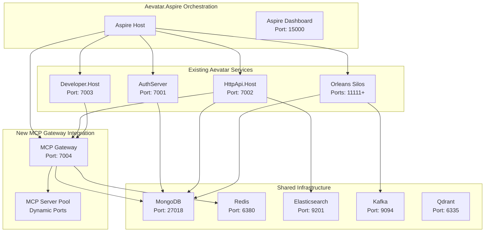

# MCP Gateway Aspire Integration Proposal

## English Documentation

### Overview

This proposal outlines how to integrate [Microsoft MCP Gateway](https://github.com/microsoft/mcp-gateway) into the existing Aevatar.Aspire orchestration platform, enabling seamless MCP server management within the Aevatar ecosystem.

### Integration Architecture



### Implementation Plan

#### Phase 1: Basic Integration

1. **Add MCP Gateway as Aspire Service**
```csharp
// Add to Aevatar.Aspire/Program.cs
var mcpGateway = builder.AddProject("mcp-gateway", "../Aevatar.MCPGateway/Aevatar.MCPGateway.csproj")
    .WithReference(mongodb)
    .WithReference(redis)
    .WaitFor(mongodb)
    .WaitFor(redis)
    .WithEnvironment("ASPNETCORE_ENVIRONMENT", "Development")
    .WithEnvironment("MongoDB__ConnectionString", "{mongodb.connectionString}")
    .WithEnvironment("Redis__Configuration", "{redis.connectionString}")
    .WithEnvironment("MCPGateway__EnableSessionAffinity", "true")
    .WithEnvironment("MCPGateway__RequestTimeout", "00:01:00")
    .WithEnvironment("MCPGateway__MaxRetryAttempts", "3")
    .WithEnvironment("MCPGateway__EnableDetailedLogging", "true")
    .WithHttpEndpoint(port: 7004, name: "mcp-gateway-http");
```

2. **Update Existing Services to Reference MCP Gateway**
```csharp
// Update HttpApi.Host to include MCP Gateway reference
var httpApiHost = builder.AddProject("httpapi", "../Aevatar.HttpApi.Host/Aevatar.HttpApi.Host.csproj")
    .WithReference(mcpGateway)
    .WithEnvironment("MCPGateway__GatewayBaseUrl", "http://localhost:7004")
    .WithEnvironment("MCPGateway__AuthToken", "Bearer aspire-dev-token")
    // ... existing configuration
```

#### Phase 2: MCP Server Integration

3. **Add Example MCP Servers**
```csharp
// Add filesystem MCP server
var mcpFilesystem = builder.AddContainer("mcp-filesystem", "localhost:5000/mcp-filesystem:1.0.0")
    .WithHttpEndpoint(port: 3001, targetPort: 3000, name: "filesystem-mcp")
    .WithEnvironment("MCP_SERVER_NAME", "filesystem")
    .WithEnvironment("WORKSPACE_PATH", "/workspace")
    .WithBindMount("./workspace", "/workspace");

// Add SQLite MCP server  
var mcpSqlite = builder.AddContainer("mcp-sqlite", "localhost:5000/mcp-sqlite:1.0.0")
    .WithHttpEndpoint(port: 3002, targetPort: 3000, name: "sqlite-mcp")
    .WithEnvironment("MCP_SERVER_NAME", "sqlite")
    .WithEnvironment("DATABASE_PATH", "/data/sqlite.db")
    .WithBindMount("./data", "/data");
```

#### Phase 3: Service Discovery Integration

4. **Configure Service Discovery**
```csharp
// Configure MCP Gateway to auto-register MCP servers
var mcpGateway = builder.AddProject("mcp-gateway", "../Aevatar.MCPGateway/Aevatar.MCPGateway.csproj")
    .WithReference(mcpFilesystem)
    .WithReference(mcpSqlite)
    .WithEnvironment("MCPGateway__AutoDiscovery__Enabled", "true")
    .WithEnvironment("MCPGateway__AutoDiscovery__Services", "filesystem-mcp,sqlite-mcp")
    // ... other configuration
```

### Configuration Updates Required

#### 1. **appsettings.json Enhancement**
```json
{
  "DockerMongoConfig": { /* existing */ },
  "DockerRedisConfig": { /* existing */ },
  "MCPGatewayConfig": {
    "port": 7004,
    "enableAutoDiscovery": true,
    "defaultTimeout": "00:01:00",
    "enableSessionAffinity": true
  },
  "MCPServersConfig": {
    "filesystem": {
      "port": 3001,
      "image": "localhost:5000/mcp-filesystem:1.0.0",
      "enabled": true
    },
    "sqlite": {
      "port": 3002,
      "image": "localhost:5000/mcp-sqlite:1.0.0",
      "enabled": true
    }
  }
}
```

#### 2. **Project Dependencies**
Add to `Aevatar.Aspire.csproj`:
```xml
<ItemGroup>
  <ProjectReference Include="..\Aevatar.MCPGateway\Aevatar.MCPGateway.csproj" />
</ItemGroup>
```

### Benefits of Aspire Integration

#### **Development Experience**
- **Unified Dashboard**: All services visible in Aspire Dashboard
- **Simplified Startup**: Single `dotnet run` command starts entire ecosystem
- **Automatic Service Discovery**: Services automatically find each other
- **Integrated Logging**: Centralized log viewing across all services

#### **Operational Advantages**
- **Health Monitoring**: Built-in health checks for all components
- **Telemetry Integration**: Automatic OpenTelemetry collection
- **Resource Management**: Aspire handles resource lifecycle
- **Environment Consistency**: Same configuration across dev/staging/prod

#### **MCP-Specific Benefits**
- **Session Affinity**: Redis-backed session management
- **Scalability**: Easy horizontal scaling of MCP servers
- **Monitoring**: Real-time metrics and logging
- **Service Mesh**: Integrated communication patterns

### Implementation Steps

1. **Create MCP Gateway Project**
```bash
cd station/src
dotnet new webapi -n Aevatar.MCPGateway
# Implement MCP Gateway wrapper service
```

2. **Update Aspire Host**
```bash
cd station/src/Aevatar.Aspire
# Modify Program.cs to include MCP Gateway
```

3. **Add MCP Server Images**
```bash
# Build and tag MCP server images
docker build -f mcp-servers/filesystem/Dockerfile -t localhost:5000/mcp-filesystem:1.0.0 .
docker build -f mcp-servers/sqlite/Dockerfile -t localhost:5000/mcp-sqlite:1.0.0 .
```

4. **Test Integration**
```bash
cd station/src/Aevatar.Aspire
dotnet run
# Verify all services start correctly
```

### Sample Aspire Configuration

```csharp
public class Program
{
    public static async Task<int> Main(string[] args)
    {
        var builder = DistributedApplication.CreateBuilder(args);
        
        // Existing infrastructure
        var mongodb = builder.AddMongoDB("mongodb", 27018);
        var redis = builder.AddRedis("redis", 6380);
        var elasticsearch = builder.AddElasticsearch("elasticsearch", 9201);
        
        // Add MCP Gateway
        var mcpGateway = builder.AddProject("mcp-gateway", "../Aevatar.MCPGateway/Aevatar.MCPGateway.csproj")
            .WithReference(mongodb)
            .WithReference(redis)
            .WithEnvironment("MCPGateway__GatewayBaseUrl", "http://localhost:7004")
            .WithHttpEndpoint(port: 7004, name: "mcp-gateway-http");
        
        // Add MCP Servers
        var mcpFilesystem = builder.AddContainer("mcp-filesystem", "localhost:5000/mcp-filesystem:1.0.0")
            .WithHttpEndpoint(port: 3001, name: "filesystem-mcp");
            
        // Update existing services to reference MCP Gateway
        var httpApiHost = builder.AddProject("httpapi", "../Aevatar.HttpApi.Host/Aevatar.HttpApi.Host.csproj")
            .WithReference(mcpGateway)
            .WithEnvironment("MCPGateway__GatewayBaseUrl", "http://localhost:7004")
            .WithHttpEndpoint(port: 7002, name: "httpapi-http");
        
        var app = builder.Build();
        app.Run();
        
        return 0;
    }
}
```

---

## 中文文档

### 概述

本提案概述了如何将[Microsoft MCP Gateway](https://github.com/microsoft/mcp-gateway)集成到现有的Aevatar.Aspire编排平台中，在Aevatar生态系统内实现无缝的MCP服务器管理。

### 集成优势

#### **开发体验**
- **统一仪表板**: 所有服务在Aspire仪表板中可见
- **简化启动**: 单个`dotnet run`命令启动整个生态系统
- **自动服务发现**: 服务自动相互发现
- **集成日志**: 跨所有服务的集中日志查看

#### **运维优势**
- **健康监控**: 所有组件的内置健康检查
- **遥测集成**: 自动OpenTelemetry收集
- **资源管理**: Aspire处理资源生命周期
- **环境一致性**: 开发/预发/生产环境配置一致

#### **MCP特定优势**
- **会话亲和性**: 基于Redis的会话管理
- **可扩展性**: MCP服务器的简易水平扩展
- **监控**: 实时指标和日志记录
- **服务网格**: 集成的通信模式

### 实施建议

鉴于现有的Aevatar.Aspire架构已经非常成熟，建议采用**渐进式集成**方式：

1. **第一阶段**: 将MCP Gateway作为新的Aspire服务添加
2. **第二阶段**: 集成现有的MCPGAgent与Gateway的连接
3. **第三阶段**: 添加MCP服务器的动态管理和扩展

这种方式可以充分利用现有的基础设施投资，同时为MCP功能提供企业级的编排和管理能力。

### 技术优势

通过Aspire集成MCP Gateway，可以实现：
- **统一的服务生命周期管理**
- **自动化的依赖注入和配置**
- **企业级的监控和可观测性**
- **开发环境的一致性和可重复性**

这将使Aevatar平台成为业界领先的MCP服务器管理和编排解决方案。
