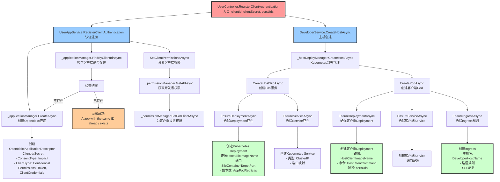
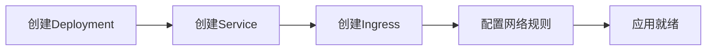

# RegisterClientAuthentication 方法调用链路分析

## 📋 目录

1. [概述](#概述)
2. [方法签名和参数](#方法签名和参数)
3. [调用链路流程图](#调用链路流程图)
4. [详细调用分析](#详细调用分析)
   - [4.1 认证注册分支](#41-认证注册分支)
   - [4.2 主机部署分支](#42-主机部署分支)
5. [底层基础设施](#底层基础设施)
6. [安全与权限](#安全与权限)
7. [错误处理](#错误处理)
8. [相关配置](#相关配置)
9. [代码引用](#代码引用)

## 🎯 概述

`RegisterClientAuthentication` 是Aevatar系统中的核心方法，负责完成客户端应用的完整注册流程。该方法集成了**OAuth认证注册**和**Kubernetes主机环境部署**两个关键功能，为新客户端提供从认证到运行环境的一站式服务。

### 核心功能
- **认证管理**：基于OpenIddict框架创建OAuth客户端应用
- **权限分配**：自动为客户端分配开发者权限
- **环境部署**：在Kubernetes集群中部署客户端运行环境
- **资源编排**：自动创建必要的容器、服务和网络资源

## 📝 方法签名和参数

```csharp
[HttpPost("registerClient")]
[Authorize(Policy = AevatarPermissions.AdminPolicy)]
public async Task RegisterClientAuthentication(string clientId, string clientSecret, string corsUrls)
```

### 参数说明

| 参数 | 类型 | 描述 |
|------|------|------|
| `clientId` | string | 客户端唯一标识符，用于OAuth认证和资源命名 |
| `clientSecret` | string | 客户端密钥，用于安全认证 |
| `corsUrls` | string | 跨域资源共享(CORS)允许的URL列表 |

### 授权要求
- **授权策略**：`AevatarPermissions.AdminPolicy`
- **权限级别**：仅管理员可执行此操作

## 🔄 调用链路流程图



## 🔍 详细调用分析

### 4.1 认证注册分支

#### 4.1.1 调用入口
```csharp
await _userAppService.RegisterClientAuthentication(clientId, clientSecret);
```

#### 4.1.2 执行流程

**步骤1：检查客户端唯一性**
```csharp
if (await _applicationManager.FindByClientIdAsync(clientId) != null)
{
    throw new UserFriendlyException("A app with the same ID already exists.");
}
```
- 通过OpenIddict应用管理器查询现有客户端
- 确保clientId的全局唯一性
- 防止重复注册导致的冲突

**步骤2：创建OpenIddict应用描述符**
```csharp
var openIddictApplicationDescriptor = new OpenIddictApplicationDescriptor
{
    ClientId = clientId,
    ClientSecret = clientSecret,
    ConsentType = OpenIddictConstants.ConsentTypes.Implicit,
    ClientType = OpenIddictConstants.ClientTypes.Confidential,
    DisplayName = "Aevatar Client",
    Permissions = {
        OpenIddictConstants.Permissions.Endpoints.Token,
        OpenIddictConstants.Permissions.GrantTypes.ClientCredentials,
        OpenIddictConstants.Permissions.Prefixes.Scope + "Aevatar",
        OpenIddictConstants.Permissions.ResponseTypes.IdToken
    }
};
```

**关键配置说明**：
- **ClientType.Confidential**：机密客户端，需要客户端密钥
- **ConsentType.Implicit**：隐式同意类型
- **GrantTypes.ClientCredentials**：支持客户端凭据授权流
- **Scope "Aevatar"**：限定访问范围

**步骤3：设置客户端权限**
```csharp
await SetClientPermissionsAsync(clientId);
```

详细权限分配过程：
```csharp
private async Task SetClientPermissionsAsync(string clientId)
{
    var permissions = await _permissionManager.GetAllAsync(
        RolePermissionValueProvider.ProviderName, 
        AevatarPermissions.DeveloperManager);

    foreach (var permission in permissions)
    {
        if (permission.IsGranted)
        {
            await _permissionManager.SetForClientAsync(clientId, permission.Name, true);
        }
    }
}
```

**步骤4：创建应用**
```csharp
await _applicationManager.CreateAsync(openIddictApplicationDescriptor);
```

### 4.2 主机部署分支

#### 4.2.1 调用入口
```csharp
await _developerService.CreateHostAsync(clientId, "1", corsUrls);
```

#### 4.2.2 服务层调用
```csharp
public async Task CreateHostAsync(string HostId, string version, string corsUrls)
{
    await _hostDeployManager.CreateHostAsync(HostId, version, corsUrls);
}
```

#### 4.2.3 Kubernetes部署管理

**主机创建流程**：
```csharp
public async Task<string> CreateHostAsync(string appId, string version, string corsUrls)
{
    await CreateHostSiloAsync(GetHostName(appId, KubernetesConstants.HostSilo), version,
        _HostDeployOptions.HostSiloImageName,
        GetHostSiloConfigContent(appId, version, KubernetesConstants.HostSiloSettingTemplateFilePath));
        
    await CreatePodAsync(GetHostName(appId, KubernetesConstants.HostClient), version,
        _HostDeployOptions.HostClientImageName,
        GetHostClientConfigContent(appId, version, KubernetesConstants.HostClientSettingTemplateFilePath, corsUrls),
        KubernetesConstants.HostClientCommand, _kubernetesOptions.DeveloperHostName);
        
    return "";
}
```

## 🏗️ 底层基础设施

### 5.1 Kubernetes资源架构

#### 5.1.1 HostSilo部署
- **功能**：Orleans集群的Silo节点，处理业务逻辑
- **资源类型**：Deployment + Service
- **镜像**：`HostSiloImageName`
- **端口**：`SiloContainerTargetPort`

#### 5.1.2 HostClient部署
- **功能**：面向用户的HTTP API服务
- **资源类型**：Deployment + Service + Ingress
- **镜像**：`HostClientImageName`
- **网络**：支持CORS配置和外部访问

### 5.2 资源创建流程



#### 5.2.1 Deployment资源
```yaml
apiVersion: apps/v1
kind: Deployment
metadata:
  name: {clientId}-host-client
  namespace: app
spec:
  replicas: {AppPodReplicas}
  selector:
    matchLabels:
      app: {clientId}-host-client
  template:
    spec:
      containers:
      - name: host-client
        image: {HostClientImageName}
        ports:
        - containerPort: 80
```

#### 5.2.2 Service资源
```yaml
apiVersion: v1
kind: Service
metadata:
  name: {clientId}-host-client-service
  namespace: app
spec:
  type: ClusterIP
  ports:
  - port: 80
    targetPort: 80
  selector:
    app: {clientId}-host-client
```

#### 5.2.3 Ingress资源
```yaml
apiVersion: networking.k8s.io/v1
kind: Ingress
metadata:
  name: {clientId}-host-client-ingress
  namespace: app
spec:
  rules:
  - host: {DeveloperHostName}
    http:
      paths:
      - path: /{clientId}
        pathType: Prefix
        backend:
          service:
            name: {clientId}-host-client-service
            port:
              number: 80
```

## 🔐 安全与权限

### 6.1 访问控制
- **控制器级别**：`[Authorize(Policy = AevatarPermissions.AdminPolicy)]`
- **方法级别**：仅管理员用户可执行
- **OAuth范围**：限定在"Aevatar"作用域内

### 6.2 客户端认证
- **认证类型**：Confidential Client（机密客户端）
- **授权流程**：Client Credentials Grant
- **令牌类型**：JWT Bearer Token
- **作用域限制**：仅限Aevatar API访问

### 6.3 网络安全
- **CORS策略**：严格控制跨域访问
- **Ingress规则**：基于路径的流量路由
- **集群网络**：内部服务通过ClusterIP通信

## ⚠️ 错误处理

### 7.1 常见异常

| 异常类型 | 触发条件 | 错误消息 |
|----------|----------|----------|
| `UserFriendlyException` | 客户端ID已存在 | "A app with the same ID already exists." |
| `BusinessException` | Kubernetes资源创建失败 | 具体的Kubernetes API错误信息 |
| `UnauthorizedAccessException` | 权限不足 | 系统默认权限错误消息 |

### 7.2 事务处理
- **OpenIddict操作**：支持数据库事务回滚
- **Kubernetes操作**：需要手动清理已创建的资源
- **权限设置**：通过权限管理器确保一致性

## ⚙️ 相关配置

### 8.1 OpenIddict配置
```json
{
  "OpenIddict": {
    "Applications": {
      "Aevatar_Swagger": {
        "ClientId": "swagger-client",
        "RootUrl": "https://api.aevatar.io"
      }
    }
  }
}
```

### 8.2 Kubernetes配置
```json
{
  "Kubernetes": {
    "WebhookHostName": "webhook.aevatar.io",
    "DeveloperHostName": "developer.aevatar.io",
    "AppPodReplicas": 1
  }
}
```

### 8.3 主机部署配置
```json
{
  "HostDeploy": {
    "HostSiloImageName": "aevatar/host-silo:latest",
    "HostClientImageName": "aevatar/host-client:latest"
  }
}
```

## 📄 代码引用

### 9.1 控制器方法
**文件路径**：`src/Aevatar.HttpApi.Admin/Controllers/UserController.cs`
```csharp
[HttpPost("registerClient")]
[Authorize(Policy = AevatarPermissions.AdminPolicy)]
public async Task RegisterClientAuthentication(string clientId, string clientSecret, string corsUrls)
{
    await _userAppService.RegisterClientAuthentication(clientId, clientSecret);
    await _developerService.CreateHostAsync(clientId, "1", corsUrls);
}
```

### 9.2 用户应用服务
**文件路径**：`src/Aevatar.Application/Service/UserAppService.cs`
```csharp
public async Task RegisterClientAuthentication(string clientId, string clientSecret)
{
    if (await _applicationManager.FindByClientIdAsync(clientId) != null)
    {
        throw new UserFriendlyException("A app with the same ID already exists.");
    }

    var openIddictApplicationDescriptor = new OpenIddictApplicationDescriptor
    {
        ClientId = clientId,
        ClientSecret = clientSecret,
        ConsentType = OpenIddictConstants.ConsentTypes.Implicit,
        ClientType = OpenIddictConstants.ClientTypes.Confidential,
        DisplayName = "Aevatar Client",
        Permissions = {
            OpenIddictConstants.Permissions.Endpoints.Token,
            OpenIddictConstants.Permissions.GrantTypes.ClientCredentials,
            OpenIddictConstants.Permissions.Prefixes.Scope + "Aevatar",
            OpenIddictConstants.Permissions.ResponseTypes.IdToken
        }
    };
    
    await SetClientPermissionsAsync(clientId);
    await _applicationManager.CreateAsync(openIddictApplicationDescriptor);
}
```

### 9.3 开发者服务
**文件路径**：`src/Aevatar.Application/Service/DeveloperService.cs`
```csharp
public async Task CreateHostAsync(string HostId, string version, string corsUrls)
{
    await _hostDeployManager.CreateHostAsync(HostId, version, corsUrls);
}
```

### 9.4 Kubernetes主机管理器
**文件路径**：`src/Aevatar.Kubernetes/Manager/KubernetesHostManager.cs`
```csharp
public async Task<string> CreateHostAsync(string appId, string version, string corsUrls)
{
    await CreateHostSiloAsync(GetHostName(appId, KubernetesConstants.HostSilo), version,
        _HostDeployOptions.HostSiloImageName,
        GetHostSiloConfigContent(appId, version, KubernetesConstants.HostSiloSettingTemplateFilePath));
        
    await CreatePodAsync(GetHostName(appId, KubernetesConstants.HostClient), version,
        _HostDeployOptions.HostClientImageName,
        GetHostClientConfigContent(appId, version, KubernetesConstants.HostClientSettingTemplateFilePath, corsUrls),
        KubernetesConstants.HostClientCommand, _kubernetesOptions.DeveloperHostName);
        
    return "";
}
```

---

## 📚 总结

`RegisterClientAuthentication` 方法是Aevatar系统中的核心基础设施方法，它巧妙地将OAuth认证管理与云原生部署相结合，为客户端应用提供了从认证到运行环境的完整生命周期管理。

**核心价值**：
1. **一站式服务**：单一API调用完成认证注册和环境部署
2. **云原生架构**：基于Kubernetes的弹性和可扩展部署
3. **安全性设计**：多层次的权限控制和访问管理
4. **微服务架构**：清晰的服务分层和职责分离

**技术亮点**：
- OpenIddict集成提供标准OAuth2.0/OIDC支持
- Orleans框架实现高性能分布式计算
- Kubernetes原生支持云环境部署
- 事务性操作确保数据一致性

该方法体现了现代云原生应用架构的最佳实践，是身份认证与基础设施即代码(IaC)完美融合的典型示例。

---

**文档版本**：v1.0  
**最后更新**：2024年12月  
**维护者**：Aevatar开发团队 