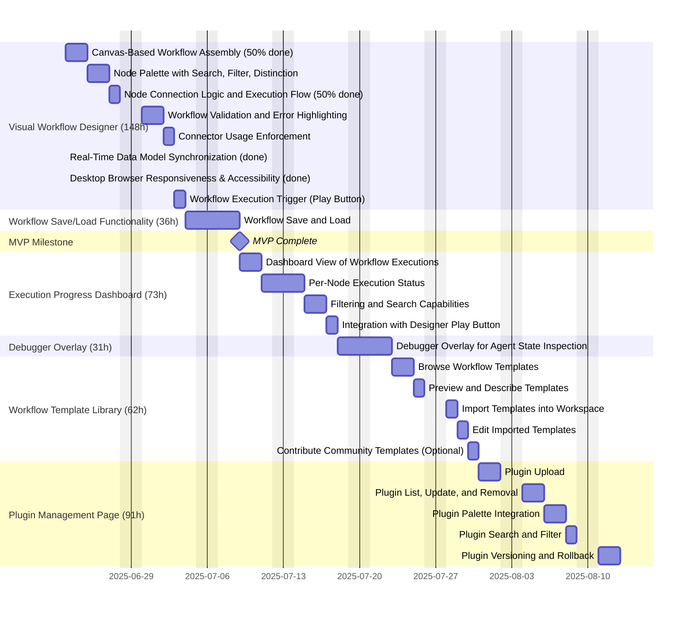

```mermaid
gantt
dateFormat  YYYY-MM-DD
excludes    weekends

section Visual Workflow Designer (148h)
Canvas-Based Workflow Assembly (50% done)           :a1, 2025-06-23, 1.5d
Node Palette with Search, Filter, Distinction       :a2, after a1, 2d
Node Connection Logic and Execution Flow (50% done) :a3, after a2, 1.25d
Workflow Validation and Error Highlighting          :a4, after a3, 1.5d
Connector Usage Enforcement                        :a5, after a4, 1d
Real-Time Data Model Synchronization (done)         :done, 2025-06-23, 0d
Desktop Browser Responsiveness & Accessibility (done):done, 2025-06-23, 0d
Workflow Execution Trigger (Play Button)            :a8, after a5, 1d

section Workflow Save/Load Functionality (36h)
Workflow Save and Load                             :b1, after a8, 3d

section MVP Milestone
MVP Complete                                       :milestone, mvp, after b1, 0d

section Execution Progress Dashboard (73h)
Dashboard View of Workflow Executions               :c1, after mvp, 2d
Per-Node Execution Status                           :c2, after c1, 2d
Filtering and Search Capabilities                   :c3, after c2, 1.5d
Integration with Designer Play Button               :c4, after c3, 1d

section Debugger Overlay (31h)
Debugger Overlay for Agent State Inspection         :d1, after c4, 2.5d

section Workflow Template Library (62h)
Browse Workflow Templates                           :e1, after d1, 1.5d
Preview and Describe Templates                      :e2, after e1, 1d
Import Templates into Workspace                     :e3, after e2, 1d
Edit Imported Templates                             :e4, after e3, 1d
Contribute Community Templates (Optional)           :e5, after e4, 1d

section Plugin Management Page (91h)
Plugin Upload                                       :f1, after e5, 2d
Plugin List, Update, and Removal                    :f2, after f1, 2d
Plugin Palette Integration                          :f3, after f2, 1.5d
Plugin Search and Filter                            :f4, after f3, 1d
Plugin Versioning and Rollback                      :f5, after f4, 1.5d
``` 