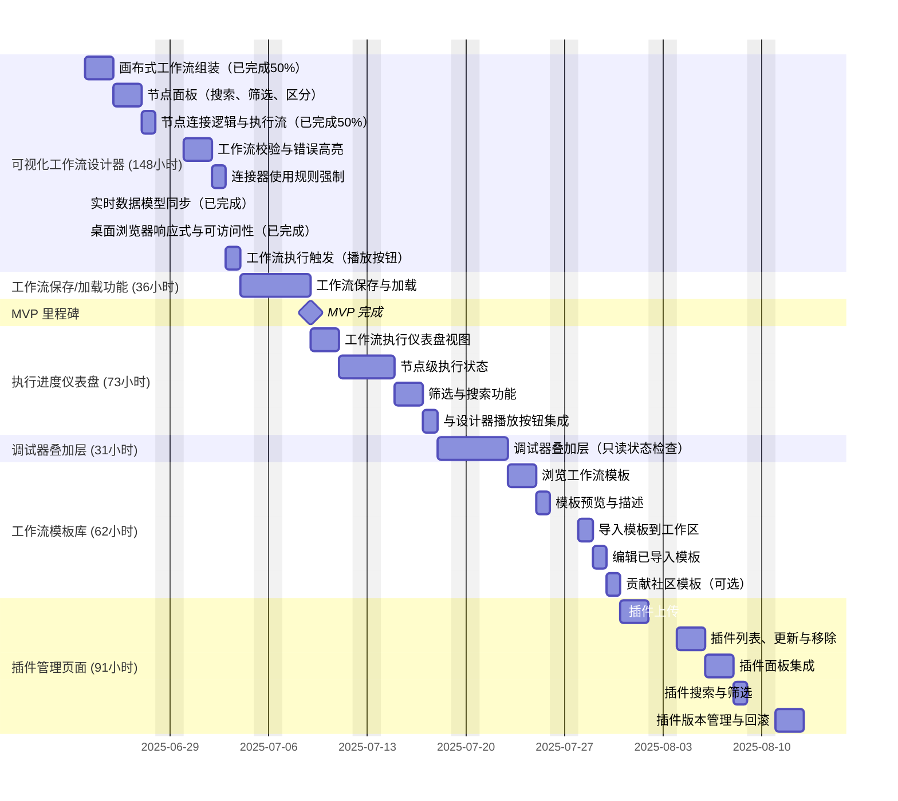

```mermaid
gantt
dateFormat  YYYY-MM-DD
excludes    weekends

section 可视化工作流设计器 (148小时)
画布式工作流组装（已完成50%）           :a1, 2025-06-23, 1.5d
节点面板（搜索、筛选、区分）              :a2, after a1, 2d
节点连接逻辑与执行流（已完成50%）         :a3, after a2, 1.25d
工作流校验与错误高亮                      :a4, after a3, 1.5d
连接器使用规则强制                        :a5, after a4, 1d
实时数据模型同步（已完成）                 :done, 2025-06-23, 0d
桌面浏览器响应式与可访问性（已完成）        :done, 2025-06-23, 0d
工作流执行触发（播放按钮）                 :a8, after a5, 1d

section 工作流保存/加载功能 (36小时)
工作流保存与加载                          :b1, after a8, 3d

section MVP 里程碑
MVP 完成                                   :milestone, mvp, after b1, 0d

section 执行进度仪表盘 (73小时)
工作流执行仪表盘视图                       :c1, after mvp, 2d
节点级执行状态                             :c2, after c1, 2d
筛选与搜索功能                             :c3, after c2, 1.5d
与设计器播放按钮集成                        :c4, after c3, 1d

section 调试器叠加层 (31小时)
调试器叠加层（只读状态检查）                :d1, after c4, 2.5d

section 工作流模板库 (62小时)
浏览工作流模板                             :e1, after d1, 1.5d
模板预览与描述                             :e2, after e1, 1d
导入模板到工作区                           :e3, after e2, 1d
编辑已导入模板                             :e4, after e3, 1d
贡献社区模板（可选）                        :e5, after e4, 1d

section 插件管理页面 (91小时)
插件上传                                   :f1, after e5, 2d
插件列表、更新与移除                        :f2, after f1, 2d
插件面板集成                               :f3, after f2, 1.5d
插件搜索与筛选                              :f4, after f3, 1d
插件版本管理与回滚                          :f5, after f4, 1.5d
``` 