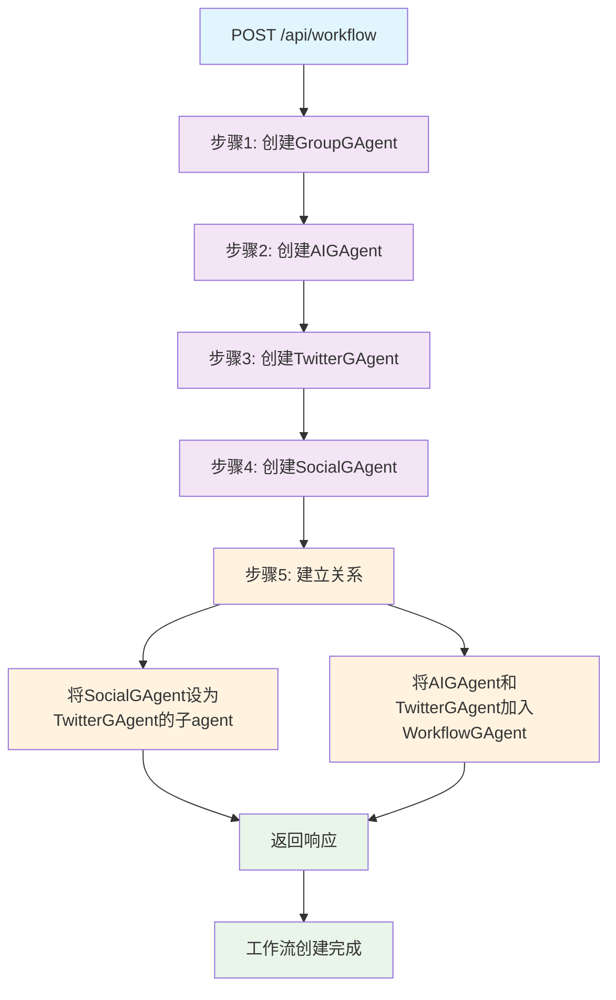
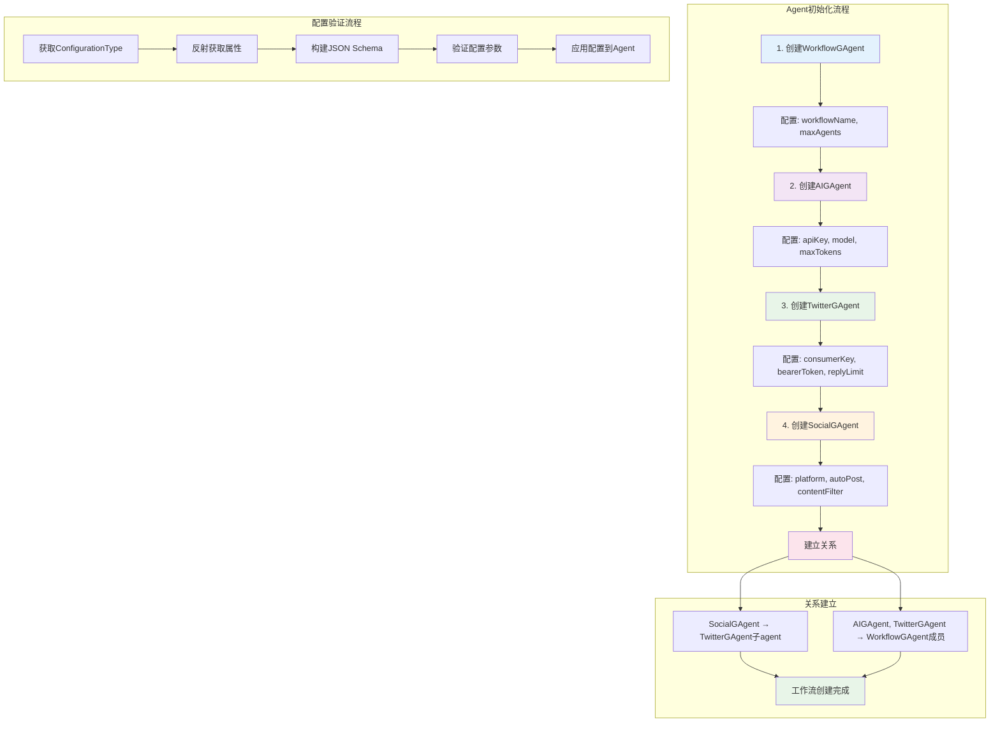

# API /api/workflow 工作流接口需求文档

## 接口基本信息
- **路径**: `/api/workflow`
- **方法**: POST
- **功能**: 一键创建完整工作流，包含多个GAgent的创建和关联

## 流程图

### 执行流程


### 实际工作流实现流程 (基于Program.cs)

```mermaid
flowchart TD
    subgraph "实际工作流实现 (基于Program.cs)"
        A["/api/workflow 请求"] --> B["创建GroupGAgent<br/>(工作流协调器)"]
        B --> C["创建AIGAgent"]
        C --> D["创建TwitterGAgent"]
        D --> E["创建SocialGAgent"]
        E --> F["设置子Agent关系<br/>SocialGAgent → TwitterGAgent"]
        F --> G["构建WorkflowUnitDto列表"]
        G --> H["调用AddWorkflowGroupChat<br/>注册工作流单元"]
        H --> I["发布StartWorkflowCoordinatorEvent<br/>启动工作流"]
        I --> J["工作流开始执行"]
        
        subgraph "WorkflowUnitDto结构"
            W1["WorkflowUnit 1:<br/>GrainId: AIGAgent<br/>NextGrainId: TwitterGAgent"]
            W2["WorkflowUnit 2:<br/>GrainId: TwitterGAgent<br/>NextGrainId: (空，结束)"]
        end
        
        G --> W1
        G --> W2
    end
    
    subgraph "最终工作流结构"
        GG["GroupGAgent<br/>(工作流协调器)"]
        AI["AIGAgent"]
        TW["TwitterGAgent"]
        SO["SocialGAgent"]
        
        GG -."管理工作流".-> AI
        GG -."管理工作流".-> TW
        AI -."执行顺序".-> TW
        TW -."子Agent".-> SO
    end
    
    style A fill:#e1f5fe
    style B fill:#f3e5f5
    style C fill:#f3e5f5
    style D fill:#e8f5e8
    style E fill:#fff3e0
    style F fill:#fce4ec
    style G fill:#f1f8e9
    style H fill:#fff8e1
    style I fill:#e8f5e8
    style J fill:#e8f5e8
```


### Agent初始化流程


## 核心流程

### 步骤1: 创建GroupGAgent (工作流协调器)
**Agent类型**: `Aevatar.GAgents.Basic.BasicGAgents.GroupGAgent` (使用现有的GroupGAgent)
**初始化参数**:
```json
{
  "name": "WorkflowCoordinator",
  "agentType": "Aevatar.GAgents.Basic.BasicGAgents.GroupGAgent",
  "properties": {
    "groupName": "TestWorkflow",
    "description": "工作流协调器",
    "maxMembers": 10
  }
}
```

### 步骤2: 创建AIGAgent
**Agent类型**: `Aevatar.GAgents.AIGAgent`
**配置方式**: 从配置文件读取apiKey
**初始化参数**:
```json
{
  "name": "MyAIAgent", 
  "agentType": "Aevatar.GAgents.AIGAgent",
  "properties": {
    "apiKey": "从配置文件读取 (appsettings.json中的AIGAgent:ApiKey)",
    "model": "gpt-4",
    "maxTokens": 1000,
    "temperature": 0.7
  }
}
```

### 步骤3: 创建TwitterGAgent
**Agent类型**: `Aevatar.GAgents.Twitter.Agent.TwitterGAgent`
**配置方式**: 从请求参数中获取Twitter配置
**初始化参数** (使用请求中的twitterConfig):
```json
{
  "name": "MyTwitterAgent",
  "agentType": "Aevatar.GAgents.Twitter.Agent.TwitterGAgent",
  "properties": {
    "consumerKey": "从请求参数twitterConfig.consumerKey获取",
    "consumerSecret": "从请求参数twitterConfig.consumerSecret获取", 
    "bearerToken": "从请求参数twitterConfig.bearerToken获取",
    "encryptionPassword": "从请求参数twitterConfig.encryptionPassword获取",
    "replyLimit": "从请求参数twitterConfig.replyLimit获取"
  }
}
```

### 步骤4: 创建SocialGAgent
**Agent类型**: `Aevatar.GAgents.SocialGAgent`
**初始化参数**:
```json
{
  "name": "MySocialAgent",
  "agentType": "Aevatar.GAgents.SocialGAgent",
  "properties": {
    "platform": "twitter",
    "autoPost": true,
    "contentFilter": true
  }
}
```

### 步骤5: 构建工作流关系
基于Program.cs的实际实现模式：

1. **设置子Agent关系**: 
   - 调用 `AgentService.AddSubAgentAsync(twitterAgentId, [socialAgentId])`
   - 将SocialGAgent设为TwitterGAgent的子agent

2. **构建工作流单元**:
   ```csharp
   var workflowUnits = new List<WorkflowUnitDto>()
   {
       new WorkflowUnitDto()
       {
           GrainId = aiAgentId.ToString(),
           NextGrainId = twitterAgentId.ToString(),
       },
       new WorkflowUnitDto()
       {
           GrainId = twitterAgentId.ToString(),
           NextGrainId = "", // 结束节点
       }
   };
   ```

3. **添加工作流到GroupGAgent**:
   - 调用 `groupAgent.AddWorkflowGroupChat(agentFactory, workflowUnits)`
   - 将工作流单元添加到GroupGAgent

4. **启动工作流**:
   - 发布 `StartWorkflowCoordinatorEvent` 事件
   - 调用 `groupAgent.PublishEventAsync(new StartWorkflowCoordinatorEvent())`

## 工作流实现细节 (基于Program.cs)

### WorkflowUnitDto结构
```csharp
public class WorkflowUnitDto
{
    public string GrainId { get; set; }        // 当前节点的GrainId
    public string NextGrainId { get; set; }    // 下一个节点的GrainId (空字符串表示结束)
}
```

### 工作流执行流程
1. **初始化阶段**:
   - 创建GroupGAgent作为工作流协调器
   - 创建各个业务Agent (AIGAgent, TwitterGAgent, SocialGAgent)
   - 配置各Agent的初始化参数

2. **关系构建阶段**:
   - 建立Agent之间的父子关系 (SocialGAgent → TwitterGAgent)
   - 定义工作流执行顺序 (AIGAgent → TwitterGAgent)

3. **工作流注册阶段**:
   - 将工作流单元列表注册到GroupGAgent
   - 使用AddWorkflowGroupChat方法

4. **工作流启动阶段**:
   - 发布StartWorkflowCoordinatorEvent事件
   - GroupGAgent开始协调各Agent按顺序执行

### 关键依赖项
- `IGAgentFactory`: 用于创建和管理GAgent实例
- `IClusterClient`: Orleans集群客户端
- `WorkflowUnitDto`: 工作流单元定义
- `StartWorkflowCoordinatorEvent`: 工作流启动事件

## 配置文件设置

### appsettings.json 配置
需要在 `appsettings.json` 中添加AIGAgent的配置：

```json
{
  "AIGAgent": {
    "ApiKey": "your_openai_api_key_here",
    "Model": "gpt-4",
    "MaxTokens": 1000,
    "Temperature": 0.7
  }
}
```

### 配置读取方式
在实现中通过 `IConfiguration` 读取配置：
```csharp
var aiApiKey = configuration["AIGAgent:ApiKey"];
var aiModel = configuration["AIGAgent:Model"] ?? "gpt-4";
var maxTokens = configuration.GetValue<int>("AIGAgent:MaxTokens", 1000);
var temperature = configuration.GetValue<double>("AIGAgent:Temperature", 0.7);
```

## API接口设计

### 请求格式
```json
{
  "workflowName": "TestWorkflow",
  "twitterConfig": {
    "consumerKey": "your_consumer_key",
    "consumerSecret": "your_consumer_secret",
    "bearerToken": "your_bearer_token",
    "encryptionPassword": "your_encryption_password",
    "replyLimit": 10
  }
}
```

### 响应格式
```json
{
  "groupAgentId": "guid1",
  "aiAgentId": "guid2", 
  "twitterAgentId": "guid3",
  "socialAgentId": "guid4",
  "workflowUnits": [
    {
      "grainId": "guid2",
      "nextGrainId": "guid3"
    },
    {
      "grainId": "guid3", 
      "nextGrainId": ""
    }
  ],
  "success": true,
  "message": "工作流创建并启动成功"
}
```

## 实现要点
1. 使用现有的 `AgentService.CreateAgentAsync()` 创建各个agent
2. 使用 `AgentService.AddSubAgentAsync()` 建立父子关系
3. 使用 `IGroupGAgent.AddWorkflowGroupChat()` 注册工作流
4. 使用 `IGroupGAgent.PublishEventAsync()` 启动工作流
5. **AIGAgent配置**: 通过 `IConfiguration` 从配置文件读取apiKey等参数
6. **TwitterGAgent配置**: 从请求参数 `twitterConfig` 中获取Twitter API凭证
7. 按顺序执行，不考虑并发和回滚
8. 使用最简单的配置参数
9. 基本的成功/失败状态返回

## 开发优先级
- 先实现基本流程
- 配置文件读取AIGAgent参数
- 请求参数传递Twitter配置
- 后续可扩展其他配置参数
- 暂不考虑错误处理和性能优化 