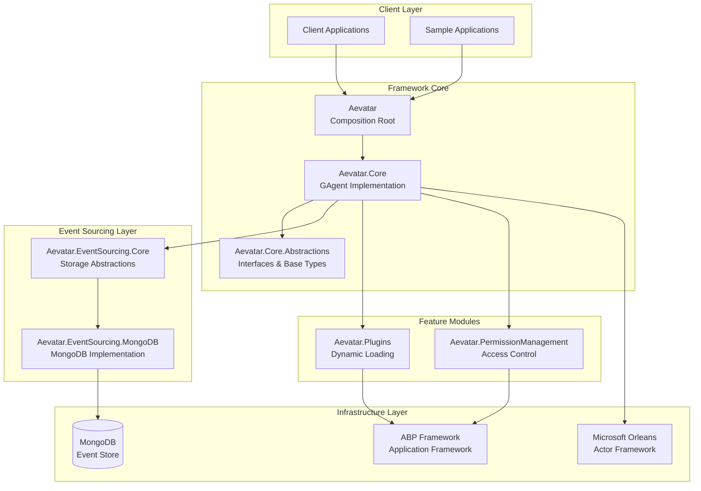
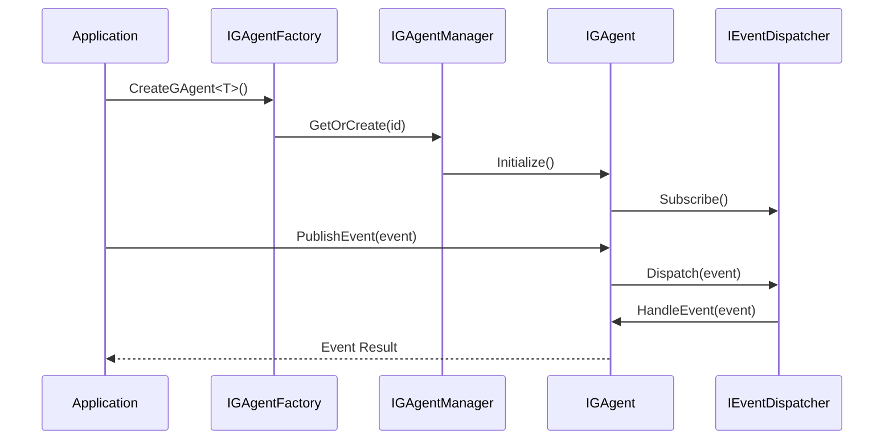
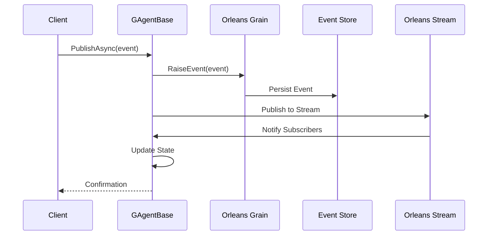
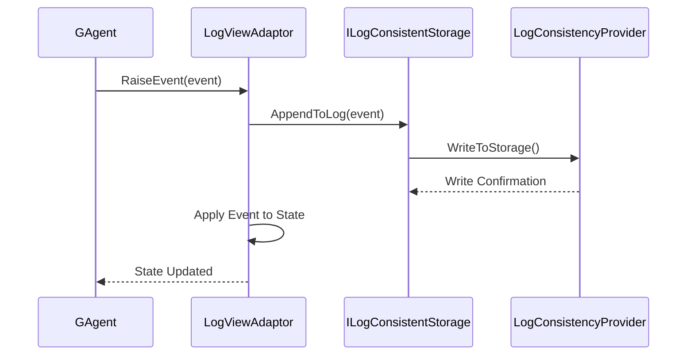
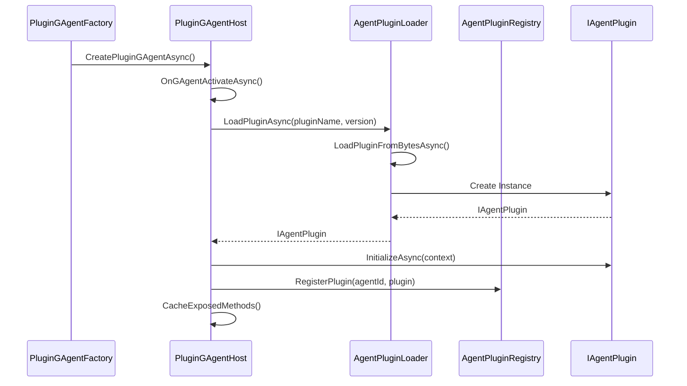
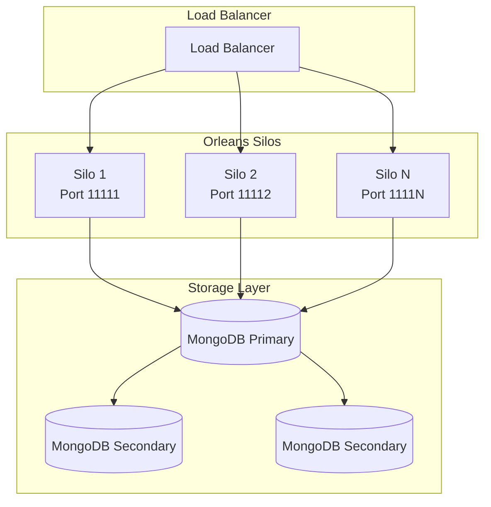

# Aevatar Framework Technical Documentation

> **Last Updated**: 2025-01-26  
> **Version Compatibility**: .NET 8+  
> **Framework Version**: 1.0.0

## Table of Contents

1. [Executive Summary](#executive-summary)
2. [System Architecture Overview](#system-architecture-overview)
3. [Core Module Documentation](#core-module-documentation)
4. [Technology Stack](#technology-stack)
5. [Development Guides](#development-guides)
6. [Configuration Reference](#configuration-reference)
7. [Performance and Scalability](#performance-and-scalability)
8. [Troubleshooting](#troubleshooting)
9. [API Reference](#api-reference)

## Executive Summary

The Aevatar Framework is a distributed actor-based framework built on Microsoft Orleans that enables building scalable, event-sourced AI agent applications. It implements sophisticated patterns including event sourcing, hierarchical agent relationships, dynamic plugin loading, and comprehensive permission management.

### Key Capabilities
- **Distributed AI Agents**: Actor-based GAgents with location transparency
- **Event Sourcing**: Complete audit trail with state reconstruction
- **Plugin Architecture**: Dynamic runtime extensibility
- **Multi-tenancy**: Isolated plugin and permission systems
- **Real-time Processing**: Orleans Streams for event distribution

## System Architecture Overview



### Architecture Principles

1. **Actor Model**: Each GAgent is a distributed Orleans Grain with independent state
2. **Event Sourcing**: All state changes captured as immutable events
3. **Hierarchical Composition**: Agents can register with and coordinate other agents
4. **Plugin Extensibility**: Runtime loading of custom business logic
5. **Multi-tenant Isolation**: Secure separation of tenant-specific functionality

## Core Module Documentation

### Aevatar.Core.Abstractions

#### Overview
Foundation module providing core interfaces, base classes, and fundamental abstractions for the entire framework.

#### Data Flow Sequence Diagram


#### Key Components

| Component | Purpose | Pattern |
|-----------|---------|---------|
| `IGAgent`, `IArtifactGAgent<>` | Core agent interfaces | Interface Segregation |
| `StateBase`, `StateLogEventBase<>` | Base state and event types | Template Method |
| `EventBase`, `EventWrapper<>` | Event infrastructure | Command Pattern |
| `IGAgentFactory`, `IGAgentManager` | Agent lifecycle management | Factory Pattern |
| `IAgentPlugin`, `IAgentContext` | Plugin system contracts | Strategy Pattern |

#### Usage Patterns

```csharp
// Define custom state and event
public class MyAgentState : StateBase
{
    public string Name { get; set; }
    public int ProcessCount { get; set; }
}

public class MyEvent : EventBase
{
    public string Data { get; set; }
}

// Create agent interface
public interface IMyAgent : IGAgent
{
    Task ProcessDataAsync(string data);
}
```

### Aevatar.Core

#### Overview
Core implementation module providing `GAgentBase<>` and Orleans integration for distributed agent functionality.

#### Data Flow Sequence Diagram


#### Key Components

| Component | Purpose | Orleans Integration |
|-----------|---------|-------------------|
| `GAgentBase<TState, TStateLogEvent>` | Base agent implementation | JournaledGrain |
| `ArtifactGAgent<>` | Specialized artifact management | Custom grain interface |
| `GAgentFactory` | Agent instantiation | Grain factory wrapper |
| `StateDispatcher` | State change broadcasting | Stream observer |
| `BroadCastGAgentBase` | Broadcasting capabilities | Multi-stream publisher |

#### Usage Patterns

```csharp
[GAgent]
public class MyAgent : GAgentBase<MyAgentState, MyStateLogEvent>, IMyAgent
{
    public override Task<string> GetDescriptionAsync()
    {
        return Task.FromResult("My Custom Agent for Data Processing");
    }

    [EventHandler]
    public async Task HandleDataProcessedAsync(DataProcessedEvent @event)
    {
        State.ProcessCount++;
        await ConfirmEvents();
        
        // Publish follow-up event through internal mechanisms
        await RaiseEvent(new ProcessCompleteStateLogEvent 
        { 
            Count = State.ProcessCount 
        });
    }

    // Note: External callers use agent factory to get agent reference
    // and then call methods through Orleans grain interface
}
```

### Aevatar.EventSourcing.Core

#### Overview
Event sourcing infrastructure providing storage abstractions and Orleans log consistency integration.

#### Data Flow Sequence Diagram


#### Key Components

| Component | Purpose | Storage Pattern |
|-----------|---------|----------------|
| `ILogConsistentStorage` | Storage abstraction | Repository Pattern |
| `LogConsistencyProvider` | Orleans integration | Adapter Pattern |
| `LogViewAdaptor` | Event sourcing bridge | Bridge Pattern |
| `ViewStateSnapshot<>` | Snapshot management | Memento Pattern |
| `InMemoryLogConsistentStorage` | Development storage | In-memory Repository |

#### Configuration

```csharp
// Orleans Silo Configuration
siloBuilder.AddLogStorageBasedLogConsistencyProvider("LogStorage")
           .AddMemoryGrainStorage("PubSubStore");

// Custom storage provider registration
services.AddSingleton<ILogConsistentStorage, CustomLogStorage>();
```

### Aevatar.EventSourcing.MongoDB

#### Overview
Production-ready MongoDB implementation of event sourcing storage with BSON serialization support.

#### Key Components

| Component | Purpose | MongoDB Integration |
|-----------|---------|-------------------|
| `MongoDbLogConsistentStorage` | MongoDB persistence | Driver integration |
| `BsonGrainSerializer` | Grain serialization | BSON format |
| `MongoDbStorageOptions` | Configuration options | Options pattern |

#### Configuration

```json
{
  "Orleans": {
    "Clustering": {
      "Provider": "MongoDB",
      "ConnectionString": "mongodb://localhost:27017/aevatar"
    },
    "Persistence": {
      "Default": {
        "Provider": "MongoDB",
        "ConnectionString": "mongodb://localhost:27017/aevatar"
      }
    }
  }
}
```

### Aevatar.Plugins

#### Overview
Sophisticated plugin system with Orleans integration enabling runtime loading, isolated assembly contexts, and multi-tenant extensibility. The system provides two tiers: core Orleans-based plugin hosting and tenant-based plugin management.

**Note**: The simple `PluginLoader` class is only a testing utility that reads DLL files from directories. The actual plugin loading is handled by `AgentPluginLoader` working with `PluginGAgentHost`.

#### Data Flow Sequence Diagram


#### Key Components

| Component | Purpose | Pattern |
|-----------|---------|---------|
| `PluginGAgentHost` | Orleans-integrated plugin host | Bridge Pattern |
| `AgentPluginLoader` | Assembly loading with isolation | Factory Pattern |
| `AgentPluginRegistry` | Plugin instance management | Registry Pattern |
| `PluginGAgentManager` | Tenant-based plugin management | Manager Pattern |
| `PluginCodeStorageGAgent` | Plugin storage persistence | Repository Pattern |

#### Usage Patterns

```csharp
// Plugin implementation
public class WeatherPlugin : IAgentPlugin
{
    public AgentPluginMetadata Metadata => new(
        "WeatherPlugin",
        "1.0.0",
        "Weather Service Plugin");

    private IAgentContext? _context;

    public Task InitializeAsync(IAgentContext context, CancellationToken cancellationToken = default)
    {
        _context = context;
        return Task.CompletedTask;
    }

    public async Task<object?> ExecuteMethodAsync(string methodName, object?[] parameters, CancellationToken cancellationToken = default)
    {
        return methodName switch
        {
            "GetWeather" => await GetWeatherAsync((string)parameters[0]!),
            _ => throw new NotSupportedException($"Method {methodName} not supported")
        };
    }

    public async Task HandleEventAsync(IAgentEvent agentEvent, CancellationToken cancellationToken = default)
    {
        if (agentEvent.EventType == "WeatherRequest")
        {
            var weatherData = await GetWeatherAsync(agentEvent.Data?.ToString() ?? "");
            await _context!.PublishEventAsync(new WeatherResponseEvent
            {
                EventType = "WeatherResponse",
                Data = weatherData,
                Timestamp = DateTime.UtcNow
            });
        }
    }

    public Task<object?> GetStateAsync(CancellationToken cancellationToken = default) => Task.FromResult<object?>(null);
    public Task SetStateAsync(object? state, CancellationToken cancellationToken = default) => Task.CompletedTask;
    public Task DisposeAsync() => Task.CompletedTask;

    private async Task<string> GetWeatherAsync(string location)
    {
        // Plugin-specific weather logic
        return $"Sunny, 25°C in {location}";
    }
}

// Plugin loading
var pluginManager = await gAgentFactory.GetGAgentAsync<IPluginGAgentManager>(managerId);
await pluginManager.AddPluginAsync(new AddPluginDto
{
    Name = "WeatherPlugin",
    Version = "1.0.0",
    AssemblyBytes = pluginAssemblyBytes,
    TenantId = tenantId
});
```

### Aevatar.PermissionManagement

#### Overview
Permission-based access control system with ABP authorization integration for secure agent operations.

#### Key Components

| Component | Purpose | Security Pattern |
|-----------|---------|-----------------|
| `PermissionGAgentBase<>` | Permission-aware agents | Decorator Pattern |
| `PermissionStateBase` | State with authorization | Template Method |
| `PermissionCheckFilter` | Authorization filtering | Filter Pattern |
| `UserContext` | User context management | Context Pattern |

#### Usage Patterns

```csharp
[Permission("Agents.Process")]
public class SecureAgent : PermissionGAgentBase<SecureState>
{
    public override async Task<string> GetDescriptionAsync()
    {
        return "Secure Agent with Permission Checks";
    }

    [Permission("Agents.Process.Data")]
    [EventHandler]
    public async Task HandleSecureDataAsync(SecureDataEvent @event)
    {
        // Only users with "Agents.Process.Data" permission can trigger this
        await ProcessSecureDataAsync(@event.Data);
    }
}
```

### Aevatar (Composition Root)

#### Overview
Main composition module integrating all framework components with ABP framework and Orleans hosting.

#### Key Components

| Component | Purpose | Integration |
|-----------|---------|-------------|
| `AevatarModule` | ABP module configuration | Module Pattern |
| `AevatarDefaultConventionalRegistrar` | Service registration | DI Container |
| `ConfigureAevatarGrainActivator` | Orleans integration | Activator Pattern |

## Technology Stack

### Core Technologies

| Technology | Version | Purpose |
|------------|---------|---------|
| .NET | 8.0+ | Primary runtime platform |
| Microsoft Orleans | 8.0+ | Actor model framework |
| ABP Framework | 8.0+ | Application framework |
| MongoDB | 6.0+ | Primary data store |
| AutoMapper | 12.0+ | Object mapping |
| Newtonsoft.Json | 13.0+ | JSON serialization |

### Observability Stack

| Technology | Purpose |
|------------|---------|
| OpenTelemetry | Distributed tracing |
| Microsoft.Extensions.Logging | Structured logging |
| Activity | Correlation tracking |

### Testing Framework

| Technology | Purpose |
|------------|---------|
| xUnit | Primary testing framework |
| Orleans TestKit | Orleans-specific testing |
| Shouldly/FluentAssertions | Assertion libraries |
| NSubstitute/Moq | Mocking frameworks |

## Development Guides

### Setting Up Development Environment

1. **Prerequisites**
   ```bash
   # Install .NET 8 SDK
   # Install MongoDB Community Edition
   # Install Visual Studio 2022 or VS Code
   ```

2. **Clone and Build**
   ```bash
   git clone <repository-url>
   cd aevatar-framework
   dotnet restore
   dotnet build
   ```

3. **Run Tests**
   ```bash
   dotnet test --collect:"XPlat Code Coverage"
   ```

### Creating a Custom GAgent

```csharp
// 1. Define state and events
public class TaskAgentState : StateBase
{
    public List<string> Tasks { get; set; } = new();
    public int CompletedCount { get; set; }
}

public class TaskAddedEvent : EventBase
{
    public string TaskDescription { get; set; }
}

public class TaskCompletedEvent : EventBase
{
    public string TaskDescription { get; set; }
}

// 2. Create agent interface
public interface ITaskAgent : IGAgent
{
    Task AddTaskAsync(string description);
    Task CompleteTaskAsync(string description);
    Task<IReadOnlyList<string>> GetPendingTasksAsync();
}

// 3. Implement agent
[GAgent]
public class TaskAgent : GAgentBase<TaskAgentState, TaskAgentStateLogEvent>, ITaskAgent
{
    public TaskAgent(ILogger<TaskAgent> logger) : base(logger)
    {
    }

    public override Task<string> GetDescriptionAsync()
    {
        return Task.FromResult("Task Management Agent");
    }

    public async Task AddTaskAsync(string description)
    {
        await PublishAsync(new TaskAddedEvent { TaskDescription = description });
    }

    public async Task CompleteTaskAsync(string description)
    {
        if (State.Tasks.Contains(description))
        {
            await PublishAsync(new TaskCompletedEvent { TaskDescription = description });
        }
    }

    public Task<IReadOnlyList<string>> GetPendingTasksAsync()
    {
        return Task.FromResult<IReadOnlyList<string>>(State.Tasks.AsReadOnly());
    }

    [EventHandler]
    public async Task HandleTaskAddedAsync(TaskAddedEvent @event)
    {
        State.Tasks.Add(@event.TaskDescription);
        await ConfirmEvents();
    }

    [EventHandler]
    public async Task HandleTaskCompletedAsync(TaskCompletedEvent @event)
    {
        State.Tasks.Remove(@event.TaskDescription);
        State.CompletedCount++;
        await ConfirmEvents();
    }
}
```

### Orleans Silo Configuration

```csharp
var builder = Host.CreateDefaultBuilder(args)
    .UseOrleans(siloBuilder =>
    {
        siloBuilder
            .UseLocalhostClustering()
            .AddMongoDBGrainStorage("Default", options =>
            {
                options.ConnectionString = "mongodb://localhost:27017";
                options.DatabaseName = "aevatar";
            })
            .AddLogStorageBasedLogConsistencyProvider("LogStorage")
            .AddMemoryStreams("Default")
            .ConfigureServices(services =>
            {
                services.AddAevatar();
            });
    })
    .UseConsoleLifetime();

var host = builder.Build();
await host.RunAsync();
```

## Configuration Reference

### Framework Configuration

```json
{
  "Aevatar": {
    "StreamNamespace": "Aevatar",
    "StateProjectionStreamNamespace": "AevatarStateProjection", 
    "BroadCastStreamNamespace": "AevatarBroadCast"
  },
  "Plugins": {
    "TenantId": "00000000-0000-0000-0000-000000000000",
    "AssemblyLoadTimeout": "00:01:00",
    "MaxPluginSize": 10485760
  },
  "MongoDB": {
    "ConnectionString": "mongodb://localhost:27017",
    "DatabaseName": "aevatar",
    "EventCollectionName": "events",
    "SnapshotCollectionName": "snapshots"
  }
}
```

### Orleans Configuration

```json
{
  "Orleans": {
    "ClusterId": "aevatar-cluster",
    "ServiceId": "aevatar-service",
    "Clustering": {
      "Provider": "MongoDB",
      "ConnectionString": "mongodb://localhost:27017/aevatar"
    },
    "GrainStorage": {
      "Default": {
        "Provider": "MongoDB",
        "ConnectionString": "mongodb://localhost:27017/aevatar"
      }
    },
    "Streaming": {
      "Default": {
        "Provider": "Memory"
      }
    }
  }
}
```

## Performance and Scalability

### Orleans Cluster Scaling



### Performance Optimization Guidelines

1. **Event Sourcing Optimization**
   - Implement snapshots for long-lived agents
   - Use batch event processing for high-throughput scenarios
   - Configure appropriate event retention policies

2. **Orleans Configuration**
   - Set proper activation collection timeouts
   - Use appropriate placement strategies
   - Configure grain call filters for cross-cutting concerns

3. **MongoDB Optimization**
   - Create appropriate indexes for queries
   - Configure connection pooling
   - Use MongoDB sharding for large datasets

## Troubleshooting

### Common Issues

#### 1. Agent Not Found
**Symptoms**: `GrainActivationException` or null agent references
**Solutions**:
- Verify agent is properly registered with `[GAgent]` attribute
- Check Orleans silo configuration
- Ensure assembly containing agent is loaded

#### 2. Event Handling Failures
**Symptoms**: Events published but not processed
**Solutions**:
- Verify `[EventHandler]` attribute on handler methods
- Check method signatures match event types
- Review exception logs for handler failures

#### 3. Plugin Loading Issues
**Symptoms**: Plugins not loading or runtime errors
**Solutions**:
- Verify plugin assembly dependencies
- Check plugin implements required interfaces
- Review tenant ID configuration

#### 4. Performance Issues
**Symptoms**: Slow event processing or high memory usage
**Solutions**:
- Implement event batching for high-volume scenarios
- Add snapshots for long event histories
- Monitor Orleans dashboard for grain distribution

### Diagnostic Commands

```bash
# Check Orleans cluster health
dotnet run --project samples/ClusterMonitor

# View event sourcing metrics
dotnet run --project samples/EventMetrics

# Test plugin loading
dotnet test framework/test/Aevatar.Core.Tests --filter Plugin
```

## API Reference

### Core Interfaces

#### IGAgent
```csharp
public interface IGAgent : IGrainWithGuidKey
{
    Task ActivateAsync();
    Task<string> GetDescriptionAsync();
    Task RegisterAsync(IGAgent gAgent);
    Task SubscribeToAsync(IGAgent gAgent);
    Task UnsubscribeFromAsync(IGAgent gAgent);
    Task UnregisterAsync(IGAgent gAgent);
    Task<List<Type>?> GetAllSubscribedEventsAsync(bool includeBaseHandlers = false);
    Task<List<GrainId>> GetChildrenAsync();
    Task<GrainId> GetParentAsync();
    Task<Type?> GetConfigurationTypeAsync();
    Task ConfigAsync(ConfigurationBase configuration);
}

public interface IStateGAgent<TState> : IGAgent
{
    Task<TState> GetStateAsync();
}
```

#### IGAgentFactory
```csharp
public interface IGAgentFactory
{
    Task<IGAgent> GetGAgentAsync(GrainId grainId, ConfigurationBase? configuration = null);
    Task<IGAgent> GetGAgentAsync(Guid primaryKey, string alias, string ns, ConfigurationBase? configuration = null);
    Task<IGAgent> GetGAgentAsync(string alias, string ns, ConfigurationBase? configuration = null);
    Task<IGAgent> GetGAgentAsync(Guid primaryKey, Type gAgentType, ConfigurationBase? configuration = null);
    Task<IGAgent> GetGAgentAsync(Type gAgentType, ConfigurationBase? configuration = null);
    Task<TGrainInterface> GetGAgentAsync<TGrainInterface>(Guid primaryKey, ConfigurationBase? configuration = null) where TGrainInterface : IGAgent;
    Task<TGrainInterface> GetGAgentAsync<TGrainInterface>(GrainId grainId, ConfigurationBase? configuration = null) where TGrainInterface : IGAgent;
    Task<TGrainInterface> GetGAgentAsync<TGrainInterface>(ConfigurationBase? configuration = null) where TGrainInterface : IGAgent;
    Task<IArtifactGAgent<TArtifact, TState, TStateLogEvent>> GetArtifactGAgentAsync<TArtifact, TState, TStateLogEvent>(ConfigurationBase? configuration = null)
        where TArtifact : IArtifact<TState, TStateLogEvent>, new()
        where TState : StateBase, new()
        where TStateLogEvent : StateLogEventBase<TStateLogEvent>;
}
```

#### IAgentPlugin
```csharp
public interface IAgentPlugin
{
    AgentPluginMetadata Metadata { get; }
    Task InitializeAsync(IAgentContext context, CancellationToken cancellationToken = default);
    Task<object?> ExecuteMethodAsync(string methodName, object?[] parameters, CancellationToken cancellationToken = default);
    Task HandleEventAsync(IAgentEvent agentEvent, CancellationToken cancellationToken = default);
    Task<object?> GetStateAsync(CancellationToken cancellationToken = default);
    Task SetStateAsync(object? state, CancellationToken cancellationToken = default);
    Task DisposeAsync();
}

public record AgentPluginMetadata(
    string Name,
    string Version,
    string Description,
    Dictionary<string, object>? Properties = null);
```

### Event Handler Attributes

```csharp
[AttributeUsage(AttributeTargets.Method, Inherited = false)]
public class EventHandlerAttribute(int priority = 100, bool allowSelfHandling = false) : Attribute
{
    public int Priority { get; } = priority;
    public bool AllowSelfHandling { get; } = allowSelfHandling;
}
```

### Sample Usage

```csharp
// Get agent factory
var factory = serviceProvider.GetRequiredService<IGAgentFactory>();

// Create or get agent using Guid ID
var agentId = Guid.NewGuid();
var agent = await factory.GetGAgentAsync<ITaskAgent>(agentId);

// Use agent
await agent.AddTaskAsync("Complete documentation");
var tasks = await agent.GetPendingTasksAsync();
```

---

*This documentation provides comprehensive coverage of the Aevatar Framework architecture, implementation patterns, and usage guidelines. For additional support, refer to the sample applications in the `samples/` directory or submit issues to the project repository.*