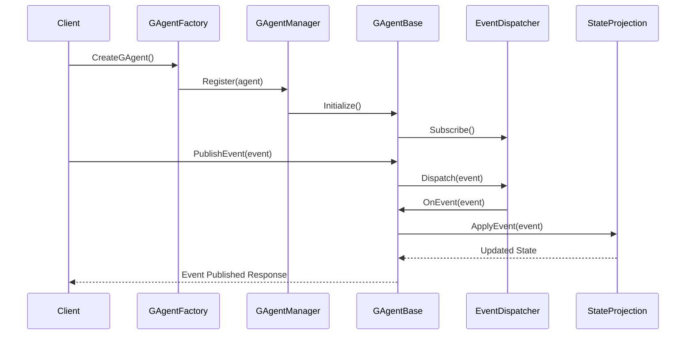
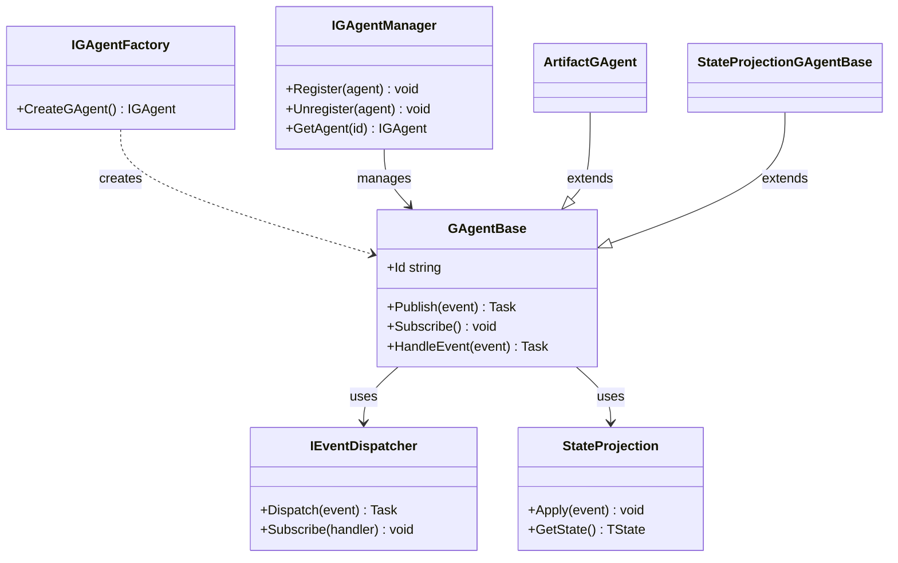

# Aevatar.Core Module Documentation

## Data Flow Sequence Diagram

## Relationship Diagram

## Module Explanation

The Aevatar.Core module serves as the foundation of the Aevatar Framework, implementing the Generative Agent (GAgent) concept. GAgents are the primary abstraction for intelligent, stateful, event-driven entities that can respond to and publish events.

Key components include:
- **GAgentBase**: The core implementation providing event publishing, subscription, and handling capabilities
- **GAgentFactory**: Creates instances of GAgents with appropriate state types
- **GAgentManager**: Manages agent lifecycle, registration, and retrieval
- **StateProjection**: Handles state updates based on incoming events
- **EventDispatcher**: Routes events between agents based on subscriptions

The module implements a lightweight event-sourcing pattern where agent state changes are driven by events. These events can trigger reactions in other agents through the subscription mechanism, creating a network of communicating agents. The module supports specialized agent types like ArtifactGAgent for artifact-based operations and StateProjectionGAgentBase for advanced state management. 