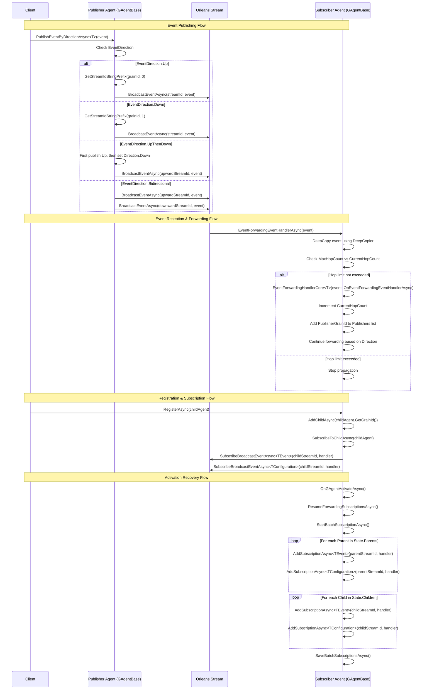
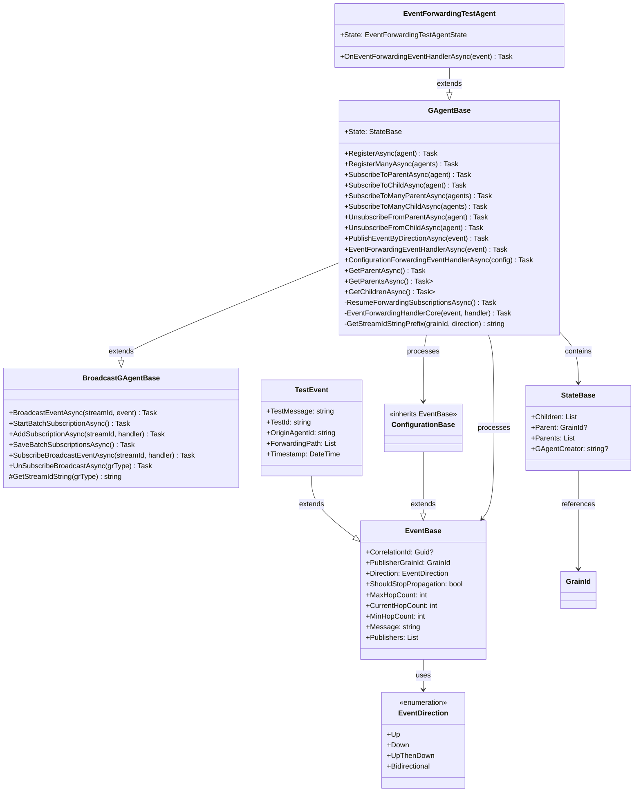

# Aevatar.EventForwarding Module Documentation

## Data Flow Sequence Diagram



## Relationship Diagram



## Module Explanation

### Overview

The **Aevatar.EventForwarding** system provides a sophisticated hierarchical communication framework for distributed agents in the Aevatar platform. Built on Microsoft Orleans, it enables complex multi-level agent structures with intelligent event routing, automatic subscription management, and performance-optimized batch operations.

### Core Architecture Principles

#### **Bidirectional Stream Architecture**
The system implements a dual-stream design where each agent can participate in two distinct communication channels:

- **Upward Streams (Direction 0)**: Child-owned streams where children publish events for parent consumption
- **Downward Streams (Direction 1)**: Parent-owned streams where parents publish events for child consumption

This design ensures clear stream ownership and enables efficient many-to-many communication patterns.

#### **Stream ID Generation Pattern**
The framework uses a consistent stream ID format implemented by `GetStreamIdStringPrefix()`: `{GrainId}.{Direction}`

Where the BroadcastGAgentBase appends the event type to create the final stream ID: `{GrainId}.{Direction}.{EventType}`

This pattern enables:
- Deterministic stream identification based on grain ownership
- Direction-based stream separation (0=upward, 1=downward)
- Support for multiple event types per relationship
- Scalable stream management through Orleans

### Key Components

#### **Event Direction System**
The framework supports four distinct event propagation patterns:

1. **Up Events**: Child-to-parent communication through multiple hierarchy levels
2. **Down Events**: Parent-to-child broadcasting through descendant trees
3. **UpThenDown Events**: Hybrid pattern where events go up to parent, then parent re-broadcasts down to extended family
4. **Bidirectional Events**: Simultaneous upward and downward propagation with loop prevention

#### **Intelligent Hop Control**
The system implements a sophisticated hop counting mechanism:

- **MaxHopCount**: Immutable limit set when creating events (-1 for unlimited)
- **CurrentHopCount**: Incremented at each forwarding step to track propagation depth
- **Publisher Tracking**: Maintains list of previous publishers to prevent circular forwarding
- **Loop Prevention**: Automatic termination when hop limits are reached

#### **Performance Optimization Features**

##### **Batch Subscription Management**
The framework provides optimized batch operations using the Orleans batch subscription pattern:

```csharp
// Public batch methods for external use
await SubscribeToManyParentAsync(parentAgentList);
await SubscribeToManyChildAsync(childAgentList);

// Internal batch pattern for activation scenarios
await StartBatchSubscriptionAsync();
foreach (var parentGrainId in State.Parents) {
    await AddSubscriptionAsync<TEvent>(parentStreamId, handler);
    await AddSubscriptionAsync<TConfiguration>(parentStreamId, handler);
}
await SaveBatchSubscriptionsAsync();
```

##### **Automatic Subscription Recovery**
The `ResumeForwardingSubscriptionsAsync()` method provides automatic subscription restoration during grain activation:

- Called from `OnGAgentActivateAsync()` after grain reactivation
- Reads persistent state (`State.Parents` and `State.Children` lists)
- Uses batch subscription pattern (`StartBatchSubscriptionAsync` → `AddSubscriptionAsync` loops → `SaveBatchSubscriptionsAsync`)
- Restores both `TEvent` and `TConfiguration` stream subscriptions
- Executes parent and child batch operations in parallel using `Task.WhenAll`
- Prevents subscription loss during deactivation/reactivation cycles

#### **Dual Event Support**
The system supports both regular events (`TEvent`) and configuration events (`TConfiguration`):

- **TEvent**: Business logic events for application functionality
- **TConfiguration**: System configuration and control plane events
- **Unified Processing**: Both types use the same forwarding infrastructure
- **Separate Streams**: Each type maintains independent stream channels

#### **Memory Safety**
The framework implements comprehensive memory safety mechanisms:

- **Deep Copying**: Uses Orleans `DeepCopier` to prevent shared state mutations
- **Event Isolation**: Each subscriber receives independent event copies
- **Concurrent Safety**: Prevents race conditions during simultaneous event processing

### Advanced Features

#### **Registration Patterns**
The framework provides flexible agent relationship management:

- **Single Registration**: `RegisterAsync(childAgent)` establishes parent-child relationship
  - Parent calls `AddChildAsync(childAgent.GetGrainId())` to update state
  - Parent calls `SubscribeToChildAsync(childAgent)` to subscribe to child's upward streams
  - Child calls `SubscribeToParentAsync(parentAgent)` to subscribe to parent's downward streams
- **Batch Registration**: `RegisterManyAsync(childAgentList)` for one-to-many relationships using batch subscription optimization
- **Bidirectional Setup**: Single `RegisterAsync` call establishes complete bidirectional communication for both `TEvent` and `TConfiguration` streams

#### **Event Tracking and Debugging**
Comprehensive debugging support includes:

- **Forwarding Path Tracking**: Complete audit trail of event propagation
- **Grain ID Logging**: Detailed agent identification for debugging
- **Performance Metrics**: Timing analysis for subscription operations
- **Verification Engine**: Event ID-based tracking for test accuracy

#### **Enterprise Scalability**
The system is designed for enterprise-scale deployments:

- **Orleans Integration**: Leverages Orleans' distributed computing capabilities
- **Kafka Streaming**: Reliable event delivery with persistence
- **MongoDB State**: Persistent agent state management
- **Horizontal Scaling**: Support for large-scale agent hierarchies

### Use Cases

#### **Hierarchical Business Logic**
Perfect for modeling organizational structures, approval workflows, and multi-level decision trees where events need to flow through management hierarchies.

#### **Family Tree Communication**
Ideal for applications requiring sibling, parent-child, uncle-nephew, and cousin communication patterns (as demonstrated in the comprehensive test suite).

#### **Configuration Cascade**
Excellent for system configuration propagation where configuration changes need to flow through hierarchical system components.

#### **Event Sourcing Architectures**
Supports complex event sourcing patterns where business events need intelligent routing through domain hierarchies.

### Performance Characteristics

- **Optimized Activation Recovery**: Uses batch subscription pattern to minimize Orleans subscription overhead during grain reactivation
- **Batch Operation Efficiency**: Reduces multiple individual `SubscribeBroadcastEventAsync` calls to batched `AddSubscriptionAsync` operations
- **Parallel Processing**: Parent and child subscription batches execute concurrently using `Task.WhenAll`
- **Memory Safety**: Uses Orleans `DeepCopier` service to prevent shared state mutations during stream broadcasting
- **Stream Ownership**: Clear direction-based stream ownership prevents subscription conflicts

The Aevatar.EventForwarding module represents a production-ready solution for complex hierarchical communication patterns in distributed systems, providing the foundation for sophisticated multi-agent applications with enterprise-scale performance and reliability.
