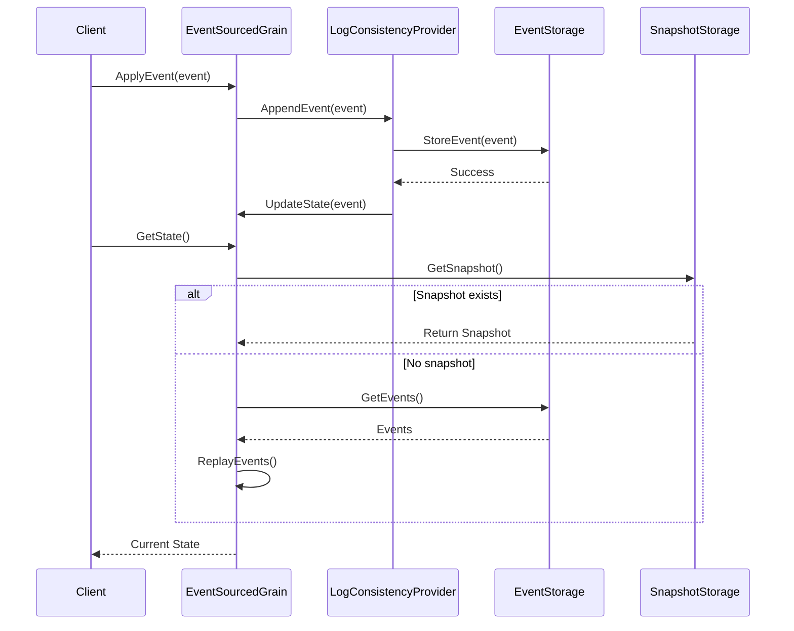
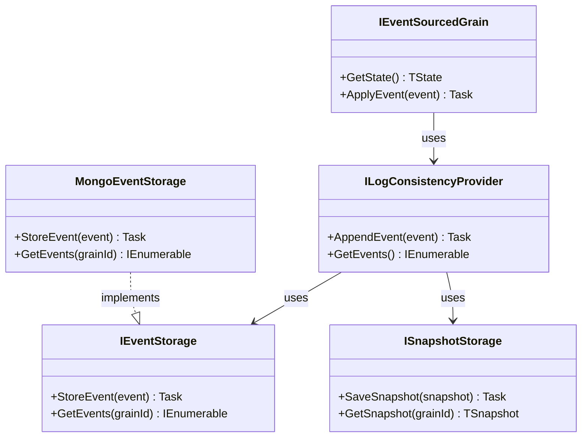

# Aevatar.EventSourcing.Core Module Documentation

## Data Flow Sequence Diagram

## Relationship Diagram

## Module Explanation

The Aevatar.EventSourcing.Core module provides a robust event sourcing implementation integrated with Microsoft Orleans. Event sourcing is a pattern where all state changes are recorded as a sequence of immutable events, which can be replayed to reconstruct the current state.

This module includes:
- **EventSourcedGrain**: Extends Orleans grains with event sourcing capabilities
- **LogConsistencyProvider**: Ensures consistency of event logs across distributed systems
- **EventStorage**: Persists events to storage systems (with MongoDB implementation available)
- **SnapshotStorage**: Creates and retrieves state snapshots to optimize performance

The event sourcing approach provides several benefits:
1. Complete audit trail of all state changes
2. Ability to reconstruct state at any point in time
3. Event replay for debugging and analysis
4. Strong consistency guarantees in distributed environments

The module is designed to work seamlessly with Orleans' distributed actor model, allowing event-sourced agents to operate across a cluster with high availability and scalability. 