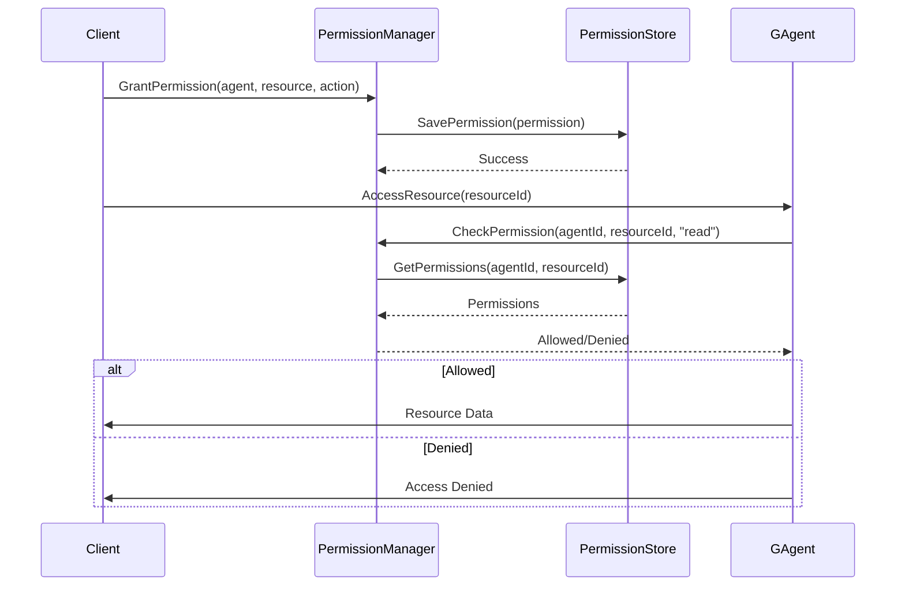
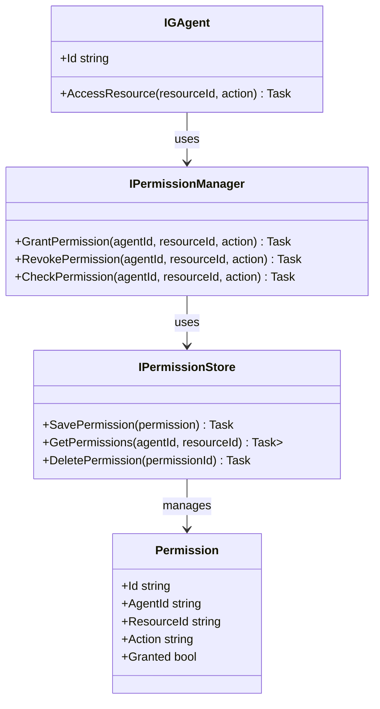

# Aevatar.PermissionManagement Module Documentation

## Data Flow Sequence Diagram

## Relationship Diagram

## Module Explanation

The Aevatar.PermissionManagement module provides a comprehensive access control system for Generative Agents and the resources they interact with. This enables secure, controlled collaboration between agents and protection of sensitive data.

Key components include:
- **PermissionManager**: Central service for granting, revoking, and checking permissions
- **PermissionStore**: Storage mechanism for permission records
- **Permission Model**: Represents the relationship between agents, resources, and allowed actions
- **Access Control Integration**: Seamless integration with agent operations

The permission system implements:
1. Fine-grained access control at the agent, resource, and action levels
2. Flexible permission models including role-based and attribute-based access control
3. Runtime permission evaluation without performance overhead
4. Auditable permission changes

This module is essential for multi-agent systems where data privacy, security boundaries, and controlled collaboration are important. It prevents unauthorized data access and ensures agents operate within their intended scope of authority, particularly important for AI-powered systems. 