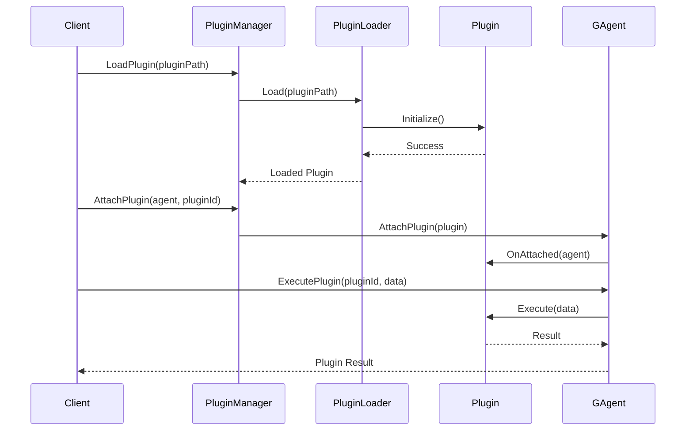
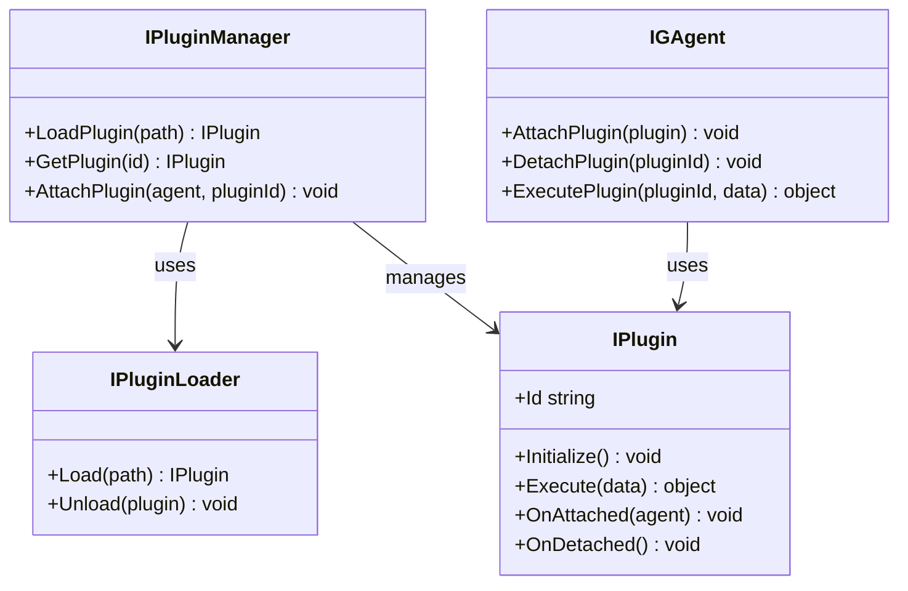

# Aevatar.Plugins Module Documentation

## Data Flow Sequence Diagram

## Relationship Diagram

## Module Explanation

The Aevatar.Plugins module implements a flexible plugin architecture that extends the functionality of Generative Agents through dynamically loaded components. This enables the framework to be highly extensible and customizable.

Key components include:
- **PluginManager**: Central service for loading, registering, and managing plugins
- **PluginLoader**: Handles the dynamic loading of plugin assemblies
- **Plugin Interface**: Contract that all plugins must implement to integrate with the framework
- **Plugin Attachment**: Mechanism for connecting plugins to agents

The plugin system allows for:
1. Dynamic capability extension without modifying core code
2. Third-party integration and ecosystem development
3. Specialized AI, data processing, or integration capabilities
4. Runtime plugin loading and unloading

Plugins can enhance agents with new behaviors, integrations with external systems, specialized AI capabilities, or domain-specific functionality. The module supports versioning, dependency resolution, and isolation to ensure stable and secure plugin execution. 