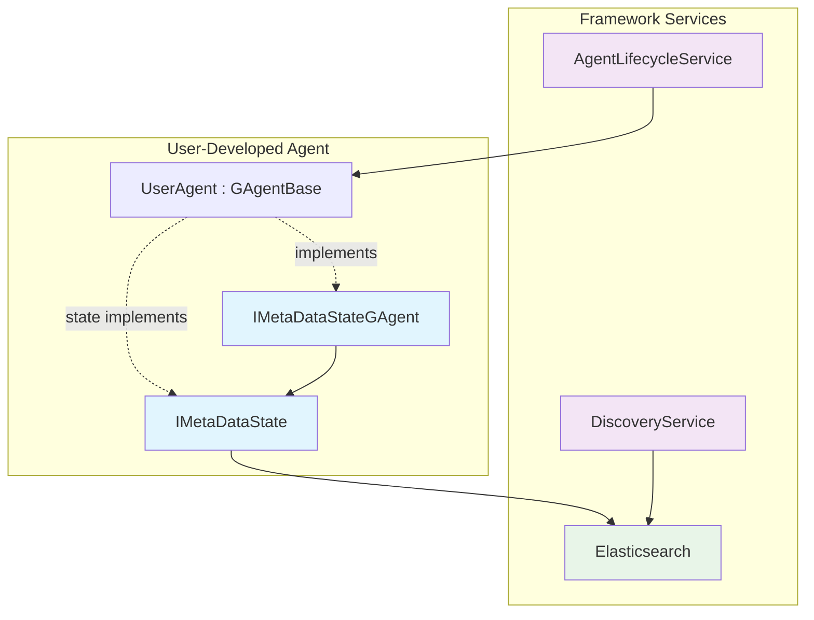
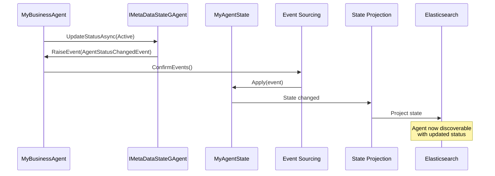

# IMetaDataStateGAgent Documentation

## Overview

`IMetaDataStateGAgent<TState>` is a critical helper interface in the Aevatar Station framework that **must be inherited by all newly user-developed agents** to ensure proper metadata management and integration with the agent discovery and lifecycle systems. This interface provides standardized methods for managing agent metadata state through event sourcing patterns.

## Purpose and Role in the Architecture

### Why This Interface is Required

According to the Agent Management Architecture Proposal, the new architecture eliminates the `CreatorGAgent` proxy layer while retaining all essential features. `IMetaDataStateGAgent` serves as the bridge between:

1. **GAgent Framework**: The core event-sourced agent implementation
2. **Metadata State Management**: Standardized tracking of agent instance metadata
3. **Discovery System**: Integration with Elasticsearch-based agent discovery
4. **Lifecycle Management**: Proper integration with `AgentLifecycleService`

### Architecture Context



## Interface Definition

```csharp
public interface IMetaDataStateGAgent<TState> where TState : IMetaDataState
{
    // Core event sourcing methods (must be provided by implementing class)
    void RaiseEvent(MetaDataStateLogEvent @event);
    Task ConfirmEvents();
    TState GetState();
    GrainId GetGrainId();
    
    // Default implementations for common metadata operations
    Task CreateAgentAsync(Guid id, Guid userId, string name, string agentType, Dictionary<string, string>? properties = null);
    Task UpdateStatusAsync(AgentStatus newStatus, string? reason = null);
    Task UpdatePropertiesAsync(Dictionary<string, string> properties, bool merge = true);
    Task RecordActivityAsync(string? activityType = null);
    Task SetPropertyAsync(string key, string value);
    Task RemovePropertyAsync(string key);
    Task BatchUpdateAsync(AgentStatus? newStatus = null, Dictionary<string, string>? properties = null, bool mergeProperties = true, string? statusReason = null);
}
```

## Implementation Requirements

### 1. State Type Constraint

Your agent's state type **MUST** implement `IMetaDataState`:

```csharp
public class MyAgentState : StateBase, IMetaDataState
{
    // IMetaDataState required properties
    public Guid Id { get; set; }
    public Guid UserId { get; set; }
    public string AgentType { get; set; }
    public string Name { get; set; }
    public Dictionary<string, string> Properties { get; set; } = new();
    public GrainId AgentGrainId { get; set; }
    public DateTime CreateTime { get; set; }
    public AgentStatus Status { get; set; }
    public DateTime LastActivity { get; set; }
    
    // Your custom state properties
    public string CustomProperty { get; set; }
    // ... other business-specific properties
}
```

### 2. Agent Implementation Pattern

```csharp
[GAgent]
[StorageProvider(ProviderName = "PubSubStore")]
[LogConsistencyProvider(ProviderName = "LogStorage")]
public class MyBusinessAgent : GAgentBase<MyAgentState, MyAgentEvent>, 
    IMyBusinessAgent, 
    IMetaDataStateGAgent<MyAgentState>
{
    // Required method implementations from IMetaDataStateGAgent
    public MyAgentState GetState() => State;
    public GrainId GetGrainId() => this.GetGrainId();
    
    // Initialize agent with metadata
    public async Task InitializeAsync(AgentConfiguration config)
    {
        // Use IMetaDataStateGAgent helper method
        await CreateAgentAsync(
            id: config.Id,
            userId: config.UserId,
            name: config.Name,
            agentType: GetType().Name,
            properties: config.Properties
        );
        
        // Set initial status
        await UpdateStatusAsync(AgentStatus.Active, "Agent initialized");
    }
    
    // Business logic methods
    [EventHandler]
    public async Task HandleBusinessEventAsync(BusinessEvent @event)
    {
        // Process business logic
        RaiseEvent(new BusinessProcessedEvent { /* ... */ });
        
        // Update metadata to track activity
        await RecordActivityAsync("BusinessEventProcessed");
        
        await ConfirmEvents();
    }
}
```

## Key Features and Benefits

### 1. Standardized Metadata Management

The interface ensures all agents maintain consistent metadata that integrates with:
- **Agent Discovery**: Metadata is automatically projected to Elasticsearch
- **Lifecycle Management**: Status tracking integrates with `AgentLifecycleService`
- **Multi-tenancy**: User isolation through standardized `UserId` property

### 2. Reduced Boilerplate Code

Default method implementations handle common patterns:
- Agent creation with initial metadata
- Status updates with audit trail
- Property management (add, update, remove)
- Activity tracking for monitoring

### 3. Event Sourcing Integration

All metadata changes are:
- Recorded as events (`MetaDataStateLogEvent` derivatives)
- Automatically applied to state via `IMetaDataState.Apply()`
- Persisted through Orleans event sourcing
- Projected to Elasticsearch for discovery

## Integration with Discovery System

### How Metadata Flows to Elasticsearch



### Discovery Query Example

```csharp
// Find all active agents of a specific type for a user
var query = new AgentDiscoveryQuery
{
    UserId = currentUserId,
    RequiredCapabilities = ["ProcessOrder"],
    Status = AgentStatus.Active
};

var agents = await discoveryService.FindAgentsAsync(query);
// Returns agents with metadata from IMetaDataState
```

## Event Types

The interface works with these metadata event types:

1. **AgentCreatedEvent**: Initial agent creation
2. **AgentStatusChangedEvent**: Status transitions
3. **AgentPropertiesUpdatedEvent**: Property modifications
4. **AgentActivityUpdatedEvent**: Activity tracking

All events inherit from `MetaDataStateLogEvent` and are automatically handled by `IMetaDataState.Apply()`.

## Troubleshooting

### Common Issues

1. **Agent not discoverable**
   - Ensure `IMetaDataState` is implemented correctly
   - Verify state inherits from `StateBase` for projection
   - Check Elasticsearch connection and indexing

2. **Metadata not updating**
   - Always call `ConfirmEvents()` after raising events
   - Ensure event handlers have `[EventHandler]` attribute
   - Verify state Apply() method handles all event types

3. **Type metadata not found**
   - Agent class must have `[GAgent]` attribute
   - Assembly must be loaded during silo startup
   - Check TypeMetadataService initialization logs

## Summary

`IMetaDataStateGAgent` is an essential interface that:
- **Standardizes** agent metadata management across the platform
- **Integrates** agents with discovery and lifecycle services
- **Simplifies** common metadata operations with default implementations
- **Ensures** proper event sourcing and state projection

All user-developed agents **MUST** implement this interface to participate in the Aevatar Station agent ecosystem properly. This ensures consistent behavior, discoverability, and management capabilities across all agents in the system.