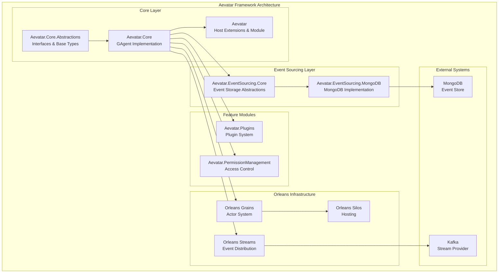
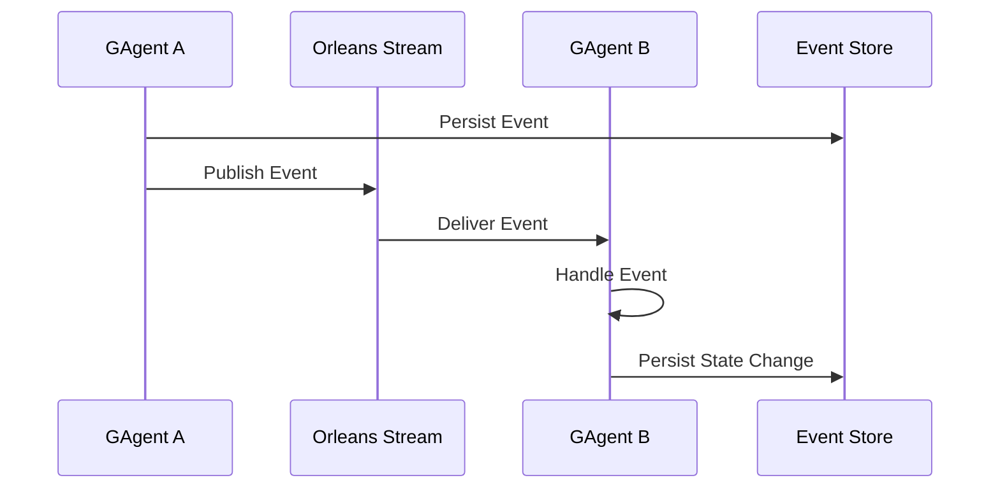
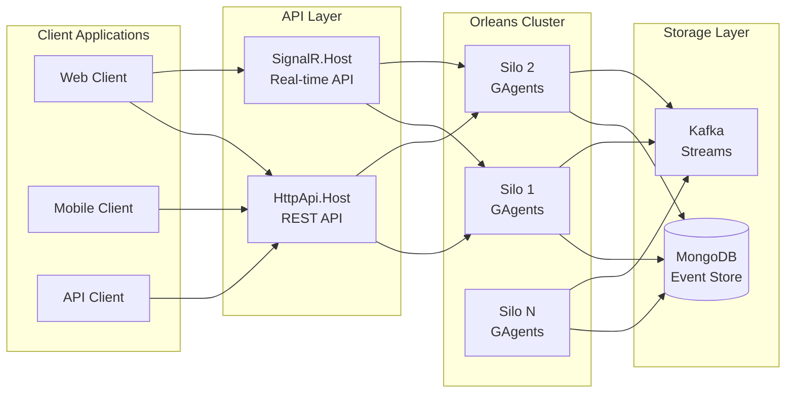
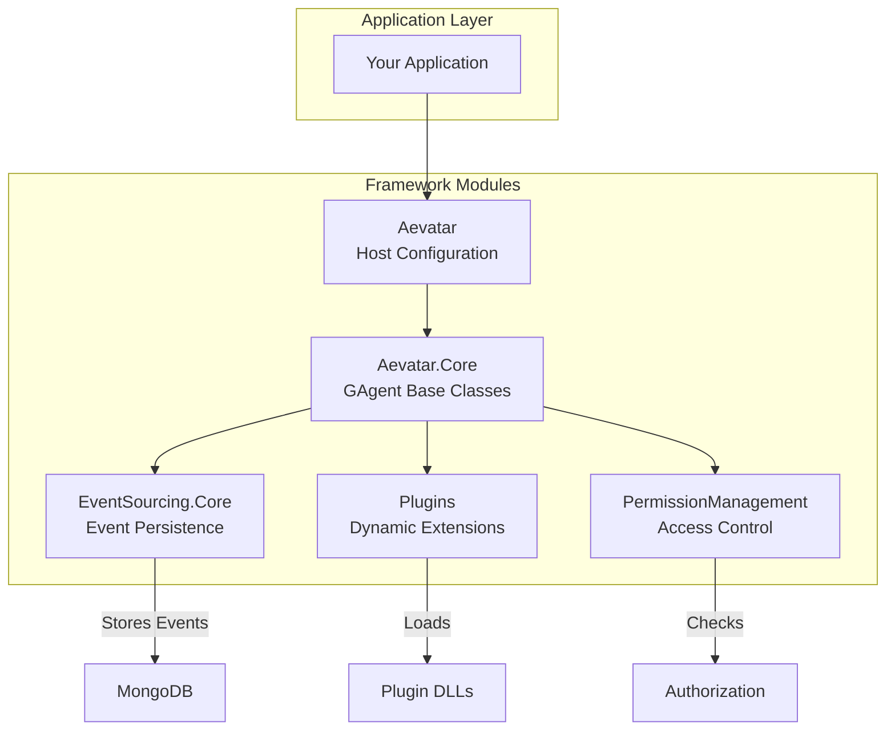
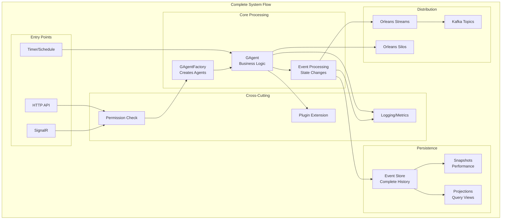

# Aevatar Framework Module Documentation

This directory contains detailed technical documentation for the major modules of the Aevatar Framework.

## Project Architecture Overview

The Aevatar Framework is a distributed actor-based framework built on Microsoft Orleans for building scalable event-sourced applications with AI-powered generative agents (GAgents).

### Architecture Diagram



### Core Concepts

#### 1. Generative Agents (GAgents)
GAgents are the fundamental building blocks of the framework, providing:
- **Event Sourcing**: Built on Orleans' `JournaledGrain` for reliable event storage and replay
- **State Management**: Strongly-typed state containers with automatic persistence
- **Event Publishing**: Support for publishing and subscribing to events between agents
- **Hierarchical Structure**: Parent-child relationships between agents for complex architectures

#### 2. Event-Driven Architecture


#### 3. Plugin System
The framework supports dynamic extensibility through a plugin system that allows:
- Runtime loading of plugin assemblies
- Multi-tenant plugin isolation
- Plugin lifecycle management
- Type discovery and registration

#### 4. State Management & Projections
- **State Persistence**: Automatic state persistence through event sourcing
- **State Projections**: Transform and aggregate events into queryable state views
- **State Dispatching**: Broadcast state changes to interested observers

### Key Features

1. **Distributed Actor Model**
   - Built on Microsoft Orleans for scalability
   - Location-transparent actors (GAgents)
   - Automatic failover and recovery

2. **Event Sourcing**
   - Complete audit trail of all state changes
   - Event replay for state reconstruction
   - Snapshot support for performance optimization
   - MongoDB and in-memory storage providers

3. **Streaming & Real-time Processing**
   - Orleans Streams for event distribution
   - Kafka integration for external streaming
   - Automatic stream subscription management

4. **Multi-tenancy Support**
   - Tenant isolation at the plugin level
   - Per-tenant configuration and customization
   - Secure tenant data separation

5. **Permission Management**
   - Attribute-based access control
   - Integration with ASP.NET Core authorization
   - Hierarchical permission structures

### Technology Stack

- **.NET 8.0+**: Core runtime
- **Microsoft Orleans**: Actor framework and distributed computing
- **MongoDB**: Default event store implementation
- **Apache Kafka**: External streaming provider
- **ASP.NET Core**: Web hosting and API layer
- **ABP Framework**: Module system and dependency injection

### Design Patterns

1. **Actor Model**: Each GAgent is an independent actor with its own state and message processing
2. **Event Sourcing**: All state changes are captured as events
3. **CQRS**: Command and query separation through events and projections
4. **Observer Pattern**: Event subscription and notification system
5. **Plugin Architecture**: Extensibility through dynamically loaded modules
6. **Repository Pattern**: Abstraction over data persistence

### Deployment Architecture



### Usage Patterns

#### Creating a GAgent

```csharp
[GAgent]
public class MyAgent : GAgentBase<MyState, MyStateLogEvent>
{
    public MyAgent(ILogger logger) : base(logger)
    {
    }

    public override async Task<string> GetDescriptionAsync()
    {
        return "My Custom Agent";
    }

    [EventHandler]
    public async Task HandleCustomEventAsync(CustomEvent @event)
    {
        // Handle the event
        State.ProcessCount++;
        await ConfirmEvents();
    }
}
```

#### Agent Hierarchy and Communication

```csharp
// Parent agent registering child agents
var parentAgent = await gAgentFactory.GetGAgentAsync<IParentAgent>(parentId);
var childAgent = await gAgentFactory.GetGAgentAsync<IChildAgent>(childId);

await parentAgent.RegisterAsync(childAgent);

// Publishing events
await parentAgent.PublishAsync(new ProcessingEvent 
{ 
    Data = "Important data" 
});
```

#### Plugin Development

```csharp
[PluginGAgent]
public class CustomPlugin : PluginGAgentBase<PluginState>
{
    public override Task<string> GetDescriptionAsync()
    {
        return Task.FromResult("Custom Plugin for Processing");
    }
    
    [EventHandler]
    public async Task HandlePluginEventAsync(PluginEvent @event)
    {
        // Plugin-specific logic
    }
}
```

### Module Integration

The framework modules work together to provide a comprehensive solution:



### Performance Considerations

1. **Event Sourcing Optimization**
   - Implement snapshots for agents with long event histories
   - Use batch processing for high-throughput scenarios
   - Configure appropriate event retention policies

2. **Streaming Performance**
   - Tune Kafka batch sizes and compression
   - Implement proper backpressure handling
   - Use Orleans stream filters for selective subscription

3. **Orleans Configuration**
   - Configure appropriate grain placement strategies
   - Set proper activation collection timeouts
   - Use grain call filters for cross-cutting concerns

### Future Roadmap

Based on the project tracker, upcoming enhancements include:
- Exception handling and publishing mechanism for GAgent EventHandlers
- Kafka stream optimization for better performance
- End-to-end GAgent streaming implementation
- Optimized GAgent publish logic
- Enhanced placement strategies for projection grains

## Framework Overview - How It All Works Together

The Aevatar Framework modules form a cohesive system for building distributed, event-driven applications with AI-powered agents:



### Key Integration Points

1. **Agent Creation Flow**
   - Client requests agent creation through API
   - PermissionManagement validates access rights
   - GAgentFactory creates agent with appropriate plugins
   - Agent initializes with event sourcing from EventSourcing.Core
   - Agent registers with Orleans for distribution

2. **Event Processing Pipeline**
   - Agent receives event through Orleans Streams
   - Plugin system allows custom event handlers
   - State changes are persisted to MongoDB
   - Events are published to Kafka for external consumers
   - Projections update query models

3. **Multi-Tenant Plugin Architecture**
   - Plugins are loaded per tenant at runtime
   - Each tenant can have custom agent behaviors
   - Plugin isolation ensures security
   - Shared core functionality reduces duplication

4. **Scalability Through Orleans**
   - Agents are distributed across Orleans silos
   - Location transparency for agent communication
   - Automatic failover and recovery
   - Stream-based communication for loose coupling

### Getting Started

To use the Aevatar Framework:

1. **Define Your Domain**
   ```csharp
   public class MyState : StateBase { }
   public class MyEvent : EventBase { }
   ```

2. **Create Your Agent**
   ```csharp
   [GAgent]
   public class MyAgent : GAgentBase<MyState, MyEvent> { }
   ```

3. **Configure Orleans Host**
   ```csharp
   hostBuilder.UseOrleans(siloBuilder =>
   {
       siloBuilder.UseAevatar();
   });
   ```

4. **Add Required Services**
   ```csharp
   services.AddAevatar()
           .AddEventSourcingMongoDB()
           .AddPluginSystem()
           .AddPermissionManagement();
   ```

5. **Use GAgentFactory to Create/Retrieve Agents**
   ```csharp
   // Inject IGAgentFactory
   public class MyService
   {
       private readonly IGAgentFactory _gAgentFactory;
       
       public MyService(IGAgentFactory gAgentFactory)
       {
           _gAgentFactory = gAgentFactory;
       }
       
       public async Task<MyAgent> GetAgentAsync(Guid agentId)
       {
           return await _gAgentFactory.GetGAgentAsync<MyAgent>(agentId);
       }
   }
   ```

## Available Module Documentation

- [Aevatar.Core](./Aevatar.Core.md) - Core framework components for Generative Agents
- [Aevatar.EventSourcing.Core](./Aevatar.EventSourcing.Core.md) - Event sourcing implementation
- [Aevatar.Plugins](./Aevatar.Plugins.md) - Plugin system for extending agent capabilities
- [Aevatar.PermissionManagement](./Aevatar.PermissionManagement.md) - Access control system for agents and resources

## Documentation Format

Each module documentation includes:

1. **Data Flow Sequence Diagram** - Illustrates the typical flow of data and interactions between components
2. **Relationship Diagram** - Shows the class relationships and dependencies within the module
3. **Module Explanation** - Detailed overview of the module's purpose, components, and capabilities

The diagrams are provided in Mermaid format, which can be rendered in GitHub and other Markdown viewers that support Mermaid syntax. 