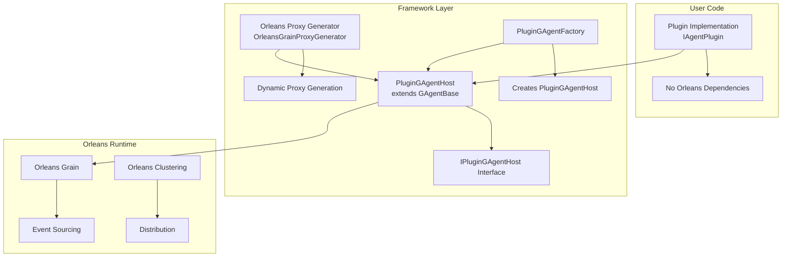

# Complete Plugin Architecture Flow

The Orleans Proxy Generator is actually part of a larger plugin architecture. Here's the complete flow:

## Architecture Overview



## Complete Flow Explanation

### 1. PluginGAgentHost - The Bridge

The `PluginGAgentHost` is the actual bridge between plugins and Orleans:

```csharp
// This IS a GAgent that extends GAgentBase
[GAgent]
public class PluginGAgentHost : GAgentBase<PluginAgentState, PluginStateLogEvent>, IPluginGAgentHost
{
    private IAgentPlugin? _plugin;  // Hosts the user plugin
    
    // Routes method calls to the plugin
    public async Task<object?> CallPluginMethodAsync(string methodName, object?[] parameters)
    {
        return await _plugin.ExecuteMethodAsync(methodName, parameters);
    }
    
    // Handles Orleans events and routes to plugin
    protected override async Task ForwardEventAsync(EventWrapperBase eventWrapper)
    {
        await base.ForwardEventAsync(eventWrapper); // Orleans handling
        // Route to plugin
        await _plugin.HandleEventAsync(pluginEvent);
    }
}
```

### 2. Two Approaches for Plugin Integration

#### Approach A: Direct Plugin Hosting (Current Implementation)
```
Client → PluginGAgentHost (GAgent) → IAgentPlugin → Business Logic
```

- `PluginGAgentHost` extends `GAgentBase` 
- Provides full Orleans features (event sourcing, clustering, etc.)
- Routes calls to the hosted plugin

#### Approach B: Orleans Proxy Generator (Additional Layer)
```
Client → Orleans Grain Interface → Generated Proxy → IAgentPlugin → Business Logic
```

- Dynamic proxy implements grain interface
- Routes to plugin without GAgent inheritance
- More flexible but less integrated

### 3. Factory Pattern

```csharp
public class PluginGAgentFactory : IPluginGAgentFactory
{
    public async Task<IPluginGAgentHost> CreatePluginGAgentAsync(
        Guid agentId, 
        string pluginName, 
        string? pluginVersion = null)
    {
        // Creates PluginGAgentHost grain
        var grain = _grainFactory.GetGrain<IPluginGAgentHost>(agentId);
        
        // Initializes with plugin configuration
        await grain.InitializePluginConfigurationAsync(pluginName, pluginVersion, null);
        
        return grain;
    }
}
```

### 4. Complete Plugin Lifecycle

1. **Creation**: Factory creates `PluginGAgentHost` grain
2. **Loading**: Host loads plugin via `IAgentPluginLoader`
3. **Initialization**: Plugin initialized with `IAgentContext`
4. **Registration**: Plugin registered in `IAgentPluginRegistry`
5. **Method Routing**: Calls routed through `CallPluginMethodAsync`
6. **Event Handling**: Orleans events routed to plugin
7. **State Management**: Plugin state managed through Orleans

## Key Insight: Two Complementary Patterns

### Pattern 1: PluginGAgentHost (Host-Based)
- **Purpose**: Full GAgent integration with Orleans features
- **Benefits**: Event sourcing, state persistence, Orleans clustering
- **Usage**: When you want full Orleans/GAgent capabilities

### Pattern 2: Orleans Proxy Generator (Interface-Based)  
- **Purpose**: Direct grain interface implementation
- **Benefits**: Clean interface contracts, flexible routing
- **Usage**: When you want specific grain interfaces without GAgent overhead

## Recommended Usage

For most scenarios, use **PluginGAgentHost** because:
1. It provides complete Orleans integration
2. Full event sourcing and state management
3. Seamless clustering and distribution
4. Built-in plugin lifecycle management

Use **Orleans Proxy Generator** when:
1. You need specific grain interface contracts
2. You want minimal framework overhead
3. You're migrating existing Orleans grains to plugins

Both approaches successfully decouple user plugin logic from Orleans while providing different levels of integration!