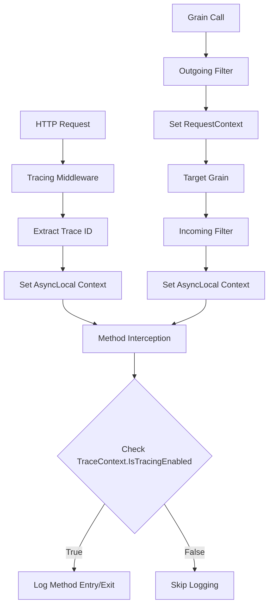

# Runtime Trace ID Control

## Overview

The Aevatar.Core.Interception library provides runtime control over tracing through a configurable trace ID system. This allows you to enable or disable tracing for specific requests or operations without restarting the application.

## Key Features

- **Runtime Control**: Enable/disable tracing without application restart
- **Trace ID Management**: Track specific trace IDs for selective tracing
- **HTTP Integration**: Extract trace IDs from HTTP requests (headers, query params, route values)
- **Orleans Integration**: Propagate trace context through grain-to-grain calls
- **Performance Optimized**: Minimal overhead when tracing is disabled
- **REST API**: HTTP endpoints for runtime trace management

## Architecture

### Trace Context Flow



### Components

1. **TraceContext**: Static class managing trace state across HTTP and Orleans contexts
2. **ITraceManager**: Service interface for runtime trace management
3. **TraceManager**: Implementation wrapping TraceContext functionality
4. **TraceManagementController**: HTTP API for runtime trace management
5. **InterceptorAttribute**: Modified to check TraceContext before logging

## Setup and Configuration

### 1. Service Registration

```csharp
// In Program.cs or Startup.cs
using Aevatar.Core.Interception;

var builder = WebApplication.CreateBuilder(args);

// Add interception services
builder.Services.AddInterception();

// Add tracing services
builder.Services.AddTracing(config =>
{
    config.Mode = TraceMode.Fody;
    config.EnablePerformanceMetrics = true;
    config.EnableMethodLogging = true;
});

var app = builder.Build();

// Add tracing middleware (if using HTTP)
app.UseMiddleware<TracingMiddleware>();

app.Run();
```

### 2. HTTP Middleware Setup

```csharp
public class TracingMiddleware
{
    private readonly RequestDelegate _next;
    
    public TracingMiddleware(RequestDelegate next)
    {
        _next = next;
    }
    
    public async Task InvokeAsync(HttpContext context)
    {
        // Extract trace ID from various sources
        var traceId = ExtractTraceId(context);
        
        if (!string.IsNullOrEmpty(traceId))
        {
            // Enable tracing for this trace ID
            TraceContext.EnableTracing(traceId);
        }
        
        await _next(context);
    }
    
    private string? ExtractTraceId(HttpContext context)
    {
        // Try multiple sources in order of preference
        return context.Request.Query["traceId"].FirstOrDefault()
            ?? context.Request.Headers["X-Trace-Id"].FirstOrDefault()
            ?? context.Request.Headers["X-Correlation-Id"].FirstOrDefault()
            ?? context.Request.RouteValues["traceId"]?.ToString();
    }
}
```

### 3. Orleans Filter Setup

```csharp
// Outgoing call filter
public class OutgoingTracingFilter : IOutgoingGrainCallFilter
{
    public async Task Invoke(IOutgoingGrainCallContext context)
    {
        // Propagate trace context to Orleans RequestContext
        TraceContext.PropagateToOrleansContext();
        await context.Invoke();
    }
}

// Incoming call filter
public class IncomingTracingFilter : IIncomingGrainCallFilter
{
    public async Task Invoke(IIncomingGrainCallContext context)
    {
        // Read trace context from Orleans RequestContext
        TraceContext.ReadFromOrleansContext();
        await context.Invoke();
    }
}

// Register filters in Program.cs
builder.Services.AddSingleton<IOutgoingGrainCallFilter, OutgoingTracingFilter>();
builder.Services.AddSingleton<IIncomingGrainCallFilter, IncomingTracingFilter>();
```

## Usage Examples

### 1. HTTP Request with Trace ID

```bash
# Enable tracing for a specific request
curl -H "X-Trace-Id: user-session-123" \
     -H "X-Correlation-Id: req-456" \
     http://localhost:5000/api/users

# Or via query parameter
curl "http://localhost:5000/api/users?traceId=user-session-123"

# Or via route parameter
curl "http://localhost:5000/api/trace/user-session-123/users"
```

### 2. Runtime Trace Management via HTTP API

```bash
# Get current configuration
GET /api/TraceManagement/config

# Get tracked trace IDs
GET /api/TraceManagement/tracked-ids

# Get active trace ID
GET /api/TraceManagement/active-trace-id

# Check if tracing is enabled
GET /api/TraceManagement/enabled

# Enable tracing for a trace ID
POST /api/TraceManagement/enable
{
    "traceId": "user-session-123",
    "enabled": true
}

# Disable tracing for a trace ID
POST /api/TraceManagement/disable
{
    "traceId": "user-session-123"
}

# Add trace ID to tracking
POST /api/TraceManagement/add-tracked-id
{
    "traceId": "user-session-456",
    "enabled": true
}

# Remove trace ID from tracking
POST /api/TraceManagement/remove-tracked-id
{
    "traceId": "user-session-456"
}

# Set active trace ID
POST /api/TraceManagement/set-active-trace-id
{
    "traceId": "user-session-789"
}

# Clear trace context
POST /api/TraceManagement/clear
```

### 3. Programmatic Trace Management

```csharp
public class UserService
{
    private readonly ITraceManager _traceManager;
    
    public UserService(ITraceManager traceManager)
    {
        _traceManager = traceManager;
    }
    
    public async Task<User> GetUserAsync(string userId, string? traceId = null)
    {
        // Enable tracing for this operation if trace ID provided
        if (!string.IsNullOrEmpty(traceId))
        {
            _traceManager.EnableTracing(traceId);
        }
        
        // Method will be intercepted and logged if tracing is enabled
        var user = await FetchUserFromDatabaseAsync(userId);
        
        return user;
    }
    
    [Interceptor]
    private async Task<User> FetchUserFromDatabaseAsync(string userId)
    {
        // This method will be intercepted and logged if tracing is enabled
        await Task.Delay(100); // Simulate database call
        return new User { Id = userId, Name = "John Doe" };
    }
}
```

### 4. Orleans Grain Integration

```csharp
public class UserGrain : Grain, IUserGrain
{
    [Interceptor]
    public async Task<User> GetUserAsync(string userId)
    {
        // This method will be intercepted if tracing is enabled
        // Trace context is automatically propagated from the caller
        
        var user = await FetchUserDataAsync(userId);
        return user;
    }
    
    [Interceptor]
    private async Task<User> FetchUserDataAsync(string userId)
    {
        // This method will also be intercepted if tracing is enabled
        await Task.Delay(100);
        return new User { Id = userId, Name = "Jane Doe" };
    }
}
```

## Configuration Options

### TraceConfig Properties

```csharp
public class TraceConfig
{
    public bool Enabled { get; set; } = true;                    // Global tracing enable/disable
    public HashSet<string> TrackedIds { get; set; } = new();     // Specific trace IDs to track
}
```

### Environment Variables

```bash
# Enable tracing globally
export AVATAR_TRACING_ENABLED=true
```

### appsettings.json

```json
{
  "Tracing": {
    "Mode": "Fody",
    "EnablePerformanceMetrics": true,
    "EnableMethodLogging": true,
    "TraceConfig": {
      "Enabled": true,
      "TrackedIds": ["user-session-123", "admin-ops"]
    }
  }
}
```

## Performance Considerations

### Overhead When Disabled

- **Tracing Disabled**: Minimal overhead (just a boolean check)
- **Tracing Enabled**: Low overhead (context lookup + logging)

### Optimization Tips

1. **Selective Tracing**: Only enable tracing for specific trace IDs
2. **Async Operations**: Use async/await to minimize blocking
3. **Batch Operations**: Group related operations under the same trace ID

## Monitoring and Observability

### Health Checks

```csharp
public class TracingHealthCheck : IHealthCheck
{
    private readonly ITraceManager _traceManager;
    
    public TracingHealthCheck(ITraceManager traceManager)
    {
        _traceManager = traceManager;
    }
    
    public Task<HealthCheckResult> CheckHealthAsync(
        HealthCheckContext context, 
        CancellationToken cancellationToken = default)
    {
        try
        {
            var isEnabled = _traceManager.IsTracingEnabled();
            var trackedIds = _traceManager.GetTrackedIds();
            
            var data = new Dictionary<string, object>
            {
                ["TracingEnabled"] = isEnabled,
                ["TrackedIdsCount"] = trackedIds.Count,
                ["ActiveTraceId"] = _traceManager.GetActiveTraceId() ?? "none"
            };
            
            return Task.FromResult(HealthCheckResult.Healthy("Tracing system is healthy", data));
        }
        catch (Exception ex)
        {
            return Task.FromResult(HealthCheckResult.Unhealthy("Tracing system is unhealthy", ex));
        }
    }
}

// Register health check
builder.Services.AddHealthChecks()
    .AddCheck<TracingHealthCheck>("tracing");
```

### Metrics

The system provides several metrics that can be collected:

- **Trace ID Count**: Number of active trace IDs
- **Tracing Enabled Rate**: Percentage of time tracing is enabled
- **Context Propagation Success Rate**: Success rate of context propagation
- **Trace ID Lifecycle**: Creation, activation, and removal of trace IDs

## Troubleshooting

### Common Issues

1. **Tracing Not Working**
   - Check if `TraceContext.IsTracingEnabled` returns true
   - Verify trace ID is in the `TrackedIds` set
   - Ensure `Enabled` flag is true in `TraceConfig`

2. **Context Not Propagating**
   - Verify Orleans filters are registered
   - Check if `IsOrleansContextAvailable()` returns true
   - Ensure `RequestContext` keys are consistent

3. **Performance Issues**
   - Limit number of tracked trace IDs
   - Use async operations to minimize blocking

### Debug Mode

Enable debug logging to troubleshoot issues:

```json
{
  "Logging": {
    "LogLevel": {
      "Aevatar.Core.Interception": "Debug"
    }
  }
}
```

## Best Practices

1. **Trace ID Naming**: Use descriptive, hierarchical names (e.g., `user-123-session-456`)
2. **Lifecycle Management**: Clean up trace IDs when no longer needed
3. **Security**: Validate trace IDs to prevent injection attacks
4. **Monitoring**: Set up alerts for tracing system health
5. **Documentation**: Document trace ID conventions for your team

## Migration Guide

### From Static Tracing Systems

1. **Replace static flags** with `TraceContext.IsTracingEnabled`
2. **Add trace ID extraction** in HTTP middleware
3. **Register Orleans filters** for grain-to-grain propagation
4. **Update configuration** to use new `TraceConfig` structure

### From Other Tracing Systems

1. **Map trace IDs** from your existing system
2. **Adapt middleware** to extract trace IDs in your format
3. **Set up health checks** for monitoring

## Future Enhancements

- **Distributed Tracing**: Integration with OpenTelemetry and Jaeger
- **Trace ID Persistence**: Save/restore trace configuration across restarts
- **Trace Analytics**: Analyze trace patterns and performance impact
- **Multi-Tenant Support**: Separate trace configurations per tenant
