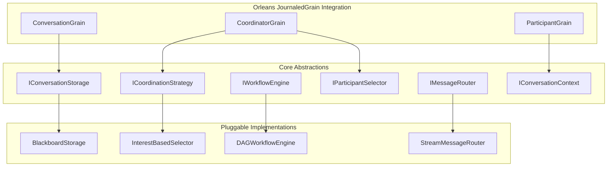

# GroupChat Module - Modular Design Proposal

## Executive Summary

This document proposes a comprehensive modular redesign of the GroupChat module to enhance separation of concerns, improve extensibility, and maintain full compatibility with Orleans JournaledGrain. The proposal introduces a plugin-based architecture that allows for runtime customization of coordination strategies, storage backends, and messaging patterns while preserving the robust event sourcing and state management capabilities of the Orleans framework.

## Current Design Analysis

### Identified Limitations

1. **Tight Coupling**: Components are heavily interdependent, making it difficult to modify or extend individual parts
2. **Monolithic Coordinators**: Single coordinator classes handle multiple responsibilities (timing, selection, messaging)
3. **Fixed Message Storage**: Blackboard is the only storage option, limiting flexibility for different use cases
4. **Hardcoded Workflows**: DAG workflow logic is built directly into coordinator implementations
5. **Limited Extensibility**: Adding new coordination strategies requires modifying core classes

### Architecture Pain Points

- Difficult to test components in isolation
- Cannot swap implementations without code changes
- Limited reusability across different conversation types
- Hard to add new features without risking existing functionality

## Proposed Modular Architecture

### Architecture Overview



### Core Design Principles

1. **Interface-First Design**: All major components defined through interfaces
2. **Plugin Architecture**: Runtime registration and discovery of implementations
3. **Event-Driven Communication**: Loose coupling through event streams
4. **State Projections**: Different views of state for different strategies
5. **Orleans Integration**: Full compatibility with JournaledGrain event sourcing

## Core Abstractions

### 1. Conversation Storage Interface

```csharp
// ABOUTME: Core conversation storage abstraction for pluggable storage implementations
// ABOUTME: Enables different storage strategies while maintaining Orleans JournaledGrain compatibility

[GenerateSerializer]
public interface IConversationStorage : IGrainWithGuidKey
{
    Task<ConversationStorageState> GetStateAsync();
    Task StoreMessageAsync(ConversationMessage message);
    Task<List<ConversationMessage>> GetMessagesAsync(ConversationQuery query);
    Task ClearAsync();
    Task<ConversationMetadata> GetMetadataAsync();
}

[GenerateSerializer]
public abstract class ConversationStorageState : StateBase
{
    [Id(0)] public Guid ConversationId { get; set; }
    [Id(1)] public DateTime CreatedAt { get; set; }
    [Id(2)] public ConversationStatus Status { get; set; }
    [Id(3)] public Dictionary<string, object> Metadata { get; set; } = new();
}
```

### 2. Coordination Strategy Interface

```csharp
// ABOUTME: Coordination strategy abstraction for pluggable coordination algorithms
// ABOUTME: Separates coordination logic from grain lifecycle management

public interface ICoordinationStrategy
{
    Task<CoordinationDecision> DecideNextActionAsync(CoordinationContext context);
    Task<ParticipantSelection> SelectParticipantAsync(IEnumerable<IParticipant> participants, CoordinationContext context);
    Task HandleParticipantResponseAsync(ParticipantResponse response, CoordinationContext context);
}

[GenerateSerializer]
public class CoordinationContext
{
    [Id(0)] public Guid ConversationId { get; set; }
    [Id(1)] public long Term { get; set; }
    [Id(2)] public List<ConversationMessage> RecentMessages { get; set; } = new();
    [Id(3)] public Dictionary<Guid, ParticipantState> Participants { get; set; } = new();
    [Id(4)] public Dictionary<string, object> Properties { get; set; } = new();
}
```

### 3. Message Routing Interface

```csharp
public interface IMessageRouter
{
    Task RouteEventAsync<T>(T @event) where T : ConversationEventBase;
    Task SubscribeAsync<T>(Guid subscriberId, Func<T, Task> handler) where T : ConversationEventBase;
    Task UnsubscribeAsync<T>(Guid subscriberId) where T : ConversationEventBase;
}
```

### 4. Workflow Engine Interface

```csharp
public interface IWorkflowEngine
{
    Task<WorkflowState> GetCurrentStateAsync(Guid conversationId);
    Task<WorkflowNode?> GetNextWorkUnitAsync(WorkflowState state);
    Task<bool> ValidateWorkflowAsync(WorkflowDefinition definition);
    Task TransitionNodeAsync(Guid conversationId, string nodeId, NodeTransition transition);
}
```

## Modular Component Design

### 1. Modular Coordinator Grain

```csharp
// ABOUTME: Modular coordinator grain that delegates to pluggable strategies
// ABOUTME: Uses Orleans JournaledGrain for reliable state management and event sourcing

[GAgent]
public class ModularCoordinatorGrain : JournaledGrain<ModularCoordinatorState, ICoordinatorEvent>, 
    IModularCoordinatorGrain
{
    private readonly ICoordinationStrategyFactory _strategyFactory;
    private readonly IConversationStorage _storage;
    private readonly IMessageRouter _messageRouter;
    private readonly IParticipantSelector _participantSelector;
    
    public ModularCoordinatorGrain(
        ICoordinationStrategyFactory strategyFactory,
        IConversationStorage storage,
        IMessageRouter messageRouter,
        IParticipantSelector participantSelector)
    {
        _strategyFactory = strategyFactory;
        _storage = storage;
        _messageRouter = messageRouter;
        _participantSelector = participantSelector;
    }

    public async Task<CoordinationResult> CoordinateAsync(CoordinationRequest request)
    {
        var strategy = await _strategyFactory.CreateStrategyAsync(State.StrategyType);
        var context = await BuildCoordinationContextAsync();
        
        var decision = await strategy.DecideNextActionAsync(context);
        
        await ProcessCoordinationDecision(decision);
        
        return new CoordinationResult
        {
            Success = true,
            NextAction = decision.Action,
            SelectedParticipant = decision.SelectedParticipant
        };
    }

    protected override void OnStateApplied(ICoordinatorEvent @event)
    {
        switch (@event)
        {
            case CoordinationStrategyChangedEvent strategyChanged:
                State.StrategyType = strategyChanged.NewStrategyType;
                State.StrategyConfiguration = strategyChanged.Configuration;
                break;
                
            case ParticipantSelectedEvent participantSelected:
                State.CurrentSpeaker = participantSelected.ParticipantId;
                State.Term++;
                break;
                
            case CoordinationCompletedEvent completed:
                State.Status = CoordinationStatus.Completed;
                State.CompletedAt = completed.Timestamp;
                break;
        }
    }
}

[GenerateSerializer]
public class ModularCoordinatorState : StateBase
{
    [Id(0)] public Guid ConversationId { get; set; }
    [Id(1)] public string StrategyType { get; set; }
    [Id(2)] public Dictionary<string, object> StrategyConfiguration { get; set; } = new();
    [Id(3)] public long Term { get; set; }
    [Id(4)] public Guid? CurrentSpeaker { get; set; }
    [Id(5)] public CoordinationStatus Status { get; set; }
    [Id(6)] public DateTime? CompletedAt { get; set; }
    [Id(7)] public List<Guid> RegisteredParticipants { get; set; } = new();
}
```

### 2. Plugin-Based Strategy System

```csharp
// ABOUTME: Plugin registry for dynamic loading of coordination strategies
// ABOUTME: Supports runtime registration and Orleans grain lifecycle integration

public interface ICoordinationStrategyFactory
{
    Task<ICoordinationStrategy> CreateStrategyAsync(string strategyType);
    Task RegisterStrategyAsync<T>(string strategyType) where T : class, ICoordinationStrategy;
    Task<IEnumerable<string>> GetAvailableStrategiesAsync();
}

[GenerateSerializer]
public class PluginBasedStrategyFactory : ICoordinationStrategyFactory
{
    private readonly IServiceProvider _serviceProvider;
    private readonly Dictionary<string, Type> _strategies = new();
    
    public async Task<ICoordinationStrategy> CreateStrategyAsync(string strategyType)
    {
        if (!_strategies.TryGetValue(strategyType, out var strategyClass))
        {
            throw new InvalidOperationException($"Strategy type '{strategyType}' not registered");
        }
        
        return (ICoordinationStrategy)ActivatorUtilities.CreateInstance(_serviceProvider, strategyClass);
    }
    
    public async Task RegisterStrategyAsync<T>(string strategyType) where T : class, ICoordinationStrategy
    {
        _strategies[strategyType] = typeof(T);
    }
}
```

## Built-in Strategy Implementations

### 1. Interest-Based Coordination Strategy

```csharp
public class InterestBasedCoordinationStrategy : ICoordinationStrategy
{
    public async Task<CoordinationDecision> DecideNextActionAsync(CoordinationContext context)
    {
        var participantsWithInterest = await EvaluateParticipantInterestAsync(context);
        
        if (participantsWithInterest.Any(p => p.InterestScore >= 100))
        {
            var topInterested = participantsWithInterest.First(p => p.InterestScore >= 100);
            return new CoordinationDecision
            {
                Action = CoordinationAction.SelectSpeaker,
                SelectedParticipant = topInterested.ParticipantId,
                Reasoning = "High interest priority selection"
            };
        }
        
        return await DefaultRandomSelectionAsync(participantsWithInterest);
    }
}
```

### 2. Workflow-Based Coordination Strategy

```csharp
public class WorkflowBasedCoordinationStrategy : ICoordinationStrategy
{
    private readonly IWorkflowEngine _workflowEngine;
    
    public async Task<CoordinationDecision> DecideNextActionAsync(CoordinationContext context)
    {
        var workflowState = await _workflowEngine.GetCurrentStateAsync(context.ConversationId);
        var nextWorkUnit = await _workflowEngine.GetNextWorkUnitAsync(workflowState);
        
        if (nextWorkUnit == null)
        {
            return new CoordinationDecision 
            { 
                Action = CoordinationAction.CompleteConversation,
                Reasoning = "Workflow completed"
            };
        }
        
        return new CoordinationDecision
        {
            Action = CoordinationAction.SelectSpeaker,
            SelectedParticipant = nextWorkUnit.AssignedParticipant,
            Context = nextWorkUnit.Context,
            Reasoning = $"Workflow step: {nextWorkUnit.Name}"
        };
    }
}
```

## Event-Driven Messaging Architecture

### Event Contracts

```csharp
// ABOUTME: Event-driven messaging contracts for loose coupling between components
// ABOUTME: Uses Orleans streams for reliable event delivery and JournaledGrain for persistence

// Base conversation events using Orleans JournaledGrain event sourcing
[GenerateSerializer]
public abstract class ConversationEventBase : StateLogEventBase<ConversationEventBase>
{
    [Id(0)] public Guid ConversationId { get; set; }
    [Id(1)] public DateTime Timestamp { get; set; } = DateTime.UtcNow;
    [Id(2)] public Guid SourceGrainId { get; set; }
}

[GenerateSerializer]
public class ParticipantJoinedEvent : ConversationEventBase
{
    [Id(0)] public Guid ParticipantId { get; set; }
    [Id(1)] public string ParticipantName { get; set; }
    [Id(2)] public ParticipantCapabilities Capabilities { get; set; }
}

[GenerateSerializer]
public class MessagePostedEvent : ConversationEventBase
{
    [Id(0)] public Guid AuthorId { get; set; }
    [Id(1)] public ConversationMessage Message { get; set; }
    [Id(2)] public long Term { get; set; }
}

[GenerateSerializer]
public class CoordinationDecisionEvent : ConversationEventBase
{
    [Id(0)] public CoordinationDecision Decision { get; set; }
    [Id(1)] public string StrategyType { get; set; }
    [Id(2)] public long Term { get; set; }
}
```

### Stream-Based Message Router

```csharp
[GenerateSerializer]
public class StreamBasedMessageRouter : IMessageRouter
{
    private readonly IStreamProvider _streamProvider;
    private readonly Dictionary<Type, List<IAsyncStream<ConversationEventBase>>> _streams = new();
    
    public async Task RouteEventAsync<T>(T @event) where T : ConversationEventBase
    {
        var streamId = StreamId.Create("conversation-events", @event.ConversationId);
        var stream = _streamProvider.GetStream<ConversationEventBase>(streamId);
        
        await stream.OnNextAsync(@event);
    }
    
    public async Task SubscribeAsync<T>(Guid subscriberId, Func<T, Task> handler) where T : ConversationEventBase
    {
        var streamId = StreamId.Create("conversation-events", subscriberId);
        var stream = _streamProvider.GetStream<ConversationEventBase>(streamId);
        
        await stream.SubscribeAsync((evt, token) => 
        {
            if (evt is T typedEvent)
            {
                return handler(typedEvent);
            }
            return Task.CompletedTask;
        });
    }
}
```

## Modular State Management

### State Management Interface

```csharp
// ABOUTME: Modular state management with Orleans JournaledGrain integration
// ABOUTME: Provides state projections and snapshots for different coordination strategies

public interface IConversationStateManager
{
    Task<TState> GetStateAsync<TState>() where TState : ConversationStateBase, new();
    Task<TProjection> GetProjectionAsync<TProjection>() where TProjection : class;
    Task SaveSnapshotAsync<TState>(TState state) where TState : ConversationStateBase;
    Task ApplyEventAsync(ConversationEventBase @event);
}

[GenerateSerializer]
public abstract class ConversationStateBase : StateBase
{
    [Id(0)] public Guid ConversationId { get; set; }
    [Id(1)] public long Version { get; set; }
    [Id(2)] public DateTime LastUpdated { get; set; }
    
    public abstract void Apply(ConversationEventBase @event);
}
```

### Strategy-Specific State Implementations

```csharp
// Interest-Based Strategy State
[GenerateSerializer]
public class InterestBasedState : ConversationStateBase
{
    [Id(0)] public Dictionary<Guid, int> ParticipantInterestScores { get; set; } = new();
    [Id(1)] public List<InterestEvaluation> RecentEvaluations { get; set; } = new();
    [Id(2)] public DateTime LastInterestCheck { get; set; }
    
    public override void Apply(ConversationEventBase @event)
    {
        switch (@event)
        {
            case InterestEvaluationEvent interestEvent:
                ParticipantInterestScores[interestEvent.ParticipantId] = interestEvent.Score;
                RecentEvaluations.Add(new InterestEvaluation 
                { 
                    ParticipantId = interestEvent.ParticipantId, 
                    Score = interestEvent.Score,
                    Timestamp = interestEvent.Timestamp 
                });
                break;
        }
        
        LastUpdated = @event.Timestamp;
        Version++;
    }
}

// Workflow Strategy State
[GenerateSerializer]
public class WorkflowState : ConversationStateBase
{
    [Id(0)] public List<WorkflowNode> Nodes { get; set; } = new();
    [Id(1)] public Dictionary<string, WorkflowNodeStatus> NodeStatuses { get; set; } = new();
    [Id(2)] public string? CurrentNodeId { get; set; }
    [Id(3)] public WorkflowExecutionStatus ExecutionStatus { get; set; }
    
    public override void Apply(ConversationEventBase @event)
    {
        switch (@event)
        {
            case WorkflowNodeStartedEvent nodeStarted:
                NodeStatuses[nodeStarted.NodeId] = WorkflowNodeStatus.InProgress;
                CurrentNodeId = nodeStarted.NodeId;
                break;
                
            case WorkflowNodeCompletedEvent nodeCompleted:
                NodeStatuses[nodeCompleted.NodeId] = WorkflowNodeStatus.Completed;
                CurrentNodeId = null;
                break;
        }
        
        LastUpdated = @event.Timestamp;
        Version++;
    }
}
```

### JournaledGrain State Management

```csharp
[GAgent]
public class ConversationStateGrain : JournaledGrain<ConversationStateBase, ConversationEventBase>, 
    IConversationStateGrain
{
    private readonly Dictionary<Type, object> _stateProjections = new();
    
    public async Task<TState> GetStateAsync<TState>() where TState : ConversationStateBase, new()
    {
        if (State is TState typedState)
        {
            return typedState;
        }
        
        // Create new state instance if type doesn't match
        var newState = new TState { ConversationId = this.GetPrimaryKey() };
        
        // Replay events to rebuild state
        await foreach (var evt in RetrieveConfirmedEvents(0, Version))
        {
            newState.Apply(evt.Event);
        }
        
        return newState;
    }
    
    protected override void OnStateApplied(ConversationEventBase @event)
    {
        State.Apply(@event);
        
        // Update projections
        foreach (var projection in _stateProjections.Values)
        {
            if (projection is IEventApplicable applicable)
            {
                applicable.Apply(@event);
            }
        }
    }
}
```

## Orleans JournaledGrain Integration

### Enhanced Base Grain Classes

```csharp
// ABOUTME: Enhanced base grain that integrates modular components with Orleans JournaledGrain
// ABOUTME: Provides event sourcing, state management, and plugin support

public abstract class ModularConversationGrain<TState, TEvent> : JournaledGrain<TState, TEvent>
    where TState : ConversationStateBase, new()
    where TEvent : ConversationEventBase
{
    protected IConversationStorage Storage { get; }
    protected IMessageRouter MessageRouter { get; }
    protected IConversationStateManager StateManager { get; }
    
    protected ModularConversationGrain(
        IConversationStorage storage,
        IMessageRouter messageRouter,
        IConversationStateManager stateManager)
    {
        Storage = storage;
        MessageRouter = messageRouter;
        StateManager = stateManager;
    }
    
    protected override async Task OnActivateAsync(CancellationToken cancellationToken)
    {
        await base.OnActivateAsync(cancellationToken);
        
        // Initialize modular components
        await InitializeModularComponentsAsync();
        
        // Subscribe to relevant events
        await SubscribeToEventsAsync();
    }
    
    protected virtual async Task InitializeModularComponentsAsync()
    {
        // Override in derived classes for custom initialization
    }
    
    protected virtual async Task SubscribeToEventsAsync()
    {
        await MessageRouter.SubscribeAsync<MessagePostedEvent>(
            this.GetPrimaryKey(), 
            HandleMessagePostedAsync);
    }
    
    protected abstract Task HandleMessagePostedAsync(MessagePostedEvent @event);
    
    protected override void OnStateApplied(TEvent @event)
    {
        // Apply to local state
        State.Apply(@event);
        
        // Route event to other components
        _ = Task.Run(async () => await MessageRouter.RouteEventAsync(@event));
    }
}
```

## Configuration System

### Modular Configuration

```csharp
// ABOUTME: Configuration system for modular components with Orleans-compatible serialization
// ABOUTME: Supports dynamic reconfiguration and strategy switching

[GenerateSerializer]
public class ModularConversationConfiguration
{
    [Id(0)] public string StorageType { get; set; } = "Blackboard";
    [Id(1)] public string CoordinationStrategy { get; set; } = "InterestBased";
    [Id(2)] public string MessageRouting { get; set; } = "Stream";
    [Id(3)] public Dictionary<string, object> StrategySettings { get; set; } = new();
    [Id(4)] public Dictionary<string, object> StorageSettings { get; set; } = new();
    [Id(5)] public List<string> EnabledPlugins { get; set; } = new();
}

public interface IModularConversationFactory
{
    Task<IModularCoordinatorGrain> CreateCoordinatorAsync(
        Guid conversationId, 
        ModularConversationConfiguration config);
        
    Task<IConversationStorage> CreateStorageAsync(
        string storageType, 
        Dictionary<string, object> settings);
        
    Task<ICoordinationStrategy> CreateStrategyAsync(
        string strategyType, 
        Dictionary<string, object> settings);
}
```

## Benefits of the Modular Design

### 1. Orleans JournaledGrain Integration
- **Event Sourcing**: Full event history with replay capabilities
- **State Persistence**: Automatic state snapshots and recovery
- **Cluster Resilience**: Built-in failover and state reconstruction
- **Performance**: Orleans-optimized state management and caching

### 2. Separation of Concerns
- **Storage**: Pluggable storage backends (Blackboard, Database, Cache)
- **Coordination**: Swappable coordination strategies (Interest-based, Workflow, Custom)
- **Messaging**: Configurable message routing (Streams, Direct, Pub/Sub)
- **State Management**: Strategy-specific state projections

### 3. Extensibility
- **Plugin System**: Runtime registration of new strategies
- **Event-Driven**: Loose coupling through event streams
- **Configuration**: Dynamic reconfiguration without restarts
- **Testing**: Easy mocking and isolated testing

### 4. Backward Compatibility
- **Migration Path**: Existing implementations can be wrapped as plugins
- **Gradual Adoption**: Components can be migrated incrementally
- **API Stability**: Core interfaces remain stable while implementations evolve

## Implementation Roadmap

### Phase 1: Core Abstractions (Weeks 1-2)
1. Define base interfaces and contracts
2. Implement Orleans JournaledGrain base classes
3. Create modular state management system
4. Establish event-driven messaging infrastructure

### Phase 2: Plugin Framework (Weeks 3-4)
1. Implement strategy factory and registration system
2. Create built-in coordination strategies as plugins
3. Develop storage abstraction with Blackboard implementation
4. Build message routing with Orleans streams

### Phase 3: Migration and Enhancement (Weeks 5-6)
1. Migrate existing coordinators to modular architecture
2. Implement workflow engine as pluggable component
3. Add advanced features (metrics, monitoring, diagnostics)
4. Create comprehensive testing framework

### Phase 4: Advanced Features (Weeks 7-8)
1. Dynamic strategy switching during conversation
2. Multi-tenant coordination strategies
3. Cross-conversation coordination
4. Advanced analytics and insights

## Usage Examples

### Creating a Custom Coordination Strategy

```csharp
public class PriorityBasedStrategy : ICoordinationStrategy
{
    public async Task<CoordinationDecision> DecideNextActionAsync(CoordinationContext context)
    {
        var participantPriorities = context.Participants
            .OrderByDescending(p => p.Value.Priority)
            .ToList();
            
        if (participantPriorities.Any())
        {
            return new CoordinationDecision
            {
                Action = CoordinationAction.SelectSpeaker,
                SelectedParticipant = participantPriorities.First().Key,
                Reasoning = "Priority-based selection"
            };
        }
        
        return new CoordinationDecision { Action = CoordinationAction.Wait };
    }
}

// Register the strategy
await strategyFactory.RegisterStrategyAsync<PriorityBasedStrategy>("PriorityBased");
```

### Configuring a Modular Conversation

```csharp
var config = new ModularConversationConfiguration
{
    CoordinationStrategy = "PriorityBased",
    StorageType = "Blackboard",
    MessageRouting = "Stream",
    StrategySettings = new Dictionary<string, object>
    {
        ["DefaultPriority"] = 50,
        ["PriorityBoostFactor"] = 1.5
    }
};

var coordinator = await conversationFactory.CreateCoordinatorAsync(conversationId, config);
```

### Implementing a Custom Storage Backend

```csharp
public class RedisConversationStorage : IConversationStorage
{
    private readonly IConnectionMultiplexer _redis;
    
    public async Task StoreMessageAsync(ConversationMessage message)
    {
        var db = _redis.GetDatabase();
        var key = $"conversation:{ConversationId}:messages";
        
        await db.ListRightPushAsync(key, JsonSerializer.Serialize(message));
    }
    
    public async Task<List<ConversationMessage>> GetMessagesAsync(ConversationQuery query)
    {
        var db = _redis.GetDatabase();
        var key = $"conversation:{ConversationId}:messages";
        
        var messages = await db.ListRangeAsync(key, query.Start, query.End);
        
        return messages.Select(m => JsonSerializer.Deserialize<ConversationMessage>(m))
                      .ToList();
    }
}
```

## Migration Strategy

### Step 1: Wrapper Implementation

```csharp
// Wrap existing BlackboardGAgent as IConversationStorage
public class BlackboardStorageAdapter : IConversationStorage
{
    private readonly IBlackboardGAgent _blackboard;
    
    public async Task StoreMessageAsync(ConversationMessage message)
    {
        var chatMessage = new ChatMessage
        {
            MemberId = message.AuthorId,
            Content = message.Content,
            MessageType = MessageType.User
        };
        
        await _blackboard.SetMessageAsync(new CoordinatorConfirmChatResponse
        {
            BlackboardId = ConversationId,
            MemberId = message.AuthorId,
            ChatResponse = new ChatResponse { Content = message.Content }
        });
    }
}
```

### Step 2: Gradual Component Migration

1. Replace storage layer with adapter
2. Extract coordination logic into strategies
3. Implement event routing over existing pub/sub
4. Migrate state management to projections

### Step 3: Full Modular Implementation

1. Remove legacy components
2. Optimize modular implementations
3. Add advanced features
4. Update documentation and examples

## Testing Strategy

### Unit Testing

```csharp
[Fact]
public async Task Should_SelectHighestInterestParticipant()
{
    // Arrange
    var strategy = new InterestBasedCoordinationStrategy();
    var context = new CoordinationContext
    {
        Participants = new Dictionary<Guid, ParticipantState>
        {
            [Guid.NewGuid()] = new ParticipantState { InterestScore = 50 },
            [Guid.NewGuid()] = new ParticipantState { InterestScore = 100 }
        }
    };
    
    // Act
    var decision = await strategy.DecideNextActionAsync(context);
    
    // Assert
    decision.Action.ShouldBe(CoordinationAction.SelectSpeaker);
    decision.SelectedParticipant.ShouldNotBeNull();
}
```

### Integration Testing

```csharp
[Fact]
public async Task Should_CoordinateFullConversation()
{
    // Arrange
    var config = new ModularConversationConfiguration
    {
        CoordinationStrategy = "InterestBased"
    };
    
    var coordinator = await _factory.CreateCoordinatorAsync(Guid.NewGuid(), config);
    
    // Act
    await coordinator.StartConversationAsync("Test Topic");
    await coordinator.AddParticipantAsync(participant1);
    await coordinator.AddParticipantAsync(participant2);
    
    var result = await coordinator.CoordinateAsync(new CoordinationRequest());
    
    // Assert
    result.Success.ShouldBeTrue();
    result.SelectedParticipant.ShouldNotBeNull();
}
```

## Performance Considerations

### Optimization Strategies

1. **Event Batching**: Process multiple events in single transaction
2. **State Caching**: Cache frequently accessed state projections
3. **Async Processing**: Non-blocking event routing and handling
4. **Resource Pooling**: Reuse strategy instances where possible

### Monitoring and Metrics

```csharp
public interface IConversationMetrics
{
    Task RecordCoordinationDecisionAsync(string strategyType, TimeSpan duration);
    Task RecordMessageStorageAsync(string storageType, TimeSpan duration);
    Task RecordEventRoutingAsync(string eventType, int recipientCount);
}
```

## Security Considerations

### Plugin Validation

```csharp
public interface IPluginValidator
{
    Task<bool> ValidatePluginAsync(Type pluginType);
    Task<bool> ValidateConfigurationAsync(Dictionary<string, object> config);
}
```

### Event Authorization

```csharp
public interface IEventAuthorizer
{
    Task<bool> CanPublishEventAsync(Guid participantId, ConversationEventBase @event);
    Task<bool> CanSubscribeToEventAsync(Guid participantId, Type eventType);
}
```

## Conclusion

This modular design proposal provides a flexible, extensible, and maintainable architecture for the GroupChat module while maintaining full compatibility with Orleans JournaledGrain. The plugin-based approach allows for easy customization and evolution of the system without breaking existing functionality, while the event-driven architecture ensures loose coupling between components.

The proposed implementation roadmap provides a clear path forward with minimal disruption to existing systems, allowing for gradual migration and continuous operation throughout the transition period.