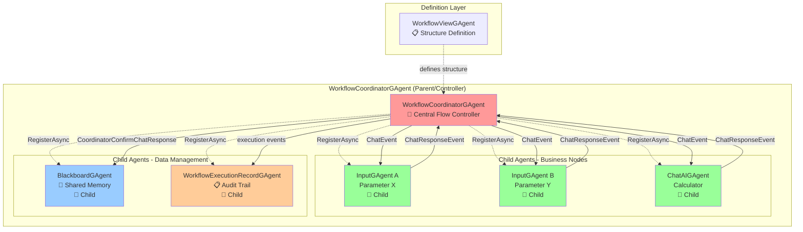
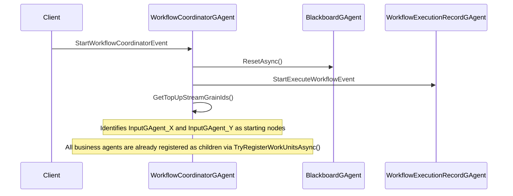
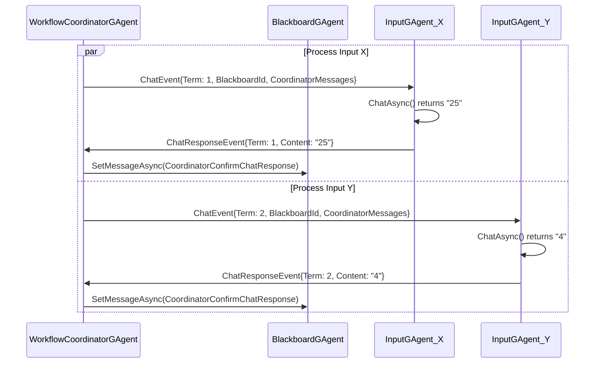
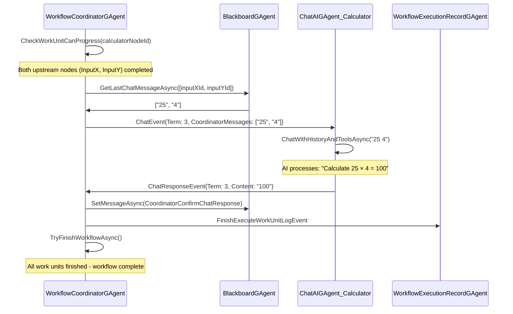

# Aevatar Workflow System - Event-Driven Agent Orchestration Guide

## Overview

The Aevatar Workflow System is a sophisticated event-driven DAG-based (Directed Acyclic Graph) orchestration platform that enables complex multi-agent workflows. The system leverages autonomous agents that control their own execution flow, with a data collection pattern for monitoring and shared state management. Each workflow run creates new instances of coordination agents for proper isolation.

## Core Agent Components

### 1. WorkflowCoordinatorGAgent
**Role**: Central flow controller and child agent manager
- **Responsibilities**:
  - Controls all event communication and workflow sequencing
  - Manages BlackboardGAgent and WorkflowExecutionRecordGAgent as child agents
  - Serves as parent agent for all workflow business nodes (InputGAgent, ChatAIGAgent)
  - Orchestrates DAG-based execution by sending ChatEvent to business agents
  - Processes ChatResponseEvent from business agents and triggers downstream nodes
  - Validates topology to prevent loops using reverse reachability analysis
- **Key Methods**:
  - `HandleEventAsync(StartWorkflowCoordinatorEvent)` - Initiates workflow execution
  - `HandleEventAsync(ChatResponseEvent)` - Processes agent responses and triggers downstream nodes
  - `TryActiveWorkUnitAsync()` - Activates ready work units and sends ChatEvent
  - `TryRegisterWorkUnitsAsync()` - Registers business agents as children via `RegisterAsync(agent)`
  - `IsAllPathsCanReachTerminal()` - Validates DAG structure

### 2. BlackboardGAgent
**Role**: Shared memory space and data repository
- **Responsibilities**:
  - Stores conversation history and intermediate results
  - Enables data sharing between non-connected workflow nodes
  - Acts as central data repository following Blackboard architectural pattern
- **Key Methods**:
  - `SetTopic(string)` - Sets initial workflow topic
  - `GetContent()` - Retrieves all messages
  - `GetLastChatMessageAsync(List<Guid>)` - Gets messages from specific agents
  - `SetMessageAsync(CoordinatorConfirmChatResponse)` - Stores agent responses

### 3. WorkflowViewGAgent
**Role**: Workflow definition and structure management
- **Responsibilities**:
  - Manages workflow node configuration and topology
  - Validates cycles in workflow graphs using Kahn's algorithm
  - Stores workflow structure (nodes and connections)
- **Key Methods**:
  - `TrySaveWorkflowViewAsync()` - Saves workflow configuration
  - `HasCycle()` - Detects cycles in workflow topology

### 4. WorkflowExecutionRecordGAgent
**Role**: Execution tracking and audit trail
- **Responsibilities**:
  - Records execution history of workflows
  - Tracks workflow and work unit execution status
  - Maintains audit trail for debugging and monitoring
- **Key Events Handled**:
  - `StartExecuteWorkflowEvent` - Records workflow start
  - `StartExecuteWorkUnitEvent` - Records work unit execution start
  - `ChatResponseEvent` - Records work unit completion/failure

### 5. InputGAgent
**Role**: Non-AI business workflow node for input data provision
- **Responsibilities**:
  - Responds to ChatEvent from WorkflowCoordinatorGAgent
  - Returns configured input text as ChatResponse
  - Extends MemberGAgentBase (non-AI) for workflow integration
  - Child agent of WorkflowCoordinatorGAgent
- **Key Methods**:
  - `HandleEventAsync(ChatEvent)` - Inherited from MemberGAgentBase, responds to coordinator trigger
  - `ChatAsync(Guid blackboardId, List<ChatMessage>? coordinatorMessages)` - Returns State.Input as configured value
  - `PublishAsync(ChatResponseEvent)` - Inherited from MemberGAgentBase, sends result back to coordinator
- **Configuration**: `InputConfigDto` with configurable input text
- **Inheritance**: `InputGAgent` → `MemberGAgentBase` → `GAgentBase` (non-AI)

### 6. ChatAIGAgent
**Role**: AI-powered business workflow node
- **Responsibilities**:
  - Responds to ChatEvent from WorkflowCoordinatorGAgent with upstream messages
  - Processes coordinator messages using AI/LLM capabilities
  - Performs AI-based computation, analysis, or generation
  - Child agent of WorkflowCoordinatorGAgent
- **Key Methods**:
  - `HandleEventAsync(ChatEvent)` - Inherited from GroupMemberGAgentBase, processes coordinator messages
  - `ChatAsync(Guid blackboardId, List<ChatMessage>? coordinatorMessages)` - Uses `ChatWithHistoryAndToolsAsync()` for AI processing
  - `PublishAsync(ChatResponseEvent)` - Inherited from GroupMemberGAgentBase, sends AI result back to coordinator
- **Features**:
  - Configurable instructions and LLM models via InitializeAsync(InitializeDto)
  - Tool integration capabilities through AIGAgentBase
  - History-aware conversation processing
- **Inheritance**: `ChatAIGAgent` → `GroupMemberGAgentBase` → `AIGAgentBase` → `GAgentBase` (AI-enabled)

## Current Architecture (Centralized Flow Control)



### Hierarchy Explanation
- **Solid Arrows**: Event communication flow
- **Dotted Lines**: Parent-child management relationships (`RegisterAsync`)
- **Red Node**: Central controller (WorkflowCoordinatorGAgent)
- **Green Nodes**: Business workflow nodes (children of coordinator)
- **Blue/Orange Nodes**: Data management nodes (children of coordinator)

## Alternative Architecture

For a comprehensive alternative design that leverages autonomous agent control and distributed workflow execution, see:

**📋 [Workflow Alternative Design](./Workflow-Alternative-Design.md)**

The alternative design document details how to use the existing Aevatar autonomous event forwarding infrastructure (enhanced EventBase with automatic child broadcasting) to create a distributed, fault-tolerant workflow system where business agents control their own execution flow.

## Example Workflow: X × Y Calculator

Let's illustrate the system with a concrete example: two InputGAgents providing parameters X and Y, and a ChatAIGAgent calculating their multiplication.

### Workflow Topology
```
[InputGAgent_X] ──┐
                  ├──> [ChatAIGAgent_Calculator]
[InputGAgent_Y] ──┘
```

### 1. Workflow Creation

#### Step 1: Create WorkflowViewGAgent
```csharp
var workflowViewConfig = new WorkflowViewConfigDto
{
    Name = "X_Multiply_Y_Calculator",
    WorkflowNodeList = new List<WorkflowNodeDto>
    {
        new() { NodeId = Guid.NewGuid(), Name = "InputX", AgentType = "InputGAgent" },
        new() { NodeId = Guid.NewGuid(), Name = "InputY", AgentType = "InputGAgent" },
        new() { NodeId = Guid.NewGuid(), Name = "Calculator", AgentType = "ChatAIGAgent" }
    },
    WorkflowNodeUnitList = new List<WorkflowNodeUnitDto>
    {
        new() { NodeId = inputXNodeId, NextNodeId = calculatorNodeId },
        new() { NodeId = inputYNodeId, NextNodeId = calculatorNodeId }
    }
};

var workflowViewGAgent = await gAgentFactory.GetGAgentAsync<IWorkflowViewGAgent>(workflowId, workflowViewConfig);
```

#### Step 2: Create and Configure Individual Agents
```csharp
// Create InputGAgent for X
var inputXConfig = new InputConfigDto { Input = "25" };
var inputXAgent = await gAgentFactory.GetGAgentAsync<IInputGAgent>(inputXNodeId, inputXConfig);

// Create InputGAgent for Y  
var inputYConfig = new InputConfigDto { Input = "4" };
var inputYAgent = await gAgentFactory.GetGAgentAsync<IInputGAgent>(inputYNodeId, inputYConfig);

// Create ChatAIGAgent for calculation
var calculatorConfig = new ChatAIGAgentConfigDto 
{ 
    Instructions = "You are a calculator. When given two numbers X and Y, multiply them and return only the result.",
    SystemLLM = LLMProviderEnum.OpenAI 
};
var calculatorAgent = await gAgentFactory.GetGAgentAsync<IChatAIGAgent>(calculatorNodeId, calculatorConfig);
```

#### Step 3: Create WorkflowCoordinatorGAgent (Current Design)
```csharp
var coordinatorConfig = new WorkflowCoordinatorConfigDto
{
    WorkflowUnitList = new List<WorkflowUnitDto>
    {
        new() { GrainId = inputXNodeId.ToString(), NextGrainId = calculatorNodeId.ToString() },
        new() { GrainId = inputYNodeId.ToString(), NextGrainId = calculatorNodeId.ToString() },
        new() { GrainId = calculatorNodeId.ToString(), NextGrainId = "" } // Terminal node
    },
    InitContent = "Calculate X × Y",
    EnableExecutionRecord = true
};

var coordinatorAgent = await gAgentFactory.GetGAgentAsync<IWorkflowCoordinatorGAgent>(workflowId, coordinatorConfig);

// In current design, coordinator automatically registers business agents as children in TryRegisterWorkUnitsAsync()
// This establishes the parent-child hierarchy:
// WorkflowCoordinatorGAgent (Parent)
// ├── InputGAgent_X (Child)
// ├── InputGAgent_Y (Child)  
// ├── ChatAIGAgent (Child)
// ├── BlackboardGAgent (Child)
// └── WorkflowExecutionRecordGAgent (Child)
```


### 2. Current Design Workflow Execution Flow

#### Phase 1: Initialization (Current Design)


#### Phase 2: Parallel Input Processing


#### Phase 3: Calculator Processing


### 3. Workflow Management Operations

#### Update Workflow
```csharp
// Add a new verification step
var updatedConfig = workflowViewConfig;
updatedConfig.WorkflowNodeList.Add(new WorkflowNodeDto 
{ 
    NodeId = Guid.NewGuid(), 
    Name = "Verifier", 
    AgentType = "ChatAIGAgent" 
});
updatedConfig.WorkflowNodeUnitList.Add(new WorkflowNodeUnitDto 
{ 
    NodeId = calculatorNodeId, 
    NextNodeId = verifierNodeId 
});

await workflowViewGAgent.ConfigAsync(updatedConfig);
```

#### Retrieve Workflow Status
```csharp
var workflowState = await coordinatorAgent.GetStateAsync();
Console.WriteLine($"Status: {workflowState.WorkflowStatus}");
Console.WriteLine($"Completed Units: {workflowState.CurrentWorkUnitInfos.Count(u => u.UnitStatusEnum == WorkerUnitStatusEnum.Finished)}");
```

#### Delete Workflow
```csharp
await coordinatorAgent.HandleEventAsync(new ResetWorkflowEvent());
// This will:
// 1. Reset blackboard
// 2. Unregister all work units
// 3. Clear workflow state
```

### 4. Event Flow Summary

| Event | Source | Target | Purpose |
|-------|--------|--------|---------|
| `StartWorkflowCoordinatorEvent` | Client | WorkflowCoordinatorGAgent | Initiates workflow execution |
| `ChatEvent` | WorkflowCoordinatorGAgent | Work Unit GAgents | Triggers agent processing |
| `ChatResponseEvent` | Work Unit GAgents | WorkflowCoordinatorGAgent | Reports completion and results |
| `CoordinatorConfirmChatResponse` | WorkflowCoordinatorGAgent | BlackboardGAgent | Stores results in shared memory |
| `StartExecuteWorkflowEvent` | WorkflowCoordinatorGAgent | WorkflowExecutionRecordGAgent | Records workflow start |
| `GroupChatFinishEvent` | WorkflowCoordinatorGAgent | All Work Units | Signals workflow completion |

### 5. State Management

#### WorkflowCoordinatorGAgent States
- **Pending**: Ready to execute, topology validated (workflow returns to this state after completion)
- **InProgress**: Currently executing work units
- **Failed**: Execution failed, requires reset

#### Work Unit States  
- **Pending**: Waiting for upstream dependencies
- **InProgress**: Currently executing
- **Finished**: Completed successfully

### 6. Key Features

#### Dependency Management
- Automatic upstream dependency checking before activation
- Parallel execution of independent nodes
- Sequential execution respecting dependencies

#### Error Handling
- Failed work units trigger workflow failure
- Comprehensive logging at each step
- State persistence for recovery

#### Resource Management
- Automatic agent registration/unregistration
- Resource context preparation for AI agents
- MCP tool integration support

#### Monitoring & Auditing
- Complete execution record tracking
- Blackboard conversation history
- Performance metrics and timing

## Architecture Comparison

### Current Design (Centralized Control)
**Strengths:**
- **Centralized Control**: WorkflowCoordinatorGAgent manages all flow logic
- **Consistent State Management**: Single point of truth for workflow status
- **Simplified Debugging**: All events flow through coordinator for easy monitoring
- **Guaranteed Execution Order**: Coordinator ensures proper DAG-based execution

**Considerations:**
- **Single Point of Control**: All events must pass through coordinator
- **Potential Bottleneck**: Coordinator manages all workflow sequencing
- **Tight Coupling**: Orchestration and business logic in same control flow

### Alternative Design (Distributed Control)
For detailed comparison of the distributed control approach, see **[Workflow Alternative Design](./Workflow-Alternative-Design.md)**.

The alternative design leverages the existing Aevatar autonomous event forwarding infrastructure (enhanced EventBase with automatic child broadcasting) to enable:
- **Autonomous Business Agents**: Control their own execution flow
- **Distributed Coordination**: No single point of control
- **Data Collection Pattern**: Coordinator becomes a child agent collecting status
- **Per-Run Isolation**: New instances prevent cross-workflow interference

## Best Practices

### Workflow Design
1. **Topology Validation**: Ensure all paths can reach terminal nodes using `IsAllPathsCanReachTerminal()`
2. **Agent Configuration**: Provide clear instructions and proper configuration for AI agents
3. **Error Handling**: Implement proper failure recovery mechanisms and timeout handling
4. **Resource Management**: Clean up resources after workflow completion via UnregisterAsync
5. **Monitoring**: Use WorkflowExecutionRecordGAgent for debugging and performance optimization

### Event Communication
1. **Parent-Child Setup**: Use `RegisterAsync()` to establish bidirectional communication
2. **Event Processing**: Allow sufficient time for asynchronous event processing
3. **State Isolation**: Use unique Guid identifiers to ensure workflow isolation
4. **Dependency Management**: Verify upstream dependencies before activating downstream nodes

### Performance Optimization
1. **Parallel Execution**: Leverage independent node parallel processing
2. **Resource Context**: Use `PrepareResourceContextAsync()` for AI tool registration
3. **State Management**: Minimize state transitions and optimize event sourcing
4. **Batch Operations**: Use batch subscription patterns for multiple agent registration

This workflow system provides a robust foundation for building complex AI agent orchestrations with proper dependency management, parallel execution, and comprehensive monitoring capabilities.
