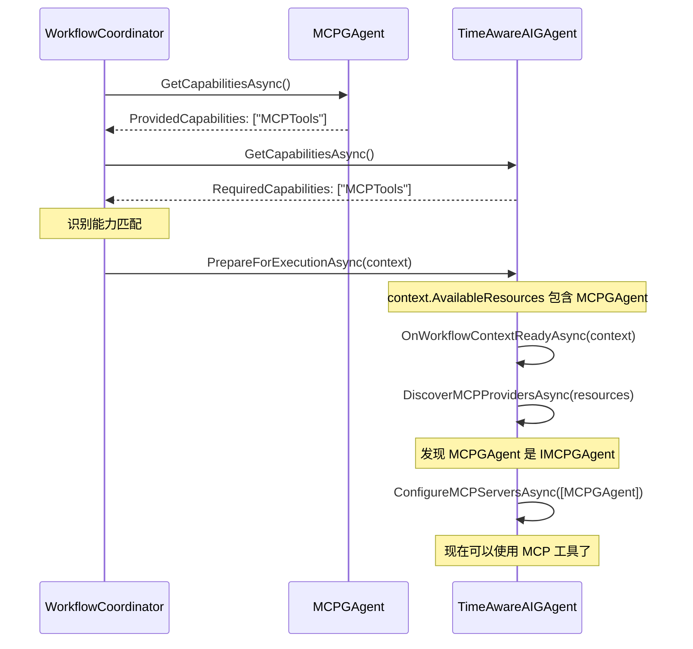

# 工作流工具注册示例

本示例展示如何使用抽象的能力系统在工作流中注册和使用工具。

## 1. 创建一个需要使用工具的 AI Agent

```csharp
using Aevatar.GAgents.GroupChat; // 注意：WorkflowAwareAIGAgentBase 现在在这个命名空间中
using Aevatar.GAgents.GroupChat.Core;

public class TimeAwareAIGAgent : WorkflowAwareAIGAgentBase<
    TimeAwareAIGAgentState, 
    TimeAwareAIGAgentStateLogEvent, 
    EventBase>  // 注意：不再需要 TConfiguration 参数
{
    // 声明此 Agent 的能力
    public override Task<WorkflowUnitCapabilities> GetCapabilitiesAsync()
    {
        return Task.FromResult(new WorkflowUnitCapabilities
        {
            UnitType = "TimeAwareAI",
            ProvidedCapabilities = new List<string> { "AI", "TimeQueries" },
            RequiredCapabilities = new List<string> { "MCPTools" }, // 需要 MCP 工具
            Metadata = new Dictionary<string, object>
            {
                ["Description"] = "AI Agent that can answer time-related questions"
            }
        });
    }
    
    // 实现 IWorkflowUnit 接口
    public async Task PrepareForExecutionAsync(WorkflowExecutionContext context)
    {
        // 调用基类方法，自动发现和注册 MCP 工具
        await OnWorkflowContextReadyAsync(context);
        
        // 执行其他准备工作
        Logger.LogInformation("TimeAwareAIGAgent is ready with MCP tools");
    }
    
    // 实现聊天逻辑
    protected override async Task<ChatResponse> ChatAsync(
        Guid blackboardId, 
        List<ChatMessage>? coordinatorMessages)
    {
        var question = coordinatorMessages?.LastOrDefault()?.Content ?? "What time is it?";
        
        // 工具已经在 PrepareForExecutionAsync 阶段自动注册
        // 可以直接使用
        var response = await ChatWithHistoryAndToolsAsync(question, maxRounds: 3);
        
        return new ChatResponse
        {
            Continue = false,
            Content = response.Content
        };
    }
    
    protected override Task<int> GetInterestValueAsync(Guid blackboardId)
    {
        // 对时间相关问题感兴趣
        return Task.FromResult(80);
    }
}
```

## 2. MCP GAgent 声明能力

```csharp
public class MCPGAgent : MCPGAgentBase<MCPGAgentState, MCPGAgentStateLogEvent, EventBase, MCPGAgentConfiguration>
{
    public override Task<WorkflowUnitCapabilities> GetCapabilitiesAsync()
    {
        return Task.FromResult(new WorkflowUnitCapabilities
        {
            UnitType = "MCPToolProvider",
            ProvidedCapabilities = new List<string> { "MCPTools" },
            RequiredCapabilities = new List<string>(),
            Metadata = new Dictionary<string, object>
            {
                ["ServerCount"] = State.MCPServers?.Count ?? 0
            }
        });
    }
}
```

## 3. 工作流协调器自动管理

```csharp
public class WorkflowDemo
{
    public async Task RunWorkflow()
    {
        // 创建工作流节点
        var mcpGAgent = await CreateMCPGAgentAsync();
        var aiGAgent = await CreateTimeAwareAIGAgentAsync();
        
        // 配置工作流
        await coordinator.SetWorkflowAsync(new[]
        {
            new WorkflowUnitDto 
            { 
                GrainId = mcpGAgent.GetGrainId().ToString(),
                NextGrainId = aiGAgent.GetGrainId().ToString()
            },
            new WorkflowUnitDto 
            { 
                GrainId = aiGAgent.GetGrainId().ToString(),
                NextGrainId = null
            }
        });
        
        // 启动工作流
        await coordinator.StartWorkflowAsync("What time is it in Tokyo?");
        
        // AI Agent 会自动获得 MCP 工具的访问权限
    }
}
```

## 4. 流程图



## 5. 注意事项

1. **命名空间变化**：`WorkflowAwareAIGAgentBase` 现在位于 `Aevatar.GAgents.GroupChat` 命名空间中
2. **简化的泛型参数**：不再需要 `TConfiguration` 参数，基类使用 `AIGAgentConfigurationBase`
3. **避免循环依赖**：这个设计避免了 AIGAgent 和 GroupChat 项目之间的循环依赖
4. **自动工具发现**：基类会自动发现工作流中的 MCP 提供者并配置工具
5. **灵活扩展**：子类可以重写 `HandleOtherResourcesAsync` 来处理其他类型的资源 