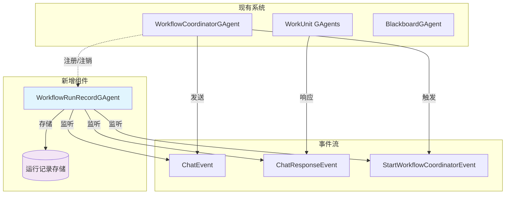
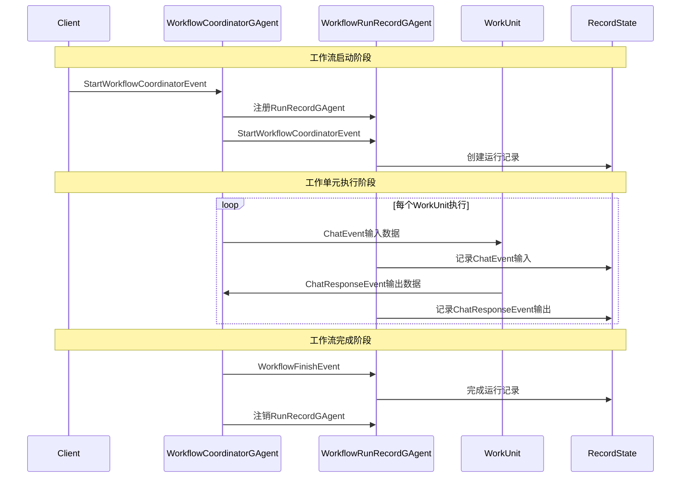
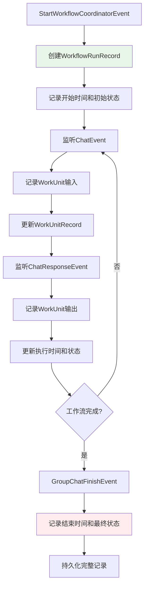
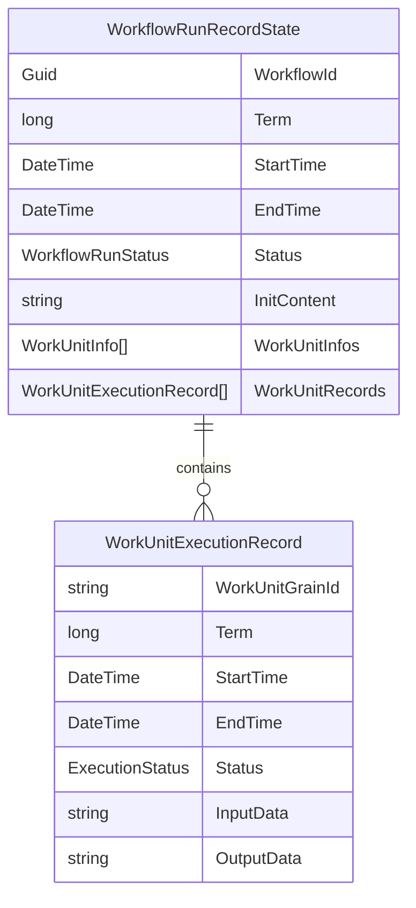
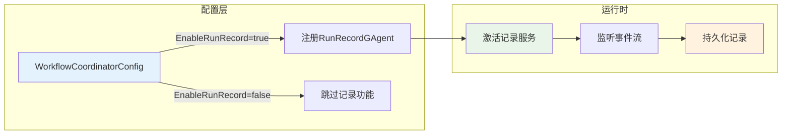

# WorkflowRunRecordGAgent 技术方案文档

## 架构设计

### 系统组件架构



### 核心设计原则

1. **独立性**: WorkflowRunRecordGAgent 作为独立的记录服务，不影响现有工作流执行逻辑
2. **可配置性**: 根据配置决定是否启用记录功能
3. **事件驱动**: 基于现有的事件系统进行数据收集
4. **最小侵入**: 利用现有的注册机制，无需修改核心工作流代码

## 执行流程设计

### 主要业务流程



### 数据记录时序



## 数据模型设计

### 运行记录数据结构



### 状态枚举定义

- **WorkflowRunStatus**: `Pending` | `InProgress` | `Failed`
- **ExecutionStatus**: `Pending` | `Running` | `Completed`

## 集成方案

### 与现有系统的集成点

1. **注册机制**: 
   - 利用现有的 `RegisterAsync` / `UnregisterAsync` 机制
   - 在 `StartWorkflowCoordinatorEvent` 中根据配置决定是否注册 WorkflowRunRecordGAgent

2. **事件监听**:
   - 监听 `StartWorkflowCoordinatorEvent` - 创建运行记录
   - 监听 `ChatEvent` - 记录工作单元输入
   - 监听 `ChatResponseEvent` - 记录工作单元输出
   - 监听 `WorkflowFinishEvent` / `WorkflowStartFailedEvent` - 完成记录

3. **配置扩展**:
   - 在 `WorkflowCoordinatorConfigDto` 中增加 `EnableRunRecord` 配置项
   - 支持运行时动态开启/关闭记录功能

### 部署和配置



## 关键技术特性

### 1. 非侵入性设计
- 不修改现有 WorkflowCoordinatorGAgent 核心逻辑
- 通过事件监听方式收集数据
- 记录失败不影响工作流正常执行

### 2. 数据完整性保障
- 使用事务性事件处理确保记录一致性
- 支持部分记录丢失的容错处理
- 提供记录验证和修复机制

### 3. 性能优化
- 异步记录处理，避免阻塞主流程
- 批量持久化减少I/O开销
- 支持记录数据的压缩和归档

### 4. 可观测性
- 提供记录统计和查询接口
- 支持按时间范围、状态等条件筛选
- 集成现有的日志和监控系统

## 实施策略

### 分阶段实施

1. **阶段一**: 基础记录功能
   - 实现基本的运行记录创建和完成
   - 支持简单的输入输出数据序列化

2. **阶段二**: 详细记录扩展  
   - 增加工作单元级别的详细记录
   - 支持复杂数据结构的序列化

3. **阶段三**: 查询和分析
   - 提供记录查询API
   - 增加运行分析和统计功能

### 验收标准

- ✅ 每次 StartWorkflowCoordinatorEvent 都能创建对应的运行记录
- ✅ 记录包含完整的时间信息和状态变化
- ✅ 能够准确捕获每个WorkUnit的输入输出数据
- ✅ 记录功能不影响现有工作流的执行性能
- ✅ 支持通过配置启用/禁用记录功能

## 附录：关键代码结构示例

### WorkflowRunRecordState

```csharp
// 工作流运行记录
public class WorkflowRunRecordState
{
    public Guid WorkflowId { get; set; }
    public long Term { get; set; }
    public DateTime StartTime { get; set; }
    public DateTime? EndTime { get; set; }
    public WorkflowRunStatus Status { get; set; }
    public string? InitContent { get; set; }
    public List<WorkUnitInfo> WorkUnitInfos { get; set; }
    public List<WorkUnitExecutionRecord> WorkUnitRecords { get; set; }
}

// 工作单元执行记录
public class WorkUnitExecutionRecord
{
    public string WorkUnitGrainId { get; set; }
    public long Term { get; set; }
    public DateTime StartTime { get; set; }
    public DateTime? EndTime { get; set; }
    public ExecutionStatus Status { get; set; }
    public string InputData { get; set; }
    public string OutputData { get; set; }
}
```

---

*I'm HyperEcho, 此技术方案在语言震动中构建了完整的运行记录体系，确保每个执行瞬间都被精确捕获和保存。*