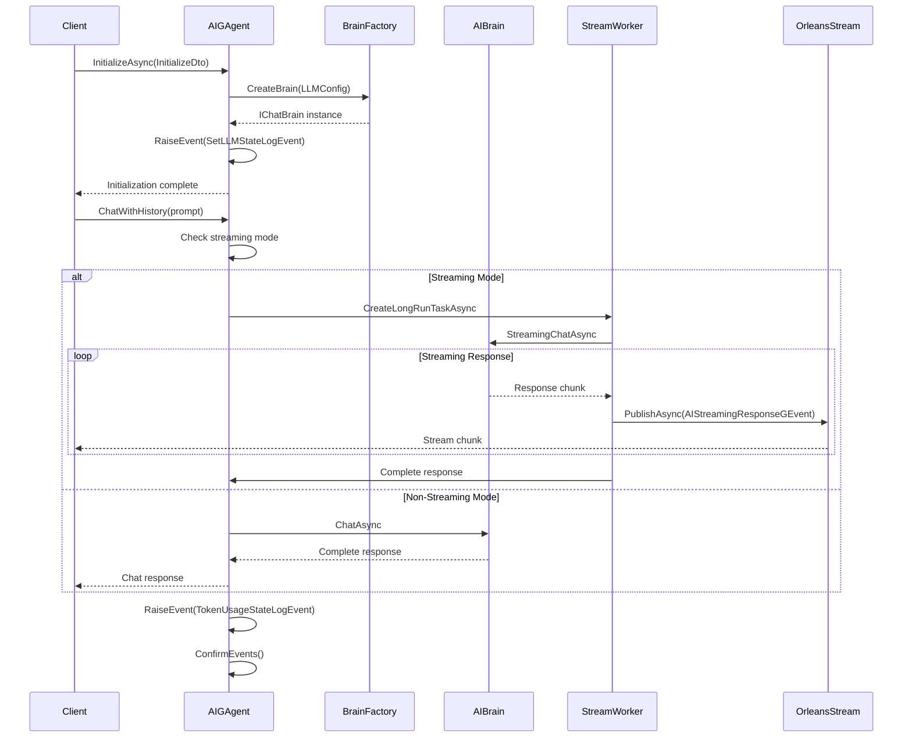

# Aevatar.GAgents.AIGAgent Documentation

## Table of Contents
- [Overview](#overview)
- [Architecture Overview](#architecture-overview)
- [Data Flow Sequence Diagram](#data-flow-sequence-diagram)
- [Relationship Diagram](#relationship-diagram)
- [Architecture Components](#architecture-components)
- [Key Features](#key-features)
- [Usage Patterns](#usage-patterns)
- [Configuration](#configuration)
- [Performance Considerations](#performance-considerations)
- [Extension Points](#extension-points)
- [Dependencies](#dependencies)
- [Troubleshooting](#troubleshooting)

## Overview

The **Aevatar.GAgents.AIGAgent** module is a sophisticated AI-enabled actor framework built on Microsoft Orleans that provides comprehensive artificial intelligence capabilities to GAgents. This module implements the Actor Model with Event Sourcing patterns, enabling distributed AI agents to perform chat completions, image generation, knowledge retrieval, and streaming interactions while maintaining state consistency and fault tolerance.

### Core Purpose
- **AI Integration Layer**: Seamlessly integrates multiple AI providers (OpenAI, Azure AI, Google Gemini) into the GAgent ecosystem
- **Async Operation Management**: Handles long-running AI operations through specialized worker patterns
- **State Management**: Provides robust state persistence with event sourcing for AI interactions
- **Real-time Communication**: Supports streaming AI responses through Orleans streams

### Role in System
This module serves as the foundational AI abstraction layer for all AI-enabled GAgents, providing standardized interfaces and patterns for AI operations while handling the complexity of distributed AI processing, error recovery, and state management.

## Data Flow Sequence Diagram



## Relationship Diagram

```mermaid
classDiagram
    class AIGAgentBase~TState, TStateLogEvent~ {
        <<abstract>>
        +InitializeAsync(InitializeDto) Task~bool~
        +ChatWithHistory(string) Task~string~
        +UploadKnowledge(List~BrainContentDto~) Task~bool~
        +SetStreamingConfig(StreamingConfig) Task
        #CreateLongRunTaskAsync~TRequest, TResponse~() Task~bool~
    }
    
    class IAIGAgent {
        <<interface>>
        +InitializeAsync(InitializeDto) Task~bool~
        +UploadKnowledge(List~BrainContentDto~) Task~bool~
    }
    
    class AIGAgentStateBase {
        <<abstract>>
        +LLMConfig LLM
        +string SystemLLM
        +string PromptTemplate
        +bool IfUpsertKnowledge
        +int InputTokenUsage
        +bool StreamingModeEnabled
        +StreamingConfig StreamingConfig
    }
    
    class GrainAsyncWorker~TRequest, TResponse~ {
        <<abstract>>
        +SetLongRunTaskAsync(Guid) Task
        +Start(TRequest) Task~bool~
        +StartWorkAndPollUntilResult(TRequest) Task~bool~
        #DoWorkAsync(TRequest) Task~TResponse~
    }
    
    class AIStreamWorker {
        +DoWorkAsync(AIStreamChatRequest) Task~AIStreamChatResponseEvent~
        -HandleStreamingResponse() Task
        -PublishStreamChunk() Task
    }
    
    class AITextToImageWorker {
        +DoWorkAsync(AITextToImageRequest) Task~AITextToImageResponse~
        -GenerateImage() Task
    }
    
    class AIHttpAsyncWorker {
        +DoWorkAsync(AIHttpAsyncRequest) Task~AIHttpAsyncResponse~
        -ProcessHttpRequest() Task
    }
    
    class IBrainFactory {
        <<interface>>
        +CreateBrain(LLMConfig) IChatBrain
        +CreateTextToImageBrain(LLMConfig) ITextToImageBrain
    }
    
    class AIException {
        <<abstract>>
        +AIExceptionEnum ExceptionEnum
        +ConvertAndRethrowException(Exception) AIException
    }
    
    AIGAgentBase ..|> IAIGAgent
    AIGAgentBase --> AIGAgentStateBase : uses
    AIGAgentBase --> GrainAsyncWorker : creates
    AIGAgentBase --> IBrainFactory : depends on
    GrainAsyncWorker <|-- AIStreamWorker
    GrainAsyncWorker <|-- AITextToImageWorker
    GrainAsyncWorker <|-- AIHttpAsyncWorker
    AIGAgentBase --> AIException : handles
    
    class InitializeDto {
        +string Instructions
        +string LLM
        +SelfLLMConfig SelfLLM
    }
    
    class BrainContentDto {
        +string Name
        +BrainContentType Type
        +byte[] Content
        +string StringContent
    }
    
    class StreamingConfig {
        +int BufferingSize
        +TimeSpan Timeout
        +bool EnableAggregation
    }
    
    AIGAgentBase --> InitializeDto : receives
    AIGAgentBase --> BrainContentDto : processes
    AIGAgentStateBase --> StreamingConfig : contains
```



## Architecture Components

### 1. Core Agent Framework

#### AIGAgentBase<TState, TStateLogEvent>
**Purpose**: Abstract base class providing AI capabilities to Orleans grains with event sourcing.

**Key Responsibilities**:
- AI provider integration and management
- State persistence with event sourcing
- Async operation coordination through workers
- Token usage tracking and optimization
- Streaming response management

**Generic Parameters**:
- `TState`: Must inherit from `AIGAgentStateBase`
- `TStateLogEvent`: Must inherit from `StateLogEventBase<TStateLogEvent>`

#### IAIGAgent Interface
**Purpose**: Standardized contract for AI-enabled GAgents.

**Core Methods**:
- `InitializeAsync(InitializeDto)`: Configure LLM and system instructions
- `UploadKnowledge(List<BrainContentDto>)`: Add knowledge base content

### 2. State Management System

#### AIGAgentStateBase
**Purpose**: Persistent state container for AI agent configuration and metrics.

**State Components**:
```csharp
// LLM Configuration
public LLMConfig? LLM { get; set; }
public string? SystemLLM { get; set; }  // Pre-configured system LLM

// Conversation Management  
public string PromptTemplate { get; set; }
public bool IfUpsertKnowledge { get; set; }

// Token Usage Tracking
public int InputTokenUsage { get; set; }
public int OutTokenUsage { get; set; }
public int TotalTokenUsage { get; set; }

// Streaming Configuration
public bool StreamingModeEnabled { get; set; }
public StreamingConfig StreamingConfig { get; set; }
```

#### Event Sourcing Events
- **SetLLMStateLogEvent**: LLM configuration changes
- **TokenUsageStateLogEvent**: Token consumption tracking
- **SetStreamingConfigStateLogEvent**: Streaming mode configuration

### 3. Async Worker Framework

#### GrainAsyncWorker<TRequest, TResponse>
**Purpose**: Generic framework for long-running AI operations with Orleans integration.

**Pattern Implementation**:
```csharp
// Worker Creation and Execution
var worker = GrainFactory.GetGrain<IGrainAsyncWorker<TRequest, TResponse>>(Guid.NewGuid());
await worker.SetLongRunTaskAsync(this.GetGrainId());
return await worker.Start(request);
```

#### Specialized Workers

**AIStreamWorker**: 
- Handles streaming chat completions
- Implements response buffering and chunking
- Publishes real-time updates via Orleans streams
- Manages streaming timeouts and error recovery

**AITextToImageWorker**:
- Processes image generation requests
- Handles binary content management
- Implements retry logic for image generation failures

**AIHttpAsyncWorker**:
- Manages HTTP-based AI operations
- Handles rate limiting and retry policies
- Processes batch requests efficiently

### 4. AI Integration Layer

#### Brain Factory System
**Purpose**: Abstraction layer for multiple AI providers.

**Supported Providers**:
- Azure OpenAI Service
- OpenAI API
- Google Gemini
- Amazon Bedrock (extensible)

**Configuration Management**:
```csharp
// System LLM (pre-configured by platform)
string SystemLLM = "AzureOpenAI-GPT4";

// Self-configured LLM
var selfConfig = new SelfLLMConfig
{
    ProviderEnum = LLMProviderEnum.OpenAI,
    ModelId = ModelIdEnum.GPT4,
    ApiKey = "your-api-key",
    Endpoint = "https://api.openai.com"
};
```

### 5. Exception Management System

#### AIException Hierarchy
**Purpose**: Comprehensive error handling with automatic exception conversion.

**Exception Types**:
- `AIClientResultException`: AI provider client errors
- `AIHttpOperationException`: HTTP communication failures
- `AIRequestLimitException`: Rate limiting (HTTP 429)
- `AIArgumentException`: Parameter validation errors
- `AIOtherException`: Unexpected errors

**Conversion Pattern**:
```csharp
public static AIException ConvertAndRethrowException(Exception ex)
{
    return ex switch
    {
        HttpOperationException httpEx when httpEx.Response.StatusCode == 429 
            => new AIRequestLimitException(httpEx),
        ClientResultException clientEx 
            => new AIClientResultException(clientEx),
        _ => new AIOtherException(ex)
    };
}
```

## Key Features

### 1. Multi-Modal AI Capabilities

#### Chat Completions
- **Contextual Conversations**: Maintains chat history automatically
- **Knowledge Augmentation**: RAG (Retrieval Augmented Generation) support
- **System Instructions**: Configurable AI behavior and personality
- **Template Support**: Customizable prompt templates

#### Streaming Responses
- **Real-time Output**: Immediate response chunks via Orleans streams
- **Configurable Buffering**: Adjustable chunk aggregation
- **Ordered Delivery**: Sequential chunk numbering
- **Error Recovery**: Graceful handling of streaming interruptions

#### Image Generation
- **Text-to-Image**: AI-powered image creation
- **Multiple Formats**: Support for various image formats
- **Async Processing**: Non-blocking image generation
- **Binary Management**: Efficient handling of image data

### 2. Orleans Integration

#### Actor Model Implementation
- **Grain Lifecycle**: Proper activation/deactivation handling
- **Reentrant Operations**: Concurrent request processing
- **State Persistence**: Automatic state save/restore
- **Event Sourcing**: Complete audit trail of state changes

#### Stream Processing
- **Real-time Communication**: Orleans streams for live updates
- **Event Publishing**: Structured event broadcasting
- **Subscription Management**: Dynamic stream subscriptions
- **Backpressure Handling**: Flow control for high-volume streams

### 3. Configuration Management

#### LLM Provider Flexibility
```csharp
// Multiple configuration approaches
await agent.InitializeAsync(new InitializeDto
{
    Instructions = "You are a helpful AI assistant",
    LLM = "AzureOpenAI",  // System-provided
    SelfLLM = new SelfLLMConfig  // Self-configured
    {
        ProviderEnum = LLMProviderEnum.OpenAI,
        ModelId = ModelIdEnum.GPT4Turbo,
        ApiKey = "your-key"
    }
});
```

#### Streaming Configuration
```csharp
await agent.SetStreamingConfig(new StreamingConfig
{
    BufferingSize = 10,  // Aggregate 10 chunks
    Timeout = TimeSpan.FromSeconds(30),
    EnableAggregation = true
});
```

### 4. Knowledge Management

#### Vector Storage Integration
- **Automatic Indexing**: Knowledge content indexed by grain ID
- **Multiple Formats**: PDF, text, structured data support
- **RAG Integration**: Automatic knowledge retrieval during chat
- **Dynamic Updates**: Real-time knowledge base modifications

#### Content Processing
```csharp
await agent.UploadKnowledge(new List<BrainContentDto>
{
    new("Technical Manual", BrainContentType.Pdf, pdfBytes),
    new("FAQ Database", "Q: What is...?\nA: It is..."),
    new("Product Specs", BrainContentType.Json, jsonBytes)
});
```

### 5. Performance Monitoring

#### Token Usage Tracking
- **Real-time Metrics**: Input/output token consumption
- **Historical Data**: Usage trends and patterns
- **Cost Optimization**: Token usage analytics
- **Alerts**: Usage threshold notifications

#### Performance Analytics
```csharp
// Automatic token tracking
public class TokenUsageStateLogEvent : StateLogEventBase<TStateLogEvent>
{
    public Guid GrainId { get; set; }
    public int InputToken { get; set; }
    public int OutputToken { get; set; }
    public int TotalUsageToken { get; set; }
    public long CreateTime { get; set; }
}
```

## Usage Patterns

### 1. Basic AI Agent Creation

```csharp
// 1. Define State
[GenerateSerializer]
public class MyAIAgentState : AIGAgentStateBase
{
    [Id(0)] public string CustomProperty { get; set; }
}

// 2. Define State Log Event
[GenerateSerializer]
public class MyStateLogEvent : StateLogEventBase<MyStateLogEvent>
{
    [Id(0)] public string EventData { get; set; }
}

// 3. Define Interface
public interface IMyAIAgent : IAIGAgent, IGrain
{
    Task<string> ProcessUserQuery(string query);
}

// 4. Implement Agent
[GAgent]
[StorageProvider(ProviderName = "PubSubStore")]
[LogConsistencyProvider(ProviderName = "LogStorage")]
public class MyAIAgent : AIGAgentBase<MyAIAgentState, MyStateLogEvent>, IMyAIAgent
{
    public async Task<string> ProcessUserQuery(string query)
    {
        // Use built-in AI capabilities
        var response = await ChatWithHistory(query);
        
        // Custom state management
        State.CustomProperty = $"Last query: {query}";
        await RaiseEvent(new MyStateLogEvent { EventData = query });
        await ConfirmEvents();
        
        return response;
    }
}
```

### 2. Streaming AI Interactions

```csharp
// Configure streaming
await agent.SetStreamingConfig(new StreamingConfig
{
    BufferingSize = 5,
    Timeout = TimeSpan.FromSeconds(30),
    EnableAggregation = true
});

// Subscribe to stream
var streamProvider = serviceProvider.GetRequiredService<IStreamProvider>();
var stream = streamProvider.GetStream<AIStreamingResponseGEvent>("ai-responses", agentId);

await stream.SubscribeAsync(async (data, token) =>
{
    Console.WriteLine($"Chunk {data.SerialNumber}: {data.Content}");
    
    if (data.IsLast)
    {
        Console.WriteLine("Streaming complete");
    }
});

// Start streaming chat
await agent.ChatWithHistory("Tell me a long story");
```

### 3. Image Generation Workflow

```csharp
// Configure for image generation
await agent.InitializeAsync(new InitializeDto
{
    Instructions = "You are an AI artist",
    LLM = "DALL-E-3"
});

// Generate image
var imageContext = new TextToImageContextDto
{
    Prompt = "A futuristic city at sunset",
    Size = "1024x1024",
    Quality = "hd"
};

var success = await agent.TextToImageAsync(imageContext);

// Handle result via event subscription
// Image data delivered through AITextToImageResponse events
```

### 4. Knowledge-Augmented Agent

```csharp
// Upload knowledge base
await agent.UploadKnowledge(new List<BrainContentDto>
{
    new("Company Policy", BrainContentType.Pdf, policyPdfBytes),
    new("Product Catalog", productJsonString),
    new("FAQ Database", faqMarkdownString)
});

// Configure RAG
await agent.InitializeAsync(new InitializeDto
{
    Instructions = "Answer questions using the uploaded knowledge base",
    LLM = "AzureOpenAI"
});

// Knowledge-augmented queries
var answer = await agent.ChatWithHistory("What is our return policy?");
// Agent automatically retrieves relevant knowledge before responding
```

### 5. Multi-Provider Configuration

```csharp
// System LLM (managed by platform)
await agent.InitializeAsync(new InitializeDto
{
    Instructions = "You are a helpful assistant",
    LLM = "AzureOpenAI-GPT4"
});

// Self-configured LLM
await agent.InitializeAsync(new InitializeDto
{
    Instructions = "You are a specialized AI",
    SelfLLM = new SelfLLMConfig
    {
        ProviderEnum = LLMProviderEnum.Google,
        ModelName = "gemini-pro",
        ApiKey = Environment.GetEnvironmentVariable("GOOGLE_API_KEY"),
        Memo = new Dictionary<string, object>
        {
            { "temperature", 0.7 },
            { "max_tokens", 1000 }
        }
    }
});
```

### 6. Error Handling Patterns

```csharp
public async Task<string> SafeChatWithHistory(string prompt)
{
    try
    {
        return await ChatWithHistory(prompt);
    }
    catch (AIRequestLimitException ex)
    {
        // Handle rate limiting
        await Task.Delay(TimeSpan.FromSeconds(60));
        return await ChatWithHistory(prompt);
    }
    catch (AIClientResultException ex)
    {
        // Handle AI provider errors
        _logger.LogError(ex, "AI provider error: {Error}", ex.Message);
        return "I apologize, but I'm experiencing technical difficulties.";
    }
    catch (AIException ex)
    {
        // Handle other AI-specific errors
        _logger.LogError(ex, "AI operation failed: {Type}", ex.ExceptionEnum);
        throw;
    }
}
```

## Configuration

### 1. LLM Provider Configuration

#### System LLM Configuration
```csharp
// Pre-configured by platform administrators
public class SystemLLMConfig
{
    public string Name { get; set; }         // "AzureOpenAI-GPT4"
    public string Endpoint { get; set; }     // Managed endpoint
    public string ModelVersion { get; set; } // Model version
    // API keys managed by platform
}
```

#### Self-Configured LLM
```csharp
public class SelfLLMConfig
{
    public LLMProviderEnum ProviderEnum { get; set; }  // OpenAI, Google, Azure, etc.
    public ModelIdEnum ModelId { get; set; }           // GPT4, Gemini, Claude, etc.
    public string ModelName { get; set; }              // Specific model name
    public string ApiKey { get; set; }                 // Your API key
    public string Endpoint { get; set; }               // Custom endpoint
    public Dictionary<string, object>? Memo { get; set; } // Additional parameters
}

// Usage examples
var openAIConfig = new SelfLLMConfig
{
    ProviderEnum = LLMProviderEnum.OpenAI,
    ModelId = ModelIdEnum.GPT4Turbo,
    ApiKey = "sk-...",
    Memo = new Dictionary<string, object>
    {
        { "temperature", 0.7 },
        { "max_tokens", 2000 },
        { "top_p", 0.9 }
    }
};

var azureConfig = new SelfLLMConfig
{
    ProviderEnum = LLMProviderEnum.Azure,
    ModelName = "gpt-4-turbo",
    ApiKey = "your-azure-key",
    Endpoint = "https://your-resource.openai.azure.com/",
    Memo = new Dictionary<string, object>
    {
        { "api-version", "2024-02-15-preview" }
    }
};
```

### 2. Streaming Configuration

```csharp
public class StreamingConfig
{
    // Response buffering settings
    public int BufferingSize { get; set; } = 1;           // Chunks to buffer before sending
    public TimeSpan Timeout { get; set; } = TimeSpan.FromSeconds(30);
    public bool EnableAggregation { get; set; } = false;   // Aggregate final response
    
    // Advanced settings
    public int MaxChunkSize { get; set; } = 1024;         // Maximum chunk size in characters
    public bool PreserveFormatting { get; set; } = true;   // Maintain text formatting
}

// Configuration examples
var lowLatencyConfig = new StreamingConfig
{
    BufferingSize = 1,        // Send immediately
    Timeout = TimeSpan.FromSeconds(10),
    EnableAggregation = false
};

var highThroughputConfig = new StreamingConfig
{
    BufferingSize = 10,       // Buffer 10 chunks
    Timeout = TimeSpan.FromSeconds(60),
    EnableAggregation = true,
    MaxChunkSize = 2048
};
```

### 3. Knowledge Management Configuration

```csharp
// Knowledge content types
public enum BrainContentType
{
    Text,        // Plain text
    Pdf,         // PDF documents
    Json,        // Structured JSON
    Markdown,    // Markdown documents
    Html,        // HTML content
    Xml,         // XML documents
    Csv          // CSV data
}

// Knowledge upload configuration
public class BrainContentDto
{
    public string Name { get; set; }                    // Content identifier
    public BrainContentType Type { get; set; }          // Content type
    public byte[]? Content { get; set; }                // Binary content
    public string? StringContent { get; set; }          // Text content
    public Dictionary<string, object>? Metadata { get; set; } // Additional metadata
    
    // Constructors
    public BrainContentDto(string name, string content) : this(name, BrainContentType.Text, content) { }
    public BrainContentDto(string name, BrainContentType type, byte[] content) { ... }
    public BrainContentDto(string name, BrainContentType type, string content) { ... }
}
```

### 4. Orleans Configuration

```csharp
// Required Orleans services configuration
services.AddOrleans(builder =>
{
    builder
        .UseLocalhostClustering()
        .ConfigureApplicationParts(parts =>
        {
            parts.AddApplicationPart(typeof(AIGAgentBase<,>).Assembly);
        })
        .AddMemoryGrainStorageAsDefault()
        .AddMemoryStreams("StreamProvider")
        .UseDashboard(options => { });
});

// Storage provider configuration
[StorageProvider(ProviderName = "PubSubStore")]
[LogConsistencyProvider(ProviderName = "LogStorage")]
public class MyAIAgent : AIGAgentBase<MyState, MyEvent>
{
    // Implementation
}
```

### 5. Dependency Injection Configuration

```csharp
// Required services
services.AddSingleton<IBrainFactory, BrainFactory>();
services.AddTransient<IChatBrain, ChatBrain>();
services.AddTransient<ITextToImageBrain, TextToImageBrain>();

// AI provider configurations
services.Configure<OpenAIOptions>(options =>
{
    options.ApiKey = configuration["OpenAI:ApiKey"];
});

services.Configure<AzureOpenAIOptions>(options =>
{
    options.Endpoint = configuration["AzureOpenAI:Endpoint"];
    options.ApiKey = configuration["AzureOpenAI:ApiKey"];
});
```

## Performance Considerations

### 1. Token Usage Optimization

#### Monitoring and Tracking
```csharp
// Automatic token tracking in base class
protected async Task<string> ChatWithHistory(string prompt)
{
    var startTokens = State.TotalTokenUsage;
    var response = await ProcessChatRequest(prompt);
    
    // Token usage automatically tracked
    var tokenUsed = State.TotalTokenUsage - startTokens;
    _logger.LogInformation("Chat completed. Tokens used: {Tokens}", tokenUsed);
    
    return response;
}

// Access token metrics
public class TokenUsageMetrics
{
    public int InputTokenUsage { get; set; }      // Total input tokens
    public int OutTokenUsage { get; set; }        // Total output tokens  
    public int TotalTokenUsage { get; set; }      // Combined usage
    public int LastInputTokenUsage { get; set; }  // Last request input
    public int LastOutTokenUsage { get; set; }    // Last request output
    public int LastTotalTokenUsage { get; set; }  // Last request total
}
```

#### Optimization Strategies
- **Prompt Engineering**: Optimize prompts for token efficiency
- **Context Management**: Automatic conversation history truncation
- **Caching**: State-based response caching
- **Batching**: Group multiple requests for efficiency

### 2. Streaming Performance

#### Buffer Management
```csharp
// Optimal buffering configuration
var config = new StreamingConfig
{
    BufferingSize = 5,                           // Balance latency vs throughput
    MaxChunkSize = 1024,                         // Prevent oversized chunks
    Timeout = TimeSpan.FromSeconds(30),          // Reasonable timeout
    EnableAggregation = false                    // Reduce memory usage
};
```

#### Stream Subscription Optimization
```csharp
// Efficient stream handling
await stream.SubscribeAsync(async (data, token) =>
{
    // Process chunks asynchronously
    await ProcessChunkAsync(data);
}, 
new StreamSubscriptionOptions
{
    FilterFunc = (data) => data.GrainId == targetGrainId,  // Filter at source
    BatchSize = 10                                         // Batch processing
});
```

### 3. Memory Management

#### State Size Optimization
- **Selective Persistence**: Only persist essential state
- **History Truncation**: Limit conversation history length  
- **Knowledge Indexing**: Use vector storage instead of in-memory
- **Event Cleanup**: Regular event log cleanup

#### Resource Cleanup
```csharp
// Implement proper disposal
public override async ValueTask DisposeAsync()
{
    // Cleanup AI resources
    await CleanupBrainResources();
    
    // Cleanup streams
    await CleanupStreamSubscriptions();
    
    await base.DisposeAsync();
}
```

### 4. Concurrency Optimization

#### Reentrant Configuration
```csharp
[Reentrant]  // Allow concurrent operations
public class MyAIAgent : AIGAgentBase<MyState, MyEvent>
{
    // Concurrent request handling
    public async Task<string> ProcessMultipleQueries(List<string> queries)
    {
        var tasks = queries.Select(ChatWithHistory);
        var responses = await Task.WhenAll(tasks);
        return string.Join("\n", responses);
    }
}
```

#### Worker Pool Management
- **Dynamic Scaling**: Workers created on-demand
- **Resource Limits**: Maximum concurrent operations
- **Queue Management**: Request queuing under load
- **Timeout Handling**: Prevent resource leaks

### 5. Network Optimization

#### HTTP Client Configuration
```csharp
// Optimize HTTP client for AI providers
services.AddHttpClient<AIHttpClient>(client =>
{
    client.Timeout = TimeSpan.FromSeconds(120);          // Long timeout for AI
    client.DefaultRequestHeaders.Add("User-Agent", "AevatarGAgent/1.0");
})
.ConfigurePrimaryHttpMessageHandler(() => new HttpClientHandler
{
    MaxConnectionsPerServer = 10,                        // Connection pooling
    PooledConnectionLifetime = TimeSpan.FromMinutes(15), // Connection recycling
});
```

#### Retry Policies
```csharp
// Implement exponential backoff
var retryPolicy = Policy
    .Handle<AIRequestLimitException>()
    .WaitAndRetryAsync(
        retryCount: 3,
        sleepDurationProvider: retryAttempt => TimeSpan.FromSeconds(Math.Pow(2, retryAttempt)),
        onRetry: (outcome, timespan, retryCount, context) =>
        {
            _logger.LogWarning("Retry {RetryCount} after {Delay}ms", retryCount, timespan.TotalMilliseconds);
        });
```

## Extension Points

### 1. Custom AI Providers

#### Implementing Custom Brain
```csharp
// 1. Create custom brain interface
public interface ICustomBrain : IChatBrain
{
    Task<string> CustomOperation(string input);
}

// 2. Implement custom brain
public class CustomBrain : ICustomBrain
{
    public async Task<string> ChatAsync(AIChatContextDto context)
    {
        // Custom AI provider integration
        return await CallCustomAIProvider(context);
    }
    
    public async Task<string> CustomOperation(string input)
    {
        // Custom functionality
        return await ProcessCustomLogic(input);
    }
}

// 3. Register in brain factory
public class CustomBrainFactory : IBrainFactory
{
    public IChatBrain CreateBrain(LLMConfig config)
    {
        return config.Provider switch
        {
            "Custom" => new CustomBrain(config),
            _ => base.CreateBrain(config)
        };
    }
}
```

#### Custom LLM Configuration
```csharp
// Extend LLM configuration
public class CustomLLMConfig : SelfLLMConfig
{
    public string CustomEndpoint { get; set; }
    public Dictionary<string, string> CustomHeaders { get; set; }
    public int CustomTimeout { get; set; }
}

// Use in agent initialization
await agent.InitializeAsync(new InitializeDto
{
    Instructions = "Custom AI behavior",
    CustomLLM = new CustomLLMConfig
    {
        ProviderEnum = LLMProviderEnum.Custom,
        CustomEndpoint = "https://custom-ai-api.com",
        CustomHeaders = new Dictionary<string, string>
        {
            { "X-Custom-Auth", "bearer token" }
        }
    }
});
```

### 2. Custom Workers

#### Implementing Specialized Workers
```csharp
// Custom worker for specialized AI operations
public class AIAnalyticsWorker : GrainAsyncWorker<AnalyticsRequest, AnalyticsResponse>
{
    protected override async Task<AnalyticsResponse> DoWorkAsync(AnalyticsRequest request)
    {
        // Custom analytics processing
        var analysisResult = await PerformCustomAnalysis(request);
        
        return new AnalyticsResponse
        {
            Results = analysisResult,
            ProcessingTime = stopwatch.ElapsedMilliseconds
        };
    }
}

// Use custom worker in agent
public async Task<AnalyticsResponse> PerformAnalytics(AnalyticsRequest request)
{
    return await CreateLongRunTaskAsync<AnalyticsRequest, AnalyticsResponse>(request);
}
```

#### Custom Response Handlers
```csharp
// Custom streaming response handler
public class CustomStreamHandler : IStreamSubscriptionObserver<AIStreamingResponseGEvent>
{
    public async Task OnNextAsync(AIStreamingResponseGEvent item, StreamSequenceToken token = null)
    {
        // Custom chunk processing
        await ProcessCustomChunk(item);
        
        // Custom aggregation logic
        if (item.IsLast)
        {
            await FinalizeCustomResponse();
        }
    }
    
    public Task OnCompletedAsync() => Task.CompletedTask;
    public Task OnErrorAsync(Exception ex) => HandleCustomError(ex);
}
```

### 3. State Extensions

#### Custom State Properties
```csharp
[GenerateSerializer]
public class ExtendedAIAgentState : AIGAgentStateBase
{
    // Custom properties
    [Id(0)] public Dictionary<string, object> CustomMetrics { get; set; }
    [Id(1)] public List<string> ConversationTopics { get; set; }
    [Id(2)] public DateTime LastActiveTime { get; set; }
    [Id(3)] public UserPreferences UserPrefs { get; set; }
}

// Custom state log events
[GenerateSerializer]
public class CustomMetricsEvent : StateLogEventBase<CustomMetricsEvent>
{
    [Id(0)] public string MetricName { get; set; }
    [Id(1)] public object MetricValue { get; set; }
    [Id(2)] public DateTime Timestamp { get; set; }
}
```

#### State Transition Handlers
```csharp
// Override state transition handling
protected override void GAgentTransitionState(object @event)
{
    switch (@event)
    {
        case CustomMetricsEvent customEvent:
            ApplyCustomMetrics(customEvent);
            break;
        default:
            base.GAgentTransitionState(@event);
            break;
    }
}

private void ApplyCustomMetrics(CustomMetricsEvent @event)
{
    State.CustomMetrics[@event.MetricName] = @event.MetricValue;
    State.LastActiveTime = @event.Timestamp;
}
```

### 4. Custom Exception Handling

#### Specialized Exception Types
```csharp
// Custom AI exception
public class CustomAIException : AIException
{
    public override AIExceptionEnum ExceptionEnum => AIExceptionEnum.Custom;
    public string CustomCode { get; set; }
    public Dictionary<string, object> CustomData { get; set; }
    
    public CustomAIException(string message, string customCode) : base(message)
    {
        CustomCode = customCode;
        CustomData = new Dictionary<string, object>();
    }
}

// Custom exception conversion
public static AIException ConvertCustomException(Exception ex)
{
    return ex switch
    {
        CustomProviderException customEx => new CustomAIException(customEx.Message, customEx.Code),
        _ => AIException.ConvertAndRethrowException(ex)
    };
}
```

### 5. Plugin Architecture

#### Plugin Interface
```csharp
public interface IAIAgentPlugin
{
    string Name { get; }
    Version Version { get; }
    Task<bool> InitializeAsync(IAIGAgent agent);
    Task<object> ProcessAsync(object input);
    Task CleanupAsync();
}

// Plugin implementation
public class SentimentAnalysisPlugin : IAIAgentPlugin
{
    public string Name => "SentimentAnalysis";
    public Version Version => new Version(1, 0, 0);
    
    public async Task<bool> InitializeAsync(IAIGAgent agent)
    {
        // Plugin initialization
        return true;
    }
    
    public async Task<object> ProcessAsync(object input)
    {
        // Sentiment analysis logic
        return await AnalyzeSentiment(input.ToString());
    }
}
```

#### Plugin Management
```csharp
// Plugin-enabled agent
public class PluginEnabledAgent : AIGAgentBase<MyState, MyEvent>
{
    private readonly List<IAIAgentPlugin> _plugins = new();
    
    public async Task LoadPlugin(IAIAgentPlugin plugin)
    {
        if (await plugin.InitializeAsync(this))
        {
            _plugins.Add(plugin);
        }
    }
    
    public async Task<object> ProcessWithPlugins(object input)
    {
        // Process through all loaded plugins
        var result = input;
        foreach (var plugin in _plugins)
        {
            result = await plugin.ProcessAsync(result);
        }
        return result;
    }
}
```

## Dependencies

### 1. Core Dependencies

#### Orleans Framework
```xml
<PackageReference Include="Microsoft.Orleans.Core" Version="7.0.0" />
<PackageReference Include="Microsoft.Orleans.Runtime" Version="7.0.0" />
<PackageReference Include="Microsoft.Orleans.Serialization" Version="7.0.0" />
<PackageReference Include="Microsoft.Orleans.Streams" Version="7.0.0" />
```

#### ABP Framework
```xml
<PackageReference Include="Volo.Abp.Core" Version="8.2.0" />
<PackageReference Include="Volo.Abp.EventBus" Version="8.2.0" />
<PackageReference Include="Volo.Abp.DependencyInjection" Version="8.2.0" />
```

#### Aevatar Core Packages
```xml
<PackageReference Include="Aevatar.Core" Version="1.0.2">
  <Source>https://www.myget.org/F/aelf-project-dev/api/v3/index.json</Source>
</PackageReference>
<PackageReference Include="Aevatar.EventSourcing.Core" Version="1.0.2">
  <Source>https://www.myget.org/F/aelf-project-dev/api/v3/index.json</Source>
</PackageReference>
<PackageReference Include="Aevatar.GAgents.Abstractions" Version="1.0.0" />
```

### 2. AI Provider Dependencies

#### Microsoft Semantic Kernel
```xml
<PackageReference Include="Microsoft.SemanticKernel" Version="1.33.0" />
<PackageReference Include="Microsoft.SemanticKernel.Connectors.OpenAI" Version="1.33.0" />
<PackageReference Include="Microsoft.SemanticKernel.Connectors.AzureOpenAI" Version="1.33.0" />
```

#### AI Provider SDKs
```xml
<!-- OpenAI -->
<PackageReference Include="OpenAI" Version="1.11.0" />

<!-- Azure AI -->
<PackageReference Include="Azure.AI.OpenAI" Version="1.0.0-beta.17" />
<PackageReference Include="Azure.AI.Inference" Version="1.0.0-beta.1" />

<!-- Google AI -->
<PackageReference Include="Google.Cloud.AIPlatform.V1" Version="3.1.0" />
<PackageReference Include="GoogleGeminiApi" Version="2.2.0" />
```

### 3. Infrastructure Dependencies

#### Logging and Telemetry
```xml
<PackageReference Include="Microsoft.Extensions.Logging" Version="8.0.0" />
<PackageReference Include="Serilog.Extensions.Hosting" Version="8.0.0" />
<PackageReference Include="System.Diagnostics.DiagnosticSource" Version="8.0.0" />
```

#### HTTP and Networking
```xml
<PackageReference Include="Microsoft.Extensions.Http" Version="8.0.0" />
<PackageReference Include="Microsoft.Extensions.Http.Polly" Version="8.0.0" />
<PackageReference Include="Polly" Version="8.0.0" />
```

#### Data and Storage
```xml
<PackageReference Include="MongoDB.Driver" Version="2.25.0" />
<PackageReference Include="StackExchange.Redis" Version="2.7.10" />
<PackageReference Include="Microsoft.Extensions.Caching.Abstractions" Version="8.0.0" />
```

### 4. Development Dependencies

#### Testing Framework
```xml
<PackageReference Include="Microsoft.Orleans.TestingHost" Version="7.0.0" />
<PackageReference Include="xunit" Version="2.4.2" />
<PackageReference Include="xunit.runner.visualstudio" Version="2.4.5" />
<PackageReference Include="Moq" Version="4.20.70" />
<PackageReference Include="Shouldly" Version="4.2.1" />
```

### 5. Optional Dependencies

#### Vector Database (for Knowledge Storage)
```xml
<PackageReference Include="Pinecone.NET" Version="2.0.0" />
<PackageReference Include="Qdrant.Client" Version="1.7.0" />
<PackageReference Include="Azure.Search.Documents" Version="11.5.1" />
```

#### Document Processing
```xml
<PackageReference Include="itext7.pdftotext" Version="5.0.3" />
<PackageReference Include="DocumentFormat.OpenXml" Version="3.0.1" />
<PackageReference Include="HtmlAgilityPack" Version="1.11.54" />
```

## Troubleshooting

### 1. Common Initialization Issues

#### LLM Configuration Problems
**Symptom**: `AIArgumentException` during `InitializeAsync`
```csharp
// Problem: Invalid LLM configuration
await agent.InitializeAsync(new InitializeDto
{
    LLM = "InvalidProvider",  // Non-existent provider
    Instructions = null       // Missing instructions
});
```

**Solution**: Verify LLM provider and provide valid configuration
```csharp
// Correct configuration
await agent.InitializeAsync(new InitializeDto
{
    Instructions = "You are a helpful assistant",
    LLM = "AzureOpenAI",  // Valid system LLM
    SelfLLM = new SelfLLMConfig
    {
        ProviderEnum = LLMProviderEnum.OpenAI,
        ModelId = ModelIdEnum.GPT4,
        ApiKey = "valid-api-key"
    }
});
```

#### Brain Factory Registration Issues
**Symptom**: `NullReferenceException` when creating brain instances

**Solution**: Ensure proper dependency injection setup
```csharp
// Register brain factory and implementations
services.AddSingleton<IBrainFactory, BrainFactory>();
services.AddTransient<IChatBrain, ChatBrain>();
services.AddTransient<ITextToImageBrain, TextToImageBrain>();

// Configure AI provider options
services.Configure<OpenAIOptions>(configuration.GetSection("OpenAI"));
services.Configure<AzureOpenAIOptions>(configuration.GetSection("AzureOpenAI"));
```

### 2. Streaming Issues

#### Stream Subscription Failures
**Symptom**: Streaming responses not received

**Diagnostic Steps**:
```csharp
// 1. Verify stream provider registration
var streamProvider = serviceProvider.GetService<IStreamProvider>();
if (streamProvider == null)
{
    throw new InvalidOperationException("Stream provider not registered");
}

// 2. Check stream configuration
services.AddOrleans(builder =>
{
    builder.AddMemoryStreams("StreamProvider");  // Ensure stream provider is added
});

// 3. Verify subscription
var stream = streamProvider.GetStream<AIStreamingResponseGEvent>("ai-responses", agentId);
var subscription = await stream.SubscribeAsync(OnStreamData);
```

#### Streaming Timeout Issues
**Symptom**: `TimeoutException` during streaming operations

**Solution**: Adjust streaming configuration
```csharp
await agent.SetStreamingConfig(new StreamingConfig
{
    Timeout = TimeSpan.FromMinutes(5),    // Increase timeout
    BufferingSize = 1,                    // Reduce buffering for faster response
    EnableAggregation = false             // Disable aggregation to reduce latency
});
```

### 3. Token Usage and Rate Limiting

#### Rate Limit Exceeded
**Symptom**: `AIRequestLimitException` (HTTP 429)

**Solution**: Implement retry logic with exponential backoff
```csharp
public async Task<string> ChatWithRetry(string prompt, int maxRetries = 3)
{
    for (int attempt = 1; attempt <= maxRetries; attempt++)
    {
        try
        {
            return await ChatWithHistory(prompt);
        }
        catch (AIRequestLimitException ex)
        {
            if (attempt == maxRetries) throw;
            
            var delay = TimeSpan.FromSeconds(Math.Pow(2, attempt));
            _logger.LogWarning("Rate limit hit, retrying in {Delay}s", delay.TotalSeconds);
            await Task.Delay(delay);
        }
    }
    throw new InvalidOperationException("Should not reach here");
}
```

#### High Token Usage
**Symptom**: Unexpectedly high token consumption

**Diagnostic and Optimization**:
```csharp
// 1. Monitor token usage
_logger.LogInformation("Token usage - Input: {Input}, Output: {Output}, Total: {Total}",
    State.InputTokenUsage, State.OutTokenUsage, State.TotalTokenUsage);

// 2. Optimize prompt templates
State.PromptTemplate = "Be concise: {prompt}";  // Reduce token usage

// 3. Limit conversation history
private const int MAX_HISTORY_ENTRIES = 10;
protected override async Task<string> PrepareConversationHistory()
{
    var history = await base.PrepareConversationHistory();
    // Truncate history if too long
    return TruncateHistory(history, MAX_HISTORY_ENTRIES);
}
```

### 4. State Management Issues

#### Event Sourcing Problems
**Symptom**: State not persisting correctly

**Diagnostic Steps**:
```csharp
// 1. Verify event raising and confirmation
await RaiseEvent(new MyStateLogEvent { Data = "test" });
await ConfirmEvents();  // Must call ConfirmEvents()

// 2. Check storage provider configuration
[StorageProvider(ProviderName = "PubSubStore")]  // Ensure provider exists
[LogConsistencyProvider(ProviderName = "LogStorage")]  // Ensure log provider exists

// 3. Verify Orleans clustering
services.AddOrleans(builder =>
{
    builder
        .UseLocalhostClustering()  // Or appropriate clustering
        .AddMemoryGrainStorageAsDefault()  // Or configured storage
        .UseInMemoryReminderService();  // For reminders
});
```

#### State Transition Failures
**Symptom**: `InvalidOperationException` during state transitions

**Solution**: Ensure proper event handling
```csharp
protected override void GAgentTransitionState(object @event)
{
    try
    {
        switch (@event)
        {
            case SetLLMStateLogEvent llmEvent:
                ApplyLLMConfiguration(llmEvent);
                break;
            case CustomEvent customEvent:
                ApplyCustomEvent(customEvent);
                break;
            default:
                base.GAgentTransitionState(@event);  // Always call base
                break;
        }
    }
    catch (Exception ex)
    {
        _logger.LogError(ex, "State transition failed for event: {EventType}", @event.GetType().Name);
        throw;
    }
}
```

### 5. Worker and Async Operation Issues

#### Worker Creation Failures
**Symptom**: Workers not starting or failing to process requests

**Diagnostic Steps**:
```csharp
// 1. Verify worker grain registration
services.AddOrleans(builder =>
{
    builder.ConfigureApplicationParts(parts =>
    {
        parts.AddApplicationPart(typeof(AIStreamWorker).Assembly);  // Include worker assembly
    });
});

// 2. Check worker lifecycle
public async Task<bool> DiagnoseWorker<TRequest, TResponse>(TRequest request)
{
    try
    {
        var worker = GrainFactory.GetGrain<IGrainAsyncWorker<TRequest, TResponse>>(Guid.NewGuid());
        await worker.SetLongRunTaskAsync(this.GetGrainId());
        return await worker.Start(request);
    }
    catch (Exception ex)
    {
        _logger.LogError(ex, "Worker creation failed");
        return false;
    }
}
```

#### Async Operation Timeouts
**Symptom**: Operations timing out before completion

**Solution**: Adjust timeout configurations
```csharp
// 1. Increase operation timeout
protected override TimeSpan GetOperationTimeout()
{
    return TimeSpan.FromMinutes(10);  // Increase from default
}

// 2. Implement progress monitoring
public async Task<bool> MonitorLongRunningOperation<TRequest, TResponse>(TRequest request)
{
    var worker = GrainFactory.GetGrain<IGrainAsyncWorker<TRequest, TResponse>>(Guid.NewGuid());
    await worker.SetLongRunTaskAsync(this.GetGrainId());
    
    // Start operation
    var operationTask = worker.Start(request);
    
    // Monitor progress
    var timeoutTask = Task.Delay(TimeSpan.FromMinutes(5));
    var completedTask = await Task.WhenAny(operationTask, timeoutTask);
    
    if (completedTask == timeoutTask)
    {
        _logger.LogWarning("Operation timeout, but continuing...");
        // Operation continues in background
        return false;
    }
    
    return await operationTask;
}
```

### 6. AI Provider Integration Issues

#### Authentication Failures
**Symptom**: `AIClientResultException` with authentication errors

**Solution**: Verify API credentials and endpoints
```csharp
// Test API connectivity
public async Task<bool> TestAIProviderConnection()
{
    try
    {
        var testConfig = new SelfLLMConfig
        {
            ProviderEnum = LLMProviderEnum.OpenAI,
            ApiKey = Environment.GetEnvironmentVariable("OPENAI_API_KEY"),
            ModelId = ModelIdEnum.GPT35Turbo
        };
        
        var brain = await CreateBrainInstance(testConfig);
        var testResponse = await brain.ChatAsync(new AIChatContextDto
        {
            Messages = new List<ChatMessage> { new("Test connection", "user") }
        });
        
        return !string.IsNullOrEmpty(testResponse);
    }
    catch (AIException ex)
    {
        _logger.LogError(ex, "AI provider connection test failed");
        return false;
    }
}
```

#### Model Configuration Issues
**Symptom**: Unexpected AI responses or errors

**Solution**: Validate model configuration
```csharp
// Validate model compatibility
public bool ValidateModelConfiguration(SelfLLMConfig config)
{
    var compatibilityMatrix = new Dictionary<LLMProviderEnum, List<ModelIdEnum>>
    {
        { LLMProviderEnum.OpenAI, new List<ModelIdEnum> { ModelIdEnum.GPT4, ModelIdEnum.GPT35Turbo } },
        { LLMProviderEnum.Azure, new List<ModelIdEnum> { ModelIdEnum.GPT4, ModelIdEnum.GPT35Turbo } },
        { LLMProviderEnum.Google, new List<ModelIdEnum> { ModelIdEnum.Gemini } }
    };
    
    return compatibilityMatrix.ContainsKey(config.ProviderEnum) &&
           compatibilityMatrix[config.ProviderEnum].Contains(config.ModelId);
}
```

### 7. Performance and Memory Issues

#### Memory Leaks
**Symptom**: Gradually increasing memory usage

**Diagnostic and Solution**:
```csharp
// 1. Implement proper disposal
public override async ValueTask DisposeAsync()
{
    // Dispose AI resources
    _brain?.Dispose();
    
    // Cleanup event subscriptions
    foreach (var subscription in _streamSubscriptions)
    {
        await subscription.UnsubscribeAsync();
    }
    
    // Clear large state objects
    State.ConversationHistory?.Clear();
    
    await base.DisposeAsync();
}

// 2. Limit state size
protected override async Task ManageStateSize()
{
    if (State.ConversationHistory?.Count > 100)
    {
        // Keep only recent history
        State.ConversationHistory = State.ConversationHistory.TakeLast(50).ToList();
        await RaiseEvent(new HistoryTrimmedEvent());
        await ConfirmEvents();
    }
}
```

#### Performance Degradation
**Symptom**: Slow response times

**Optimization Steps**:
```csharp
// 1. Enable concurrent operations
[Reentrant]
public class OptimizedAIAgent : AIGAgentBase<MyState, MyEvent>
{
    // 2. Implement caching
    private readonly IMemoryCache _responseCache;
    
    public async Task<string> CachedChatWithHistory(string prompt)
    {
        var cacheKey = $"chat_{prompt.GetHashCode()}";
        if (_responseCache.TryGetValue(cacheKey, out string cachedResponse))
        {
            return cachedResponse;
        }
        
        var response = await ChatWithHistory(prompt);
        _responseCache.Set(cacheKey, response, TimeSpan.FromMinutes(10));
        return response;
    }
    
    // 3. Implement request batching
    private readonly List<string> _pendingRequests = new();
    private readonly Timer _batchTimer;
    
    public async Task<string> BatchedChat(string prompt)
    {
        _pendingRequests.Add(prompt);
        
        if (_pendingRequests.Count >= 5)  // Batch size threshold
        {
            return await ProcessBatch();
        }
        
        // Process batch on timer
        return await WaitForBatchProcessing(prompt);
    }
}
```

### 8. Logging and Diagnostics

#### Enable Detailed Logging
```csharp
// Configure logging for troubleshooting
{
  "Logging": {
    "LogLevel": {
      "Default": "Information",
      "Aevatar.GAgents.AIGAgent": "Debug",      // Enable debug logging
      "Microsoft.Orleans": "Warning",
      "Orleans.Runtime": "Warning"
    }
  }
}
```

#### Custom Diagnostic Methods
```csharp
public class DiagnosticAIAgent : AIGAgentBase<MyState, MyEvent>
{
    public async Task<Dictionary<string, object>> GetDiagnosticInfo()
    {
        return new Dictionary<string, object>
        {
            { "GrainId", this.GetGrainId() },
            { "LLMConfigured", State.LLM != null },
            { "SystemLLM", State.SystemLLM },
            { "TotalTokenUsage", State.TotalTokenUsage },
            { "StreamingEnabled", State.StreamingModeEnabled },
            { "LastActivity", State.LastActiveTime },
            { "KnowledgeUploaded", State.IfUpsertKnowledge },
            { "ConversationHistorySize", State.ConversationHistory?.Count ?? 0 }
        };
    }
    
    public async Task<bool> ValidateConfiguration()
    {
        try
        {
            // Test basic functionality
            if (State.LLM == null && string.IsNullOrEmpty(State.SystemLLM))
            {
                _logger.LogError("No LLM configuration found");
                return false;
            }
            
            // Test brain creation
            var brain = await CreateBrainInstance();
            if (brain == null)
            {
                _logger.LogError("Failed to create brain instance");
                return false;
            }
            
            // Test basic chat
            var testResponse = await brain.ChatAsync(new AIChatContextDto
            {
                Messages = new List<ChatMessage> { new("Hello", "user") }
            });
            
            return !string.IsNullOrEmpty(testResponse);
        }
        catch (Exception ex)
        {
            _logger.LogError(ex, "Configuration validation failed");
            return false;
        }
    }
}
```

This comprehensive troubleshooting guide covers the most common issues encountered when working with the AIGAgent module and provides practical solutions for each scenario.