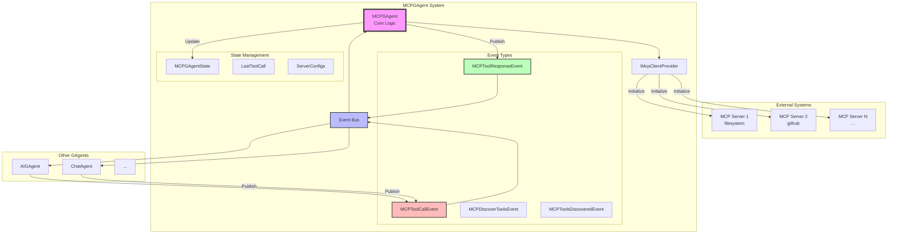

# Aevatar.GAgents.MCP

MCP (Model Context Protocol) integration for Aevatar GAgents framework, enabling AI agents to interact with external tools and services through a standardized protocol.

## 🌟 Overview

MCPGAgent is a GAgent implementation that bridges the Aevatar GAgents ecosystem with Model Context Protocol (MCP) servers. It extends `MemberGAgentBase` from the GroupChat module and provides a unified event-driven interface for AI agents to discover and invoke tools from various MCP servers.

### Inheritance Hierarchy

```
GAgentBase<TState, TStateLogEvent>
    └── MemberGAgentBase<TState, TStateLogEvent, TEvent, TConfiguration>
            └── MCPGAgentBase<TState, TStateLogEvent, TEvent, TConfiguration>
                    └── MCPGAgent : IMCPGAgent
```

MCPGAgent inherits GroupChat capabilities, including:
- Blackboard integration for multi-agent coordination
- Interest value calculation for task assignment
- Built-in chat functionality (though typically skipped for tool-only agents)

### Key Features

- 🔌 **Multi-Server Support**: Connect to multiple MCP servers through configurable providers
- 🎭 **Event-Driven Architecture**: Full integration with GAgents event system using `EventWithResponseBase`
- 🔍 **Dynamic Tool Discovery**: Automatically discover available tools from MCP servers
- 🛡️ **Type-Safe Implementation**: Strongly-typed with Orleans serialization attributes
- 📊 **State Management**: Event-sourced state with proper state transitions
- ⚡ **Async/Await Support**: Full asynchronous operation support
- 🔧 **Extensible Provider System**: Pluggable MCP client providers through DI

## 🏗️ Architecture



## 📦 Installation

Add the NuGet package to your project:

```bash
dotnet add package Aevatar.GAgents.MCP
dotnet add package Aevatar.GAgents.MCP.Core
```

## 🔑 Important Implementation Notes

### GAgent Attribute Requirements

All GAgent implementations must have the `[GAgent]` attribute:

```csharp
[GAgent("mcp", "aevatar")]  // alias and namespace
public class MCPGAgent : MCPGAgentBase<...>, IMCPGAgent
{
    // Implementation
}
```

### No Constructor Parameters

GAgents must **never** have constructor parameters. Use property injection instead:

```csharp
// ❌ WRONG
public MCPGAgent(ILogger<MCPGAgent> logger) { }

// ✅ CORRECT - Use base class property
protected ILogger Logger => base.Logger;

// ✅ CORRECT - Use service provider
private IGAgentFactory GAgentFactory => 
    ServiceProvider.GetRequiredService<IGAgentFactory>();
```

### State Management Rules

1. **Never modify state directly**:
```csharp
// ❌ WRONG
State.LastToolCall = DateTime.UtcNow;

// ✅ CORRECT
RaiseEvent(new UpdateLastToolCallLogEvent { Timestamp = DateTime.UtcNow });
await ConfirmEvents();
```

2. **All state changes through events**:
```csharp
protected override void GAgentTransitionState(MCPGAgentState state, 
    StateLogEventBase<MCPGAgentStateLogEvent> @event)
{
    switch (@event)
    {
        case UpdateLastToolCallLogEvent e:
            state.LastToolCall = e.Timestamp;
            break;
    }
}
```

## 📝 Configuration

MCPGAgent uses `MCPGAgentConfig` which extends `MemberConfigDto` from the GroupChat module:

```csharp
[GenerateSerializer]
public class MCPGAgentConfig : MemberConfigDto
{
    [Id(0)] public MCPServerConfig ServerConfig { get; set; } = new();
    [Id(1)] public TimeSpan RequestTimeout { get; set; } = TimeSpan.FromSeconds(30);
}

[GenerateSerializer]
public class MCPServerConfig
{
    [Id(0)] public string ServerName { get; set; } = string.Empty;
    [Id(1)] public string Command { get; set; } = string.Empty;
    [Id(2)] public List<string> Args { get; set; } = new();
    [Id(3)] public Dictionary<string, string> Environment { get; set; } = new();
}
```

## 🚀 Quick Start

### 1. Configure MCP Servers

```csharp
// Create configuration
var mcpConfig = new MCPGAgentConfig
{
    ServerConfig = new MCPServerConfig
    {
        ServerName = "filesystem",
        Command = "npx",
        Args = new List<string> { "-y", "@modelcontextprotocol/server-filesystem" },
        Environment = new Dictionary<string, string>
        {
            ["NODE_ENV"] = "production",
            ["ALLOWED_PATHS"] = "/home/user/documents"
        }
    },
    RequestTimeout = TimeSpan.FromSeconds(30)
};
```

### 2. Initialize MCPGAgent

```csharp
// Always use IGAgentFactory - never instantiate directly!
var gAgentFactory = ServiceProvider.GetRequiredService<IGAgentFactory>();

// Create and configure MCPGAgent with configuration
var mcpGAgent = await gAgentFactory.GetGAgentAsync<IMCPGAgent>(
    Guid.NewGuid(),
    mcpConfig  // Pass configuration
);

// The GAgentFactory will automatically call PerformConfigAsync
// which initializes the MCP client and discovers tools
```

### 3. Discover Available Tools

```csharp
// Within a GAgent that needs to discover MCP tools
public async Task DiscoverToolsAsync(string serverName)
{
    // Publish discovery event
    await PublishAsync(new MCPDiscoverToolsEvent 
    { 
        ServerName = serverName 
    });
}

// Handle discovered tools in your GAgent
[EventHandler]
public async Task HandleEventAsync(MCPToolsDiscoveredEvent @event)
{
    foreach (var tool in @event.Tools)
    {
        Logger.LogInformation($"Discovered tool: {tool.Name} - {tool.Description}");
        foreach (var param in tool.Parameters)
        {
            Logger.LogInformation($"  Parameter: {param.Name} ({param.Type}) - Required: {param.Required}");
        }
    }
}
```

### 4. Invoke MCP Tools

```csharp
// Within a GAgent that needs to call MCP tools
public async Task<MCPToolResponseEvent> ReadFileAsync(string filePath)
{
    var toolCallEvent = new MCPToolCallEvent
    {
        ServerName = "filesystem",
        ToolName = "read_file",
        Arguments = new Dictionary<string, object>
        {
            ["path"] = filePath
        }
    };
    
    // MCPGAgent will handle this event and return the response
    return await PublishAsync<MCPToolCallEvent, MCPToolResponseEvent>(toolCallEvent);
}

// Or handle the response asynchronously
[EventHandler]
public async Task HandleEventAsync(MCPToolResponseEvent response)
{
    if (response.Success)
    {
        Logger.LogInformation($"Tool executed successfully: {response.Result}");
        // Process the result
    }
    else
    {
        Logger.LogError($"Tool execution failed: {response.ErrorMessage}");
    }
}
```

## 🔧 Advanced Usage

### Creating a Custom MCPGAgent

```csharp
// Define your interface
public interface IMyMCPGAgent : IMCPGAgent
{
    Task<string> ProcessFileWithToolAsync(string filePath);
}

// Implement your custom MCPGAgent
[GAgent("my-mcp", "workshop")]
public class MyMCPGAgent : MCPGAgentBase<MyMCPState, MyMCPStateLogEvent, EventBase, MyMCPConfig>,
    IMyMCPGAgent
{
    public override Task<string> GetDescriptionAsync()
        => Task.FromResult("Custom MCP GAgent for file processing");
    
    public async Task<string> ProcessFileWithToolAsync(string filePath)
    {
        var response = await CallToolAsync("filesystem", "read_file", 
            new Dictionary<string, object> { ["path"] = filePath });
            
        if (response.Success)
        {
            // Process the file content
            return response.Result?.ToString() ?? string.Empty;
        }
        
        throw new InvalidOperationException($"Failed to read file: {response.ErrorMessage}");
    }
    
    protected override void GAgentTransitionState(MyMCPState state, StateLogEventBase<MyMCPStateLogEvent> @event)
    {
        // Handle state transitions
    }
}

// State and configuration classes
[GenerateSerializer]
public class MyMCPState : MCPGAgentState
{
    [Id(0)] public int ProcessedFiles { get; set; }
}

[GenerateSerializer]
public abstract record MyMCPStateLogEvent : StateLogEventBase<MyMCPStateLogEvent>;

[GenerateSerializer]
public class MyMCPConfig : MCPGAgentConfig
{
    [Id(0)] public string WorkingDirectory { get; set; } = string.Empty;
}
```

### Custom MCP Client Provider

```csharp
public class CustomMcpClientProvider : IMcpClientProvider
{
    private readonly ILogger<CustomMcpClientProvider> _logger;
    
    public CustomMcpClientProvider(ILogger<CustomMcpClientProvider> logger)
    {
        _logger = logger;
    }
    
    public async Task<IMcpClient> GetOrCreateClientAsync(MCPServerConfig config)
    {
        // Implement custom client creation logic
        _logger.LogInformation("Creating custom MCP client for {ServerName}", config.ServerName);
        return new WebSocketMcpClient(config);
    }
}

// Register in your module
public class MyModule : AbpModule
{
    public override void ConfigureServices(ServiceConfigurationContext context)
    {
        context.Services.AddSingleton<IMcpClientProvider, CustomMcpClientProvider>();
    }
}
```

### State Management

```csharp
// Define state log events for MCP operations
[GenerateSerializer]
public record ToolCalledLogEvent : MCPGAgentStateLogEvent
{
    [Id(0)] public string ToolName { get; init; } = string.Empty;
    [Id(1)] public DateTime Timestamp { get; init; }
}

// In your MCPGAgent implementation
protected override void GAgentTransitionState(MCPGAgentState state, StateLogEventBase<MCPGAgentStateLogEvent> @event)
{
    switch (@event)
    {
        case ToolCalledLogEvent e:
            state.LastToolCall = e.Timestamp;
            // Update other state as needed
            break;
        case ConfigMCPServerLogEvent e:
            state.MCPServerConfig = e.ServerConfig;
            break;
    }
}

// Raise events to update state
public async Task RecordToolCallAsync(string toolName)
{
    RaiseEvent(new ToolCalledLogEvent 
    { 
        ToolName = toolName,
        Timestamp = DateTime.UtcNow 
    });
    await ConfirmEvents();
}
```

## 📋 Event Reference

### MCPToolCallEvent
Triggers a tool invocation on an MCP server. Inherits from `EventWithResponseBase<MCPToolResponseEvent>`.

```csharp
[GenerateSerializer]
[Description("Call a tool on MCP server")]
public class MCPToolCallEvent : EventWithResponseBase<MCPToolResponseEvent>
{
    [Id(0)] public string ServerName { get; set; } = string.Empty;
    [Id(1)] public string ToolName { get; set; } = string.Empty;
    [Id(2)] public Dictionary<string, object> Arguments { get; set; } = new();
    [Id(3)] public Guid RequestId { get; set; } = Guid.NewGuid();
}
```

### MCPToolResponseEvent
Response from a tool invocation.

```csharp
[GenerateSerializer]
public class MCPToolResponseEvent : EventBase
{
    [Id(0)] public Guid RequestId { get; set; }
    [Id(1)] public bool Success { get; set; }
    [Id(2)] public object? Result { get; set; }
    [Id(3)] public string? ErrorMessage { get; set; }
    [Id(4)] public string ServerName { get; set; } = string.Empty;
    [Id(5)] public string ToolName { get; set; } = string.Empty;
}
```

### MCPDiscoverToolsEvent
Request tool discovery from a specific server.

```csharp
[GenerateSerializer]
public class MCPDiscoverToolsEvent : EventBase
{
    [Id(0)] public string ServerName { get; set; } = string.Empty;
}
```

### MCPToolsDiscoveredEvent
Response containing discovered tools.

```csharp
[GenerateSerializer]
public class MCPToolsDiscoveredEvent : EventBase
{
    [Id(0)] public string ServerName { get; set; } = string.Empty;
    [Id(1)] public List<MCPToolInfo> Tools { get; set; } = new();
}
```

## 🧪 Testing

The module includes comprehensive testing support:

### Unit Testing with Mock Provider

```csharp
// In your test module
public class MyTestModule : AbpModule
{
    public override void ConfigureServices(ServiceConfigurationContext context)
    {
        // Register mock provider
        context.Services.AddSingleton<IMcpClientProvider, MockMcpClientProvider>();
    }
}

// In your test base
public class MCPGAgentTestBase : AevatarTestBase<MyTestModule>
{
    protected async Task<IMCPGAgent> CreateMCPGAgentAsync()
    {
        var config = new MCPGAgentConfig
        {
            ServerConfig = new MCPServerConfig
            {
                ServerName = "test-server",
                Command = "mock",
                Args = new List<string>()
            },
            RequestTimeout = TimeSpan.FromSeconds(5)
        };
        
        var gAgentFactory = GetRequiredService<IGAgentFactory>();
        return await gAgentFactory.GetGAgentAsync<IMCPGAgent>(Guid.NewGuid(), config);
    }
}

// Example test
[Fact]
public async Task Should_Discover_Tools()
{
    // Arrange
    var mcpGAgent = await CreateMCPGAgentAsync();
    
    // Act
    var tools = await mcpGAgent.GetAvailableToolsAsync("test-server");
    
    // Assert
    tools.ShouldNotBeEmpty();
    tools.ShouldContain(t => t.Name == "read_file");
}
```

### Testing Event Handlers

```csharp
[Fact]
public async Task Should_Handle_Tool_Call_Event()
{
    // Arrange
    var mcpGAgent = await CreateMCPGAgentAsync();
    var toolCallEvent = new MCPToolCallEvent
    {
        ServerName = "test-server",
        ToolName = "read_file",
        Arguments = new Dictionary<string, object> { ["path"] = "test.txt" }
    };
    
    // Act - Use GAgentExecutor for event testing
    var executor = GetRequiredService<IGAgentExecutor>();
    var responseJson = await executor.ExecuteGAgentEventHandler(
        mcpGAgent, 
        toolCallEvent, 
        typeof(MCPToolResponseEvent)
    );
    
    var response = JsonSerializer.Deserialize<MCPToolResponseEvent>(responseJson);
    
    // Assert
    response.ShouldNotBeNull();
    response.Success.ShouldBeTrue();
    response.Result.ShouldNotBeNull();
}
```

## 🔍 Debugging

Enable detailed logging:

```csharp
builder.Logging.AddFilter("Aevatar.GAgents.MCP", LogLevel.Debug);
```

Common issues and solutions:

| Issue | Solution |
|-------|----------|
| Tools not discovered | Check server configuration and network connectivity |
| Tool execution timeout | Increase `RequestTimeout` in config |
| Parameter validation errors | Verify required parameters and types |
| Server startup failure | Check command path and environment variables |

## 🛣️ Roadmap

- [x] Core architecture implementation
- [x] Event system integration
- [x] Mock provider for testing
- [x] Stdio-based MCP client
- [ ] Tool caching and optimization
- [ ] Metrics and monitoring
- [ ] OpenTelemetry integration
- [ ] Tool composition and chaining

## 🤝 Contributing

Contributions are welcome! Please read our contributing guidelines and submit pull requests to our repository.

## 📄 License

This project is licensed under the MIT License - see the LICENSE file for details.

## 🔗 Related Projects

- [Model Context Protocol](https://github.com/anthropics/model-context-protocol)
- [Aevatar GAgents Framework](https://github.com/aevatar/gagents)
- [MCP Server Implementations](https://github.com/modelcontextprotocol/servers)
- [Orleans Event Sourcing](https://docs.microsoft.com/en-us/dotnet/orleans/grains/event-sourcing)