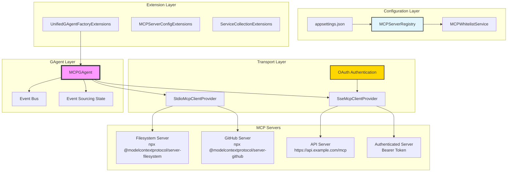

# Aevatar.GAgents.MCP

MCP (Model Context Protocol) integration for Aevatar GAgents framework, enabling AI agents to interact with external tools and services through a standardized protocol with comprehensive OAuth authentication support.

## 🌟 Overview

MCPGAgent is a GAgent implementation that bridges the Aevatar GAgents ecosystem with Model Context Protocol (MCP) servers. It provides a unified event-driven interface for AI agents to discover and invoke tools from various MCP servers, supporting both Stdio and StreamableHttp transports with advanced authentication mechanisms.

### Key Features

- 🔌 **Multi-Server Support**: Connect to multiple MCP servers with different transport types
- 🎭 **Event-Driven Architecture**: Full integration with GAgents event system
- 🔍 **Dynamic Tool Discovery**: Automatically discover available tools from MCP servers
- 🛡️ **OAuth Authentication**: Comprehensive OAuth support (Bearer, OAuth2, Basic, Custom)
- 📊 **State Management**: Event-sourced state with proper state transitions
- ⚡ **Dual Transport Support**: Both Stdio and StreamableHttp (SSE) protocols
- 🔧 **Extensible Provider System**: Pluggable MCP client providers through DI
- 🏗️ **Scalable Whitelist System**: Configuration-driven server management
- 📋 **Unified Extension Methods**: Convenient factory methods for all scenarios

## 🏗️ Architecture


```mermaid
graph TB
    subgraph "Configuration Layer"
        Config[appsettings.json]
        Registry[MCPServerRegistry]
        Whitelist[MCPWhitelistService]
    end
    
    subgraph "Extension Layer"
        UnifiedExt[UnifiedGAgentFactoryExtensions]
        ConfigExt[MCPServerConfigExtensions]
        ServiceExt[ServiceCollectionExtensions]
    end
    
    subgraph "Transport Layer"
        StdioProvider[StdioMcpClientProvider]
        SseProvider[SseMcpClientProvider]
        OAuth[OAuth Authentication]
    end
    
    subgraph "MCP Servers"
        Stdio1[Filesystem Server<br/>npx @modelcontextprotocol/server-filesystem]
        Stdio2[GitHub Server<br/>npx @modelcontextprotocol/server-github]
        Http1[API Server<br/>https://api.example.com/mcp]
        Http2[Authenticated Server<br/>Bearer Token]
    end
    
    subgraph "GAgent Layer"
        MCPGAgent[MCPGAgent]
        EventBus[Event Bus]
        State[Event Sourcing State]
    end
    
    %% Connections
    Config --> Registry
    Registry --> Whitelist
    UnifiedExt --> MCPGAgent
    StdioProvider --> Stdio1
    StdioProvider --> Stdio2
    SseProvider --> Http1
    SseProvider --> Http2
    OAuth --> SseProvider
    MCPGAgent --> StdioProvider
    MCPGAgent --> SseProvider
    MCPGAgent --> EventBus
    MCPGAgent --> State
    
    style MCPGAgent fill:#f9f,stroke:#333,stroke-width:4px
    style OAuth fill:#ffd700,stroke:#333,stroke-width:2px
    style Registry fill:#e1f5fe,stroke:#333,stroke-width:2px
```

## 📦 Installation

Add the NuGet packages to your project:

```bash
dotnet add package Aevatar.GAgents.MCP
dotnet add package Aevatar.GAgents.MCP.Core
```

Register the services in your module:

```csharp
[DependsOn(typeof(AevatarGAgentsMCPModule))]
public class YourModule : AbpModule
{
    public override void ConfigureServices(ServiceConfigurationContext context)
    {
        // Register MCP server registry and whitelist services
        context.Services.AddMCPServerRegistry();
    }
}
```

## 🚀 Quick Start

### 1. Configuration-Based Approach (Recommended)

Configure MCP servers in your `appsettings.json`:

```json
{
  "MCPServerOptions": {
    "EnableAllMCPServers": false,
    "ResetWhitelistEverytime": true,
    "MCPServers": {
      "filesystem": {
        "ServerName": "filesystem",
        "Command": "npx",
        "Args": ["-y", "@modelcontextprotocol/server-filesystem", "/path/to/directory"],
        "Description": "File system operations",
        "Type": "Stdio"
      },
      "github": {
        "ServerName": "github",
        "Command": "npx",
        "Args": ["-y", "@modelcontextprotocol/server-github"],
        "Description": "GitHub API integration",
        "Type": "Stdio",
        "Env": {
          "GITHUB_PERSONAL_ACCESS_TOKEN": "${GITHUB_TOKEN}"
        }
      },
      "api-server": {
        "ServerName": "api-server",
        "Url": "https://api.example.com/mcp/stream",
        "Description": "Custom API server via SSE",
        "Type": "StreamableHttp",
        "Headers": {
          "Accept": "text/event-stream"
        },
        "OAuth": {
          "ProviderType": "bearer",
          "AccessToken": "${API_ACCESS_TOKEN}"
        }
      }
    }
  }
}
```

Create MCPGAgent using server name:

```csharp
var gAgentFactory = serviceProvider.GetRequiredService<IGAgentFactory>();

// Create MCPGAgent for configured server
var mcpGAgent = await gAgentFactory.GetMCPGAgentAsync("filesystem");

// Or with custom environment variables
var githubAgent = await gAgentFactory.GetMCPGAgentAsync("github", 
    env: new Dictionary<string, string>
    {
        ["GITHUB_PERSONAL_ACCESS_TOKEN"] = "your-token-here"
    });
```

### 2. DefaultMCPServer Enum Approach

Use predefined server configurations:

```csharp
// Core servers (no authentication required)
var memoryAgent = await gAgentFactory.GetMCPGAgentAsync(DefaultMCPServer.Memory);
var filesystemAgent = await gAgentFactory.GetMCPGAgentAsync(DefaultMCPServer.Filesystem);

// Authenticated servers (environment variables required)
var githubAgent = await gAgentFactory.GetMCPGAgentAsync(
    DefaultMCPServer.GitHub,
    env: new Dictionary<string, string>
    {
        ["GITHUB_PERSONAL_ACCESS_TOKEN"] = "your-token"
    });
```

### 3. StreamableHttp with OAuth

Create authenticated HTTP-based MCP servers:

```csharp
// Bearer token authentication
var bearerAgent = await gAgentFactory.GetStreamableHttpMCPGAgentWithAuthAsync(
    serverName: "api-server",
    url: "https://api.example.com/mcp/stream",
    bearerToken: "your-bearer-token",
    description: "API server with Bearer auth"
);

// OAuth2 authentication
var oauthConfig = new MCPOAuthConfig
{
    ProviderType = "oauth2",
    ClientId = "your-client-id",
    ClientSecret = "your-client-secret",
    AccessToken = "your-access-token",
    TokenUrl = "https://auth.example.com/oauth/token"
};

var oauth2Agent = await gAgentFactory.GetStreamableHttpMCPGAgentWithOAuthAsync(
    serverName: "oauth2-server",
    url: "https://secure.api.com/mcp/stream",
    oauthConfig: oauthConfig
);

// API Key authentication
var apiKeyAgent = await gAgentFactory.GetStreamableHttpMCPGAgentWithApiKeyAsync(
    serverName: "api-key-server",
    url: "https://api.service.com/mcp/events",
    apiKey: "your-api-key",
    apiKeyHeader: "X-API-Key"  // Optional, defaults to "X-API-Key"
);
```

### 4. Convenience Methods for Common Servers

```csharp
// Filesystem with specific paths
var fsAgent = await gAgentFactory.GetFilesystemMCPGAgentAsync("/home/user/docs", "/tmp");

// Check server availability
var serverNames = gAgentFactory.GetRegisteredMCPServerNames();
var isRegistered = gAgentFactory.IsMCPServerRegistered("github");
var serverConfig = gAgentFactory.GetMCPServerConfig("filesystem");
```

## 🔧 Advanced Configuration

### OAuth Authentication Types

#### Bearer Token
```json
{
  "OAuth": {
    "ProviderType": "bearer",
    "AccessToken": "your-bearer-token"
  }
}
```

#### OAuth2 with Refresh Token
```json
{
  "OAuth": {
    "ProviderType": "oauth2",
    "ClientId": "your-client-id",
    "ClientSecret": "your-client-secret",
    "AccessToken": "current-access-token",
    "RefreshToken": "refresh-token",
    "AuthorizationUrl": "https://auth.example.com/oauth/authorize",
    "TokenUrl": "https://auth.example.com/oauth/token",
    "Scopes": ["read", "write"]
  }
}
```

#### Basic Authentication
```json
{
  "OAuth": {
    "ProviderType": "basic",
    "AdditionalParameters": {
      "username": "your-username",
      "password": "your-password"
    }
  }
}
```

#### Custom Headers
```json
{
  "OAuth": {
    "ProviderType": "custom",
    "AdditionalParameters": {
      "X-API-Key": "your-api-key",
      "X-Client-ID": "your-client-id",
      "X-Signature": "computed-signature"
    }
  }
}
```

### Transport Types

#### Stdio Transport
For local command-line MCP servers:

```json
{
  "ServerName": "filesystem",
  "Command": "npx",
  "Args": ["-y", "@modelcontextprotocol/server-filesystem", "/path"],
  "Type": "Stdio",
  "Env": {
    "NODE_ENV": "production"
  }
}
```

#### StreamableHttp Transport
For HTTP-based MCP servers using Server-Sent Events:

```json
{
  "ServerName": "api-server",
  "Url": "https://api.example.com/mcp/stream",
  "Type": "StreamableHttp",
  "Headers": {
    "Accept": "text/event-stream",
    "User-Agent": "Aevatar-MCP-Client/1.0"
  }
}
```

## 🎭 Event-Driven Usage

### Tool Discovery

```csharp
[EventHandler]
public async Task HandleToolsDiscoveredAsync(MCPToolsDiscoveredEvent @event)
{
    Logger.LogInformation("Discovered {Count} tools from {ServerName}", 
        @event.Tools.Count, @event.ServerName);
    
    foreach (var tool in @event.Tools)
    {
        Logger.LogInformation("Tool: {Name} - {Description}", 
            tool.Name, tool.Description);
    }
}
```

### Tool Invocation

```csharp
// Call a tool and get response
public async Task<string> ReadFileAsync(string filePath)
{
    var response = await CallToolAsync("filesystem", "read_file", 
        new Dictionary<string, object> { ["path"] = filePath });
    
    if (response.Success)
    {
        return response.Result?.ToString() ?? string.Empty;
    }
    
    throw new InvalidOperationException($"Failed to read file: {response.ErrorMessage}");
}

// Or use event-driven approach
[EventHandler]
public async Task HandleToolResponseAsync(MCPToolResponseEvent @event)
{
    if (@event.Success)
    {
        Logger.LogInformation("Tool {ToolName} executed successfully: {Result}", 
            @event.ToolName, @event.Result);
    }
    else
    {
        Logger.LogError("Tool {ToolName} failed: {Error}", 
            @event.ToolName, @event.ErrorMessage);
    }
}
```

## 🔍 Extension Methods Reference

### UnifiedGAgentFactoryExtensions

```csharp
// DefaultMCPServer enum approach
Task<IMCPGAgent> GetMCPGAgentAsync(DefaultMCPServer defaultServer, 
    Dictionary<string, string>? env = null, string[]? customArgs = null)

// Server name approach  
Task<IMCPGAgent?> GetMCPGAgentAsync(string serverName,
    Dictionary<string, string>? env = null, string[]? customArgs = null)

// Filesystem convenience
Task<IMCPGAgent> GetFilesystemMCPGAgentAsync(params string[] paths)

// StreamableHttp methods
Task<IMCPGAgent> GetStreamableHttpMCPGAgentAsync(string serverName, string url,
    Dictionary<string, string>? headers = null, string? description = null)

Task<IMCPGAgent> GetStreamableHttpMCPGAgentWithAuthAsync(string serverName, 
    string url, string bearerToken, Dictionary<string, string>? additionalHeaders = null)

Task<IMCPGAgent> GetStreamableHttpMCPGAgentWithApiKeyAsync(string serverName,
    string url, string apiKey, string apiKeyHeader = "X-API-Key")

Task<IMCPGAgent> GetStreamableHttpMCPGAgentWithOAuthAsync(string serverName,
    string url, MCPOAuthConfig oauthConfig, Dictionary<string, string>? additionalHeaders = null)

// Registry queries
IEnumerable<string> GetRegisteredMCPServerNames()
bool IsMCPServerRegistered(string serverName)
MCPServerConfig? GetMCPServerConfig(string serverName)
```

### MCPServerConfigExtensions

```csharp
// Configuration manipulation
MCPServerConfig Clone()
MCPServerConfig Merge(MCPServerConfig target)
ConfigValidationResult Validate()
MCPServerConfig WithoutSensitiveInfo()  // For logging
```

### ServiceCollectionExtensions

```csharp
// Service registration
IServiceCollection AddMCPServerRegistry()         // Full setup with background services
IServiceCollection AddMCPServerRegistryOnly()     // Registry only, no background services
```

## 📊 Configuration Validation

The system includes comprehensive validation:

```csharp
var config = new MCPServerConfig
{
    ServerName = "test-server",
    Url = "https://api.example.com/mcp/stream",
    Type = MCPServerType.StreamableHttp,
    OAuth = new MCPOAuthConfig
    {
        ProviderType = "bearer",
        AccessToken = "token"
    }
};

var validationResult = config.Validate();
if (!validationResult.IsValid)
{
    foreach (var error in validationResult.ErrorMessages)
    {
        Logger.LogError("Validation error: {Error}", error);
    }
}
```

## 🧪 Testing

### Unit Testing with Mock Providers

```csharp
[Collection(ClusterCollection.Name)]
public class MCPGAgentTests : AevatarTestBase<TestModule>
{
    private readonly IGAgentFactory _gAgentFactory;

    public MCPGAgentTests()
    {
        _gAgentFactory = GetRequiredService<IGAgentFactory>();
    }

    [Fact]
    public async Task Should_Create_MCPGAgent_From_Configuration()
    {
        // Arrange & Act
        var mcpGAgent = await _gAgentFactory.GetMCPGAgentAsync("filesystem");
        
        // Assert
        mcpGAgent.ShouldNotBeNull();
        
        var tools = await mcpGAgent.GetAvailableToolsAsync();
        tools.ShouldNotBeEmpty();
    }

    [Fact]
    public async Task Should_Handle_OAuth_Authentication()
    {
        // Arrange
        var oauthConfig = new MCPOAuthConfig
        {
            ProviderType = "bearer",
            AccessToken = "test-token"
        };

        // Act
        var mcpGAgent = await _gAgentFactory.GetStreamableHttpMCPGAgentWithOAuthAsync(
            "test-server", "https://test.api.com/mcp", oauthConfig);

        // Assert
        mcpGAgent.ShouldNotBeNull();
    }
}
```

## 🔍 Debugging and Monitoring

Enable detailed logging:

```csharp
builder.Logging.AddFilter("Aevatar.GAgents.MCP", LogLevel.Debug);
```

Common troubleshooting:

| Issue | Solution |
|-------|----------|
| Server not found | Check `appsettings.json` configuration and server name |
| Authentication failed | Verify OAuth configuration and tokens |
| Tool execution timeout | Increase `RequestTimeout` in configuration |
| Connection refused | Check server URL and network connectivity |
| Invalid parameters | Use `ConfigValidationResult` to validate configuration |

## 🛣️ Roadmap

- [x] Core MCP integration
- [x] Stdio and StreamableHttp transport support
- [x] OAuth authentication system
- [x] Unified extension methods
- [x] Configuration-driven server management
- [x] Comprehensive validation system
- [ ] Advanced tool composition and chaining
- [ ] Metrics and monitoring integration
- [ ] Connection pooling optimization
- [ ] Automatic token refresh for OAuth2

## 📋 Supported MCP Servers

### Official Servers
- **Filesystem**: File system operations (`@modelcontextprotocol/server-filesystem`)
- **GitHub**: GitHub API integration (`@modelcontextprotocol/server-github`)
- **Memory**: Persistent memory (`@modelcontextprotocol/server-memory`)
- **PostgreSQL**: Database operations (`@modelcontextprotocol/server-postgres`)
- **SQLite**: SQLite database (`@modelcontextprotocol/server-sqlite`)
- **And many more...**

### Third-party Servers
- **Docker**: Container management (`mcp-server-docker`)
- **AWS CLI**: AWS operations (`mcp-server-aws-cli`)
- **MongoDB**: Document database (`mcp-server-mongodb`)
- **Redis**: Cache operations (`mcp-server-redis`)
- **And 200+ community servers...**

## 🤝 Contributing

Contributions are welcome! Please read our contributing guidelines and submit pull requests to our repository.

## 📄 License

This project is licensed under the MIT License - see the LICENSE file for details.

## 🔗 Related Projects

- [Model Context Protocol](https://github.com/modelcontextprotocol/servers)
- [Aevatar GAgents Framework](https://github.com/aevatar/gagents)
- [MCP Server Registry](https://mcpservers.com)
- [Orleans Documentation](https://docs.microsoft.com/en-us/dotnet/orleans/)