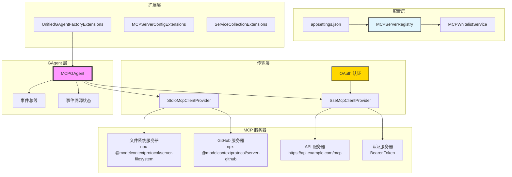

# Aevatar.GAgents.MCP

为 Aevatar GAgents 框架提供 MCP (模型上下文协议) 集成，使 AI 智能体能够通过标准化协议与外部工具和服务交互，并提供全面的 OAuth 认证支持。

## 🌟 概述

MCPGAgent 是一个 GAgent 实现，它在 Aevatar GAgents 生态系统和模型上下文协议 (MCP) 服务器之间建立桥梁。它为 AI 智能体提供统一的事件驱动接口，用于发现和调用各种 MCP 服务器的工具，支持 Stdio 和 StreamableHttp 传输协议以及高级认证机制。

### 主要特性

- 🔌 **多服务器支持**: 连接多个不同传输类型的 MCP 服务器
- 🎭 **事件驱动架构**: 与 GAgents 事件系统完全集成
- 🔍 **动态工具发现**: 自动发现 MCP 服务器的可用工具
- 🛡️ **OAuth 认证**: 全面的 OAuth 支持 (Bearer、OAuth2、Basic、Custom)
- 📊 **状态管理**: 基于事件溯源的状态管理和正确的状态转换
- ⚡ **双传输支持**: 同时支持 Stdio 和 StreamableHttp (SSE) 协议
- 🔧 **可扩展的提供者系统**: 通过依赖注入的可插拔 MCP 客户端提供者
- 🏗️ **可扩展的白名单系统**: 配置驱动的服务器管理
- 📋 **统一扩展方法**: 为所有场景提供便捷的工厂方法

## 🏗️ 架构图



## 📦 安装

将 NuGet 包添加到您的项目：

```bash
dotnet add package Aevatar.GAgents.MCP
dotnet add package Aevatar.GAgents.MCP.Core
```

在您的模块中注册服务：

```csharp
[DependsOn(typeof(AevatarGAgentsMCPModule))]
public class YourModule : AbpModule
{
    public override void ConfigureServices(ServiceConfigurationContext context)
    {
        // 注册 MCP 服务器注册表和白名单服务
        context.Services.AddMCPServerRegistry();
    }
}
```

## 🚀 快速开始

### 1. 基于配置的方法 (推荐)

在 `appsettings.json` 中配置 MCP 服务器：

```json
{
  "MCPServerOptions": {
    "EnableAllMCPServers": false,
    "ResetWhitelistEverytime": true,
    "MCPServers": {
      "filesystem": {
        "ServerName": "filesystem",
        "Command": "npx",
        "Args": ["-y", "@modelcontextprotocol/server-filesystem", "/path/to/directory"],
        "Description": "文件系统操作",
        "Type": "Stdio"
      },
      "github": {
        "ServerName": "github",
        "Command": "npx",
        "Args": ["-y", "@modelcontextprotocol/server-github"],
        "Description": "GitHub API 集成",
        "Type": "Stdio",
        "Env": {
          "GITHUB_PERSONAL_ACCESS_TOKEN": "${GITHUB_TOKEN}"
        }
      },
      "api-server": {
        "ServerName": "api-server",
        "Url": "https://api.example.com/mcp/stream",
        "Description": "通过 SSE 的自定义 API 服务器",
        "Type": "StreamableHttp",
        "Headers": {
          "Accept": "text/event-stream"
        },
        "OAuth": {
          "ProviderType": "bearer",
          "AccessToken": "${API_ACCESS_TOKEN}"
        }
      }
    }
  }
}
```

使用服务器名称创建 MCPGAgent：

```csharp
var gAgentFactory = serviceProvider.GetRequiredService<IGAgentFactory>();

// 为配置的服务器创建 MCPGAgent
var mcpGAgent = await gAgentFactory.GetMCPGAgentAsync("filesystem");

// 或者使用自定义环境变量
var githubAgent = await gAgentFactory.GetMCPGAgentAsync("github", 
    env: new Dictionary<string, string>
    {
        ["GITHUB_PERSONAL_ACCESS_TOKEN"] = "your-token-here"
    });
```

### 2. DefaultMCPServer 枚举方法

使用预定义的服务器配置：

```csharp
// 核心服务器 (无需认证)
var memoryAgent = await gAgentFactory.GetMCPGAgentAsync(DefaultMCPServer.Memory);
var filesystemAgent = await gAgentFactory.GetMCPGAgentAsync(DefaultMCPServer.Filesystem);

// 认证服务器 (需要环境变量)
var githubAgent = await gAgentFactory.GetMCPGAgentAsync(
    DefaultMCPServer.GitHub,
    env: new Dictionary<string, string>
    {
        ["GITHUB_PERSONAL_ACCESS_TOKEN"] = "your-token"
    });
```

### 3. StreamableHttp 与 OAuth

创建认证的基于 HTTP 的 MCP 服务器：

```csharp
// Bearer token 认证
var bearerAgent = await gAgentFactory.GetStreamableHttpMCPGAgentWithAuthAsync(
    serverName: "api-server",
    url: "https://api.example.com/mcp/stream",
    bearerToken: "your-bearer-token",
    description: "使用 Bearer 认证的 API 服务器"
);

// OAuth2 认证
var oauthConfig = new MCPOAuthConfig
{
    ProviderType = "oauth2",
    ClientId = "your-client-id",
    ClientSecret = "your-client-secret",
    AccessToken = "your-access-token",
    TokenUrl = "https://auth.example.com/oauth/token"
};

var oauth2Agent = await gAgentFactory.GetStreamableHttpMCPGAgentWithOAuthAsync(
    serverName: "oauth2-server",
    url: "https://secure.api.com/mcp/stream",
    oauthConfig: oauthConfig
);

// API Key 认证
var apiKeyAgent = await gAgentFactory.GetStreamableHttpMCPGAgentWithApiKeyAsync(
    serverName: "api-key-server",
    url: "https://api.service.com/mcp/events",
    apiKey: "your-api-key",
    apiKeyHeader: "X-API-Key"  // 可选，默认为 "X-API-Key"
);
```

### 4. 常用服务器的便捷方法

```csharp
// 指定路径的文件系统
var fsAgent = await gAgentFactory.GetFilesystemMCPGAgentAsync("/home/user/docs", "/tmp");

// 检查服务器可用性
var serverNames = gAgentFactory.GetRegisteredMCPServerNames();
var isRegistered = gAgentFactory.IsMCPServerRegistered("github");
var serverConfig = gAgentFactory.GetMCPServerConfig("filesystem");
```

## 🔧 高级配置

### OAuth 认证类型

#### Bearer Token
```json
{
  "OAuth": {
    "ProviderType": "bearer",
    "AccessToken": "your-bearer-token"
  }
}
```

#### OAuth2 与刷新令牌
```json
{
  "OAuth": {
    "ProviderType": "oauth2",
    "ClientId": "your-client-id",
    "ClientSecret": "your-client-secret",
    "AccessToken": "current-access-token",
    "RefreshToken": "refresh-token",
    "AuthorizationUrl": "https://auth.example.com/oauth/authorize",
    "TokenUrl": "https://auth.example.com/oauth/token",
    "Scopes": ["read", "write"]
  }
}
```

#### Basic 认证
```json
{
  "OAuth": {
    "ProviderType": "basic",
    "AdditionalParameters": {
      "username": "your-username",
      "password": "your-password"
    }
  }
}
```

#### 自定义头部
```json
{
  "OAuth": {
    "ProviderType": "custom",
    "AdditionalParameters": {
      "X-API-Key": "your-api-key",
      "X-Client-ID": "your-client-id",
      "X-Signature": "computed-signature"
    }
  }
}
```

### 传输类型

#### Stdio 传输
用于本地命令行 MCP 服务器：

```json
{
  "ServerName": "filesystem",
  "Command": "npx",
  "Args": ["-y", "@modelcontextprotocol/server-filesystem", "/path"],
  "Type": "Stdio",
  "Env": {
    "NODE_ENV": "production"
  }
}
```

#### StreamableHttp 传输
用于基于 HTTP 的 MCP 服务器，使用服务器发送事件：

```json
{
  "ServerName": "api-server",
  "Url": "https://api.example.com/mcp/stream",
  "Type": "StreamableHttp",
  "Headers": {
    "Accept": "text/event-stream",
    "User-Agent": "Aevatar-MCP-Client/1.0"
  }
}
```

## 🎭 事件驱动用法

### 工具发现

```csharp
[EventHandler]
public async Task HandleToolsDiscoveredAsync(MCPToolsDiscoveredEvent @event)
{
    Logger.LogInformation("从 {ServerName} 发现了 {Count} 个工具", 
        @event.ServerName, @event.Tools.Count);
    
    foreach (var tool in @event.Tools)
    {
        Logger.LogInformation("工具: {Name} - {Description}", 
            tool.Name, tool.Description);
    }
}
```

### 工具调用

```csharp
// 调用工具并获取响应
public async Task<string> ReadFileAsync(string filePath)
{
    var response = await CallToolAsync("filesystem", "read_file", 
        new Dictionary<string, object> { ["path"] = filePath });
    
    if (response.Success)
    {
        return response.Result?.ToString() ?? string.Empty;
    }
    
    throw new InvalidOperationException($"读取文件失败: {response.ErrorMessage}");
}

// 或使用事件驱动方法
[EventHandler]
public async Task HandleToolResponseAsync(MCPToolResponseEvent @event)
{
    if (@event.Success)
    {
        Logger.LogInformation("工具 {ToolName} 执行成功: {Result}", 
            @event.ToolName, @event.Result);
    }
    else
    {
        Logger.LogError("工具 {ToolName} 执行失败: {Error}", 
            @event.ToolName, @event.ErrorMessage);
    }
}
```

## 🔍 扩展方法参考

### UnifiedGAgentFactoryExtensions

```csharp
// DefaultMCPServer 枚举方法
Task<IMCPGAgent> GetMCPGAgentAsync(DefaultMCPServer defaultServer, 
    Dictionary<string, string>? env = null, string[]? customArgs = null)

// 服务器名称方法  
Task<IMCPGAgent?> GetMCPGAgentAsync(string serverName,
    Dictionary<string, string>? env = null, string[]? customArgs = null)

// 文件系统便捷方法
Task<IMCPGAgent> GetFilesystemMCPGAgentAsync(params string[] paths)

// StreamableHttp 方法
Task<IMCPGAgent> GetStreamableHttpMCPGAgentAsync(string serverName, string url,
    Dictionary<string, string>? headers = null, string? description = null)

Task<IMCPGAgent> GetStreamableHttpMCPGAgentWithAuthAsync(string serverName, 
    string url, string bearerToken, Dictionary<string, string>? additionalHeaders = null)

Task<IMCPGAgent> GetStreamableHttpMCPGAgentWithApiKeyAsync(string serverName,
    string url, string apiKey, string apiKeyHeader = "X-API-Key")

Task<IMCPGAgent> GetStreamableHttpMCPGAgentWithOAuthAsync(string serverName,
    string url, MCPOAuthConfig oauthConfig, Dictionary<string, string>? additionalHeaders = null)

// 注册表查询
IEnumerable<string> GetRegisteredMCPServerNames()
bool IsMCPServerRegistered(string serverName)
MCPServerConfig? GetMCPServerConfig(string serverName)
```

### MCPServerConfigExtensions

```csharp
// 配置操作
MCPServerConfig Clone()                    // 深度克隆配置
MCPServerConfig Merge(MCPServerConfig target)  // 合并配置
ConfigValidationResult Validate()         // 验证配置
MCPServerConfig WithoutSensitiveInfo()     // 清理敏感信息用于日志
```

### ServiceCollectionExtensions

```csharp
// 服务注册
IServiceCollection AddMCPServerRegistry()         // 完整设置，包含后台服务
IServiceCollection AddMCPServerRegistryOnly()     // 仅注册表，无后台服务
```

## 📊 配置验证

系统包含全面的验证机制：

```csharp
var config = new MCPServerConfig
{
    ServerName = "test-server",
    Url = "https://api.example.com/mcp/stream",
    Type = MCPServerType.StreamableHttp,
    OAuth = new MCPOAuthConfig
    {
        ProviderType = "bearer",
        AccessToken = "token"
    }
};

var validationResult = config.Validate();
if (!validationResult.IsValid)
{
    foreach (var error in validationResult.ErrorMessages)
    {
        Logger.LogError("验证错误: {Error}", error);
    }
}
```

## 🧪 测试

### 使用模拟提供者进行单元测试

```csharp
[Collection(ClusterCollection.Name)]
public class MCPGAgentTests : AevatarTestBase<TestModule>
{
    private readonly IGAgentFactory _gAgentFactory;

    public MCPGAgentTests()
    {
        _gAgentFactory = GetRequiredService<IGAgentFactory>();
    }

    [Fact]
    public async Task Should_Create_MCPGAgent_From_Configuration()
    {
        // Arrange & Act
        var mcpGAgent = await _gAgentFactory.GetMCPGAgentAsync("filesystem");
        
        // Assert
        mcpGAgent.ShouldNotBeNull();
        
        var tools = await mcpGAgent.GetAvailableToolsAsync();
        tools.ShouldNotBeEmpty();
    }

    [Fact]
    public async Task Should_Handle_OAuth_Authentication()
    {
        // Arrange
        var oauthConfig = new MCPOAuthConfig
        {
            ProviderType = "bearer",
            AccessToken = "test-token"
        };

        // Act
        var mcpGAgent = await _gAgentFactory.GetStreamableHttpMCPGAgentWithOAuthAsync(
            "test-server", "https://test.api.com/mcp", oauthConfig);

        // Assert
        mcpGAgent.ShouldNotBeNull();
    }
}
```

## 🔍 调试和监控

启用详细日志记录：

```csharp
builder.Logging.AddFilter("Aevatar.GAgents.MCP", LogLevel.Debug);
```

常见问题排查：

| 问题 | 解决方案 |
|------|----------|
| 服务器未找到 | 检查 `appsettings.json` 配置和服务器名称 |
| 认证失败 | 验证 OAuth 配置和令牌 |
| 工具执行超时 | 增加配置中的 `RequestTimeout` |
| 连接被拒绝 | 检查服务器 URL 和网络连接 |
| 无效参数 | 使用 `ConfigValidationResult` 验证配置 |

## 🛣️ 路线图

- [x] 核心 MCP 集成
- [x] Stdio 和 StreamableHttp 传输支持
- [x] OAuth 认证系统
- [x] 统一扩展方法
- [x] 配置驱动的服务器管理
- [x] 全面的验证系统
- [ ] 高级工具组合和链式调用
- [ ] 指标和监控集成
- [ ] 连接池优化
- [ ] OAuth2 自动令牌刷新

## 📋 支持的 MCP 服务器

### 官方服务器
- **Filesystem**: 文件系统操作 (`@modelcontextprotocol/server-filesystem`)
- **GitHub**: GitHub API 集成 (`@modelcontextprotocol/server-github`)
- **Memory**: 持久化内存 (`@modelcontextprotocol/server-memory`)
- **PostgreSQL**: 数据库操作 (`@modelcontextprotocol/server-postgres`)
- **SQLite**: SQLite 数据库 (`@modelcontextprotocol/server-sqlite`)
- **以及更多...**

### 第三方服务器
- **Docker**: 容器管理 (`mcp-server-docker`)
- **AWS CLI**: AWS 操作 (`mcp-server-aws-cli`)
- **MongoDB**: 文档数据库 (`mcp-server-mongodb`)
- **Redis**: 缓存操作 (`mcp-server-redis`)
- **以及 200+ 个社区服务器...**

## 🤝 贡献

欢迎贡献！请阅读我们的贡献指南并向我们的仓库提交 pull request。

## 📄 许可证

本项目基于 MIT 许可证 - 详见 LICENSE 文件。

## 🔗 相关项目

- [模型上下文协议](https://github.com/modelcontextprotocol/servers)
- [Aevatar GAgents 框架](https://github.com/aevatar/gagents)
- [MCP 服务器注册表](https://mcpservers.com)
- [Orleans 文档](https://docs.microsoft.com/en-us/dotnet/orleans/)
