# GAgent Request Data Flow Lifecycle Documentation

## Overview

This document provides a comprehensive technical analysis of the data flow lifecycle for requests to GAgents in the Aevatar Station platform. The platform leverages Microsoft Orleans' actor model, SignalR for real-time communication, and event sourcing for state management.

## Architecture Overview

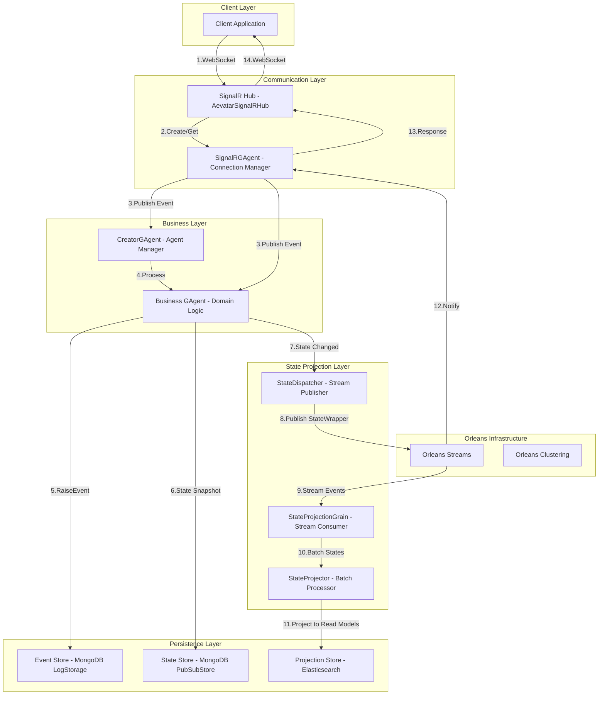

## Complete End-to-End Request Flow

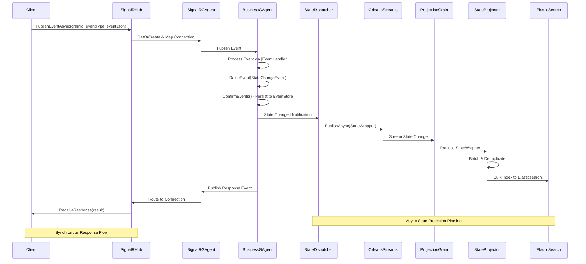

## Detailed Request Flow Sequence

### Phase 1: Client Request Initiation

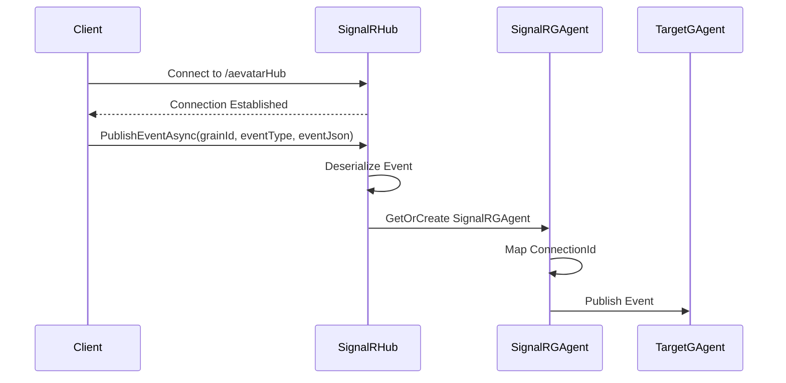

#### 1.1 Client Connection
- **Protocol**: WebSocket over SignalR
- **Endpoint**: `/aevatarHub`
- **Authentication**: Optional (integrated with ABP framework)
- **Connection Management**: Automatic reconnection with exponential backoff

#### 1.2 Request Structure
```csharp
// Client request format
{
    "grainId": "gagent/businessagent/12345",
    "eventTypeName": "MyDomainEvent",
    "eventJson": "{\"property\": \"value\", \"correlationId\": \"abc123\"}"
}
```

### Phase 2: SignalR Hub Processing

#### 2.1 Hub Implementation
```csharp
public class AevatarSignalRHub : Hub
{
    public async Task<GrainId> PublishEventAsync(
        GrainId grainId, 
        string eventTypeName, 
        string eventJson)
    {
        // Deserialize event using registered deserializer
        var @event = await _eventDeserializer.DeserializeAsync(
            eventTypeName, eventJson);
        
        // Get or create SignalRGAgent for target
        var signalRGAgent = await GetSignalRGAgentAsync(grainId);
        
        // Map connection for response routing
        await signalRGAgent.AddConnectionMappingAsync(
            grainId, Context.ConnectionId);
        
        // Publish event through SignalRGAgent
        await signalRGAgent.PublishEventAsync(grainId, @event);
        
        return signalRGAgent.GetGrainId();
    }
}
```

#### 2.2 SignalRGAgent Intermediary
- **Purpose**: Bridge between SignalR connections and Orleans grains
- **State Management**: Maintains connection mappings and correlation IDs
- **Response Queuing**: Ensures reliable message delivery
- **Connection Lifecycle**: Handles disconnections and reconnections

### Phase 3: GAgent Event Processing

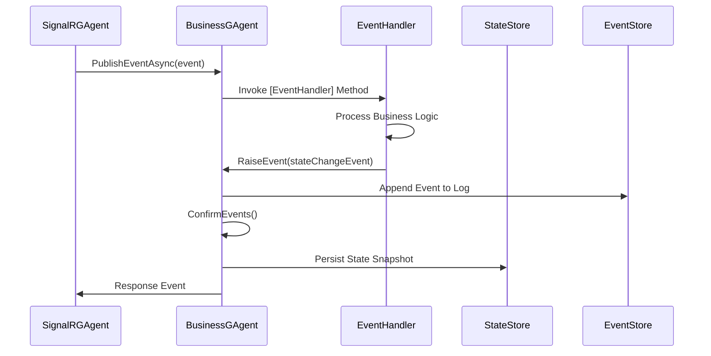

#### 3.1 Event Handler Discovery
```csharp
[GAgent("myBusinessAgent")]
[StorageProvider(ProviderName = "PubSubStore")]
[LogConsistencyProvider(ProviderName = "LogStorage")]
public class MyBusinessGAgent : GAgentBase<MyState, MyStateLogEvent>, IMyBusinessGAgent
{
    [EventHandler(Priority = 100)]
    public async Task HandleMyEventAsync(MyDomainEvent @event)
    {
        // Business logic processing
        State.ProcessedCount++;
        State.LastProcessedTime = DateTime.UtcNow;
        
        // Raise state change event for event sourcing
        RaiseEvent(new MyStateChangedEvent
        {
            ProcessedCount = State.ProcessedCount,
            Timestamp = State.LastProcessedTime
        });
        
        // Persist events to storage
        await ConfirmEvents();
        
        // Publish response event
        await PublishEventAsync(new MyResponseEvent
        {
            Success = true,
            CorrelationId = @event.CorrelationId
        });
    }
}
```

#### 3.2 Event Handler Resolution
1. **Attribute-based Discovery**: Methods marked with `[EventHandler]`
2. **Priority-based Execution**: Handlers executed in priority order (higher first)
3. **Type Matching**: Exact type match or interface implementation
4. **AllEventHandler**: Catch-all handlers for generic processing

### Phase 4: State Management and Persistence

#### 4.1 Event Sourcing Flow

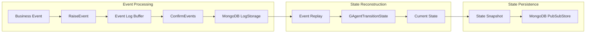

#### 4.2 Event Storage Implementation
```csharp
// Event is stored with metadata
{
    "GrainId": "gagent/businessagent/12345",
    "Version": 42,
    "snapshot": {
        "Id": "event-123",
        "Ctime": "2024-01-04T10:30:00Z",
        "EventType": "MyStateChangedEvent",
        "Data": { /* event payload */ }
    }
}
```

#### 4.3 State Transition Handler
```csharp
protected override void GAgentTransitionState(
    MyState state, 
    StateLogEventBase<MyStateLogEvent> @event)
{
    switch (@event)
    {
        case MyStateChangedEvent changed:
            state.ProcessedCount = changed.ProcessedCount;
            state.LastProcessedTime = changed.Timestamp;
            break;
        // Handle other event types
    }
}
```

### Phase 5: State Projection Flow

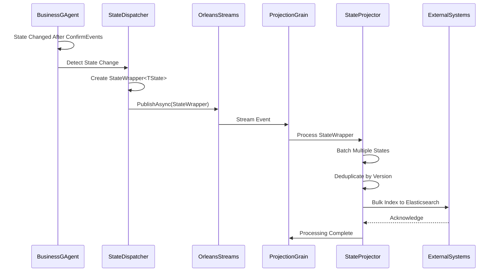

#### 5.1 State Projection Components

**StateDispatcher**
```csharp
public class StateDispatcher : IStateDispatcher
{
    // Publishes to indexed streams for load balancing
    public async Task PublishAsync<TState>(GrainId grainId, StateWrapper<TState> stateWrapper)
    {
        var streamIndex = Math.Abs(grainId.GetHashCode()) % _streamCount;
        var streamId = StreamId.Create(typeof(TState).Name, streamIndex);
        var stream = _streamProvider.GetStream<StateWrapperBase>(streamId);
        await stream.OnNextAsync(stateWrapper);
    }
    
    // Publishes to single stream for ordered processing
    public async Task PublishSingleAsync<TState>(GrainId grainId, StateWrapper<TState> stateWrapper)
    {
        var streamId = StreamId.Create(typeof(TState).Name, grainId.Key);
        var stream = _streamProvider.GetStream<StateWrapperBase>(streamId);
        await stream.OnNextAsync(stateWrapper);
    }
}
```

**StateProjectionGrain**
```csharp
[SiloNamePatternPlacement("Projector")]
public class StateProjectionGrain<TState> : Grain, IProjectionGrain<TState>
{
    private StreamSubscriptionHandle<StateWrapperBase> _streamSubscription;
    
    public override async Task OnActivateAsync(CancellationToken cancellationToken)
    {
        var streamId = StreamId.Create(typeof(TState).Name, this.GetPrimaryKeyLong());
        var stream = this.GetStreamProvider("StreamProvider")
            .GetStream<StateWrapperBase>(streamId);
        
        _streamSubscription = await stream.SubscribeAsync(
            new StateProjectionAsyncObserver(_serviceProvider));
    }
}
```

**AevatarStateProjector with Elasticsearch Integration**
```csharp
public class AevatarStateProjector : IStateProjector
{
    private readonly ConcurrentDictionary<string, SaveStateCommand> _latestCommands = new();
    private readonly Timer _flushTimer;
    private readonly IElasticIndexingService _elasticIndexingService;
    private int _batchSize = 100;
    
    public async Task ProjectAsync(StateWrapperBase stateWrapper)
    {
        var key = $"{stateWrapper.GrainId}_{stateWrapper.State.GetType().Name}";
        
        // Deduplication: Keep only the latest version
        _latestCommands.AddOrUpdate(key, 
            new SaveStateCommand(stateWrapper),
            (k, existing) => stateWrapper.Version > existing.Version ? 
                new SaveStateCommand(stateWrapper) : existing);
        
        // Adaptive batching based on queue depth
        if (_latestCommands.Count >= CalculateEffectiveBatchSize())
        {
            await FlushBatchAsync();
        }
    }
    
    private async Task FlushBatchAsync()
    {
        var commands = _latestCommands.Values.ToList();
        _latestCommands.Clear();
        
        // Bulk index to Elasticsearch with version control
        await _elasticIndexingService.BulkIndexAsync(commands);
    }
    
    private int CalculateEffectiveBatchSize()
    {
        // Adaptive batch sizing based on memory pressure
        var memoryPressure = GC.GetTotalMemory(false) / (1024 * 1024); // MB
        return memoryPressure > 500 ? _batchSize / 2 : _batchSize;
    }
}
```

#### 5.2 State Projection Features

1. **Indexed Streams**: Multiple streams per state type for load balancing
2. **Version Control**: Prevents duplicate processing using state version numbers
3. **Batch Processing**: Collects multiple state changes for efficient processing
4. **Deduplication**: Maintains only the latest version of each state
5. **Retry Logic**: Implements exponential backoff for failed projections
6. **Adaptive Batching**: Adjusts batch size based on memory pressure
7. **Timer-based Flushing**: Ensures timely processing even with low throughput

#### 5.3 StateWrapper Structure
```csharp
public class StateWrapper<T> : StateWrapperBase
{
    public GrainId GrainId { get; set; }
    public T State { get; set; }
    public long Version { get; set; }
    public DateTime Timestamp { get; set; }
}
```

#### 5.4 Projection Initialization
```csharp
public class StateProjectionInitializer : IStartupTask
{
    public async Task ExecuteAsync(CancellationToken cancellationToken)
    {
        // Discover all StateBase derived types
        var stateTypes = Assembly.GetExecutingAssembly()
            .GetTypes()
            .Where(t => t.IsSubclassOf(typeof(StateBase)))
            .ToList();
        
        // Activate projection grains for each state type
        foreach (var stateType in stateTypes)
        {
            for (int i = 0; i < _streamCount; i++)
            {
                var grain = _grainFactory.GetGrain<IProjectionGrain<StateBase>>(i, stateType.Name);
                await grain.EnsureActivatedAsync();
            }
        }
    }
}
```

### Phase 6: Response Flow

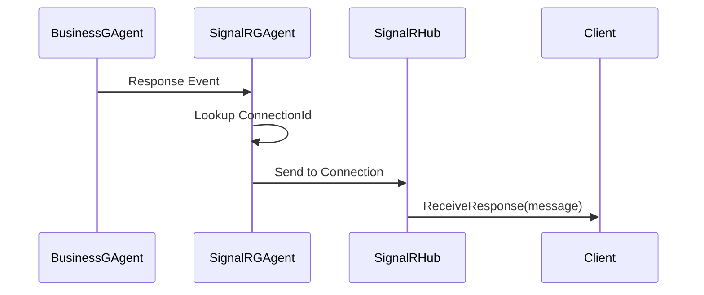

#### 6.1 Response Routing
1. **Correlation ID Matching**: Links response to original request
2. **Connection Mapping**: Routes to specific client connection
3. **Queuing**: Handles offline clients with message queuing
4. **Broadcast Support**: Can notify multiple subscribers

#### 6.2 Client Response Handling
```javascript
// Client-side response handler
connection.on("ReceiveResponse", (message) => {
    const response = JSON.parse(message);
    // Handle based on correlation ID or event type
    handleResponse(response);
});
```

## Storage Architecture

### MongoDB Collections

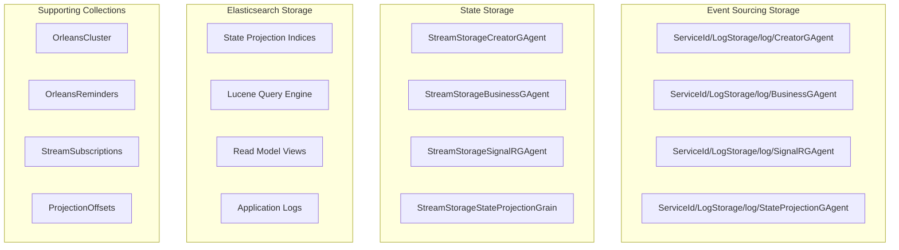

### Storage Providers Configuration

```yaml
# Orleans configuration
OrleansEventSourcing:
  Provider: mongodb
  MongoDBClient: "mongodb://localhost:27017"
  DataBase: "AevatarStation"

Orleans:
  Storage:
    PubSubStore:
      Provider: MongoDB
      CollectionPrefix: "StreamStorage"
    LogStorage:
      Provider: MongoDbLogConsistency

# Elasticsearch configuration
ElasticUris:
  Uris:
    - "http://localhost:9200"
    - "http://elasticsearch-node2:9200"

ElasticSearch:
  Username: "elastic"
  Password: "changeme"
  IndexPrefix: "aevatar"
  IndexSuffix: "-v1"
```

## Elasticsearch State Projection System

### Index Management Strategy

The Elasticsearch integration follows a sophisticated indexing strategy designed for multi-tenant, versioned state projections:

#### Index Naming Convention
```csharp
// Pattern: {IndexPrefix}-{HostId}-{StateName}{IndexSuffix}
// Example: aevatar-host001-useragent-v1
private string GetIndexName(string stateName)
{
    return $"{CqrsConstant.IndexPrefix}-{_hostId}-{stateName.ToLower()}{CqrsConstant.IndexSuffix}";
}
```

#### Dynamic Index Mapping
```csharp
public async Task CreateIndexIfNotExistsAsync(string indexName, Type stateType)
{
    var mappingProperties = new Properties();
    
    foreach (var property in stateType.GetProperties())
    {
        var fieldMapping = property.PropertyType switch
        {
            Type t when t == typeof(string) => new TextProperty(),
            Type t when t == typeof(int) || t == typeof(long) => new LongNumberProperty(),
            Type t when t == typeof(float) => new FloatNumberProperty(),
            Type t when t == typeof(double) || t == typeof(decimal) => new DoubleNumberProperty(),
            Type t when t == typeof(DateTime) => new DateProperty(),
            Type t when t == typeof(bool) => new BooleanProperty(),
            Type t when t == typeof(Guid) => new KeywordProperty(),
            _ => new TextProperty() // Complex objects as JSON
        };
        
        mappingProperties.Add(property.Name.ToLower(), fieldMapping);
    }
    
    var indexRequest = new CreateIndexRequest(indexName)
    {
        Mappings = new TypeMapping { Properties = mappingProperties }
    };
    
    await _elasticClient.Indices.CreateAsync(indexRequest);
}
```

### Bulk Operations with Version Control

#### Advanced Bulk Processing
```csharp
public async Task BulkIndexAsync(List<SaveStateCommand> commands)
{
    var operations = new List<IBulkOperation>();
    
    foreach (var command in commands)
    {
        var indexName = GetIndexName(command.State.GetType().Name);
        
        // Ensure index exists with proper mapping
        await CreateIndexIfNotExistsAsync(indexName, command.State.GetType());
        
        // Version-based upsert with script for conflict resolution
        var operation = new BulkIndexOperation<SaveStateCommand>(command)
        {
            Index = indexName,
            Id = command.Id,
            Version = command.Version,
            VersionType = VersionType.External,
            Script = new Script($@"
                if (ctx._source.version < params.newVersion) {{
                    ctx._source = params.newState;
                    ctx._source.version = params.newVersion;
                }} else {{
                    ctx.op = 'noop';
                }}")
            {
                Params = new Dictionary<string, object>
                {
                    ["newVersion"] = command.Version,
                    ["newState"] = command.State
                }
            }
        };
        
        operations.Add(operation);
    }
    
    var bulkRequest = new BulkRequest
    {
        Operations = operations,
        Refresh = Refresh.WaitFor // Ensure immediate consistency
    };
    
    var response = await _elasticClient.BulkAsync(bulkRequest);
    
    if (response.Errors)
    {
        await HandleBulkErrors(response.Items);
    }
}
```

### Query System Integration

#### Lucene Query Support
```csharp
public async Task<SearchResponse<T>> QueryAsync<T>(LuceneQueryDto queryDto) where T : StateBase
{
    var indexName = GetIndexName(typeof(T).Name);
    
    var searchRequest = new SearchRequest(indexName)
    {
        Query = string.IsNullOrEmpty(queryDto.QueryString) 
            ? new MatchAllQuery()
            : new QueryStringQuery { Query = queryDto.QueryString },
        From = queryDto.PageIndex * queryDto.PageSize,
        Size = queryDto.PageSize,
        Sort = queryDto.SortFields.Select(f => new SortOptions
        {
            Field = f.ToLower(),
            Order = SortOrder.Desc
        }).ToList()
    };
    
    return await _elasticClient.SearchAsync<T>(searchRequest);
}
```

### Monitoring and Metrics

#### MetricsElasticIndexingService
```csharp
public class MetricsElasticIndexingService : IElasticIndexingService
{
    private readonly IElasticIndexingService _inner;
    private readonly Counter<int> _operationCounter;
    private readonly Histogram<double> _operationDuration;
    
    public async Task BulkIndexAsync(List<SaveStateCommand> commands)
    {
        using var activity = ActivitySource.StartActivity("BulkIndex");
        var stopwatch = Stopwatch.StartNew();
        
        try
        {
            await _inner.BulkIndexAsync(commands);
            _operationCounter.Add(1, new("operation", "bulk_index"), new("status", "success"));
        }
        catch (Exception ex)
        {
            _operationCounter.Add(1, new("operation", "bulk_index"), new("status", "error"));
            activity?.SetStatus(ActivityStatusCode.Error, ex.Message);
            throw;
        }
        finally
        {
            _operationDuration.Record(stopwatch.Elapsed.TotalMilliseconds,
                new("operation", "bulk_index"));
        }
    }
}
```

### Application Logging Integration

#### Log Management
```csharp
public class LogElasticSearchService : ILogElasticSearchService
{
    public async Task IndexLogAsync(LogEntry logEntry)
    {
        var indexName = $"logs-{DateTime.UtcNow:yyyy-MM}";
        
        // Apply ILM policy for log rotation
        await ApplyILMPolicyAsync(indexName);
        
        var indexRequest = new IndexRequest<LogEntry>(logEntry, indexName)
        {
            Id = logEntry.Id,
            Refresh = Refresh.False // Async for logs
        };
        
        await _elasticClient.IndexAsync(indexRequest);
    }
    
    private async Task ApplyILMPolicyAsync(string indexName)
    {
        var policy = new LifecyclePolicy
        {
            Phases = new Phases
            {
                Hot = new HotPhase
                {
                    MaxAge = _options.ILMPolicy.HotMaxAge,
                    MaxSize = _options.ILMPolicy.HotMaxSize
                },
                Cold = new ColdPhase
                {
                    MinAge = _options.ILMPolicy.ColdMinAge
                },
                Delete = new DeletePhase
                {
                    MinAge = _options.ILMPolicy.DeleteMinAge
                }
            }
        };
        
        await _elasticClient.IndexLifecycleManagement
            .PutLifecyclePolicyAsync("aevatar-logs-policy", policy);
    }
}
```

## Advanced Features

### Parent-Child Hierarchies

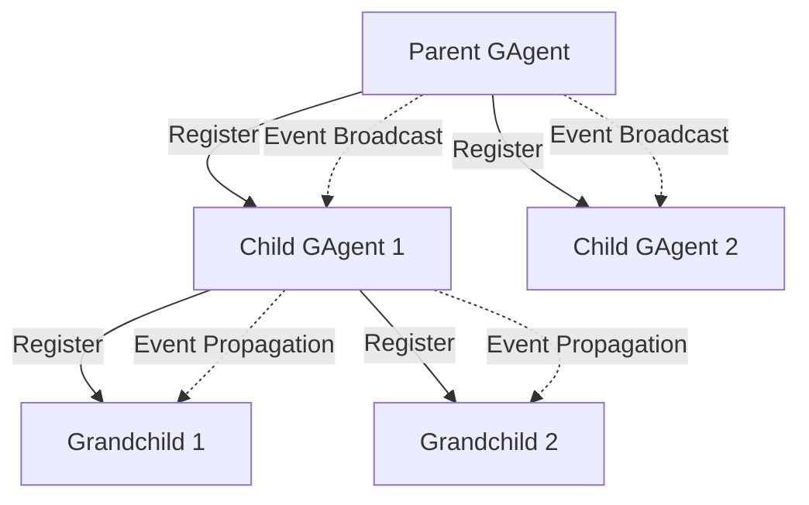

### Stream Integration

1. **Event Streams**: GAgents can publish to Orleans streams
2. **State Projection Streams**: Automatic state change broadcasting
3. **Subscription Management**: Dynamic subscription/unsubscription
4. **Stream Providers**: Support for multiple providers (SMS, EventHub)
5. **Implicit Subscriptions**: Via `[ImplicitStreamSubscription]` attribute
6. **Indexed Streams**: Multiple streams per type for load balancing

### State Projection Architecture

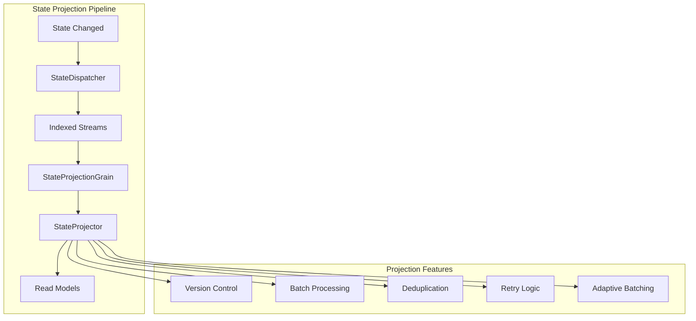

**StateProjectionGAgentBase Example**
```csharp
[GAgent]
public class TokenUsageProjectionGAgent : StateProjectionGAgentBase<SampleAIGAgentState, TokenUsageProjectionGAgentState, TokenUsageProjectionStateLogEvent>
{
    [StateLogEventHandler]
    protected override async Task HandleStateAsync(StateWrapper<SampleAIGAgentState> projectionStateWrapper)
    {
        // Process the state change
        State.TotalTokensUsed += projectionStateWrapper.State.LatestTotalUsageToken;
        State.LastUpdated = DateTime.UtcNow;
        
        // Raise event for audit trail
        RaiseEvent(new TokenUsageStateLogEvent
        {
            TotalUsageToken = projectionStateWrapper.State.LatestTotalUsageToken,
            ProjectionVersion = projectionStateWrapper.Version
        });
        
        // Persist the projection state
        await ConfirmEvents();
    }
}
```

### Plugin Architecture

```csharp
public interface IGAgentPlugin
{
    Task OnActivateAsync(IGAgent agent);
    Task OnDeactivateAsync(IGAgent agent);
    Task<bool> OnEventAsync(EventBase @event);
}
```

## Performance Considerations

### Optimization Strategies

1. **Event Batching**: Multiple events confirmed in single transaction
2. **State Snapshots**: Periodic snapshots reduce replay overhead
3. **Connection Pooling**: Reuse MongoDB connections
4. **Grain Activation**: Lazy activation with configurable timeouts
5. **Stream Buffering**: Configurable buffer sizes for event streams

### Scalability Patterns

1. **Horizontal Scaling**: Add Orleans silos for more capacity
2. **Grain Placement**: Strategic placement strategies
3. **Event Partitioning**: Distribute events across streams
4. **State Sharding**: MongoDB sharding for large datasets

## Error Handling and Recovery

### Failure Scenarios

1. **Network Failures**: Automatic reconnection with backoff
2. **Storage Failures**: Retry with exponential backoff
3. **Grain Failures**: Orleans automatic recovery
4. **Event Processing Failures**: Dead letter queues

### Recovery Mechanisms

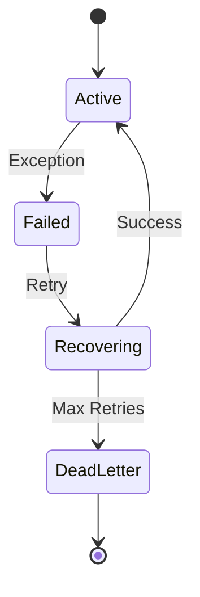

## Monitoring and Observability

### Key Metrics

1. **Request Latency**: End-to-end processing time
2. **Event Throughput**: Events processed per second
3. **Storage Operations**: Read/write performance
4. **Connection Health**: Active connections and failures
5. **Grain Activation**: Active grain count and lifecycle

### Orleans Dashboard

- **URL**: http://localhost:8080
- **Features**: Grain statistics, stream metrics, cluster health

## Security Considerations

1. **Authentication**: Integrated with ABP Identity
2. **Authorization**: Role-based access control
3. **Event Validation**: Schema validation before processing
4. **Connection Security**: TLS/SSL for SignalR
5. **Storage Encryption**: MongoDB encryption at rest

## Best Practices

### GAgent Design

1. **Single Responsibility**: Each GAgent handles one domain
2. **Event Naming**: Clear, domain-specific event names
3. **State Design**: Minimize state size for performance
4. **Error Handling**: Graceful degradation
5. **Testing**: Use Orleans TestKit for unit tests

### Event Design

1. **Immutability**: Events should be immutable
2. **Versioning**: Support event schema evolution
3. **Correlation**: Always include correlation IDs
4. **Idempotency**: Design for at-least-once delivery

## Conclusion

The GAgent request data flow lifecycle represents a sophisticated event-driven architecture that combines:
- **Real-time communication** via SignalR for client interaction
- **Distributed actor model** with Orleans for scalable processing
- **Event sourcing** for complete audit trails and state reconstruction
- **Elasticsearch state projection pipeline** for CQRS read model generation
- **MongoDB persistence** for event storage and Orleans state management
- **Elasticsearch search and analytics** for advanced querying capabilities
- **Hierarchical agent organization** for complex system modeling
- **Stream-based state propagation** for eventual consistency
- **Batch processing with deduplication** for efficient Elasticsearch indexing

This architecture enables building scalable, resilient, and maintainable distributed AI agent systems with:
- **Strong consistency** through event sourcing
- **Eventual consistency** through state projections
- **High availability** through Orleans clustering
- **Comprehensive observability** through event streams
- **Flexible deployment** through microservices patterns

The complete request lifecycle flows through 14 distinct phases, from client request initiation to response delivery, with parallel state projection processing ensuring that read models are eventually consistent with the authoritative event-sourced state.