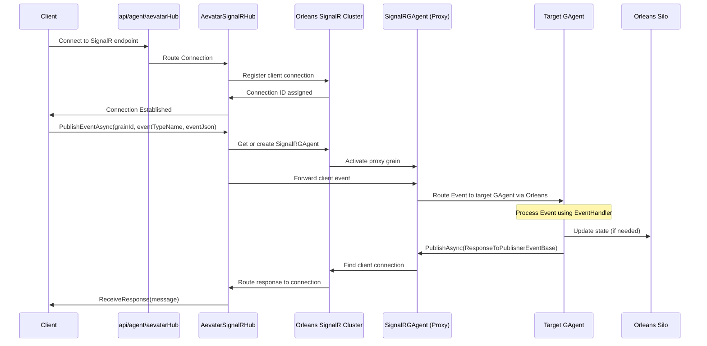
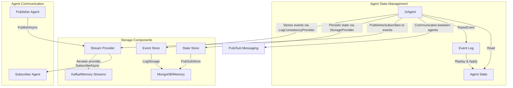

# *Aevatar Station*

*Your all-in-one platform for creating, managing, and deploying AI agents.*

---
## 🚀 **Introduction**

**Aevatar Station** is a cutting-edge developer platform designed to simplify the creation, management, and deployment of intelligent AI agents. With a focus on flexibility, scalability, and ease of use, Aevatar Station empowers developers and organizations to harness the power of AI in a streamlined and efficient way.

## Getting Started

### Prerequisites

- .NET 9.0 SDK
- MongoDB
- Elasticsearch
- Redis
- Kafka

## Configuration

1. Update the `appsettings.json` file in the Silo project with your specific configurations (e.g., connection strings, Orleans clustering configurations).

    ```json
    {
      "ConnectionStrings": {
        "Default": "mongodb://localhost:27017/Aevatar"
      },
      "Orleans": {
        "ClusterId": "AevatarSiloCluster",
        "ServiceId": "AevatarBasicService",
        "AdvertisedIP": "127.0.0.1",
        "GatewayPort": 20001,
        "SiloPort": 10001,
        "MongoDBClient": "mongodb://localhost:27017/?maxPoolSize=555",
        "DataBase": "AevatarDb",
        "DashboardUserName": "admin",
        "DashboardPassword": "123456",
        "DashboardCounterUpdateIntervalMs": 1000,
        "DashboardPort": 8080,
        "EventStoreConnection": "ConnectTo=tcp://localhost:1113; HeartBeatTimeout=500",
        "ClusterDbConnection": "127.0.0.1:6379",
        "ClusterDbNumber": 0,
        "GrainStorageDbConnection": "127.0.0.1:6379",
        "GrainStorageDbNumber": 0
      }
    }
    ```

2. Update the `appsettings.json` file in the HttpApi.Host project with your specific configurations (e.g., connection strings, Orleans clustering configurations).

    ```json
    {
      "ConnectionStrings": {
        "Default": "mongodb://localhost:27017/Aevatar"
      },
      "Orleans": {
        "ClusterId": "AevatarSiloCluster",
        "ServiceId": "AevatarBasicService",
        "MongoDBClient": "mongodb://localhost:27017/?maxPoolSize=555",
        "DataBase": "AevatarDb"
      }
    }
    ```

### Running the Application

1. Go to the `src` folder
    ```shell
    cd src
    ```
2. Run the `Aevatar.DbMigrator` project to create the initial database from `src`.
    ```shell
    cd Aevatar.DbMigrator
    dotnet run
    ```
3. Run the `Aevatar.AuthServer` project to create the initial database from `src`.
    ```shell
    cd Aevatar.AuthServer
    dotnet run
    ```
4. Run the `Aevatar.Silo` project to start the Orleans Silo from `src`.
    ```shell
    cd ../Aevatar.Silo
    dotnet run
    ```
5. Run the `Aevatar.HttpApi.Host` project to start the API from `src`.
    ```shell
    cd ../Aevatar.HttpApi.Host
    dotnet run
    ```

## Documentation

### Data Flow Diagram (through SignalR)



A data flow diagram depicting communication between frontend and backend to process data. All communications within the backend are done through Kafka on runtime.

### GAgent Store Dependency



The diagram shows how GAgents in the Aevatar Framework use different storage components:

1. **Event Store (LogStorage)**:
   - Implemented via the `LogConsistencyProvider` attribute
   - Stores event logs for event sourcing
   - Can be configured to use MongoDB or in-memory storage
   - Responsible for maintaining the event history of each agent

2. **State Store (PubSubStore)**:
   - Implemented via the `StorageProvider` attribute
   - Persists the agent's state
   - Can be configured to use MongoDB or in-memory storage
   - Maintains the current state derived from events

3. **Stream Provider**:
   - Used for pub/sub messaging between agents
   - Can be configured to use Kafka or in-memory streams
   - Enables event broadcasting and subscription

The GAgent combines these components to provide:
- Event sourcing (storing all state changes as events)
- State management (applying events to update state)
- Communication between agents (via pub/sub)
- Hierarchical agent relationships (agent registration and subscription)

Each GAgent transitions state by applying events through the `GAgentTransitionState` method, which updates the agent's state based on the events stored in the event log.

## Environment Variables

### General Configuration
| Variable Name | Description | Example |
|---------------|-------------|---------|
| POD_IP | IP address of the current pod when running in Kubernetes | 192.168.1.100 |
| ORLEANS_CLUSTER_ID | Orleans cluster identifier | aevatar-cluster |
| ORLEANS_SERVICE_ID | Orleans service identifier | aevatar-service |
| SILO_NAME_PATTERN | Pattern to match silo names for SiloNamePatternPlacement | compute- |

## Update aevatar-framework & aevatar-signalR
1. Add `aevatar-framework`, `aevatar-signalR` and this repo itself as remote repos.
```bash
git remote add framework git@github.com:aevatarAI/aevatar-framework.git
git remote add signalR git@github.com:aevatarAI/aevatar-signalR.git
git remote add station git@github.com:aevatarAI/aevatar-station.git
```
2. Update dev branch
```bash
git subtree pull --prefix=framework framework dev --squash
git subtree pull --prefix=signalR signalR dev --squash
git subtree pull --prefix=station station dev --squash
```

## Contributing

If you encounter a bug or have a feature request, please use the [Issue Tracker](https://github.com/AISmartProject/aevatar-station/issues/new). The project is also open to contributions, so feel free to fork the project and open pull requests.

## License

Distributed under the MIT License. See [License](LICENSE) for more information.