# Aevatar Station Technical Documentation

> **Last Updated**: 2025-01-26  
> **Version Compatibility**: .NET 8+  
> **Platform Version**: 1.0.0

## Table of Contents

1. [Executive Summary](#executive-summary)
2. [System Architecture Overview](#system-architecture-overview)
3. [Core Module Documentation](#core-module-documentation)
4. [Technology Stack](#technology-stack)
5. [Development Guides](#development-guides)
6. [API Reference](#api-reference)
7. [Configuration Reference](#configuration-reference)
8. [Deployment & Infrastructure](#deployment--infrastructure)
9. [Performance and Scalability](#performance-and-scalability)
10. [Troubleshooting](#troubleshooting)

## Executive Summary

Aevatar Station is a sophisticated, distributed AI agent management platform built on Microsoft Orleans and ABP Framework. It implements a comprehensive event-sourced, CQRS-based architecture designed for scalable, multi-tenant AI agent orchestration with real-time capabilities.

### Key Capabilities
- **Distributed AI Agent Management**: Orleans-based virtual actors for agent lifecycle
- **Event Sourcing & CQRS**: Complete audit trail with optimized read/write separation
- **Multi-tenancy**: Organization and project-based isolation
- **Real-time Communication**: SignalR for live agent interactions
- **Extensible Plugin System**: Dynamic agent behavior extension
- **Kubernetes-native**: Container orchestration and auto-scaling

## System Architecture Overview

### High-Level Architecture

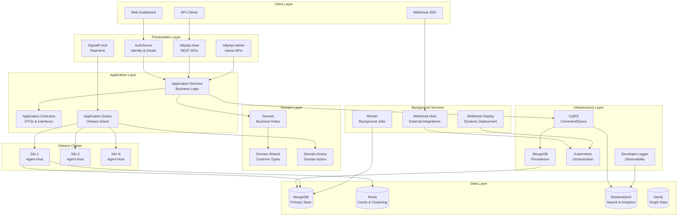

### Architecture Principles

1. **Domain-Driven Design**: Clear separation between domain, application, and infrastructure layers
2. **Event Sourcing**: All state changes captured as immutable events for auditability
3. **CQRS**: Command and query responsibility segregation for optimal performance
4. **Actor Model**: Orleans virtual actors for distributed, stateful agent management
5. **Multi-tenancy**: Organization and project-based isolation with security boundaries
6. **Microservices**: Independently deployable services with well-defined boundaries

## Core Module Documentation

### Aevatar.Domain.Shared

#### Overview
Foundation module providing shared domain types, constants, enumerations, and localization resources across all layers.

#### Data Flow Sequence Diagram
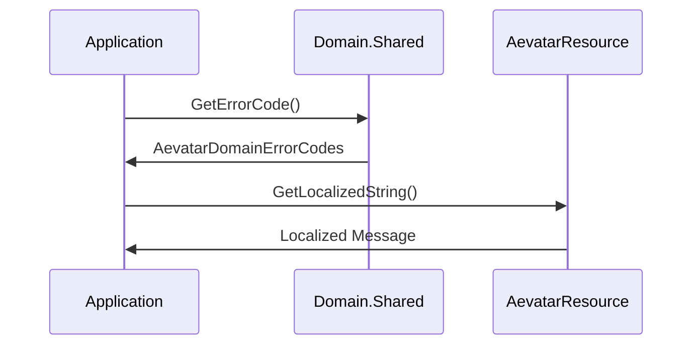

#### Key Components

| Component | Purpose | Pattern |
|-----------|---------|---------|
| `AevatarDomainErrorCodes` | Centralized error code definitions | Constants Pattern |
| `AevatarResource` | Localization resources | Resource Pattern |
| `NotificationTypeEnum` | Notification categorization | Enumeration Pattern |
| `OrganizationType` | Organization classification | Type-safe Enum |
| `PermissionScope` | Permission boundary definitions | Domain Model |

#### Configuration

```csharp
public class AgentOptions
{
    public string DefaultAgentType { get; set; } = "DefaultAgent";
    public int MaxAgentsPerOrganization { get; set; } = 1000;
    public TimeSpan AgentTimeoutDuration { get; set; } = TimeSpan.FromMinutes(30);
}
```

### Aevatar.Domain

#### Overview
Core domain layer implementing business entities, aggregates, domain services, and business rules for the agent management platform.

#### Data Flow Sequence Diagram
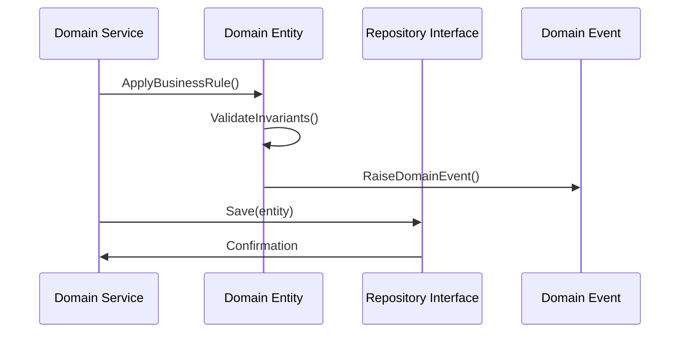

#### Key Components

| Component | Purpose | Pattern |
|-----------|---------|---------|
| `Plugin` | Plugin entity with business rules | Aggregate Root |
| `NotificationInfo` | Notification domain entity | Entity |
| `ProjectAppIdInfo` | API key management | Value Object |
| `UserChainAddressInfo` | Blockchain address binding | Entity |

#### Domain Services

```csharp
public class AISmartDbMigrationService
{
    public async Task MigrateAsync(CancellationToken cancellationToken = default)
    {
        // Database migration logic
    }
}
```

### Aevatar.Application.Contracts

#### Overview
Application layer contracts defining DTOs, service interfaces, and API boundaries for external communication.

#### Data Flow Sequence Diagram
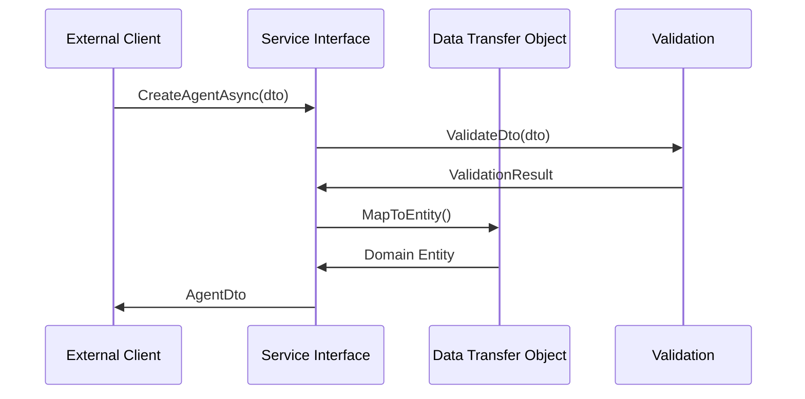

#### Key Service Interfaces

| Interface | Purpose | Responsibility |
|-----------|---------|----------------|
| `IAgentService` | Agent lifecycle management | CRUD operations |
| `IOrganizationService` | Multi-tenant organization management | Tenant operations |
| `INotificationService` | Notification system | Message delivery |
| `IProjectService` | Project management | Resource allocation |
| `IPluginService` | Plugin management | Extension points |

#### DTO Categories

```csharp
// Agent Management
public class CreateAgentInputDto
{
    public string AgentType { get; set; }
    public string Name { get; set; }
    public Dictionary<string, object> Configuration { get; set; }
}

// Organization Management
public class CreateOrganizationDto
{
    public string Name { get; set; }
    public OrganizationType Type { get; set; }
    public string Description { get; set; }
}
```

### Aevatar.Application

#### Overview
Application services layer implementing business workflows, coordinating domain operations, and managing cross-cutting concerns.

#### Data Flow Sequence Diagram
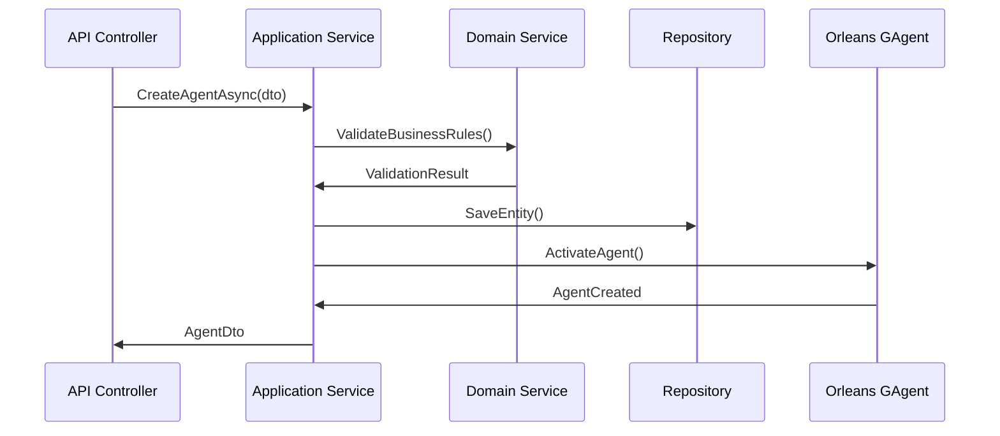

#### Key Services

| Service | Purpose | Integration |
|---------|---------|-------------|
| `AgentService` | Agent lifecycle coordination | Orleans Grains |
| `OrganizationService` | Multi-tenant management | ABP Authorization |
| `NotificationService` | Real-time notifications | SignalR Hub |
| `ProjectService` | Project and resource management | MongoDB Repository |
| `PluginService` | Plugin lifecycle management | Dynamic Loading |

#### Cross-Cutting Concerns

```csharp
public class ApiRequestStatisticsMiddleware
{
    public async Task InvokeAsync(HttpContext context, RequestDelegate next)
    {
        var stopwatch = Stopwatch.StartNew();
        await next(context);
        stopwatch.Stop();
        
        // Record API metrics
        await RecordMetricsAsync(context, stopwatch.ElapsedMilliseconds);
    }
}
```

### Aevatar.Application.Grains

#### Overview
Orleans grains implementing distributed, stateful business logic with event sourcing capabilities.

#### Data Flow Sequence Diagram
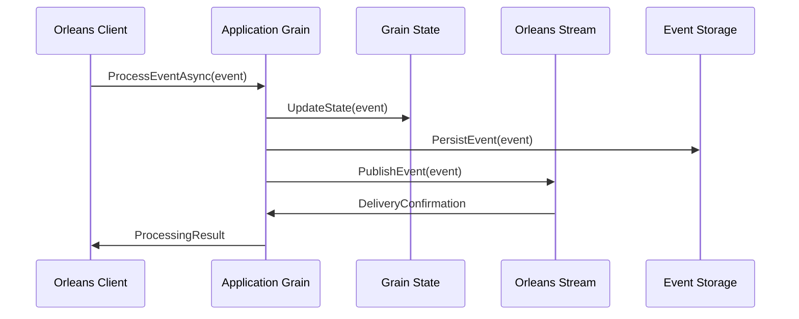

#### Key Grains

| Grain | Purpose | State Management |
|-------|---------|-----------------|
| `SubscriptionGAgent` | Event subscription management | Event-sourced |
| `GroupGAgent` | Social event coordination | Stateful |
| `PublishingGAgent` | Event publishing coordination | Stream-based |

#### Grain Implementation

```csharp
[StorageProvider(ProviderName = "PubSubStore")]
[LogConsistencyProvider(ProviderName = "LogStorage")]
public class SubscriptionGAgent : GAgentBase<EventSubscriptionState, SubscriptionGEvent>
{
    public override Task<string> GetDescriptionAsync()
    {
        return Task.FromResult("Event Subscription Management Agent");
    }

    [EventHandler]
    public async Task HandleSubscriptionEventAsync(SubscribeEventInputDto @event)
    {
        State.Subscriptions.Add(@event.EventType);
        await ConfirmEvents();
    }
}
```

### Aevatar.HttpApi.Host

#### Overview
Main HTTP API host providing REST endpoints, SignalR hubs, and serving as the primary external interface.

#### Data Flow Sequence Diagram
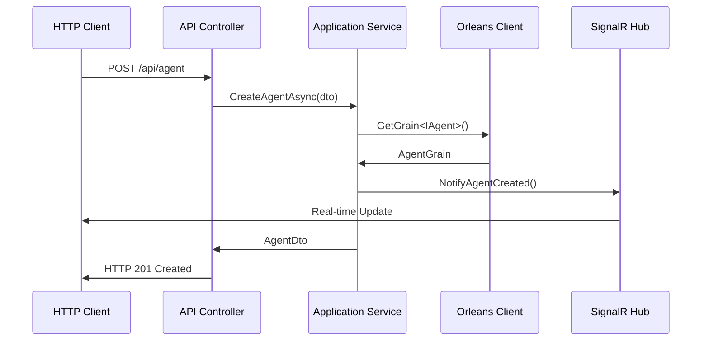

#### API Controllers

| Controller | Endpoints | Purpose |
|------------|-----------|---------|
| `AgentController` | `/api/agent/*` | Agent lifecycle management |
| `OrganizationController` | `/api/organization/*` | Multi-tenant operations |
| `ProjectController` | `/api/project/*` | Project management |
| `SubscriptionController` | `/api/subscription/*` | Event subscriptions |
| `NotificationController` | `/api/notification/*` | Notification management |

#### SignalR Integration

```csharp
public class StationSignalRHub : Hub<ISignalRMessage>, IHubService
{
    public async Task JoinAgentGroup(string agentId)
    {
        await Groups.AddToGroupAsync(Context.ConnectionId, $"Agent_{agentId}");
    }

    public async Task SendAgentUpdate(string agentId, object data)
    {
        await Clients.Group($"Agent_{agentId}").SendAsync("AgentUpdate", data);
    }
}
```

### Aevatar.Silo

#### Overview
Orleans silo host responsible for running distributed agents, managing cluster membership, and coordinating distributed state.

#### Data Flow Sequence Diagram
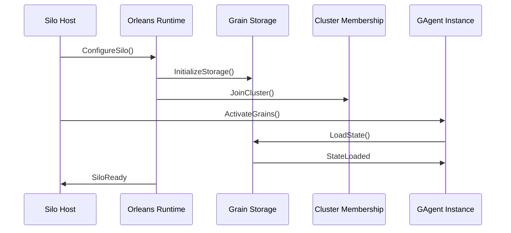

#### Silo Configuration

```csharp
var siloBuilder = Host.CreateDefaultBuilder(args)
    .UseOrleans(builder =>
    {
        builder
            .UseMongoDBClustering(options =>
            {
                options.DatabaseName = "aevatar_orleans";
                options.ConnectionString = connectionString;
            })
            .AddMongoDBGrainStorage("PubSubStore", options =>
            {
                options.DatabaseName = "aevatar_grains";
                options.ConnectionString = connectionString;
            })
            .AddLogStorageBasedLogConsistencyProvider("LogStorage")
            .UseMemoryStreams()
            .ConfigureServices(services =>
            {
                services.AddAevatar();
            });
    });
```

### Aevatar.AuthServer

#### Overview
Identity server implementing OAuth 2.0/OpenID Connect with custom grant types for blockchain authentication.

#### Data Flow Sequence Diagram
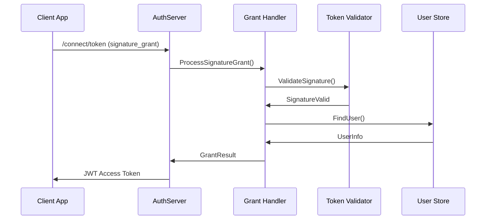

#### Custom Grant Types

```csharp
public class SignatureGrantHandler : IExtensionGrantValidator
{
    public async Task ValidateAsync(ExtensionGrantValidationContext context)
    {
        var signature = context.Request.Raw["signature"];
        var address = context.Request.Raw["address"];
        
        if (await ValidateSignatureAsync(signature, address))
        {
            context.Result = new GrantValidationResult(
                subject: address,
                authenticationMethod: "signature"
            );
        }
    }
}
```

### Aevatar.CQRS

#### Overview
Command Query Responsibility Segregation implementation with Elasticsearch integration for read model optimization.

#### Data Flow Sequence Diagram
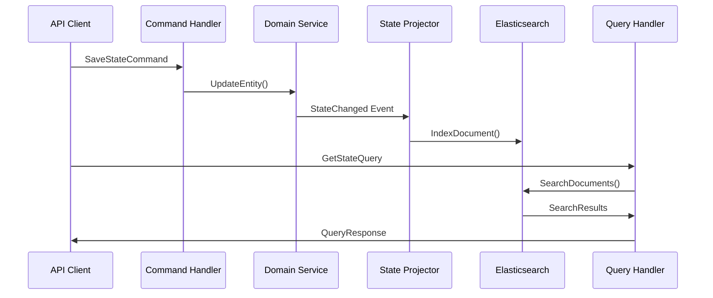

#### CQRS Implementation

```csharp
// Command Handler
public class SaveStateCommandHandler : IRequestHandler<SaveStateCommand, bool>
{
    public async Task<bool> Handle(SaveStateCommand request, CancellationToken cancellationToken)
    {
        // Process command and update write model
        await _repository.SaveAsync(request.Entity);
        
        // Publish event for read model updates
        await _eventBus.PublishAsync(new StateChangedEvent(request.Entity));
        
        return true;
    }
}

// Query Handler
public class GetStateQueryHandler : IRequestHandler<GetStateQuery, object>
{
    public async Task<object> Handle(GetStateQuery request, CancellationToken cancellationToken)
    {
        // Query optimized read model
        return await _elasticClient.SearchAsync<object>(request.Query);
    }
}
```

### Aevatar.Worker

#### Overview
Background service host for processing long-running tasks, scheduled jobs, and asynchronous operations.

#### Data Flow Sequence Diagram
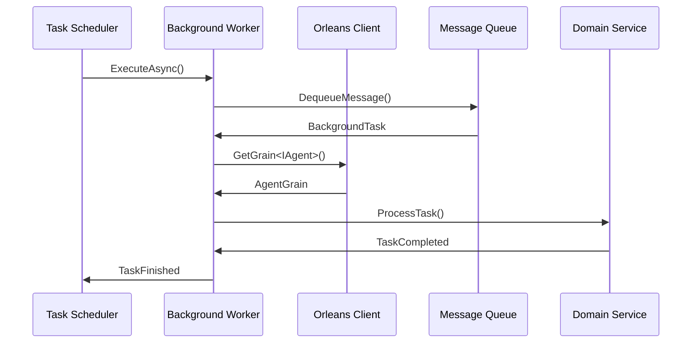

#### Worker Services

```csharp
public class ApiRequestWorker : BackgroundService
{
    protected override async Task ExecuteAsync(CancellationToken stoppingToken)
    {
        while (!stoppingToken.IsCancellationRequested)
        {
            var requests = await _repository.GetPendingRequestsAsync();
            
            foreach (var request in requests)
            {
                await ProcessApiRequestAsync(request);
            }
            
            await Task.Delay(TimeSpan.FromSeconds(30), stoppingToken);
        }
    }
}
```

## Technology Stack

### Core Technologies

| Technology | Version | Purpose | Justification |
|------------|---------|---------|---------------|
| .NET | 8.0+ | Primary runtime platform | Latest LTS version with performance improvements |
| Microsoft Orleans | 8.0+ | Virtual actor framework | Distributed stateful processing |
| ABP Framework | 8.0+ | Application framework | DDD, multi-tenancy, authorization |
| AutoMapper | 12.0+ | Object mapping | DTO to entity mapping |
| MediatR | 12.0+ | CQRS implementation | Command/query separation |

### Data Storage

| Technology | Purpose | Usage Pattern |
|------------|---------|---------------|
| MongoDB | Primary data store | Document storage, Orleans clustering |
| Redis | Caching and session storage | High-performance caching, Orleans grain storage |
| Elasticsearch | Search and analytics | CQRS read models, log aggregation |
| Neo4j | Graph relationships | Agent relationship mapping |

### Communication & Integration

| Technology | Purpose | Implementation |
|------------|---------|----------------|
| SignalR | Real-time communication | WebSocket connections, hub management |
| Kafka | Event streaming | External event integration (optional) |
| HTTP/REST | API communication | OpenAPI specification |
| gRPC | Internal service communication | High-performance inter-service calls |

### Infrastructure & DevOps

| Technology | Purpose | Benefits |
|------------|---------|----------|
| Kubernetes | Container orchestration | Auto-scaling, service discovery |
| Docker | Containerization | Consistent deployment environments |
| OpenTelemetry | Observability | Distributed tracing, metrics |
| Serilog | Structured logging | Centralized log management |

## Development Guides

### Setting Up Development Environment

#### Prerequisites

```bash
# Install .NET 8 SDK
curl -sSL https://dot.net/v1/dotnet-install.sh | bash /dev/stdin --version 8.0.101

# Install Docker and Docker Compose
# For MongoDB, Redis, and Elasticsearch

# Install Kubernetes (optional for local development)
# kubectl and kind/minikube for local clusters
```

#### Development Setup

```bash
# Clone repository
git clone <repository-url>
cd aevatar-station/station

# Start infrastructure services
docker-compose up -d mongodb redis elasticsearch

# Restore dependencies
dotnet restore

# Run database migrations
cd src/Aevatar.DbMigrator
dotnet run

# Start services in development mode
cd ../Aevatar.AuthServer && dotnet run &
cd ../Aevatar.Silo && dotnet run &
cd ../Aevatar.HttpApi.Host && dotnet run &
cd ../Aevatar.Worker && dotnet run &
```

### Creating Custom Agents

#### Agent Development Pattern

```csharp
// 1. Define agent state
public class CustomAgentState : StateBase
{
    public string AgentName { get; set; } = string.Empty;
    public int ProcessedEvents { get; set; }
    public Dictionary<string, object> Configuration { get; set; } = new();
}

// 2. Define state log events
public class CustomAgentStateLogEvent : StateLogEventBase<CustomAgentStateLogEvent>
{
    public string Action { get; set; } = string.Empty;
    public object Data { get; set; } = new();
}

// 3. Implement agent grain
[GAgent]
[StorageProvider(ProviderName = "PubSubStore")]
[LogConsistencyProvider(ProviderName = "LogStorage")]
public class CustomAgent : GAgentBase<CustomAgentState, CustomAgentStateLogEvent>
{
    public override Task<string> GetDescriptionAsync()
    {
        return Task.FromResult($"Custom Agent: {State.AgentName}");
    }

    [EventHandler]
    public async Task HandleCustomEventAsync(CustomEventDto @event)
    {
        State.ProcessedEvents++;
        await RaiseEvent(new CustomAgentStateLogEvent
        {
            Action = "EventProcessed",
            Data = @event
        });
        await ConfirmEvents();
    }

    public async Task<int> GetProcessedEventCountAsync()
    {
        return State.ProcessedEvents;
    }
}

// 4. Create agent interface
public interface ICustomAgent : IGAgent
{
    Task HandleCustomEventAsync(CustomEventDto @event);
    Task<int> GetProcessedEventCountAsync();
}
```

#### Agent Registration

```csharp
// In Startup.cs or Program.cs
services.Configure<AgentOptions>(options =>
{
    options.RegisteredAgentTypes.Add(typeof(CustomAgent));
});
```

### API Development Patterns

#### Controller Implementation

```csharp
[ApiController]
[Route("api/[controller]")]
public class CustomController : AevatarController
{
    private readonly ICustomService _customService;
    private readonly IGAgentFactory _agentFactory;

    public CustomController(ICustomService customService, IGAgentFactory agentFactory)
    {
        _customService = customService;
        _agentFactory = agentFactory;
    }

    [HttpPost]
    public async Task<ActionResult<CustomDto>> CreateAsync(CreateCustomDto input)
    {
        var result = await _customService.CreateAsync(input);
        return Ok(result);
    }

    [HttpGet("{id}")]
    public async Task<ActionResult<CustomDto>> GetAsync(Guid id)
    {
        var agent = await _agentFactory.GetGAgentAsync<ICustomAgent>(id);
        var description = await agent.GetDescriptionAsync();
        
        return Ok(new CustomDto { Id = id, Description = description });
    }
}
```

### Testing Strategies

#### Unit Testing Pattern

```csharp
public class CustomAgentTests : AevatarOrleansTestBase
{
    [Fact]
    public async Task Should_Process_Custom_Event()
    {
        // Arrange
        var agent = await GetGrainAsync<ICustomAgent>(Guid.NewGuid());
        var customEvent = new CustomEventDto { Data = "test data" };

        // Act
        await agent.HandleCustomEventAsync(customEvent);

        // Assert
        var count = await agent.GetProcessedEventCountAsync();
        count.ShouldBe(1);
    }
}
```

#### Integration Testing

```csharp
public class CustomServiceTests : AevatarApplicationTestBase
{
    private readonly ICustomService _customService;

    public CustomServiceTests()
    {
        _customService = GetRequiredService<ICustomService>();
    }

    [Fact]
    public async Task Should_Create_Custom_Entity()
    {
        // Arrange
        var input = new CreateCustomDto { Name = "Test" };

        // Act
        var result = await _customService.CreateAsync(input);

        // Assert
        result.ShouldNotBeNull();
        result.Name.ShouldBe("Test");
    }
}
```

## API Reference

### Core Endpoints

#### Agent Management API

```http
GET    /api/agent/agent-list                    # List all agents
POST   /api/agent                               # Create new agent
GET    /api/agent/{id}                         # Get agent details
PUT    /api/agent/{id}                         # Update agent
DELETE /api/agent/{id}                         # Delete agent
GET    /api/agent/agent-type-info-list         # List available agent types
```

#### Organization Management API

```http
GET    /api/organization                       # List organizations
POST   /api/organization                       # Create organization
GET    /api/organization/{id}                  # Get organization
PUT    /api/organization/{id}                  # Update organization
DELETE /api/organization/{id}                  # Delete organization
GET    /api/organization/{id}/members          # List members
POST   /api/organization/{id}/members          # Add member
```

#### Project Management API

```http
GET    /api/project                           # List projects
POST   /api/project                           # Create project
GET    /api/project/{id}                      # Get project
PUT    /api/project/{id}                      # Update project
DELETE /api/project/{id}                      # Delete project
```

#### Subscription API

```http
GET    /api/subscription                      # List subscriptions
POST   /api/subscription                      # Create subscription
GET    /api/subscription/{id}                 # Get subscription
PUT    /api/subscription/{id}                 # Update subscription
DELETE /api/subscription/{id}                 # Delete subscription
```

### SignalR Hubs

#### Station Hub

```typescript
// Connection
const connection = new signalR.HubConnectionBuilder()
    .withUrl("/api/agent/aevatarHub")
    .build();

// Join agent group for updates
await connection.invoke("JoinAgentGroup", "agent-id");

// Listen for agent updates
connection.on("AgentUpdate", (agentId, data) => {
    console.log(`Agent ${agentId} updated:`, data);
});
```

## Configuration Reference

### Application Configuration

```json
{
  "ConnectionStrings": {
    "Default": "mongodb://localhost:27017/AevatarStation",
    "Redis": "localhost:6379",
    "Elasticsearch": "http://localhost:9200"
  },
  "Orleans": {
    "ClusterId": "aevatar-cluster",
    "ServiceId": "aevatar-station",
    "Clustering": {
      "Provider": "MongoDB",
      "ConnectionString": "mongodb://localhost:27017/aevatar_orleans"
    },
    "GrainStorage": {
      "Default": {
        "Provider": "MongoDB"
      },
      "PubSubStore": {
        "Provider": "Redis"
      }
    },
    "Streaming": {
      "Default": {
        "Provider": "Memory"
      }
    }
  },
  "Agent": {
    "DefaultAgentType": "DefaultAgent",
    "MaxAgentsPerOrganization": 1000,
    "AgentTimeoutDuration": "00:30:00"
  },
  "Elasticsearch": {
    "DefaultIndex": "aevatar-logs",
    "Processors": 10
  },
  "OpenTelemetry": {
    "ServiceName": "AevatarStation",
    "ServiceVersion": "1.0.0",
    "Jaeger": {
      "Endpoint": "http://localhost:14268/api/traces"
    }
  }
}
```

### Orleans Silo Configuration

```csharp
siloBuilder
    .UseMongoDBClustering(options =>
    {
        options.DatabaseName = "aevatar_orleans";
        options.ConnectionString = connectionString;
    })
    .AddMongoDBGrainStorage("PubSubStore", options =>
    {
        options.DatabaseName = "aevatar_grains";
        options.ConnectionString = connectionString;
    })
    .AddRedisGrainStorage("Cache", options =>
    {
        options.ConnectionString = redisConnectionString;
    })
    .AddLogStorageBasedLogConsistencyProvider("LogStorage")
    .UseMemoryStreams()
    .UseDashboard(options =>
    {
        options.Port = 8080;
        options.Host = "*";
    });
```

## Deployment & Infrastructure

### Kubernetes Deployment

#### Service Deployment Pattern

```yaml
# orleans-silo-deployment.yaml
apiVersion: apps/v1
kind: Deployment
metadata:
  name: aevatar-silo
spec:
  replicas: 3
  selector:
    matchLabels:
      app: aevatar-silo
  template:
    metadata:
      labels:
        app: aevatar-silo
    spec:
      containers:
      - name: silo
        image: aevatar/silo:latest
        ports:
        - containerPort: 11111
        - containerPort: 30000
        env:
        - name: ORLEANS_CLUSTER_ID
          value: "aevatar-cluster"
        - name: ORLEANS_SERVICE_ID
          value: "aevatar-station"
        - name: MONGODB_CONNECTION
          valueFrom:
            secretKeyRef:
              name: database-secrets
              key: mongodb-connection
---
apiVersion: v1
kind: Service
metadata:
  name: aevatar-silo-service
spec:
  selector:
    app: aevatar-silo
  ports:
  - name: orleans-silo
    port: 11111
    targetPort: 11111
  - name: orleans-gateway
    port: 30000
    targetPort: 30000
```

#### Auto-scaling Configuration

```yaml
apiVersion: autoscaling/v2
kind: HorizontalPodAutoscaler
metadata:
  name: aevatar-silo-hpa
spec:
  scaleTargetRef:
    apiVersion: apps/v1
    kind: Deployment
    name: aevatar-silo
  minReplicas: 2
  maxReplicas: 10
  metrics:
  - type: Resource
    resource:
      name: cpu
      target:
        type: Utilization
        averageUtilization: 70
  - type: Resource
    resource:
      name: memory
      target:
        type: Utilization
        averageUtilization: 80
```

### Infrastructure Requirements

#### Minimum Requirements (Development)

- **CPU**: 4 cores
- **Memory**: 8 GB RAM
- **Storage**: 50 GB SSD
- **Network**: 1 Gbps

#### Production Requirements

- **CPU**: 16+ cores per node
- **Memory**: 32+ GB RAM per node
- **Storage**: 500+ GB SSD with IOPS 3000+
- **Network**: 10 Gbps with low latency
- **Kubernetes**: 3+ worker nodes

#### External Dependencies

```yaml
# Infrastructure dependencies
dependencies:
  - name: MongoDB
    version: "6.0+"
    purpose: Primary data store and Orleans clustering
    scaling: Replica set with 3+ nodes
    
  - name: Redis
    version: "7.0+"
    purpose: Caching and Orleans grain storage
    scaling: Cluster mode with 3+ masters
    
  - name: Elasticsearch
    version: "8.0+"
    purpose: Search, analytics, and log aggregation
    scaling: 3+ node cluster with dedicated masters
    
  - name: Neo4j
    version: "5.0+"
    purpose: Graph relationships (optional)
    scaling: Causal cluster with 3+ core members
```

## Performance and Scalability

### Orleans Cluster Scaling

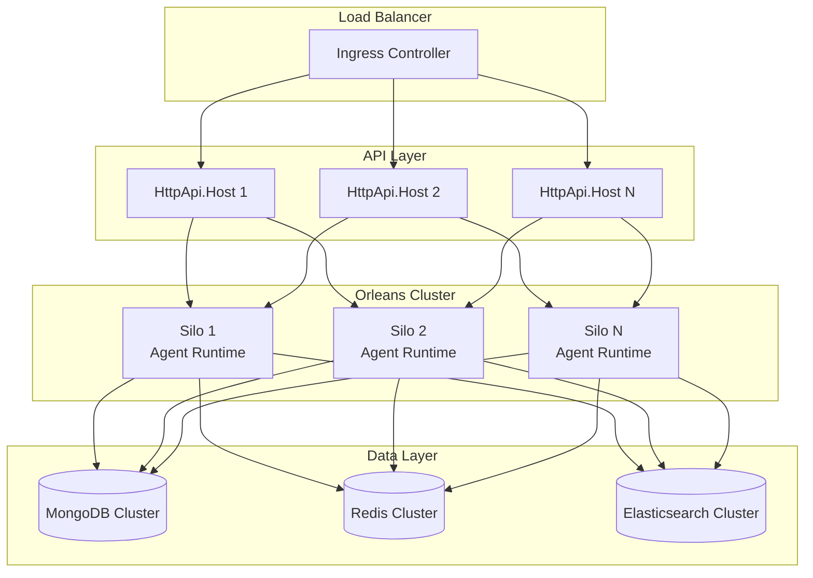

### Performance Optimization Guidelines

#### Orleans Configuration

```csharp
// Optimize grain placement and lifecycle
siloBuilder.Configure<GrainCollectionOptions>(options =>
{
    options.CollectionAge = TimeSpan.FromMinutes(10);
    options.DeactivationTimeout = TimeSpan.FromMinutes(2);
});

// Configure stream providers for high throughput
siloBuilder.AddKafkaStreams("kafka", builder =>
{
    builder.ConfigureKafka(config =>
    {
        config.BootstrapServers = "kafka:9092";
        config.BatchSize = 16384;
        config.LingerMs = 5;
    });
});
```

#### Database Optimization

```csharp
// MongoDB indexing strategy
public static async Task CreateIndexesAsync(IMongoDatabase database)
{
    var agentCollection = database.GetCollection<Agent>("agents");
    
    // Compound index for queries
    await agentCollection.Indexes.CreateOneAsync(
        new CreateIndexModel<Agent>(
            Builders<Agent>.IndexKeys
                .Ascending(x => x.OrganizationId)
                .Ascending(x => x.AgentType)
                .Ascending(x => x.CreatedAt)
        )
    );
    
    // Text index for search
    await agentCollection.Indexes.CreateOneAsync(
        new CreateIndexModel<Agent>(
            Builders<Agent>.IndexKeys.Text(x => x.Name).Text(x => x.Description)
        )
    );
}
```

#### Caching Strategy

```csharp
public class AgentService : ApplicationService
{
    private readonly IDistributedCache _cache;
    
    public async Task<AgentDto> GetAgentAsync(Guid id)
    {
        var cacheKey = $"agent:{id}";
        var cachedAgent = await _cache.GetStringAsync(cacheKey);
        
        if (cachedAgent != null)
        {
            return JsonSerializer.Deserialize<AgentDto>(cachedAgent);
        }
        
        var agent = await _repository.GetAsync(id);
        var agentDto = ObjectMapper.Map<Agent, AgentDto>(agent);
        
        await _cache.SetStringAsync(cacheKey, JsonSerializer.Serialize(agentDto), 
            new DistributedCacheEntryOptions
            {
                AbsoluteExpirationRelativeToNow = TimeSpan.FromMinutes(15)
            });
        
        return agentDto;
    }
}
```

### Monitoring and Observability

#### Metrics Collection

```csharp
public class MetricsMiddleware
{
    private static readonly Counter RequestCount = Metrics
        .CreateCounter("http_requests_total", "Total HTTP requests");
    
    private static readonly Histogram RequestDuration = Metrics
        .CreateHistogram("http_request_duration_seconds", "HTTP request duration");

    public async Task InvokeAsync(HttpContext context, RequestDelegate next)
    {
        using var timer = RequestDuration.NewTimer();
        
        try
        {
            await next(context);
        }
        finally
        {
            RequestCount.WithLabels(
                context.Request.Method,
                context.Response.StatusCode.ToString()
            ).Inc();
        }
    }
}
```

## Troubleshooting

### Common Issues

#### 1. Orleans Cluster Formation Issues
**Symptoms**: Silos not joining cluster, grain activation failures
**Solutions**:
- Verify MongoDB connection strings across all silos
- Check network connectivity between silo instances
- Ensure consistent ClusterId and ServiceId configuration
- Review Orleans dashboard for cluster health

#### 2. Agent State Persistence Issues
**Symptoms**: Agent state not persisting, event sourcing failures
**Solutions**:
- Verify LogConsistencyProvider configuration
- Check MongoDB storage provider setup
- Review grain storage connection strings
- Monitor storage provider health metrics

#### 3. SignalR Connection Issues
**Symptoms**: Real-time updates not working, connection drops
**Solutions**:
- Check SignalR hub registration in DI container
- Verify WebSocket support in load balancer
- Review authentication and authorization configuration
- Monitor connection pool limits

#### 4. Performance Degradation
**Symptoms**: Slow API responses, high memory usage
**Solutions**:
- Implement grain deactivation timeouts
- Add database query optimization
- Configure proper caching strategies
- Monitor and scale infrastructure resources

### Diagnostic Commands

```bash
# Check Orleans cluster health
kubectl port-forward svc/aevatar-silo-service 8080:8080
# Open http://localhost:8080 for Orleans dashboard

# View application logs
kubectl logs -f deployment/aevatar-silo --tail=100

# Monitor resource usage
kubectl top pods -l app=aevatar-silo

# Test API health
curl -X GET http://localhost/health

# Check database connectivity
kubectl exec -it deployment/aevatar-api -- /bin/bash
telnet mongodb-service 27017
```

### Health Monitoring

```csharp
public class HealthCheckExtensions
{
    public static IServiceCollection AddAevatarHealthChecks(
        this IServiceCollection services, 
        IConfiguration configuration)
    {
        services.AddHealthChecks()
            .AddMongoDb(
                configuration.GetConnectionString("Default"), 
                name: "mongodb")
            .AddRedis(
                configuration.GetConnectionString("Redis"), 
                name: "redis")
            .AddElasticsearch(options =>
            {
                options.UseServer(configuration.GetConnectionString("Elasticsearch"));
            }, name: "elasticsearch")
            .AddOrleans(name: "orleans");
            
        return services;
    }
}
```

---

*This documentation provides comprehensive coverage of the Aevatar Station platform architecture, implementation patterns, and operational guidelines. For additional support, refer to the sample applications in the `samples/` directory or submit issues to the project repository.*