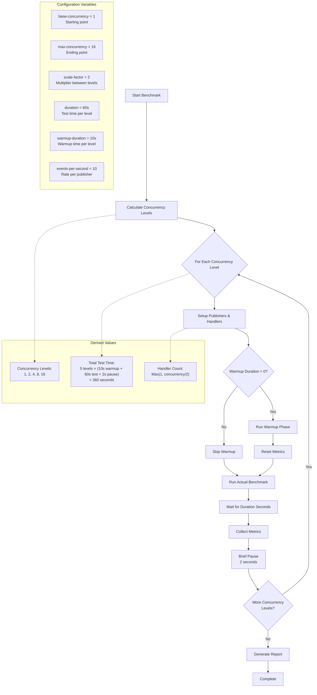

# Orleans Latency Benchmark Tool

A comprehensive benchmarking tool for measuring agent-to-agent communication latency and throughput in Orleans-based distributed systems.

## Overview

This tool performs automated latency testing across multiple concurrency levels to analyze how your Orleans cluster handles increasing load. It uses real Orleans grains (agents) to simulate realistic communication patterns.

## How It Works

### Agent-to-Agent Communication
- **Publisher Agents**: Generate events at a controlled rate
- **Handler Agents**: Receive and process events, measuring latency
- **Stream-Based**: Uses Orleans Streams (Kafka) for reliable message delivery
- **Consistent Agent IDs**: Same publisher/handler agents reused across concurrency levels
- **Sticky Load Balancing**: Each publisher consistently targets the same handler

### Test Progression
The benchmark runs through multiple concurrency levels, testing system performance under increasing load.

### Execution Flow


## Benchmark Methodology Improvements

### Enhanced Agent Management

The benchmark has been improved to provide more consistent and accurate results:

#### 1. **Consistent Agent IDs Across Concurrency Levels**
- **Previous Behavior**: New publisher and handler agent IDs were generated for each concurrency level
- **Current Behavior**: Same set of agent IDs are reused across all concurrency levels within a benchmark run
- **Benefits**: 
  - Eliminates agent initialization overhead from latency measurements
  - Provides more consistent baseline for comparing different concurrency levels
  - Better simulates real-world scenarios where agents are persistent

#### 2. **Deterministic/Sticky Load Balancing**
- **Previous Behavior**: Publishers used random load balancing, potentially targeting any handler
- **Current Behavior**: Each publisher consistently targets the same handler using `publisherId % handlerCount`
- **Benefits**:
  - Eliminates random clustering on busy handlers
  - Reduces latency variance, especially with low concurrency
  - Ensures predictable load distribution
  - More consistent performance measurements

#### 3. **Load Distribution Pattern**

With 4 publishers and 8 handlers, the assignment is:
```
Publisher 0 → Handler 0 (index 0)
Publisher 1 → Handler 1 (index 1)  
Publisher 2 → Handler 2 (index 2)
Publisher 3 → Handler 3 (index 3)
```

Each publisher gets dedicated handler capacity, eliminating the random clustering that could cause:
- Multiple publishers hitting the same handler
- Uneven handler utilization
- Inconsistent latency results
- Performance variance between test runs

### Impact on Results
These improvements provide:
- **More Reliable Measurements**: Consistent agent behavior across test runs
- **Better Scalability Analysis**: Clear comparison between concurrency levels
- **Reduced Variance**: More predictable latency patterns
- **Real-World Accuracy**: Better simulation of production load patterns

## Configuration Variables

### Core Settings
| Variable | Default | Description |
|----------|---------|-------------|
| `base-concurrency` | 1 | Starting number of publisher agents |
| `max-concurrency` | 16 | Maximum number of publisher agents |
| `scale-factor` | 2 | Multiplier between concurrency levels |
| `duration` | 60 | Test duration in seconds per level |
| `warmup-duration` | 10 | Warmup time in seconds per level |
| `events-per-second` | 10 | Events per second per publisher |
| `start-from-level` | - | Start testing from specific concurrency level |
| `stop-at-level` | - | Stop testing at specific concurrency level |

### How Variables Interact

#### 1. Test Sequence Generation
```csharp
// Generated levels: [1, 2, 4, 8, 16]
current = base-concurrency;    // Start at 1
while (current <= max-concurrency) {
    levels.Add(current);
    current *= scale-factor;   // Multiply by 2
}
```

#### 2. Agent Scaling
- **Publisher Agents**: Equals concurrency level (1, 2, 4, 8, 16)
- **Handler Agents**: `Max(1, concurrency_level / 2)` (1, 1, 2, 4, 8)
- **Total Throughput**: `concurrency_level × events_per_second`

#### 3. Timeline Calculation
```
Total Time = Number_of_Levels × (warmup_duration + duration + grace_period + 2s_pause)
Default: 5 levels × (10s + 60s + 2s + 2s) = 370 seconds (6.2 minutes)
```

**Grace Period**: A 2-second grace period is added after publishers stop to allow in-flight events to be processed, ensuring accurate event count matching between sent and processed events.

## Event Generation Calculation

### Events Per Test Level
Each concurrency level generates events according to this formula:
```
Events Per Level = Publishers × Events_Per_Second × Duration
```

### Default Configuration Analysis
With default settings (`events-per-second=10`, `duration=60s`, `base-concurrency=1`, `max-concurrency=16`, `scale-factor=2`):

| Concurrency Level | Publishers | Events/Second | Duration (s) | Events Generated | Daily Equivalent |
|:-----------------:|:----------:|:-------------:|:------------:|:---------------:|:---------------:|
| 1 | 1 | 10 | 60 | **600** | 518,400 |
| 2 | 2 | 20 | 60 | **1,200** | 1,036,800 |
| 4 | 4 | 40 | 60 | **2,400** | 2,073,600 |
| 8 | 8 | 80 | 60 | **4,800** | 4,147,200 |
| 16 | 16 | 160 | 60 | **9,600** | 8,294,400 |
| **TOTALS** | **31** | **310** | **300s** | **18,600** | **16,070,400** |

### Variable Impact Analysis

#### Impact of `events-per-second`
| Events/Second | Concurrency 16 | Total Events | Daily Equivalent |
|:-------------:|:--------------:|:------------:|:---------------:|
| 5 | 5 × 16 = 80/sec | 9,300 | 8,035,200 |
| **10** | **10 × 16 = 160/sec** | **18,600** | **16,070,400** |
| 20 | 20 × 16 = 320/sec | 37,200 | 32,140,800 |
| 50 | 50 × 16 = 800/sec | 93,000 | 80,352,000 |

#### Impact of `duration`
| Duration (s) | Concurrency 16 | Total Events | Time Investment |
|:------------:|:--------------:|:------------:|:---------------:|
| 30 | 16 × 160 × 30 | 9,300 | 3 minutes |
| **60** | **16 × 160 × 60** | **18,600** | **6 minutes** |
| 120 | 16 × 160 × 120 | 37,200 | 12 minutes |
| 300 | 16 × 160 × 300 | 93,000 | 30 minutes |

#### Impact of `max-concurrency`
| Max Concurrency | Levels Tested | Highest Events/Second | Total Events |
|:---------------:|:-------------:|:--------------------:|:------------:|
| 4 | [1, 2, 4] | 40 | 4,200 |
| 8 | [1, 2, 4, 8] | 80 | 9,000 |
| **16** | **[1, 2, 4, 8, 16]** | **160** | **18,600** |
| 32 | [1, 2, 4, 8, 16, 32] | 320 | 37,800 |
| 64 | [1, 2, 4, 8, 16, 32, 64] | 640 | 75,600 |

#### Impact of `scale-factor`
| Scale Factor | Concurrency Levels | Total Events | Test Granularity |
|:------------:|:------------------:|:------------:|:---------------:|
| 1 | [1, 2, 3, 4, 5, 6, 7, 8, 9, 10, 11, 12, 13, 14, 15, 16] | 81,600 | Very Fine |
| **2** | **[1, 2, 4, 8, 16]** | **18,600** | **Standard** |
| 3 | [1, 3, 9] | 7,800 | Coarse |
| 4 | [1, 4, 16] | 12,600 | Very Coarse |

### Customization Examples

#### High-Volume Short Test
```bash
dotnet run -- --events-per-second 100 --duration 30 --max-concurrency 8
```
| Level | Publishers | Events/Second | Events Generated | Daily Equivalent |
|:-----:|:----------:|:-------------:|:---------------:|:---------------:|
| 1 | 1 | 100 | 3,000 | 8,640,000 |
| 2 | 2 | 200 | 6,000 | 17,280,000 |
| 4 | 4 | 400 | 12,000 | 34,560,000 |
| 8 | 8 | 800 | 24,000 | 69,120,000 |
| **Total** | **15** | **1,500** | **45,000** | **129,600,000** |

#### Extended Duration Test
```bash
dotnet run -- --duration 300 --max-concurrency 4
```
| Level | Publishers | Events/Second | Events Generated | Test Duration |
|:-----:|:----------:|:-------------:|:---------------:|:-------------:|
| 1 | 1 | 10 | 3,000 | 5 minutes |
| 2 | 2 | 20 | 6,000 | 5 minutes |
| 4 | 4 | 40 | 12,000 | 5 minutes |
| **Total** | **7** | **70** | **21,000** | **15 minutes** |

### Performance Targeting

#### To Reach 10M Events/Day Target
```
Required Rate = 10,000,000 ÷ 86,400 = 115.7 events/second
```

| Strategy | Publishers Needed | Events/Second | Test Configuration |
|:--------:|:----------------:|:-------------:|:-----------------:|
| Low Frequency | 12 | 10 each | `--max-concurrency 12` |
| **Medium Frequency** | **6** | **20 each** | `--max-concurrency 6 --events-per-second 20` |
| High Frequency | 3 | 40 each | `--max-concurrency 3 --events-per-second 40` |

## Usage Examples

### Basic Usage (Default Settings)
```bash
dotnet run
```
- Tests: 1, 2, 4, 8, 16 publishers
- Duration: 60s per level
- Total time: ~6 minutes

### Quick Performance Check
```bash
dotnet run -- --max-concurrency 8 --duration 30 --warmup-duration 5
```
- Tests: 1, 2, 4, 8 publishers
- Duration: 30s per level
- Total time: ~3 minutes

### High-Throughput Testing
```bash
dotnet run -- --max-concurrency 32 --events-per-second 20
```
- Tests: 1, 2, 4, 8, 16, 32 publishers
- Max throughput: 640 events/sec
- Equivalent: ~55M events/day

### Linear Scaling Test
```bash
dotnet run -- --scale-factor 1 --max-concurrency 10
```
- Tests: 1, 2, 3, 4, 5, 6, 7, 8, 9, 10 publishers
- More granular scaling analysis

### Range Filtering (Avoid Overload)
```bash
dotnet run -- --stop-at-level 8
```
- Tests: 1, 2, 4, 8 publishers (stops before potential overload)
- Useful when higher concurrency shows latency issues

### Resume Testing from Higher Levels
```bash
dotnet run -- --start-from-level 4
```
- Tests: 4, 8, 16 publishers (skips low concurrency)
- Useful for focusing on high-load scenarios

### Test Specific Range
```bash
dotnet run -- --start-from-level 4 --stop-at-level 8
```
- Tests: 4, 8 publishers only
- Perfect for targeted performance analysis

## Test Timeline

With default settings, here's the exact timeline:

### Visual Timeline

```mermaid
gantt
    title Benchmark Timeline - How Variables Control Completion
    dateFormat X
    axisFormat %s
    
    section Concurrency 1
    Warmup (10s)     :milestone, 0, 10
    Test (60s)       :milestone, 10, 70
    Pause (2s)       :milestone, 70, 72
    
    section Concurrency 2
    Warmup (10s)     :milestone, 72, 82
    Test (60s)       :milestone, 82, 142
    Pause (2s)       :milestone, 142, 144
    
    section Concurrency 4
    Warmup (10s)     :milestone, 144, 154
    Test (60s)       :milestone, 154, 214
    Pause (2s)       :milestone, 214, 216
    
    section Concurrency 8
    Warmup (10s)     :milestone, 216, 226
    Test (60s)       :milestone, 226, 286
    Pause (2s)       :milestone, 286, 288
    
    section Concurrency 16
    Warmup (10s)     :milestone, 288, 298
    Test (60s)       :milestone, 298, 358
    Pause (2s)       :milestone, 358, 360
    
    section Final Report
    Generate Report  :milestone, 360, 370
```


### Detailed Timeline
```
Time    | Phase                      | Publishers | Handlers | Events/sec
--------|----------------------------|------------|----------|----------
00:00   | Warmup (Concurrency 1)     | 1          | 1        | 10
00:10   | Test (Concurrency 1)       | 1          | 1        | 10
01:10   | Pause                      | -          | -        | 0
01:12   | Warmup (Concurrency 2)     | 2          | 1        | 20
01:22   | Test (Concurrency 2)       | 2          | 1        | 20
02:22   | Pause                      | -          | -        | 0
02:24   | Warmup (Concurrency 4)     | 4          | 2        | 40
02:34   | Test (Concurrency 4)       | 4          | 2        | 40
03:34   | Pause                      | -          | -        | 0
03:36   | Warmup (Concurrency 8)     | 8          | 4        | 80
03:46   | Test (Concurrency 8)       | 8          | 4        | 80
04:46   | Pause                      | -          | -        | 0
04:48   | Warmup (Concurrency 16)    | 16         | 8        | 160
04:58   | Test (Concurrency 16)      | 16         | 8        | 160
05:58   | Pause                      | -          | -        | 0
06:00   | Generate Report            | -          | -        | 0
06:10   | COMPLETE                   | -          | -        | 0
```

## Range Filtering for Overload Detection

### When to Use Range Filtering

**🚨 Stop at Level** (`--stop-at-level`):
- When P95/P99 latencies start climbing significantly
- When you see event queue buildup (events sent > events processed)
- When resource utilization (CPU/Memory) approaches limits
- When you've identified the system's performance ceiling

**⏩ Start from Level** (`--start-from-level`):
- When you know low concurrency levels perform well
- For focused high-load testing
- When resuming tests after system improvements
- For comparing before/after performance changes

**🎯 Specific Range** (`--start-from-level` + `--stop-at-level`):
- For regression testing specific concurrency ranges
- When you've identified the optimal operating range
- For comparing different configurations at same load levels

### Example Scenarios

```bash
# Scenario 1: Found high latency at level 8, investigate 4-8 range
dotnet run -- --start-from-level 4 --stop-at-level 8 --duration 120

# Scenario 2: System overloads above 12 publishers
dotnet run -- --stop-at-level 12

# Scenario 3: Focus on high-load performance only
dotnet run -- --start-from-level 8 --events-per-second 20
```

## Target Throughput Analysis

The tool calculates required concurrency for your target daily event volume:

```
Target: 10,000,000 events/day
= 10,000,000 ÷ 86,400 seconds/day
= 115.7 events/second required

With 10 events/sec per publisher:
Required concurrency = 115.7 ÷ 10 = 12 publishers
```

## Understanding Results

### Metrics Collected
- **Latency**: Min, Max, Average, Median, P95, P99, Standard Deviation
- **Throughput**: Events sent vs. events processed
- **Per-Agent Metrics**: Individual publisher and handler performance

### Key Performance Indicators
1. **Scalability**: How latency changes with increasing concurrency
2. **Throughput Ceiling**: Maximum sustainable event rate
3. **Latency Distribution**: P95/P99 latencies under load
4. **Resource Utilization**: Handler efficiency vs. publisher load
5. **Load Balance Efficiency**: Consistent publisher-to-handler assignments
6. **Agent Reuse Benefits**: Reduced initialization overhead across test levels

### Sample Output
```
Agent-to-Agent Benchmark Result for 16 concurrent publisher agents:
  Events Sent: 9,600
  Events Processed: 9,585
  Throughput: 160.0 events/sec
  Latency - Min: 12.45ms, Avg: 28.73ms, Max: 156.42ms
  Latency - P95: 45.23ms, P99: 78.91ms
```

### Verbose Debug Output (--verbose)
With the improved methodology, verbose mode shows consistent agent assignments:
```
Publisher 0 consistently targeting handler xyz (index 0 of 8 handlers)
Publisher 1 consistently targeting handler abc (index 1 of 8 handlers)
Publisher 2 consistently targeting handler def (index 2 of 8 handlers)
```
This confirms the deterministic load balancing is working correctly.

## Prerequisites

1. **Orleans Cluster**: Running Orleans silo with specific silo patterns
   - **Scheduler Silo**: For publisher agents (agent IDs: `Scheduler-0`, `Scheduler-1`, etc.)
   - **User Silo**: For consumer/handler agents (agent IDs: `User-0`, `User-1`, etc.)
2. **MongoDB**: For Orleans clustering (`mongodb://localhost:27017`)
3. **Kafka**: For Orleans streams (`localhost:9092`)
4. **Dependencies**: Orleans.Streams.Kafka, Aevatar.Silo packages

## Output Files

- **JSON Report**: `latency-results.json` (detailed metrics)
- **Console Logs**: Real-time progress and results
- **Metrics**: Individual agent performance data

## Advanced Configuration

### Methodology Notes
The enhanced agent management and sticky load balancing are **automatically enabled** - no configuration required. These improvements are transparent to users while providing more reliable benchmark results.

### Custom Test Patterns
```bash
# Test specific concurrency levels
dotnet run -- --base-concurrency 5 --max-concurrency 50 --scale-factor 5
# Results: [5, 25, 50]

# Extended duration testing
dotnet run -- --duration 300 --warmup-duration 30
# 5 minute tests with 30s warmup

# High-frequency testing
dotnet run -- --events-per-second 100 --max-concurrency 10
# Up to 1000 events/sec total

# Range filtering for overload prevention
dotnet run -- --start-from-level 4 --stop-at-level 12
# Test only the 4-12 range, avoiding low and high extremes

# Progressive testing approach
dotnet run -- --stop-at-level 8 --duration 120 --verbose
# Stop at 8 if system shows stress, use longer duration for accuracy
```

### Completion Conditions

The benchmark completes when:
1. ✅ All concurrency levels tested
2. ✅ Each level runs for full duration
3. ✅ All metrics collected from agents
4. ✅ Final report generated

**Early termination** only occurs on:
- Manual cancellation (Ctrl+C)
- Orleans connection failure
- Unhandled exceptions

## Troubleshooting

### Common Issues
1. **Orleans Connection Failed**: Check MongoDB and Kafka services
2. **Agents Not Responding**: Verify Orleans silo is running
3. **Low Throughput**: Check network latency and resource constraints
4. **High Latency**: Investigate Orleans grain activation patterns

### Performance Tips
1. **Warm-up**: Use adequate warmup duration for Orleans grain activation
2. **Kafka Partitions**: Ensure sufficient partitions for parallelism
3. **MongoDB**: Use appropriate connection pooling settings
4. **Resource Limits**: Monitor CPU and memory usage during tests
5. **Range Filtering**: Use `--stop-at-level` when detecting overload symptoms
6. **Progressive Testing**: Start with lower ranges, then test higher levels separately
7. **Consistent Results**: The improved methodology automatically provides more reliable measurements
8. **Verbose Monitoring**: Use `--verbose` to verify deterministic load balancing is working

## Contributing

When modifying the benchmark:
1. Maintain backward compatibility with existing configurations
2. Add appropriate logging for new features
3. Update this README with new variables or behaviors
4. Test with various concurrency levels and durations 