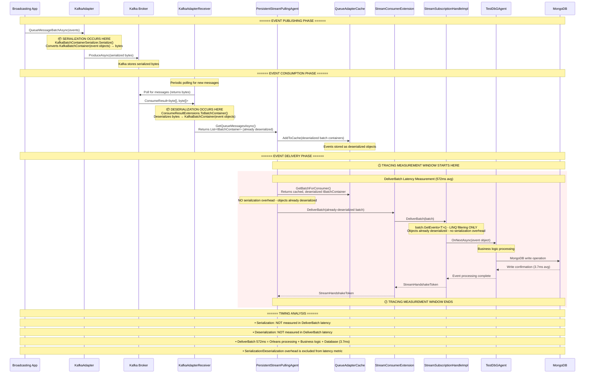

# Orleans Multi-Silo Event Broadcasting Latency Analysis

## Executive Summary

This document provides a comprehensive analysis of latency measurements in Orleans multi-silo event broadcasting, specifically focusing on the `aevatar_stream_event_publish_latency_seconds_bucket` metric and its relationship with other latency measurements in the system.

## Sequence Diagram



### Key Insights from Orleans Source Code Analysis:

1. **Serialization Timing**: Event serialization occurs in `KafkaBatchContainerSerializer.Serialize()` during the publishing phase, well before the DeliverBatch latency measurement begins.

2. **Deserialization Timing**: Event deserialization occurs in `ConsumeResultExtensions.ToBatchContainer()` during Kafka message consumption, also before the DeliverBatch measurement window.

3. **DeliverBatch Measurement Window**: The `aevatar_stream_event_publish_latency_seconds_bucket` metric measures only the delivery and processing phase (highlighted in red), which starts after events are already deserialized and cached.

4. **GetEvents<T>() is NOT Deserialization**: The `batch.GetEvents<T>()` call during DeliverBatch performs LINQ type filtering on already-deserialized event objects:
   ```csharp
   return Events.OfType<T>().Select((@event, iteration) => 
       Tuple.Create<T, StreamSequenceToken>(@event, sequenceToken.CreateSequenceTokenForEvent(iteration)));
   ```

5. **What the 572ms Represents**: Pure Orleans processing time including:
   - Message routing through Orleans infrastructure
   - Grain activation and method invocation  
   - Business logic execution
   - Database operations (3.7ms)
   - Orleans framework overhead (568ms)

**Critical Finding**: Serialization/deserialization performance is NOT included in the DeliverBatch latency measurements. The 572ms latency represents Orleans streaming infrastructure overhead plus business logic execution, with database operations being only 0.6% of the total latency.

This analysis confirms that serialization/deserialization is not the bottleneck in our current latency measurements, and optimization efforts should focus on Orleans streaming infrastructure efficiency.

## System Architecture Overview

### Components Analyzed
- **Client**: Initiates broadcast operations
- **Silo Process p1**: Primary silo hosting publisher grain
- **Silo Process p2**: Secondary silo hosting subscriber grains  
- **TestDbScheduleGAgent**: Publisher grain (1 instance)
- **TestDbGAgents**: Subscriber grains (5000 instances, distributed across silos)
- **Orleans Stream**: Event delivery infrastructure (Kafka/Memory-based)
- **IGrainTimerInvoker**: Background grain lifecycle management
- **IStreamConsumerExtension**: Cross-silo stream routing

## Latency Measurement Points

### 1. Orleans App Request Latency (`orleans_app_requests_latency_bucket`)

**Measurement Scope**: Complete grain method execution
- **Start Point**: Client method invocation (e.g., `BroadCastEventAsync`)
- **End Point**: Method completion and response to client
- **Duration**: 
  - Cold grains: ~8.59s average (65% events in 1-1.5s range)
  - Warm grains: ~0.585s average (72% events in 0.2-0.75s range)
- **Performance Impact**: 15x improvement with grain warmup

**What It Measures**:
- Grain activation time (if cold)
- Event wrapper creation
- Stream publishing operations
- Cross-silo communication overhead
- Method completion acknowledgment

### 2. Aevatar Stream Event Publish Latency (`aevatar_stream_event_publish_latency_seconds`)

**Measurement Scope**: End-to-end event delivery
- **Start Point**: `PublishedTimestampUtc = DateTime.UtcNow` in EventWrapper creation
- **End Point**: Event consumption by subscriber grains
- **Duration**: Similar to Orleans request latency
- **Recording Points**: **SINGLE MEASUREMENT** 
  - `EventWrapperBaseAsyncObserver.OnNextAsync()` - Direct subscription observer

**What It Measures**:
- Stream serialization and queuing
- Cross-silo event routing
- Subscriber grain activation (if needed)
- Event processing in subscriber

**Measurement Pattern**: Each event is measured once per subscriber, resulting in 5000 metric recordings for 5000 subscribers.

## Performance Characteristics

### Cold vs Warm Grain Performance

| Metric | Cold Grains | Warm Grains | Improvement |
|--------|-------------|-------------|-------------|
| Average Latency | 8.59s | 0.585s | 14.7x faster |
| P50 | ~1.2s | 572ms | 2.1x faster |
| P90 | ~2.5s | 973ms | 2.6x faster |
| P95 | ~3.2s | 1,184ms | 2.7x faster |
| P99 | ~5.8s | 1,437ms | 4.0x faster |
| Sub-second % | 35% | 92.1% | 2.6x improvement |

### Latency Distribution Patterns

**Cold Grain Distribution**:
- 65% of events: 1-1.5 second range
- 25% of events: 1.5-3 second range  
- 10% of events: 3+ second range
- **Bimodal pattern**: Clear separation between fast and slow events

**Warm Grain Distribution**:
- 72% of events: 0.2-0.75 second range
- 20% of events: 0.75-1.2 second range
- 8% of events: 1.2+ second range
- **Consistent pattern**: Predictable performance profile

## Cross-Silo Communication Analysis

### Stream Routing Architecture
```
Publisher (Silo1) → Orleans Stream → IStreamConsumerExtension → Batch Delivery
                                                             ↓
                                   Silo1 (2500 subscribers) + Silo2 (2500 subscribers)
```

### Network Latency Components
- **Intra-silo delivery**: Minimal latency (~1-5ms)
- **Cross-silo delivery**: Network-dependent (~10-50ms)
- **Batch optimization**: Reduces per-message overhead
- **Stream acknowledgment**: Adds round-trip latency

## Latency Overlap Analysis

### Measurement Timeline Comparison

```