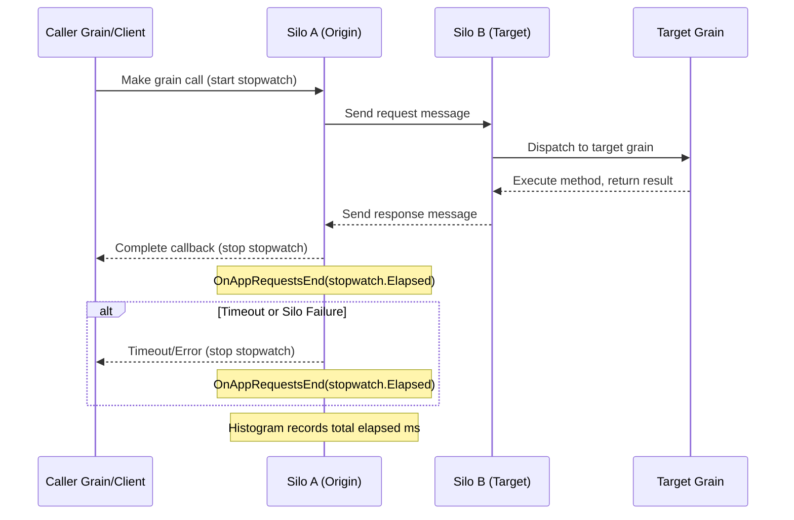

# Core Metrics Requirements Document
## Core Performance Monitoring: Request Latency, Runtime, and API Metrics

**Document Version**: 1.0  
**Date**: June 11, 2025  
**Target Audience**: Cross-functional Development Team  
**Project**: Aevatar Agent Platform Core Monitoring  
**Feature ID**: F011

---

## 📋 **EXECUTIVE SUMMARY**

This document defines requirements for implementing core performance monitoring focused on three essential metric categories for the Aevatar Agent Platform. This focused approach prioritizes the most critical metrics needed for operational visibility and performance optimization.

## 📊 **ACCURACY LEVEL STANDARDS**

All metrics in this document use quantified accuracy levels based on industry standards for observability and monitoring systems:

### **Accuracy Level Classification**
Based on industry standards for SRE and observability systems, metrics are classified using the following accuracy levels:

- **99.9%**: **Counters and Exact Measurements** - Precise event counting and deterministic operations with minimal data loss (industry standard for critical business metrics)
- **99.5%**: **Real-time State Metrics (Gauges)** - High-fidelity measurements with minimal collection delay (standard for SLI/SLO monitoring)
- **99%**: **Latency and Performance Histograms** - Timing measurements with instrumentation overhead (standard for percentile-based SLOs)
- **98%**: **System Resource Metrics** - OS-level collection with inherent measurement overhead (standard for infrastructure monitoring)
- **97%**: **Network and Distributed System Metrics** - Network measurement variance and cross-system coordination delays (standard for distributed systems)
- **95%**: **External Service Dependencies** - Third-party service uncertainty and network latency factors (standard for external API monitoring)

### **Industry Standard Rationale**
Based on Google SRE practices, ACM Queue standards, and observability industry best practices:

- **99.9% (Counters)**: Industry standard for business-critical metrics requiring exact counting (e.g., financial transactions, user actions)
- **99.5% (Gauges)**: Standard accuracy for SLI measurements used in SLO calculations and alerting thresholds
- **99% (Histograms)**: Accepted accuracy for percentile-based latency measurements (p95, p99) used in performance SLOs
- **98% (System Metrics)**: Standard for infrastructure monitoring where OS collection overhead is expected
- **97% (Network Metrics)**: Industry standard for distributed system metrics accounting for network variance
- **95% (External Services)**: Standard accuracy expectation for third-party dependencies and external API monitoring

### **Compliance with SRE Standards**
These accuracy levels align with:
- **Google SRE Book** recommendations for service level indicators
- **ACM Queue** metrics standards for production systems
- **Industry SLO/SLA** practices for high-availability services (99.95% availability targets)
- **Observability frameworks** used by major cloud providers and enterprise systems

### **Key Deliverables**
1. **Orleans Request Latency**: Agent request processing time tracking per cluster/silo/grain type/method
2. **.NET Runtime Metrics**: Garbage collection, thread pool, memory management, and exception tracking
3. **HTTP API Metrics**: Client request latency, service availability, and error rate monitoring

---

## 🎯 **PRIORITY CLASSIFICATION SYSTEM**

All metrics are classified using a five-tier priority system:

- **Very High Priority**: Mission-critical metrics that directly impact core performance targets
- **High Priority**: Critical metrics essential for meeting performance and availability targets
- **Medium Priority**: Important metrics for operational visibility and troubleshooting
- **Low Priority**: Useful metrics for comprehensive monitoring and optimization
- **Very Low Priority**: Future enhancement metrics for detailed analysis

---

## 🎯 **SECTION 1: ORLEANS REQUEST LATENCY METRICS**

### **1.1 Orleans Agent Request Performance**

#### **Core Request Latency Metrics**
| Metric Name | Type | Description | Labels | Percentiles/Thresholds | Priority | Accuracy Level | Retention Period |
|-------------|------|-------------|---------|----------------------|----------|----------------|------------------|
| `orleans-app-requests-latency-bucket` | Histogram | Agent method execution time (Orleans built-in) | `cluster_id`, `silo_id`, `grain_type`, `method_name` | p50, p90, p95, p99 | Very High | 99.5% | 30d |
| `orleans-app-requests-latency-count` | Counter | Total agent requests count | `cluster_id`, `silo_id`, `grain_type` | >10M/day | Very High | 99.9% | 30d |
| `orleans-app-requests-latency-sum` | Counter | Sum of all request durations | `cluster_id`, `silo_id`, `grain_type` | Average calculation | Very High | 99.9% | 30d |

#### **Storage Provider Metrics**
| Metric Name | Type | Description | Labels | Percentiles/Thresholds | Priority | Accuracy Level | Retention Period |
|-------------|------|-------------|---------|----------------------|----------|----------------|------------------|
| `orleans-storage-read-latency` | Histogram | MongoDB storage read latency | `cluster_id`, `silo_id`, `grain_type` | p50, p90, p95 | High | 99.5% | 30d |
| `orleans-storage-write-latency` | Histogram | MongoDB storage write latency | `cluster_id`, `silo_id`, `grain_type` | p50, p90, p95 | High | 99.5% | 30d |
| `orleans-storage-clear-latency` | Histogram | MongoDB storage clear operation latency | `cluster_id`, `silo_id`, `grain_type` | p50, p90, p95 | Medium | 99.5% | 7d |
| `orleans-storage-read-errors` | Counter | MongoDB storage read errors | `cluster_id`, `silo_id`, `error_type` | >1% error rate | High | 99.9% | 30d |
| `orleans-storage-write-errors` | Counter | MongoDB storage write errors | `cluster_id`, `silo_id`, `error_type` | >1% error rate | High | 99.9% | 30d |

#### **Streaming Metrics**
| Metric Name                                 | Type      | Description                                                      | Labels                | Percentiles/Thresholds | Priority | Accuracy Level | Retention Period |
|---------------------------------------------|-----------|------------------------------------------------------------------|-----------------------|----------------------|----------|----------------|------------------|
| `orleans-streams-queue-cache-under-pressure` | Counter   | Times stream queue cache was under pressure                        | `cluster_id`, `silo_id`, `queue_id` | Pressure events | High | 99.9% | 7d |
| `orleans-streams-queue-cache-pressure`      | Gauge     | Pressure on stream queue cache                                    | `cluster_id`, `silo_id`, `queue_id` | Backpressure | High | 99.9% | 7d |
| `orleans-streams-queue-cache-size`            | Counter   | Stream queue cache size in bytes                                  | `cluster_id`, `silo_id`, `queue_id` | Memory usage | High | 99.9% | 7d |
| `orleans-streams-queue-cache-length`            | Counter   | Stream queue length                                               | `cluster_id`, `silo_id`, `queue_id` | Queue depth | High | 99.9% | 7d |
| `orleans-streams-queue-cache-messages-added`    | Counter   | Messages added to stream queue                                     | `cluster_id`, `silo_id`, `queue_id` | Input rate | High | 99.9% | 30d |
| `orleans-streams-queue-cache-messages-purged`     | Counter   | Messages purged from stream queue                                  | `cluster_id`, `silo_id`, `queue_id` | Purge rate | Medium | 99.9% | 7d |
| `aevatar_stream_event_publish_latency`      | Histogram | Time from event publish to event received by handler (seconds)    | event type, grain id, stream id, silo, ... | p50, p95, p99 | High | High | 30d |
| `aevatar_stream_event_publish_latency_count`| Counter   | Number of events measured for publish-to-receive latency         | event type, ...       | - | High | High | 30d |
| `aevatar_stream_event_publish_latency_sum`  | Counter   | Sum of all measured latencies (seconds)                          | event type, ...       | - | High | High | 30d |

#### **Request Latency Requirements**
- **Cluster-Level Tracking**: Request latency aggregated by silos for cluster level tracking
- **Silo-Level Breakdown**: Per-silo latency tracking for load balancing and performance analysis
- **Grain Type Classification**: Latency tracking per grain/agent type for performance profiling
- **Method-Level Granularity**: Individual method performance tracking for optimization
- **Percentile Calculations**: Support for p50, p90, p95, p99 latency percentiles
- **Percentile Gauges**: Real-time gauge metrics for exact percentile values for alerting and dashboards
- **Storage Performance**: Storage provider latency tracking for persistence operations
- **Streaming Performance**: Stream queue performance and backpressure monitoring
- **Histogram Buckets**: Use Orleans default buckets [1, 2, 4, 6, 8, 10, 50, 100, 200, 400, 800, 1000, 1500, 2000, 5000, 10000, 15000] milliseconds

#### **Orleans Built-in Metrics Integration**
*Based on [Microsoft Orleans Monitoring Documentation](https://learn.microsoft.com/en-us/dotnet/orleans/host/monitoring/?pivots=orleans-7-0)*

Orleans provides comprehensive built-in metrics through the `Microsoft.Orleans` meter using `System.Diagnostics.Metrics` APIs. Our requirements focus on **enhancing** these existing metrics with additional labels:

- **Primary Meter**: `Microsoft.Orleans` - Comprehensive built-in metrics for all Orleans operations
- **Application Metrics**: `orleans-app-requests-latency-bucket` (histogram for p95/p90/p50 calculations)
- **Storage Metrics**: `orleans-storage-read-latency`, `orleans-storage-write-latency` (storage operation latencies)
- **Streaming Metrics**: `orleans-streams-queue-cache-*` (stream queue performance metrics)
- **Enhancement Strategy**: Add `cluster_id`, `silo_id`, `grain_type`, `method_name` labels to existing Orleans metrics

---

## 🖥️ **SECTION 2: .NET RUNTIME METRICS**

### **2.1 Garbage Collection Performance Metrics**

#### **GC Performance Tracking**
| Metric Name | Type | Description | Labels | Percentiles/Thresholds | Priority | Accuracy Level | Retention Period |
|-------------|------|-------------|---------|----------------------|----------|----------------|------------------|
| `dotnet_gc_duration_seconds` | Histogram | Garbage collection duration | `silo_id`, `generation`, `type`, `reason` | p50, p90, p95 | High | 99.5% | 7d |
| `dotnet_gc_heap_size_bytes` | Gauge | Managed heap size by generation | `silo_id`, `generation` | >2GB threshold | High | 99% | 7d |
| `dotnet_gc_collections_total` | Counter | Total GC collections | `silo_id`, `generation` | Collection frequency | High | 99.9% | 7d |
| `dotnet_gc_allocated_bytes_total` | Counter | Total allocated bytes | `silo_id` | Allocation rate | High | 98% | 7d |
| `dotnet_gc_pause_time_percentage` | Gauge | GC pause time percentage | `silo_id` | >5% threshold | High | 99% | 7d |

### **2.2 Thread Pool Performance Metrics**

#### **Thread Pool Tracking**
| Metric Name | Type | Description | Labels | Percentiles/Thresholds | Priority | Accuracy Level | Retention Period |
|-------------|------|-------------|---------|----------------------|----------|----------------|------------------|
| `dotnet_threadpool_threads_count` | Gauge | Thread pool thread count | `silo_id`, `type` | >500 threads | High | 99% | 7d |
| `dotnet_threadpool_queue_length` | Gauge | Thread pool queue length | `silo_id` | Queue depth | High | 99% | 7d |
| `dotnet_threadpool_completed_items_total` | Counter | Completed work items | `silo_id` | Completion rate | High | 99.9% | 7d |

### **2.3 Memory Management Metrics**

#### **Memory Performance Tracking**
| Metric Name | Type | Description | Labels | Percentiles/Thresholds | Priority | Accuracy Level | Retention Period |
|-------------|------|-------------|---------|----------------------|----------|----------------|------------------|
| `dotnet_memory_working_set_bytes` | Gauge | Process working set | `silo_id` | Memory usage | High | 99% | 7d |

### **2.4 Exception and Error Metrics**

#### **Exception Tracking**
| Metric Name | Type | Description | Labels | Percentiles/Thresholds | Priority | Accuracy Level | Retention Period |
|-------------|------|-------------|---------|----------------------|----------|----------------|------------------|
| `dotnet_exceptions_total` | Counter | Total exceptions thrown | `silo_id`, `exception_type` | >100/min rate | High | 99.9% | 30d |

#### **.NET Runtime Monitoring Requirements**
- **Garbage Collection**: GC frequency, duration, heap sizes, generation statistics
- **Thread Pool**: Active threads, queued work items, completion rates
- **Memory Management**: Working set, generation heap sizes
- **Exception Handling**: Exception rates

> **Note on Metric Consolidation:**
> Several runtime metrics have been consolidated to align with OpenTelemetry standards and avoid redundancy:
> - **Heap Generation Sizes** (`dotnet_memory_gen0_size_bytes`, etc.) are covered by `dotnet_gc_heap_size_bytes` using the `generation` label (`gen0`, `gen1`, `gen2`, `loh`).
> - **Thread Pool Throughput** (`dotnet_threadpool_throughput_total`) is derived from the rate of `dotnet_threadpool_completed_items_total`.
> - **Private Memory** (`dotnet_memory_private_bytes`) is sufficiently represented by the process working set (`dotnet_memory_working_set_bytes`) for most monitoring scenarios.
> - **Unhandled Exceptions** (`dotnet_unhandled_exceptions_total`) are a subset of `dotnet_exceptions_total`, which tracks all first-chance exceptions and provides broader visibility into potential issues.

---

## 🌐 **SECTION 3: HTTP API METRICS**

### **3.0 HTTP API-Exposing Projects in aevatar-station**

The following projects in the aevatar-station repository expose HTTP APIs:

| Project Name                | Path                                      | Description                                                      |
|----------------------------|-------------------------------------------|------------------------------------------------------------------|
| **Aevatar.HttpApi.Host**    | src/Aevatar.HttpApi.Host                  | Main RESTful API for agent, user, and platform operations        |
| **Aevatar.AuthServer**      | src/Aevatar.AuthServer                    | OAuth2/OpenIddict authentication and token issuance API          |
| **Aevatar.WebHook.Host**    | src/Aevatar.WebHook.Host                  | Webhook endpoint host for external integrations                  |
| **Aevatar.Developer.Host**  | src/Aevatar.Developer.Host                | Developer tools, diagnostics, and test endpoints                 |

> **Note:**
> - These projects use ASP.NET Core and expose endpoints via controllers, SignalR hubs, or custom endpoint mapping.
> - All HTTP API metrics in this section apply to these projects unless otherwise specified.

### **3.1 HTTP Request Performance Metrics**

#### **Core API Performance Tracking**
| Metric Name | Type | Description | Labels | Percentiles/Thresholds | Priority | Accuracy Level | Retention Period |
|-------------|------|-------------|---------|----------------------|----------|----------------|------------------|
| `http_request_duration_seconds` | Histogram | HTTP request duration | `endpoint`, `method`, `status_code`, `service` | p50, p90, p95, p99 | Very High | 99.5% | 30d |
| `http_requests_total` | Counter | Total HTTP requests | `endpoint`, `method`, `status_code`, `service` | >1000/sec | Very High | 99.9% | 30d |
| `http_requests_in_flight` | Gauge | Concurrent HTTP requests | `endpoint`, `method`, `service` | >100 concurrent | High | 99.9% | 7d |

### **3.2 HTTP Error and Status Metrics**

#### **API Error Tracking**
| Metric Name | Type | Description | Labels | Percentiles/Thresholds | Priority | Accuracy Level | Retention Period |
|-------------|------|-------------|---------|----------------------|----------|----------------|------------------|
| `http_requests_errors_total` | Counter | HTTP error requests | `endpoint`, `method`, `status_code`, `error_type` | >1% error rate | Very High | 99.9% | 30d |
| `http_requests_4xx_total` | Counter | 4xx client errors | `endpoint`, `method`, `status_code` | Client error rate | High | 99.9% | 30d |
| `http_requests_5xx_total` | Counter | 5xx server errors | `endpoint`, `method`, `status_code` | >0.1% server errors | Very High | 99.9% | 30d |

### **3.3 Service Availability Metrics**

#### **Service Health Tracking**
| Metric Name | Type | Description | Labels | Percentiles/Thresholds | Priority | Accuracy Level | Retention Period |
|-------------|------|-------------|---------|----------------------|----------|----------------|------------------|
| `service_up` | Gauge | Service health status (0/1) | `service`, `endpoint`, `instance` | 99.95% availability | Very High | 99.9% | 30d |
| `service_availability_percentage` | Gauge | Service availability percentage | `service`, `time_window` | 99.95% target | Very High | 99.9% | 90d |
| `service_downtime_seconds_total` | Counter | Total service downtime | `service`, `reason` | Downtime tracking | Very High | 99.9% | 90d |

#### **HTTP API Monitoring Requirements**
- **Request Performance**: HTTP request latency, throughput, concurrent request tracking
- **Error Classification**: 4xx client errors, 5xx server errors, timeout tracking
- **Service Availability**: Health status, availability percentage, downtime tracking
- **Endpoint Coverage**: All public API endpoints must be monitored

---

## 🚨 **SECTION 4: ALERTING REQUIREMENTS**

### **4.1 High Latency Alerts**

#### **Performance Degradation Alerts**
| Service Type | Alert Name | Condition | Duration | Severity | Context |
|-------------|------------|-----------|----------|----------|---------|
| Orleans Agent | `aevatar_agent_high_latency_alert` | P95 latency > 120ms | 2 minutes | Critical | Cluster, silo, grain type, method, percentiles |
| HTTP API | `aevatar_api_high_latency_alert` | P95 response time > 200ms | 3 minutes | Warning | Endpoint, method, percentiles |

### **4.2 High Error Rate Alerts**

#### **Error Rate Threshold Alerts**
| Service Type | Alert Name | Condition | Duration | Severity | Context |
|-------------|------------|-----------|----------|----------|---------|
| Orleans Agent | `aevatar_agent_high_error_alert` | Error rate > 1% | 2 minutes | Critical | Cluster, silo, grain type, error types |
| HTTP API | `aevatar_api_high_error_alert` | 5xx error rate > 0.1% | 2 minutes | Critical | Endpoint, status codes, error details |

### **4.3 Runtime Performance Alerts**

#### **.NET Runtime Alerts**
| Service Type | Alert Name | Condition | Duration | Severity | Context |
|-------------|------------|-----------|----------|----------|---------|
| .NET Runtime | `aevatar_gc_high_pressure_alert` | GC pause time > 5% | 3 minutes | Warning | Silo, generation, GC type |
| .NET Runtime | `aevatar_threadpool_saturation_alert` | Thread pool queue > 1000 | 2 minutes | Warning | Silo, queue depth |
| .NET Runtime | `aevatar_memory_pressure_alert` | Working set > 2GB | 5 minutes | Warning | Silo, memory type |
| .NET Runtime | `aevatar_unhandled_exception_alert` | Unhandled exceptions > 0 | 1 minute | Critical | Silo, exception type |

---

## ✅ **SECTION 5: ACCEPTANCE CRITERIA AND SUCCESS METRICS**

### **5.1 Requirements Document Acceptance Criteria**

#### **Completeness Criteria**
- [ ] Orleans request latency metrics specified with cluster/silo/grain type/method labels
- [ ] .NET runtime metrics defined for GC, thread pool, memory, and exceptions
- [ ] HTTP API metrics documented for performance and availability
- [ ] Alerting requirements defined for all three metric categories
- [ ] Cross-functional team review and approval obtained

#### **Technical Clarity Criteria**
- [ ] Metric names, types, and labels clearly defined
- [ ] Percentile and threshold requirements specified
- [ ] Accuracy levels and retention periods documented
- [ ] Alert definitions and thresholds specified
- [ ] Integration with Orleans built-in metrics documented

#### **Implementation Readiness Criteria**
- [ ] Development team can estimate implementation effort
- [ ] Functional requirements clearly specified
- [ ] Dependencies on Orleans metrics framework identified
- [ ] Testing and validation approach defined
- [ ] Success criteria and acceptance tests defined

### **5.2 Success Metrics for Cross-Functional Team**

#### **Development Team Metrics**
- **Implementation Velocity**: Complete core metrics within 1 week
- **Code Quality**: 90%+ test coverage for instrumentation code
- **Performance Impact**: <2% overhead from metrics collection

#### **Operations Team Metrics**
- **Dashboard Adoption**: 100% of on-call engineers using dashboards
- **Alert Effectiveness**: <5% false positive rate
- **MTTR Improvement**: 30% reduction in incident resolution time

#### **Business Team Metrics**
- **Performance Goals**: Maintain p95 latency <120ms under load
- **Availability Target**: Achieve 99.95% availability
- **Operational Visibility**: Complete visibility into request latency patterns

---

## 📚 **APPENDIX A: QUERY REQUIREMENTS**

### **Request Latency Query Requirements**
- **Agent P95 Latency by Type**: Must support calculating 95th percentile latency grouped by grain type
- **Cross-silo Latency Comparison**: Must support comparing 95th percentile latency across different silos
- **Cluster Performance Analysis**: Must support latency analysis across entire cluster
- **Method-Level Performance**: Must support calculating latency percentiles per method

### **Runtime Performance Query Requirements**
- **GC Performance Analysis**: Must support calculating GC duration percentiles and frequency
- **Thread Pool Utilization**: Must support calculating thread pool utilization and queue depth trends
- **Memory Usage Trends**: Must support tracking memory usage patterns across generations
- **Exception Rate Analysis**: Must support calculating exception rates by type and silo

### **API Performance Query Requirements**
- **Service Availability Percentage**: Must support calculating availability percentage over time periods
- **API Error Rate**: Must support calculating error rate based on HTTP status codes
- **Endpoint Performance Comparison**: Must support comparing latency across different endpoints

## Orleans AppRequestsLatencyHistogram Measurement Diagram

The following sequence diagram illustrates what the `AppRequestsLatencyHistogram` in Orleans actually measures:

**Explanation:**
- The measured latency is the total time from when the request is sent by the origin Silo until a response, error, or timeout is received.
- This includes network, scheduling, grain execution, and serialization/deserialization overhead.
- The histogram records this elapsed time for every request, timeout, or error.

---

## 📞 **CONTACT AND REVIEW PROCESS**

### **Document Owner**
- **Primary Contact**: AevatarAI Platform Team
- **Business Stakeholder**: AevatarAI Platform Team

### **Implementation Team**
- **Primary Implementation**: DevOps Team

### **Review and Approval Process**
1. **Technical Review**: AI Framework and DevOps teams
2. **Business Review**: AevatarAI Platform Team
3. **Final Approval**: AI Framework and DevOps teams
4. **Implementation Kickoff**: Requirements handoff to DevOps team

### **Document Maintenance**
- **Review Cycle**: Weekly during implementation phase
- **Update Process**: Version-controlled changes with AI Framework team approval
- **Feedback Loop**: Continuous improvement based on DevOps implementation learnings

---

**Document Status**: ✅ Ready for Cross-Functional Team Review  
**Next Action**: Schedule requirements review session with development team  
**Implementation Target**: Begin development within 3 days of approval 