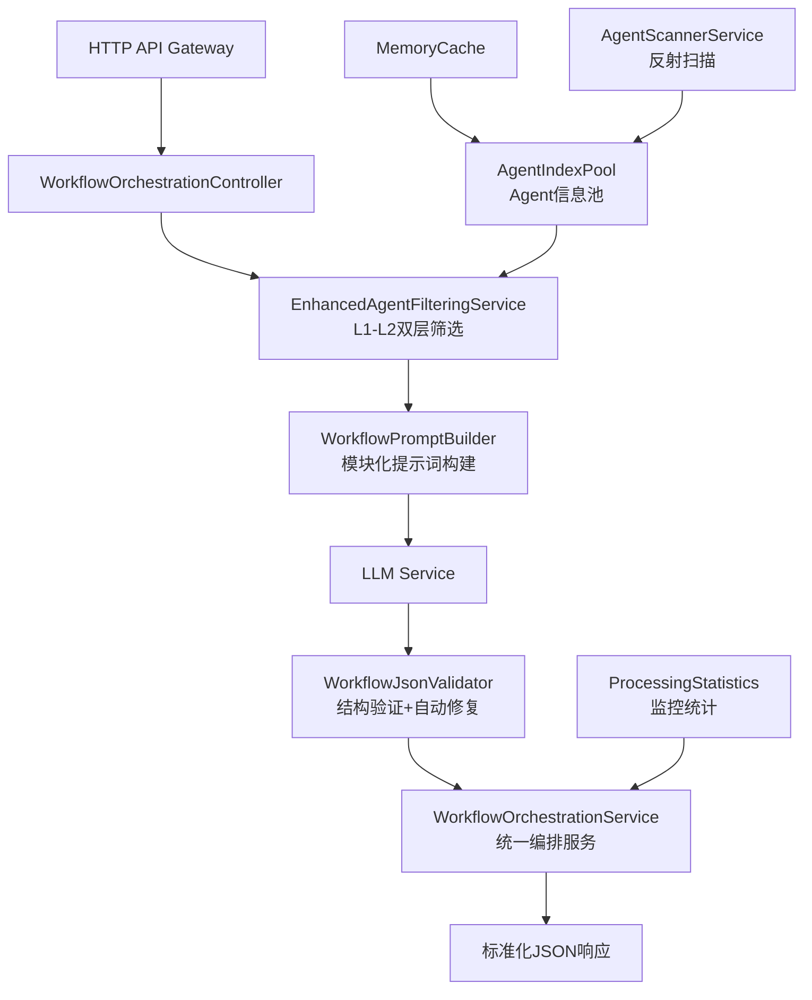

# Agent工作流智能编排系统 - 技术方案设计

## 一、项目概述

### 1.1 核心目标
基于AgentIndexPool的AI工作流编排系统，让LLM智能理解所有Agent能力，根据用户目标自动设计复杂工作流编排（支持并行、串行、条件、循环），并输出前端可直接渲染的标准化JSON格式。

### 1.2 核心价值
- **智能筛选**：双层筛选机制，预期Token使用效率提升85-92%
- **自动编排**：根据用户目标自动生成复杂工作流
- **标准输出**：前端友好的JSON格式，支持直接渲染
- **高可扩展**：模块化设计，支持新Agent类型快速集成

## 二、系统架构设计

### 2.1 总体架构



### 2.2 核心组件
1. **AgentIndexPool** - Agent信息管理和缓存
2. **EnhancedAgentFilteringService** - 双层智能筛选
3. **WorkflowPromptBuilder** - 模块化提示词构建
4. **WorkflowJsonValidator** - JSON验证和自动修复
5. **WorkflowOrchestrationService** - 统一编排服务

## 三、核心解决方案

### 3.1 Agent信息管理系统

#### 设计理念
- **一次性加载**：系统启动时扫描所有Agent，运行期间保持不变
- **标准化描述**：基于Attribute的双层描述系统（L1/L2）
- **内存缓存**：高性能的Agent信息访问

#### 核心组件
- **AgentIndexInfo模型**：标准化的Agent信息结构
- **AgentDescriptionAttribute**：Agent类标记系统
- **AgentScannerService**：基于反射的自动扫描
- **AgentIndexPool**：内存缓存管理服务

#### 双层描述系统
- **L1Description**：100-150字符简短描述，用于快速语义匹配
- **L2Description**：300-500字符详细描述，用于精确能力分析

### 3.2 双层筛选系统

#### 设计原理
通过两层筛选机制大幅减少Token使用量，同时保持筛选精度：

1. **L1层：快速语义匹配**
   - 从300+个Agent筛选到Top20
   - 基于TF-IDF和余弦相似度算法
   - 处理时间：<100ms

2. **L2层：详细能力匹配**
   - 从Top20筛选到最终3-5个Agent
   - 基于意图识别和能力分析
   - 处理时间：<200ms

#### 优化效果
- **Token节约率**：85-92%
- **筛选精度**：保持高质量Agent选择
- **处理效率**：总筛选时间<300ms

### 3.3 模块化提示词构建系统

#### 6组件动态组装
1. **角色定义组件**：定义LLM的工作角色
2. **任务描述组件**：用户目标的结构化描述
3. **Agent信息组件**：筛选后的Agent详细信息
4. **语法说明组件**：工作流DSL语法（分级）
5. **输出格式组件**：JSON格式规范
6. **示例组件**：分复杂度的参考示例

#### 复杂度自适应
- **Simple**：最小化提示词，单Agent串行流程
- **Medium**：核心语法说明，2-3个Agent编排
- **Complex**：完整语法支持，多Agent复杂编排

### 3.4 JSON验证修复系统

#### 核心功能
- **Markdown清理**：自动移除```json包装
- **格式修复**：处理常见JSON格式错误
- **结构验证**：检查必需字段、节点连接等
- **自动修复**：智能修复常见结构问题
- **兼容性保证**：确保前端可直接渲染

#### 容错能力
- 处理LLM输出的各种异常情况
- 保证系统的稳定性和可用性
- 提供详细的错误信息和修复报告

## 四、工作流定义规范

### 4.1 支持的节点类型
- **Start/End**：开始和结束节点
- **Agent**：Agent执行节点
- **Condition**：条件判断节点
- **Loop**：循环控制节点
- **Parallel**：并行分支节点
- **Merge**：合并汇总节点

### 4.2 数据传递机制
- **变量系统**：支持节点间数据传递
- **类型安全**：强类型的变量定义
- **作用域管理**：清晰的变量生命周期

### 4.3 复杂度分级
- **Simple**：1-3个节点，串行执行
- **Medium**：4-8个节点，包含分支或并行
- **Complex**：9+个节点，包含循环、复杂数据流

## 五、技术实现架构

### 5.1 项目结构
```
station/src/
├── Aevatar.WorkflowOrchestration/           # 新增：核心库
│   ├── Models/                              # 数据模型
│   ├── Services/                            # 核心服务
│   ├── Abstractions/                        # 接口定义
│   └── Extensions/                          # 扩展方法
├── Aevatar.WorkflowOrchestration.Tests/     # 新增：单元测试
└── Aevatar.HttpApi.Host/                    # 现有：集成点
    └── Controllers/WorkflowController.cs     # 新增：API控制器
```

### 5.2 依赖关系
- 基于现有的Aevatar.Core基础设施
- 使用ASP.NET Core依赖注入框架
- 集成现有的日志、缓存、配置系统

### 5.3 关键接口设计
- `IAgentIndexPool` - Agent信息池管理
- `IEnhancedAgentFilteringService` - 智能筛选服务
- `IWorkflowPromptBuilder` - 提示词构建服务
- `IWorkflowJsonValidator` - JSON验证服务
- `IWorkflowOrchestrationService` - 统一编排服务

## 六、API接口设计

### 6.1 核心接口
- `POST /api/workflow/generate` - 生成工作流
- `GET /api/workflow/agents` - 获取所有Agent
- `POST /api/workflow/agents/filter` - 筛选Agent
- `POST /api/workflow/validate` - 验证工作流JSON

### 6.2 数据格式
- 请求格式：支持用户目标、复杂度限制、上下文信息
- 响应格式：包含工作流定义、统计信息、Agent列表

## 七、性能与监控

### 7.1 性能指标
- **响应时间**：目标<2秒完整工作流生成
- **Token效率**：相比全量发送节约85-92%
- **筛选精度**：保持高质量Agent选择
- **并发能力**：支持多用户同时请求

### 7.2 监控统计
- **处理统计**：Token使用量、处理时间、成功率
- **筛选统计**：L1/L2筛选效率、Agent分布
- **错误监控**：JSON验证失败、LLM调用异常

## 八、质量保证

### 8.1 测试策略
- **单元测试**：覆盖所有核心组件
- **集成测试**：端到端工作流生成测试
- **性能测试**：并发场景和大量Agent测试

### 8.2 代码质量
- **SOLID原则**：模块化和可扩展设计
- **日志记录**：关键检查点的详细日志
- **错误处理**：完善的异常处理机制

## 九、部署与维护

### 9.1 部署策略
- **集成部署**：集成到现有的HttpApi.Host服务
- **配置管理**：支持环境相关配置
- **健康检查**：Agent扫描状态和缓存健康

### 9.2 维护机制
- **Agent更新**：通过服务重启自动重新扫描
- **缓存管理**：内存缓存的生命周期管理
- **监控告警**：关键指标的监控和告警

---

**项目状态**：技术方案设计完成，准备开始实施开发
**下一步**：创建项目结构，实现核心组件 