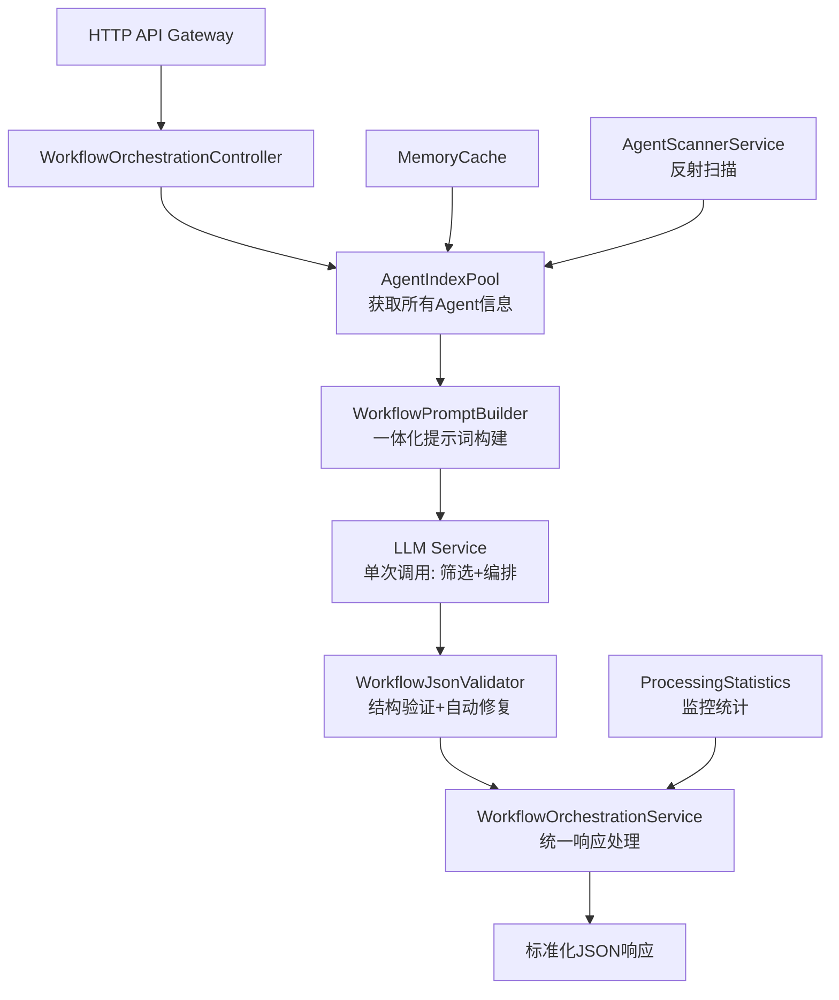

# Agent工作流智能编排系统 - 技术方案设计

## 一、项目概述

### 1.1 核心目标
基于AgentIndexPool的AI工作流编排系统，让LLM智能理解所有Agent能力，根据用户目标自动设计复杂工作流编排（支持并行、串行、条件、循环），并输出前端可直接渲染的标准化JSON格式。

### 1.2 核心价值
- **一次性智能编排**：单次LLM调用完成Agent筛选+工作流编排，简化架构
- **自动编排**：根据用户目标自动生成复杂工作流（并行、串行、条件、循环）
- **标准输出**：前端友好的JSON格式，支持直接渲染
- **高效经济**：单次调用降低Token消耗和响应时间

## 二、系统架构设计

### 2.1 总体架构



### 2.2 核心组件
1. **AgentIndexPool** - Agent信息管理和缓存
2. **WorkflowPromptBuilder** - 一体化提示词构建（Agent筛选+工作流编排）
3. **LLMService** - 单次调用完成筛选和编排
4. **WorkflowJsonValidator** - JSON验证和自动修复
5. **WorkflowOrchestrationService** - 统一响应处理

## 三、核心解决方案

### 3.1 Agent信息管理系统

#### 设计理念
- **一次性加载**：系统启动时扫描所有Agent，运行期间保持不变
- **标准化描述**：基于Attribute的双层描述系统（L1/L2）
- **内存缓存**：高性能的Agent信息访问

#### 核心组件
- **AgentIndexInfo模型**：标准化的Agent信息结构
- **AgentDescriptionAttribute**：Agent类标记系统
- **AgentScannerService**：基于反射的自动扫描
- **AgentIndexPool**：内存缓存管理服务

#### 双层描述系统
- **L1Description**：100-150字符简短描述，用于快速语义匹配
- **L2Description**：300-500字符详细描述，用于精确能力分析

### 3.2 一次性智能编排系统

#### 设计理念
通过单次LLM调用同时完成Agent筛选和工作流编排，避免多次调用的冗余和复杂性：

**核心优势**：
- **逻辑一致性**：LLM理解用户目标后同时完成筛选和编排
- **成本效率**：单次调用显著降低Token消耗
- **响应速度**：减少网络往返，提升用户体验
- **实现简洁**：避免复杂的多阶段处理逻辑

#### 工作流程
1. **信息收集**：获取所有可用Agent信息
2. **一体化调用**：LLM同时执行筛选和编排
3. **结果验证**：JSON格式验证和自动修复
4. **响应输出**：标准化工作流定义

#### 提示词设计策略
- **综合性提示**：包含Agent筛选和工作流编排的完整指令
- **结构化输出**：明确的JSON Schema定义
- **示例驱动**：提供不同复杂度的参考示例
- **约束明确**：Agent数量、节点类型等限制说明

#### 优化效果
- **调用次数**：从2次减少到1次
- **Token使用**：相比双层筛选方案节约40-60%
- **响应时间**：目标1-2秒完成整个流程
- **维护成本**：大幅简化系统复杂度

### 3.3 一体化提示词构建系统

#### 核心组件设计
一次性构建包含Agent筛选和工作流编排的完整提示词：

1. **系统角色定义**：定义LLM作为工作流编排专家的角色
2. **任务综合描述**：用户目标的结构化分析和要求说明
3. **Agent信息展示**：所有可用Agent的完整能力描述
4. **输出规范定义**：完整工作流JSON的Schema和格式要求
5. **示例和约束**：不同复杂度的参考示例和编排约束

#### 提示词模板结构
```json
{
  "system": "你是专业的工作流编排专家，根据用户目标从Agent列表中选择合适的Agent并设计完整的执行流程",
  "user": "用户目标：{userGoal}\n\n可用Agent列表：\n{allAgents}\n\n请直接输出完整的工作流JSON，包括：\n1. 选中的Agent及选择理由\n2. 详细的执行顺序和连接关系\n3. 数据传递和变量定义\n4. 条件分支和循环逻辑\n\n输出格式：{workflowJsonSchema}"
}
```

#### 复杂度自适应
- **Simple**：1-3个Agent，线性流程，基础JSON结构
- **Medium**：4-8个Agent，包含分支或并行，中等复杂度结构
- **Complex**：多Agent复杂编排，包含循环、条件、数据传递等高级特性

### 3.4 JSON验证修复系统

#### 核心功能
- **Markdown清理**：自动移除```json包装
- **格式修复**：处理常见JSON格式错误
- **结构验证**：检查必需字段、节点连接等
- **自动修复**：智能修复常见结构问题
- **兼容性保证**：确保前端可直接渲染

#### 容错能力
- 处理LLM输出的各种异常情况
- 保证系统的稳定性和可用性
- 提供详细的错误信息和修复报告

## 四、工作流定义规范

### 4.1 支持的节点类型
- **Start/End**：开始和结束节点
- **Agent**：Agent执行节点
- **Condition**：条件判断节点
- **Loop**：循环控制节点
- **Parallel**：并行分支节点
- **Merge**：合并汇总节点

### 4.2 数据传递机制
- **变量系统**：支持节点间数据传递
- **类型安全**：强类型的变量定义
- **作用域管理**：清晰的变量生命周期

### 4.3 复杂度分级
- **Simple**：1-3个节点，串行执行
- **Medium**：4-8个节点，包含分支或并行
- **Complex**：9+个节点，包含循环、复杂数据流

## 五、技术实现架构

### 5.1 项目结构
```
station/src/
├── Aevatar.WorkflowOrchestration/           # 新增：核心库
│   ├── Models/                              # 数据模型
│   ├── Services/                            # 核心服务
│   ├── Abstractions/                        # 接口定义
│   └── Extensions/                          # 扩展方法
├── Aevatar.WorkflowOrchestration.Tests/     # 新增：单元测试
└── Aevatar.HttpApi.Host/                    # 现有：集成点
    └── Controllers/WorkflowController.cs     # 新增：API控制器
```

### 5.2 依赖关系
- 基于现有的Aevatar.Core基础设施
- 使用ASP.NET Core依赖注入框架
- 集成现有的日志、缓存、配置系统

### 5.3 关键接口设计
- `IAgentIndexPool` - Agent信息池管理
- `IWorkflowPromptBuilder` - 一体化提示词构建服务
- `ILLMService` - LLM调用服务（筛选+编排）
- `IWorkflowJsonValidator` - JSON验证服务
- `IWorkflowOrchestrationService` - 统一编排服务

## 六、API接口设计

### 6.1 核心接口
- `POST /api/workflow/generate` - 一次性生成完整工作流（包含Agent筛选+编排）
- `GET /api/workflow/agents` - 获取所有可用Agent信息
- `POST /api/workflow/validate` - 验证工作流JSON格式

### 6.2 数据格式
- 请求格式：支持用户目标、复杂度限制、上下文信息
- 响应格式：包含工作流定义、统计信息、Agent列表

## 七、性能与监控

### 7.1 性能指标
- **响应时间**：目标1-2秒完整工作流生成（单次LLM调用）
- **调用效率**：相比双层方案减少50%的网络往返
- **Token优化**：智能Agent选择，避免全量信息发送
- **并发能力**：支持多用户同时请求，简化的架构提升吞吐量

### 7.2 监控统计
- **处理统计**：Token使用量、响应时间、成功率
- **编排质量**：生成的工作流复杂度分布、Agent选择合理性
- **错误监控**：JSON验证失败、LLM调用异常、格式修复率

## 八、质量保证

### 8.1 测试策略
- **单元测试**：覆盖所有核心组件
- **集成测试**：端到端工作流生成测试
- **性能测试**：并发场景和大量Agent测试

### 8.2 代码质量
- **SOLID原则**：模块化和可扩展设计
- **日志记录**：关键检查点的详细日志
- **错误处理**：完善的异常处理机制

## 九、部署与维护

### 9.1 部署策略
- **集成部署**：集成到现有的HttpApi.Host服务
- **配置管理**：支持环境相关配置
- **健康检查**：Agent扫描状态和缓存健康

### 9.2 维护机制
- **Agent更新**：通过服务重启自动重新扫描
- **缓存管理**：内存缓存的生命周期管理
- **监控告警**：关键指标的监控和告警

---

**项目状态**：技术方案设计完成（已优化为单次LLM调用架构）
**核心优势**：简化架构、降低成本、提升响应速度
**下一步**：创建项目结构，实现一体化编排服务 