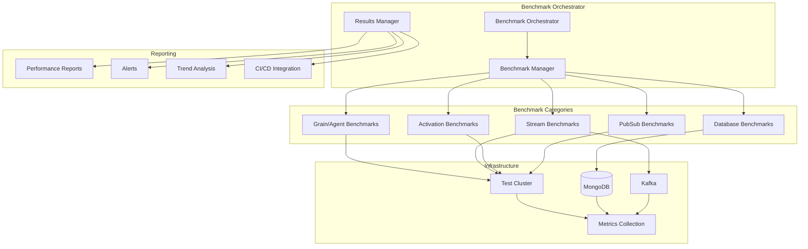

# Automated Benchmarking Design Document

## Executive Summary

This document outlines the design for a comprehensive automated benchmarking system for the Aevatar platform, covering five critical performance areas:

1. **Grain/Agent Method Call Flow Latency** - Measuring end-to-end method invocation performance
2. **Stream Produce/Consumption Latencies** - Kafka and Orleans streaming performance
3. **MongoDB Read/Write Latencies** - Database operation performance
4. **Grain/Agent Activation Latency** - Time to activate and initialize grains
5. **Pub/Sub Method Call Latencies** - Publisher-subscriber communication performance

The design leverages existing infrastructure including BenchmarkDotNet, Orleans metrics, and the current testing framework to provide automated, continuous performance monitoring.

## Current State Analysis

### Existing Infrastructure

Based on analysis of the codebase, we have:

- **BenchmarkDotNet Integration**: Already implemented in `aevatar-station/benchmark/VerifySerializerPerformance/`
- **Performance Test Patterns**: Found in `AgentWarmupE2E/Tests/PerformanceTests.cs`
- **Orleans Metrics**: Stream and grain instrumentation in Orleans core
- **MongoDB Benchmarks**: Patterns from mongo-csharp-driver benchmarks
- **Test Infrastructure**: Comprehensive test fixtures and utilities

### Key Components Identified

- **Aevatar.Silo**: Main silo implementation with Orleans, MongoDB, and Kafka integration
- **Aevatar.Core**: Core framework with event sourcing and agent abstractions
- **E2E.Grains**: Test grain implementations for benchmarking
- **Orleans.Streams.Kafka**: Custom Kafka streaming implementation
- **MongoDB Integration**: Via Orleans.Providers.MongoDB and custom implementations

## Benchmarking Architecture Design

### Overall Architecture



### Core Principles

1. **Leverage Existing Infrastructure**: Build on BenchmarkDotNet and existing test patterns
2. **Automated Execution**: Integrate with CI/CD for continuous monitoring
3. **Comprehensive Coverage**: Measure all critical performance paths
4. **Trend Analysis**: Track performance over time to detect regressions
5. **Actionable Insights**: Provide clear metrics and alerts for performance issues

## Implementation Details

### 1. Grain/Agent Method Call Flow Latency

#### Objective
Measure end-to-end latency for typical grain/agent method invocations including serialization, network transport, and execution time.

#### Implementation Strategy

```csharp
[MemoryDiagnoser]
[SimpleJob(RuntimeMoniker.Net90)]
public class GrainMethodCallLatencyBenchmark
{
    private TestCluster _cluster;
    private IClusterClient _client;
    
    [Params(1, 10, 100, 1000)]
    public int ConcurrentCalls { get; set; }
    
    [Params("Simple", "Complex", "EventSourced")]
    public string GrainType { get; set; }
    
    [GlobalSetup]
    public async Task Setup()
    {
        // Initialize test cluster with realistic configuration
        _cluster = new TestClusterBuilder()
            .AddSiloBuilderConfigurator<SiloConfigurator>()
            .Build();
        await _cluster.DeployAsync();
        _client = _cluster.Client;
    }
    
    [Benchmark]
    public async Task MeasureMethodCallLatency()
    {
        var tasks = new List<Task>();
        var stopwatch = Stopwatch.StartNew();
        
        for (int i = 0; i < ConcurrentCalls; i++)
        {
            tasks.Add(CallGrainMethod(i));
        }
        
        await Task.WhenAll(tasks);
        stopwatch.Stop();
        
        // Record metrics
        RecordLatencyMetrics(stopwatch.Elapsed, ConcurrentCalls);
    }
    
    private async Task CallGrainMethod(int id)
    {
        var grain = GrainType switch
        {
            "Simple" => _client.GetGrain<ITestWarmupAgent>(id),
            "Complex" => _client.GetGrain<IComplexComputeAgent>(id),
            "EventSourced" => _client.GetGrain<IEventSourcedAgent>(id),
            _ => throw new ArgumentException($"Unknown grain type: {GrainType}")
        };
        
        // Measure specific method calls
        await grain.PingAsync();
        await grain.ComputeAsync(1000);
        await grain.GetStateAsync();
    }
}
```

#### Key Metrics
- **Average Method Call Latency**: P50, P95, P99 percentiles
- **Throughput**: Calls per second under various loads
- **Concurrency Impact**: Performance degradation with concurrent calls
- **Grain Type Comparison**: Performance differences between grain types

### 2. Stream Produce/Consumption Latencies

#### Objective
Measure end-to-end streaming performance including Kafka producer/consumer latencies and Orleans stream processing.

#### Implementation Strategy

```csharp
[MemoryDiagnoser]
public class StreamLatencyBenchmark
{
    private TestCluster _cluster;
    private IStreamProvider _streamProvider;
    
    [Params(1, 10, 100)]
    public int ProducerCount { get; set; }
    
    [Params(1, 5, 10)]
    public int ConsumerCount { get; set; }
    
    [Params(1024, 10240, 102400)]
    public int MessageSize { get; set; }
    
    [GlobalSetup]
    public async Task Setup()
    {
        _cluster = new TestClusterBuilder()
            .AddSiloBuilderConfigurator<StreamingSiloConfigurator>()
            .Build();
        await _cluster.DeployAsync();
        
        _streamProvider = _cluster.Client.GetStreamProvider("Aevatar");
    }
    
    [Benchmark]
    public async Task MeasureStreamLatency()
    {
        var streamId = StreamId.Create("benchmark", Guid.NewGuid());
        var stream = _streamProvider.GetStream<byte[]>(streamId);
        
        // Setup consumers
        var consumers = new List<StreamConsumerBenchmark>();
        for (int i = 0; i < ConsumerCount; i++)
        {
            var consumer = new StreamConsumerBenchmark();
            await consumer.SubscribeAsync(stream);
            consumers.Add(consumer);
        }
        
        // Measure produce latency
        var message = new byte[MessageSize];
        var produceLatencies = new List<TimeSpan>();
        
        for (int i = 0; i < ProducerCount; i++)
        {
            var stopwatch = Stopwatch.StartNew();
            await stream.OnNextAsync(message);
            stopwatch.Stop();
            produceLatencies.Add(stopwatch.Elapsed);
        }
        
        // Wait for consumption and measure end-to-end latency
        await Task.Delay(1000); // Allow processing
        
        // Calculate metrics
        var avgProduceLatency = produceLatencies.Average(l => l.TotalMilliseconds);
        var avgConsumeLatency = consumers.Average(c => c.AverageLatency);
        
        RecordStreamMetrics(avgProduceLatency, avgConsumeLatency);
    }
}

public class StreamConsumerBenchmark
{
    private readonly List<TimeSpan> _latencies = new();
    private DateTime _lastMessageTime;
    
    public async Task SubscribeAsync(IAsyncStream<byte[]> stream)
    {
        await stream.SubscribeAsync(OnMessageReceived);
    }
    
    private Task OnMessageReceived(byte[] message, StreamSequenceToken token)
    {
        var now = DateTime.UtcNow;
        if (_lastMessageTime != default)
        {
            _latencies.Add(now - _lastMessageTime);
        }
        _lastMessageTime = now;
        return Task.CompletedTask;
    }
    
    public double AverageLatency => _latencies.Count > 0 
        ? _latencies.Average(l => l.TotalMilliseconds) 
        : 0;
}
```

#### Key Metrics
- **Producer Latency**: Time to publish messages to stream
- **Consumer Latency**: Time from publish to consumption
- **End-to-End Latency**: Total time from producer to consumer
- **Throughput**: Messages per second
- **Backpressure Impact**: Performance under high load

### 3. MongoDB Read/Write Latencies

#### Objective
Measure database operation performance for grain state persistence, event sourcing, and general data operations.

#### Implementation Strategy

```csharp
[MemoryDiagnoser]
public class MongoDBLatencyBenchmark
{
    private IMongoDatabase _database;
    private IMongoCollection<BsonDocument> _collection;
    private IGrainStateSerializer _serializer;
    
    [Params(1, 10, 100)]
    public int ConcurrentOperations { get; set; }
    
    [Params(1024, 10240, 102400)]
    public int DocumentSize { get; set; }
    
    [Params("Insert", "Update", "Read", "Delete")]
    public string OperationType { get; set; }
    
    [GlobalSetup]
    public void Setup()
    {
        var client = new MongoClient("mongodb://localhost:27017");
        _database = client.GetDatabase("benchmark");
        _collection = _database.GetCollection<BsonDocument>("test");
        _serializer = new BsonGrainStateSerializer();
    }
    
    [Benchmark]
    public async Task MeasureDatabaseLatency()
    {
        var tasks = new List<Task>();
        var latencies = new ConcurrentBag<TimeSpan>();
        
        for (int i = 0; i < ConcurrentOperations; i++)
        {
            tasks.Add(ExecuteOperation(i, latencies));
        }
        
        await Task.WhenAll(tasks);
        
        // Record metrics
        var avgLatency = latencies.Average(l => l.TotalMilliseconds);
        RecordDatabaseMetrics(OperationType, avgLatency, ConcurrentOperations);
    }
    
    private async Task ExecuteOperation(int id, ConcurrentBag<TimeSpan> latencies)
    {
        var stopwatch = Stopwatch.StartNew();
        
        try
        {
            switch (OperationType)
            {
                case "Insert":
                    await InsertDocument(id);
                    break;
                case "Update":
                    await UpdateDocument(id);
                    break;
                case "Read":
                    await ReadDocument(id);
                    break;
                case "Delete":
                    await DeleteDocument(id);
                    break;
            }
        }
        finally
        {
            stopwatch.Stop();
            latencies.Add(stopwatch.Elapsed);
        }
    }
    
    private async Task InsertDocument(int id)
    {
        var document = CreateTestDocument(id, DocumentSize);
        await _collection.InsertOneAsync(document);
    }
    
    private async Task ReadDocument(int id)
    {
        var filter = Builders<BsonDocument>.Filter.Eq("_id", id);
        await _collection.Find(filter).FirstOrDefaultAsync();
    }
    
    // Additional operation methods...
}
```

#### Key Metrics
- **Operation Latency**: P50, P95, P99 for each operation type
- **Throughput**: Operations per second
- **Connection Pool Efficiency**: Connection utilization
- **Document Size Impact**: Performance vs. document size
- **Concurrency Scaling**: Performance under concurrent load

### 4. Grain/Agent Activation Latency

#### Objective
Measure the time required to activate grains from cold start, including dependency injection, state loading, and initialization.

#### Implementation Strategy

```csharp
[MemoryDiagnoser]
public class GrainActivationLatencyBenchmark
{
    private TestCluster _cluster;
    private IClusterClient _client;
    
    [Params(1, 10, 50, 100)]
    public int ConcurrentActivations { get; set; }
    
    [Params("Stateless", "Stateful", "EventSourced")]
    public string GrainCategory { get; set; }
    
    [GlobalSetup]
    public async Task Setup()
    {
        _cluster = new TestClusterBuilder()
            .AddSiloBuilderConfigurator<ActivationBenchmarkSiloConfigurator>()
            .Build();
        await _cluster.DeployAsync();
        _client = _cluster.Client;
        
        // Ensure clean state
        await ForceGrainDeactivation();
    }
    
    [Benchmark]
    public async Task MeasureActivationLatency()
    {
        var activationTasks = new List<Task<ActivationMetrics>>();
        
        for (int i = 0; i < ConcurrentActivations; i++)
        {
            activationTasks.Add(MeasureSingleActivation(i));
        }
        
        var results = await Task.WhenAll(activationTasks);
        
        // Analyze results
        var avgActivationTime = results.Average(r => r.ActivationTime.TotalMilliseconds);
        var avgFirstCallTime = results.Average(r => r.FirstCallTime.TotalMilliseconds);
        
        RecordActivationMetrics(GrainCategory, avgActivationTime, avgFirstCallTime);
    }
    
    private async Task<ActivationMetrics> MeasureSingleActivation(int grainId)
    {
        var activationStopwatch = Stopwatch.StartNew();
        
        var grain = GrainCategory switch
        {
            "Stateless" => _client.GetGrain<IStatelessTestGrain>(grainId),
            "Stateful" => _client.GetGrain<IStatefulTestGrain>(grainId),
            "EventSourced" => _client.GetGrain<IEventSourcedTestGrain>(grainId),
            _ => throw new ArgumentException($"Unknown grain category: {GrainCategory}")
        };
        
        // First call triggers activation
        var firstCallStopwatch = Stopwatch.StartNew();
        await grain.PingAsync();
        firstCallStopwatch.Stop();
        activationStopwatch.Stop();
        
        return new ActivationMetrics
        {
            ActivationTime = activationStopwatch.Elapsed,
            FirstCallTime = firstCallStopwatch.Elapsed
        };
    }
    
    private async Task ForceGrainDeactivation()
    {
        var mgmt = _client.GetGrain<IManagementGrain>(0);
        await mgmt.ForceActivationCollection(TimeSpan.Zero);
        await Task.Delay(1000); // Allow cleanup
    }
}

public class ActivationMetrics
{
    public TimeSpan ActivationTime { get; set; }
    public TimeSpan FirstCallTime { get; set; }
}
```

#### Key Metrics
- **Cold Start Latency**: Time from first call to response
- **Warm Start Latency**: Subsequent activation times
- **State Loading Time**: Time to load persisted state
- **Dependency Injection Overhead**: DI container resolution time
- **Concurrent Activation Impact**: Performance under load

### 5. Pub/Sub Method Call Latencies

#### Objective
Measure publisher-subscriber communication performance including subscription management and message delivery.

#### Implementation Strategy

```csharp
[MemoryDiagnoser]
public class PubSubLatencyBenchmark
{
    private TestCluster _cluster;
    private IClusterClient _client;
    
    [Params(1, 10, 100)]
    public int PublisherCount { get; set; }
    
    [Params(1, 10, 100)]
    public int SubscriberCount { get; set; }
    
    [Params(100, 1000, 10000)]
    public int MessageCount { get; set; }
    
    [GlobalSetup]
    public async Task Setup()
    {
        _cluster = new TestClusterBuilder()
            .AddSiloBuilderConfigurator<PubSubBenchmarkSiloConfigurator>()
            .Build();
        await _cluster.DeployAsync();
        _client = _cluster.Client;
    }
    
    [Benchmark]
    public async Task MeasurePubSubLatency()
    {
        var streamId = StreamId.Create("pubsub-benchmark", Guid.NewGuid());
        var streamProvider = _client.GetStreamProvider("Aevatar");
        var stream = streamProvider.GetStream<PubSubMessage>(streamId);
        
        // Setup subscribers
        var subscribers = new List<PubSubSubscriber>();
        for (int i = 0; i < SubscriberCount; i++)
        {
            var subscriber = new PubSubSubscriber(i);
            await subscriber.SubscribeAsync(stream);
            subscribers.Add(subscriber);
        }
        
        // Setup publishers and measure latency
        var publishTasks = new List<Task>();
        var publishLatencies = new ConcurrentBag<TimeSpan>();
        
        for (int p = 0; p < PublisherCount; p++)
        {
            publishTasks.Add(PublishMessages(stream, p, publishLatencies));
        }
        
        await Task.WhenAll(publishTasks);
        
        // Wait for all messages to be processed
        await WaitForMessageProcessing(subscribers);
        
        // Calculate metrics
        var avgPublishLatency = publishLatencies.Average(l => l.TotalMilliseconds);
        var avgDeliveryLatency = subscribers.Average(s => s.AverageDeliveryLatency);
        var totalThroughput = MessageCount * PublisherCount / publishLatencies.Max().TotalSeconds;
        
        RecordPubSubMetrics(avgPublishLatency, avgDeliveryLatency, totalThroughput);
    }
    
    private async Task PublishMessages(IAsyncStream<PubSubMessage> stream, int publisherId, 
        ConcurrentBag<TimeSpan> latencies)
    {
        for (int i = 0; i < MessageCount; i++)
        {
            var message = new PubSubMessage
            {
                Id = $"{publisherId}-{i}",
                Timestamp = DateTime.UtcNow,
                Data = $"Message {i} from publisher {publisherId}"
            };
            
            var stopwatch = Stopwatch.StartNew();
            await stream.OnNextAsync(message);
            stopwatch.Stop();
            
            latencies.Add(stopwatch.Elapsed);
        }
    }
    
    private async Task WaitForMessageProcessing(List<PubSubSubscriber> subscribers)
    {
        var expectedMessages = MessageCount * PublisherCount;
        var timeout = TimeSpan.FromSeconds(30);
        var start = DateTime.UtcNow;
        
        while (DateTime.UtcNow - start < timeout)
        {
            var totalReceived = subscribers.Sum(s => s.MessagesReceived);
            if (totalReceived >= expectedMessages * SubscriberCount)
                break;
                
            await Task.Delay(100);
        }
    }
}

public class PubSubSubscriber
{
    private readonly int _id;
    private readonly List<TimeSpan> _deliveryLatencies = new();
    private int _messagesReceived;
    
    public PubSubSubscriber(int id) => _id = id;
    
    public async Task SubscribeAsync(IAsyncStream<PubSubMessage> stream)
    {
        await stream.SubscribeAsync(OnMessageReceived);
    }
    
    private Task OnMessageReceived(PubSubMessage message, StreamSequenceToken token)
    {
        var deliveryLatency = DateTime.UtcNow - message.Timestamp;
        _deliveryLatencies.Add(deliveryLatency);
        Interlocked.Increment(ref _messagesReceived);
        return Task.CompletedTask;
    }
    
    public int MessagesReceived => _messagesReceived;
    public double AverageDeliveryLatency => _deliveryLatencies.Count > 0 
        ? _deliveryLatencies.Average(l => l.TotalMilliseconds) 
        : 0;
}

public class PubSubMessage
{
    public string Id { get; set; }
    public DateTime Timestamp { get; set; }
    public string Data { get; set; }
}
```

#### Key Metrics
- **Publish Latency**: Time to publish messages
- **Delivery Latency**: Time from publish to subscriber receipt
- **Subscription Overhead**: Cost of managing subscriptions
- **Fan-out Performance**: Delivery time with multiple subscribers
- **Message Throughput**: Messages per second across all subscribers

## Infrastructure Requirements

### Development Environment

```yaml
# docker-compose.benchmark.yml
version: '3.8'
services:
  mongodb:
    image: mongo:7.0
    ports:
      - "27017:27017"
    environment:
      MONGO_INITDB_ROOT_USERNAME: admin
      MONGO_INITDB_ROOT_PASSWORD: password
    volumes:
      - mongodb_data:/data/db

  kafka:
    image: confluentinc/cp-kafka:latest
    ports:
      - "9092:9092"
    environment:
      KAFKA_ZOOKEEPER_CONNECT: zookeeper:2181
      KAFKA_ADVERTISED_LISTENERS: PLAINTEXT://localhost:9092
      KAFKA_OFFSETS_TOPIC_REPLICATION_FACTOR: 1

  zookeeper:
    image: confluentinc/cp-zookeeper:latest
    ports:
      - "2181:2181"
    environment:
      ZOOKEEPER_CLIENT_PORT: 2181
      ZOOKEEPER_TICK_TIME: 2000

volumes:
  mongodb_data:
```

### Benchmark Project Structure

```
aevatar-station/benchmark/
├── AutomatedBenchmarks/
│   ├── AutomatedBenchmarks.csproj
│   ├── Program.cs
│   ├── Configuration/
│   │   ├── BenchmarkConfig.cs
│   │   └── TestClusterConfig.cs
│   ├── Benchmarks/
│   │   ├── GrainMethodCallLatencyBenchmark.cs
│   │   ├── StreamLatencyBenchmark.cs
│   │   ├── MongoDBLatencyBenchmark.cs
│   │   ├── GrainActivationLatencyBenchmark.cs
│   │   └── PubSubLatencyBenchmark.cs
│   ├── Infrastructure/
│   │   ├── BenchmarkOrchestrator.cs
│   │   ├── MetricsCollector.cs
│   │   └── ReportGenerator.cs
│   ├── TestGrains/
│   │   ├── ITestGrains.cs
│   │   └── TestGrainImplementations.cs
│   └── Utilities/
│       ├── BenchmarkExtensions.cs
│       └── TestDataGenerator.cs
├── Reports/
│   ├── Templates/
│   └── Generated/
└── Scripts/
    ├── run-benchmarks.sh
    └── setup-environment.sh
```

## Automation and CI/CD Integration

### GitHub Actions Workflow

```yaml
# .github/workflows/performance-benchmarks.yml
name: Performance Benchmarks

on:
  schedule:
    - cron: '0 2 * * *'  # Daily at 2 AM
  push:
    branches: [main, develop]
  pull_request:
    branches: [main]

jobs:
  benchmark:
    runs-on: ubuntu-latest
    
    services:
      mongodb:
        image: mongo:7.0
        ports:
          - 27017:27017
      
      kafka:
        image: confluentinc/cp-kafka:latest
        ports:
          - 9092:9092

    steps:
    - uses: actions/checkout@v4
    
    - name: Setup .NET
      uses: actions/setup-dotnet@v4
      with:
        dotnet-version: '9.0.x'
    
    - name: Run Benchmarks
      run: |
        cd aevatar-station/benchmark/AutomatedBenchmarks
        dotnet run --configuration Release -- --exporters json html
    
    - name: Upload Benchmark Results
      uses: actions/upload-artifact@v4
      with:
        name: benchmark-results
        path: |
          aevatar-station/benchmark/AutomatedBenchmarks/BenchmarkDotNet.Artifacts/
          aevatar-station/benchmark/Reports/Generated/
```

## Implementation Roadmap

### Phase 1: Foundation (Weeks 1-2)
- [ ] Set up benchmark project structure
- [ ] Implement basic BenchmarkDotNet configuration
- [ ] Create test cluster configuration
- [ ] Implement grain method call latency benchmarks
- [ ] Set up CI/CD pipeline for automated execution

### Phase 2: Core Benchmarks (Weeks 3-4)
- [ ] Implement stream latency benchmarks
- [ ] Implement MongoDB latency benchmarks
- [ ] Implement grain activation latency benchmarks
- [ ] Create comprehensive test grain implementations
- [ ] Add basic reporting functionality

### Phase 3: Advanced Features (Weeks 5-6)
- [ ] Implement pub/sub latency benchmarks
- [ ] Add performance regression detection
- [ ] Implement alerting system
- [ ] Create performance dashboard
- [ ] Add trend analysis capabilities

### Phase 4: Integration and Optimization (Weeks 7-8)
- [ ] Integrate with monitoring systems
- [ ] Optimize benchmark execution time
- [ ] Add comprehensive documentation
- [ ] Implement automated baseline updates
- [ ] Performance tune the benchmark suite itself

### Phase 5: Production Deployment (Weeks 9-10)
- [ ] Deploy to production CI/CD pipeline
- [ ] Set up monitoring and alerting
- [ ] Train team on benchmark interpretation
- [ ] Establish performance SLAs
- [ ] Create runbooks for performance issues

## Success Metrics

### Benchmark Coverage
- **100% Coverage**: All 5 performance areas measured
- **Automated Execution**: Daily benchmark runs with zero manual intervention
- **Regression Detection**: 95% accuracy in detecting performance regressions
- **Alert Response Time**: Performance alerts within 5 minutes of detection

### Performance Insights
- **Baseline Establishment**: Clear performance baselines for all metrics
- **Trend Visibility**: 30-day performance trend analysis
- **Bottleneck Identification**: Automated identification of performance bottlenecks
- **Optimization Guidance**: Actionable recommendations for performance improvements

## Conclusion

This automated benchmarking design provides comprehensive performance monitoring across all critical areas of the Aevatar platform. By leveraging existing infrastructure and following established patterns, the implementation will deliver actionable performance insights while maintaining development velocity.

The phased approach ensures incremental value delivery while building toward a complete performance monitoring solution. The focus on automation and integration ensures that performance monitoring becomes an integral part of the development process.

Key benefits include:
- **Proactive Performance Management**: Early detection of performance regressions
- **Data-Driven Optimization**: Clear metrics to guide performance improvements
- **Continuous Monitoring**: Automated tracking of performance trends
- **Developer Productivity**: Reduced time spent on manual performance testing
- **Production Reliability**: Improved confidence in production deployments 