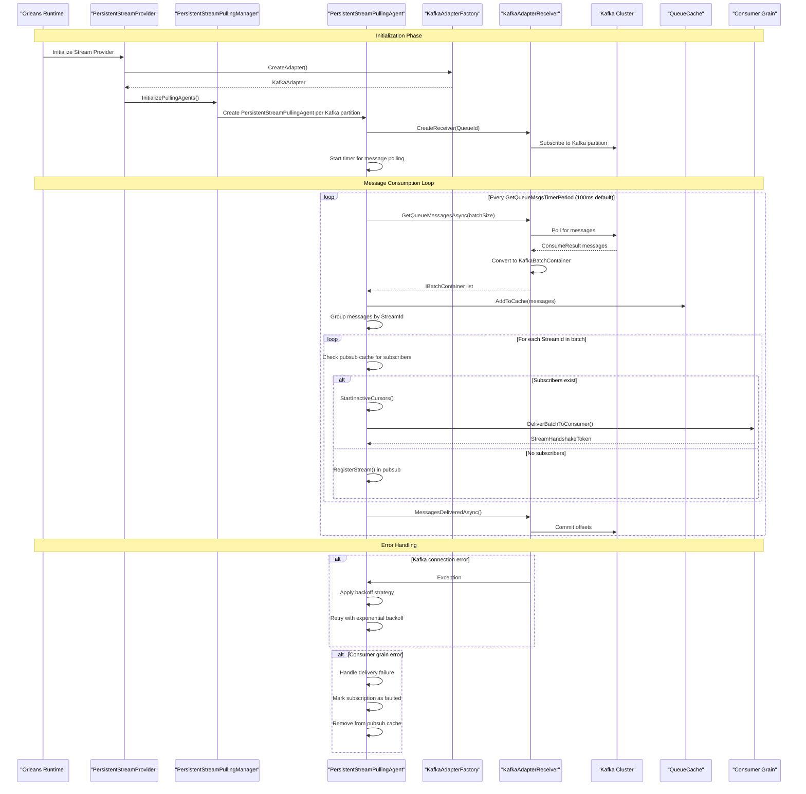

# Orleans Kafka Streaming Architecture

## Overview

This document explains how `PersistentStreamPullingAgent` integrates with `KafkaStreamProvider` in the Orleans streaming infrastructure, providing the technical foundation for understanding streaming performance characteristics in the Aevatar platform.

## Architecture Components

### Core Components

1. **PersistentStreamPullingAgent** - SystemTarget responsible for polling Kafka partitions
2. **KafkaAdapterReceiver** - Handles direct Kafka consumer operations
3. **KafkaAdapterFactory** - Creates Kafka-specific streaming components
4. **PersistentStreamPullingManager** - Manages multiple pulling agents

### Integration Flow



## Detailed Integration Analysis

### 1. Initialization Phase

The integration begins when Orleans initializes the streaming infrastructure:

1. **Stream Provider Setup**: `PersistentStreamProvider` initializes with `KafkaAdapterFactory`
2. **Manager Creation**: `PersistentStreamPullingManager` creates one `PersistentStreamPullingAgent` per Kafka partition
3. **Receiver Creation**: Each agent creates a `KafkaAdapterReceiver` for its specific partition
4. **Kafka Connection**: The receiver establishes connection to Kafka cluster and subscribes to the partition

### 2. Message Consumption Loop

The heart of the integration is the continuous polling loop in `PersistentStreamPullingAgent`:

```csharp
// From PersistentStreamPullingAgent.cs
private async Task<bool> ReadFromQueue()
{
    IList<IBatchContainer> multiBatch = await receiver.GetQueueMessagesAsync(options.BatchContainerBatchSize);
    if (multiBatch == null || multiBatch.Count == 0) return false;

    queueCache?.AddToCache(multiBatch);
    numMessages += multiBatch.Count;
    
    foreach (var group in multiBatch.Where(m => m != null).GroupBy(container => container.StreamId))
    {
        var streamId = new QualifiedStreamId(queueAdapter.Name, group.Key);
        StreamSequenceToken startToken = group.First().SequenceToken;
        StreamConsumerCollection streamData;
        if (pubSubCache.TryGetValue(streamId, out streamData))
        {
            streamData.RefreshActivity(now);
            StartInactiveCursors(streamData, startToken);
        }
        else
        {
            RegisterStream(streamId, startToken, now).Ignore();
        }
    }
    return true;
}
```

### 3. Kafka-Specific Implementation

#### KafkaAdapterReceiver Implementation

The `KafkaAdapterReceiver` handles the actual Kafka polling:

```csharp
public Task<IList<IBatchContainer>> GetQueueMessagesAsync(int maxCount)
{
    _consumePromise = Task.Run(() => PollForMessages(maxCount, cancellationSource));
    return _consumePromise;
}

private async Task<IList<IBatchContainer>> PollForMessages(int maxCount, CancellationTokenSource cancellation)
{
    var batches = new List<IBatchContainer>();
    for (var i = 0; i < maxCount && !cancellation.IsCancellationRequested; i++)
    {
        var consumeResult = _consumer.Consume(_options.PollTimeout);
        if (consumeResult == null) break;

        var batchContainer = consumeResult.ToBatchContainer(serializationContext, _queueProperties);
        batches.Add(batchContainer);
    }
    return batches;
}
```

#### Message Transformation

- **Input**: Kafka `ConsumeResult<byte[], byte[]>`
- **Output**: Orleans `KafkaBatchContainer` (implements `IBatchContainer`)
- **Sequence Token**: Kafka offset preserved as `EventSequenceTokenV2`
- **Metadata**: Topic/partition information maintained

### 4. Key Integration Points

#### Timer-Based Polling
- **Frequency**: Every 100ms by default (`GetQueueMsgsTimerPeriod`)
- **Process**: Agent calls `ReadFromQueue()` → `receiver.GetQueueMessagesAsync()`
- **Kafka Poll**: Receiver polls with configurable `PollTimeout`

#### Offset Management
- **Delivery Confirmation**: Orleans handles via `MessagesDeliveredAsync()`
- **Commit Strategy**: Kafka receiver commits offsets after successful delivery
- **Consume Modes**: Supports LastCommitted, StreamEnd, StreamStart

#### Pub/Sub Integration
- **Stream Registration**: Automatic registration when new streams detected
- **Subscriber Management**: Maintains pubsub cache for active subscribers
- **Cursor Management**: Tracks delivery progress per subscriber

### 5. Configuration Integration

Aevatar Station configuration example:

```csharp
siloBuilder.AddAevatarKafkaStreaming("Aevatar", options =>
{
    options.BrokerList = configuration.GetSection("OrleansStream:Brokers").Get<List<string>>();
    options.ConsumerGroupId = "Aevatar";
    options.ConsumeMode = ConsumeMode.LastCommittedMessage;
    
    var partitions = configuration.GetSection("OrleansStream:Partitions").Get<int>();
    var replicationFactor = configuration.GetSection("OrleansStream:ReplicationFactor").Get<short>();
    var topics = configuration.GetSection("OrleansStream:Topics").Get<string>();
    
    foreach (var topic in topics.Split(','))
    {
        options.AddTopic(topic.Trim(), new TopicCreationConfig
        {
            AutoCreate = true,
            Partitions = partitions,
            ReplicationFactor = replicationFactor
        });
    }
});
```

### 6. Performance Characteristics

Based on latency analysis, the typical flow shows:

1. **Kafka Poll**: 20-100ms (network + serialization)
2. **Orleans Processing**: ~338ms (PersistentStreamPullingAgent processing)
3. **Stream Delivery**: Variable based on consumer grain processing
4. **Total Latency**: Primarily dominated by Orleans streaming infrastructure (95%) vs Kafka operations (5%)

### 7. Error Handling & Resilience

#### Connection Failures
- **Backoff Strategy**: Exponential backoff with `queueReaderBackoffProvider`
- **Retry Logic**: Infinite retries with configurable delays
- **Circuit Breaking**: Temporary suspension on repeated failures

#### Delivery Failures
- **Retry Mechanism**: Uses `deliveryBackoffProvider` for retry delays
- **Fault Handling**: Marks subscriptions as faulted on persistent failures
- **Cleanup**: Removes failed subscriptions from pubsub cache

#### Offset Management
- **At-Least-Once**: Ensures message delivery semantics
- **Commit Strategy**: Only commits after successful delivery
- **Recovery**: Resumes from last committed offset on restart

### 8. Scalability Model

#### Horizontal Scaling
- **Agent Distribution**: One `PersistentStreamPullingAgent` per Kafka partition
- **Load Balancing**: Kafka's partition-based distribution
- **Consumer Groups**: Multiple Orleans silos share Kafka consumer group

#### Vertical Scaling
- **Batch Processing**: Configurable batch sizes for throughput optimization
- **Concurrent Processing**: Multiple agents per silo for different partitions
- **Queue Balancing**: Orleans' `IStreamQueueBalancer` distributes partitions across silos

### 9. Monitoring and Observability

#### Key Metrics
- **Message Throughput**: Messages per second per partition
- **Latency Distribution**: End-to-end delivery times
- **Error Rates**: Connection failures, delivery failures
- **Offset Lag**: Consumer lag behind Kafka log head

#### Telemetry Integration
- **OpenTelemetry**: Automatic span creation for streaming operations
- **Prometheus Metrics**: Custom metrics for Kafka-specific operations
- **Distributed Tracing**: End-to-end trace correlation

## System Target Architecture

The `PersistentStreamPullingAgent` operates as a **SystemTarget**, which means:

- **Dedicated Thread**: Runs on Orleans scheduler but with system-level priority
- **Non-Grain Entity**: Not subject to grain lifecycle management
- **Direct Invocation**: Can be called directly without grain directory lookup
- **Resource Management**: Managed by Orleans runtime for optimal performance

## Conclusion

The integration between `PersistentStreamPullingAgent` and `KafkaStreamProvider` provides a robust, scalable bridge between Orleans' actor-based streaming model and Kafka's distributed messaging platform. The architecture handles the impedance mismatch between the two systems while maintaining Orleans' programming model and Kafka's durability guarantees.

Key benefits of this integration:

1. **Seamless Integration**: Orleans grains can consume Kafka messages without Kafka-specific code
2. **Fault Tolerance**: Built-in retry mechanisms and error handling
3. **Scalability**: Automatic load distribution across Orleans silos
4. **Performance**: Optimized for high-throughput, low-latency scenarios
5. **Monitoring**: Full observability into streaming operations

This architecture serves as the foundation for understanding streaming performance characteristics and optimization opportunities in the Aevatar platform. 